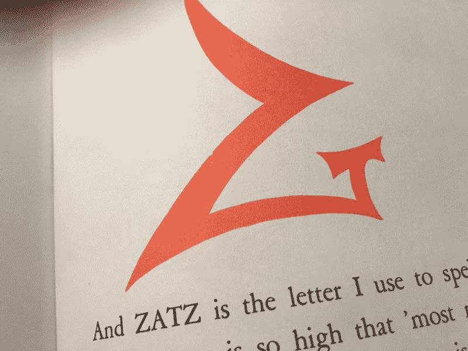

# 止步于 Z 的危险:用苏斯博士的话说，为什么孩子们应该编码

> 原文：<https://www.freecodecamp.org/news/the-danger-of-stopping-at-z-c28fbd702e0b/>

威廉·卡贝尔

# 止步于 Z 的危险:用苏斯博士的话说，为什么孩子们应该编码

> “在我去的地方有我看到的东西

> 如果我把 z 打住，我永远也拼不出来。

> 我告诉你这些是因为你是我的朋友。

> 我的字母表从你的字母表结束的地方开始！"

康拉德·科尼利厄斯·唐纳德·奥戴尔的代码世界之旅就这样开始了，这是字母表之外的字母表。写于 1955 年的《超越斑马》中，苏斯博士的[当然没有直接提到编程，但它传达的信息很清楚，呆在舒适的知识中是乏味和不满足的生活的秘诀。](https://en.wikipedia.org/wiki/On_Beyond_Zebra!)

作为一个普遍的信息，这是给学者、科学家、作家和其他所有工作涉及到扩展他们对世界的理解的人的。我衷心地向这些人推荐这本书，但是今天，我也向开发人员和技术人员推荐这本书。

和你的孩子一起读。与他们讨论探索的重要性。但是特别的是，要弄清楚你所做的事情与你的爱好、生活或激情的相似之处。它不仅将在未来几十年带来回报，还将有助于建立对技术实用性和人文之美的健康尊重。

#### 《斑马之外》讲的是什么

对于那些没有享受过这种乐趣或者需要复习的人来说，Beyond Zebra 讲述了年轻的 Conrad Cornelius o'Donald o'Dell 发现一个新的知识分支的故事，讲述者傲慢地断言，当他到达字母表的“结尾”时，他绝不会无聊到停在“Z”处。

解说员解释说，Z 后面还有字母，可以拼出苏斯博士书中的单词，比如 Glikker 和 Floob-Boober-Bab-Boober-Bubs。

当叙述者把康拉德从一个虚构的地方拖到另一个虚构的地方时，他向他展示了那些不可思议的野兽和精巧的装置，如果没有字母 Glikk 和 Floob 等等，他们可能会错过它们。在这一切之后，叙述者把康拉德留在了学校的黑板前，在那里他发现了他，发明了他自己的新字母，A-Z 被擦掉并留下了很长时间。

#### 分享探索

有一天，我在去空手道的路上看着后视镜，问我快五岁的女儿，当我在家工作的时候，她是否知道我在电脑上做什么。她耸耸肩说不。我决定无论如何是时候告诉她了。

我正在做一件大事:从零开始学习编码，自从我忍受了中学的 QuickBasic 课程后，就再也没有这样接触过电脑。

从 HTML5 和 CSS 开始，我正在努力学习 JavaScript，并计划完成剩余的[自由代码营](https://www.freecodecamp.com/)的全栈开发认证。

不过，通过训练，我成为了一名历史学家和古典主义者，这意味着，尽管我从未直接用我在学校学到的东西赚钱，但我从收集不同的信息并观察它们如何相互交流中找到了乐趣。

因此，当我读到一个男孩的故事，他的整个世界都超越了以前的界限，我立即回想起我第一次编写一段基本的 HTML 并刷新浏览器时，看到这段代码的一个化身出现在那里，就像变魔术一样，不知何故，从我的文本编辑器中迟钝的炼金术等式变成了美丽的(对我来说)，干净的文本，图像和链接，现在在我面前闪亮的 Chrome 中。

错过那个时刻该有多难过，仅仅因为我的世界从来没有扩展到从 A-Z 到新的异国字母

在六月一个下雨的下午，我坐下来阅读《斑马之外》上的文章。我们是心血来潮从图书馆得到这本书的，因为我们已经通读了大部分苏斯经典，因为作为父母，大多数儿童书籍读起来并不那么有趣，但《好医生》却很有趣。

当我们一路走来，享受着文字游戏、节奏和韵律(我)以及引人注目的插图(我的女儿们)时，我开始看到一个非常尖锐的论点，即教育孩子们总是有超出他们现有知识的新的学习领域和新世界。就在那时，我与代码建立了联系。

随着我们的孩子成长，技术变得越来越不可避免，确保他们以开放的眼光和充分的理解来继承数字世界变得至关重要。他们不仅必须在知识层面上理解他们可以将信封推进到未探索的领域，而且在实践层面上知道如何使用技术使之成为可能。

当他们将技术简单地视为魔术，而不是一个由硬件和软件相互作用驱动的复杂、不可思议的生态系统时，危险就来了。如果我们能避开懒惰的魔法假设，我们的孩子就能过上更有生产力、更有联系、最终更安全的生活。

#### 谈话

“嗯，你想知道我在做什么吗？”

“当然可以。”

“你知道，当我们阅读南希的奇特书籍时，一个人写下我们阅读的文字，另一个人画出我们观看的图片。”

“是啊。”

“你知道你在我手机或妈妈手机上玩的那些应用程序吗？还是在 iPad 上？比如托卡屋？”

“是啊。”

“嗯，这是一个类似的想法。有人画出你看到和触摸到的所有图片，但也有人编写语言，让这些图片移动，或者当你触摸屏幕时发生一些事情。这就是我正在做的。我甚至还没有真正工作，这更像是我在学校，学习那些语言，以便我可以编写这样的应用程序。”

沉默。

“这有道理吗？”

“是的。我能吃块椒盐卷饼吗？”

“是的，但只有一个，快到吃晚饭的时间了。”

对于一个快五岁的孩子来说，我认为这是一次胜利。

#### 学习(和教授)新的读写能力

编码是[新的素养](https://medium.freecodecamp.com/please-do-learn-to-code-233597dd141c#.gx82502mt)。软件正在渗透到我们生活的每一个角落——通常比我们作为一种文化所能理解的要快得多。我们与机器交流的方式，以及这些机器将我们与其他人联系起来的方式，正变得越来越重要。

已经有计划帮助我们的孩子通过教育系统更好地理解科学、技术、工程和数学学科，许多大学已经开始扩展这些学科，有时是以牺牲其他“利润较低”的学科为代价。

我发现“技术第一”运动中的狂妄令人恐惧，因为这可能意味着引领我们走向今天的文化的丧失。这也是我从 1955 年的一本儿童书籍中找到灵感的地方。

儿童文学的美在于它的简单。最好的情况下，儿童书籍读起来就像好代码。他们接受一个概念，一个想法，一个完整的世界观，并以一种干净，清晰，简单的方式呈现出来。

这种美很大程度上在于，在一个有限的词汇中，这些想法是如何在每个人的脑海中闪耀并激发出一些东西——无论是年轻人还是老年人——并激发理解和创造力。

这就是我们的孩子需要明白的地方，用代码，就像用“日常”字母 A-Z 一样，他们可以在想象中创造任何世界。他们可以解决任何问题，并以惊人的方式在世界上实现他们的意志。

软件是未来的原材料。创造力会将它塑造成不仅实用，而且美观的东西。因此，文科是帮助儿童成长为健康、理智的社会成员的关键组成部分，他们可以像解决问题一样聪明地参与文化和社会，下一波技术浪潮将席卷我们。

#### 不要停在 Z

我还没有开始跟进与我女儿的对话，但我现在知道，继续教育她和她的妹妹，当我在电脑上用那些有趣的符号和单词时会发生什么，这将与任何语言一样重要。与此同时，我将继续尽可能多地为他们阅读苏斯博士和其他书籍，以确保当他们开始与技术互动时，他们拥有理解技术的智力和词汇。

虽然叙述者从未因康拉德学习字母表而看不起他，但他显然惊讶地发现，康拉德会认为停在“Z”是可以接受的。因此，这本书以及随后与我女儿的对话成为了这篇文章的灵感，也是我的新博客[“On Beyond Z”](https://medium.com/on-beyond-z)的灵感，该博客将专注于提供资源，帮助孩子们接触我们基本字母表以外的世界。

我的目标是成为父母和教育工作者的资源，帮助孩子们在这个勇敢的新世界中找到自己的路，这样未来的几代人将成为第一代人，在他们的成长过程中，很大一部分人将了解编程的基础知识以及塑造我们社会的所有文化标准。

而且，即使技术不是他所想的，苏斯博士也是一个帮助儿童突破 A-Z 字母表的界限，找到他们自己通向未来的道路的倡导者。

教育的目的是什么，如果不是为了在所有的光谱上拓展心灵，让它有新的可能性？

正如苏斯博士所说:

> “我带着他四处逛，努力表现

> 还有 Z 以外的东西，一般人不知道。

> 我带他经过斑马。尽我所能。

> 我想，也许，也许我给他带来了一些好处……”

如果你喜欢这个，请点击下面的❤️来喜欢和推荐！谢谢，请每周回来查看更多帖子。