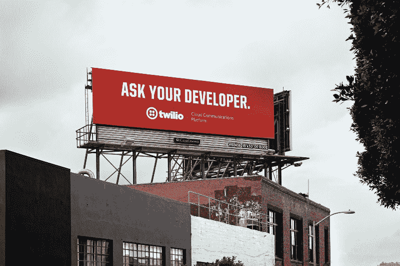
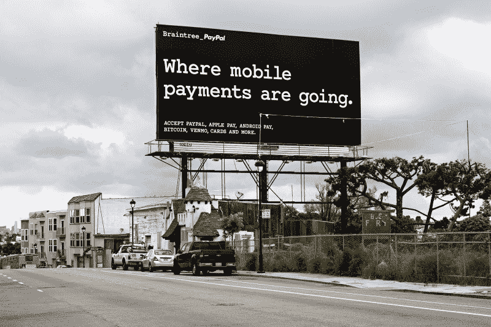
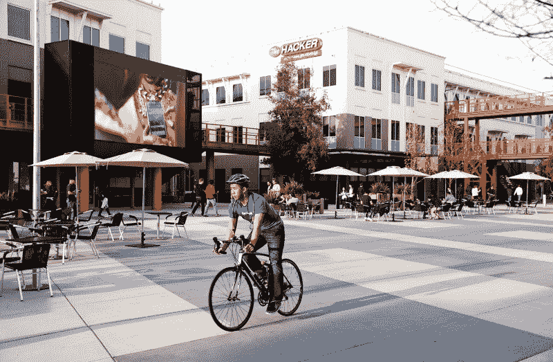
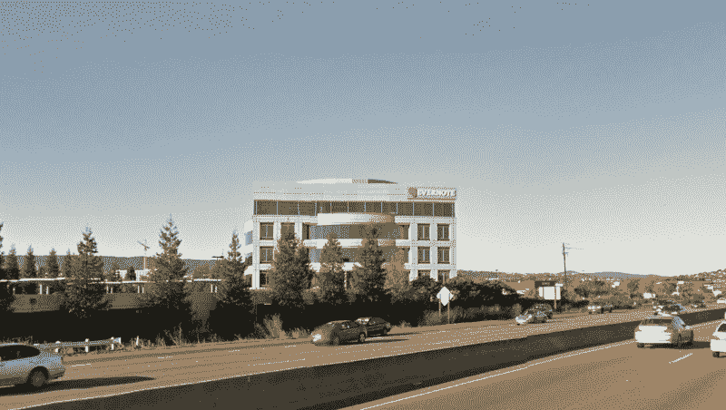

# 在我逗留的 12 个小时里，我对硅谷的了解

> 原文：<https://www.freecodecamp.org/news/what-i-learned-about-silicon-valley-in-12-hours-1f8e870c5295/>

作者:Sahil Khoja

# 在我逗留的 12 个小时里，我对硅谷的了解

除非你是设计师或开发商，否则这些广告牌纯粹是胡言乱语。

如果你不是在谈论技术，那么你是在谈论谈论技术的人。

如果你看到一个可爱的标志，上面有一个单词，可能还有一个句号，那很可能是一家设计公司。

脸书是成人的迪斯尼乐园。

无论你在哪里工作，如何工作，或者有什么福利，你都可能在不知不觉中一周工作 80 个小时。

如果你住在山景城或帕洛阿尔托，那你就错过了这座城市。如果你住在旧金山，那么你的房租会高得离谱。另一边的草总是更绿。不管怎样，你都完了。

101 是丑陋的。280 很漂亮。问题是大多数住宅区都在 280 号公路上，而办公室却在 101 号公路上。再说一次，你完蛋了。

考虑到大多数人使用 Evernote 的目的，Evernote 的建筑比它应该有的要大得多。

你的生活过得怎么样？

只有在三藩市，一家*奶酪*初创公司被[收购](http://www.sfgate.com/food/article/Cowgirl-Creamery-sold-to-Swiss-dairy-company-7508019.php)。