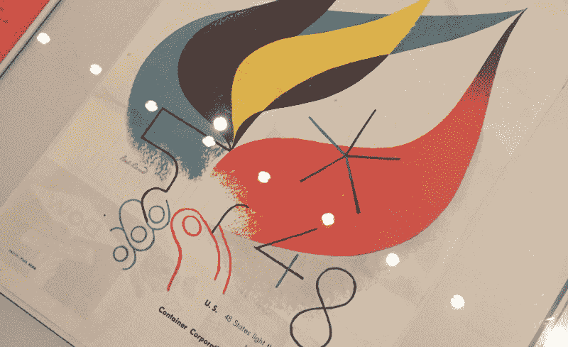
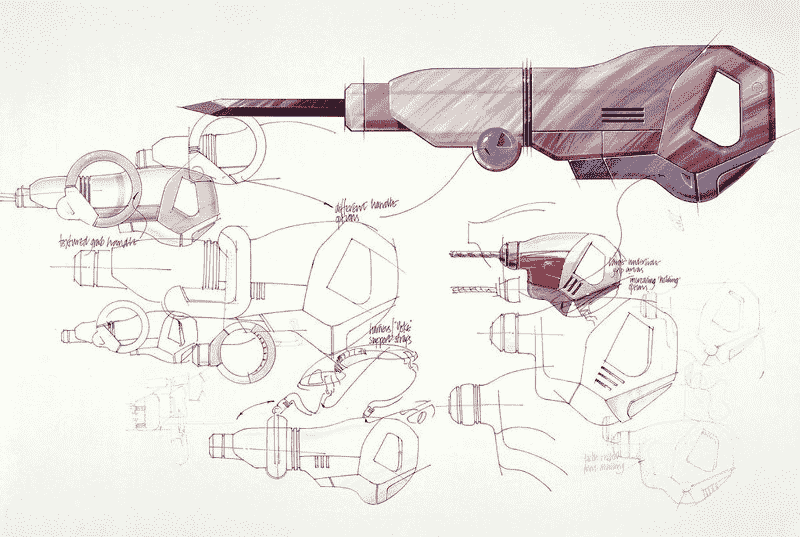

# 工艺、设计和代码

> 原文：<https://www.freecodecamp.org/news/craftsmanship-design-and-code-6d93eba3e7fe/>

上周，我在 Twitter 上收到了一个人的如下问题:

> …如果你不介意，我想问你一个困扰我很久的具体问题。有前端开发者，也有 UI/UX 设计师。据我所知，UI/UX 设计师提出事情应该是什么样子，前端开发人员实现他们的愿景。如果我可以设计和编码呢？如果我想构思经验并付诸实施呢？大多数公司不鼓励那样做是真的吗？你有什么建议？

当我读到这条消息时，我脑海中浮现出过去读过的几十篇文章。如果你在谷歌上搜索，你会发现有大量关于设计师是否应该学习编码或者开发人员是否应该学习设计的文章。所有这些文章都体现了争论的不同方面。

这些文章中的每一篇都提出了有效的观点。然而，这些文章中一个反复出现的主题是*一个人如何优化自己的技能才能被一家公司雇佣*。

这种视角鼓励开发者和设计师磨练自己的技能，不是为了自己，而是为了公司。这就引出了我的主要观点:**专注于你喜欢做的事情，并让它成为你工作的一部分。**

#### 工艺的意思是……小心、技巧和独创性地制造或生产。

**做工匠。**工匠是将自己的工作视为科学和艺术的人。他们带着激情、自豪和关爱创造产品。他们一直在寻找改进工艺的方法。他们的关键指标是随着时间的推移取得的进步。

工匠的一个例子是日本工匠大师冈野信夫，他花了 30 年时间完善修复书籍的艺术。

不管他修复的是一百页还是一千页的书，Nobuo 都是一页一页地用镊子把折痕展开，用熨斗把纸压平。

他煞费苦心地把散页粘在新纸上，并把它们裁剪得适合书本。从他对细节的关注可以明显看出，信夫对他的手艺有着深深的敬意。

工匠的另一个例子是安东尼奥·斯特拉迪瓦里，他被公认为世界上最著名的小提琴制造商之一。

斯特拉迪瓦里小提琴以其音色、响应度、优雅的设计和精确度而闻名。

小提琴是以最大的尊重和关怀制作的。从使用的木材到小提琴琴身的设计，斯特拉迪瓦里都很注意每一个小细节。斯特拉迪瓦里在他的工艺上取得了如此大的进步，以至于今天科学家们仍在探索他的工艺。

### 设计师和开发者也可以是工匠。

如果你看看像[保罗·兰德](https://en.wikipedia.org/wiki/Paul_Rand)或[约翰尼·伊夫](http://www.apple.com/pr/bios/jonathan-ive.html)这样的设计师和像[布伦丹·艾希](https://brendaneich.com/)或[保罗·爱尔兰](http://www.paulirish.com/)这样的开发人员，他们都把设计和编码视为他们技艺的一部分。他们的秘密武器是他们不断探索自己的领域，寻找留下印记的方法。

对于工匠来说，进步是衡量成功的标准。保罗·兰德是一位著名的美国图形设计师，起初他在一家为各种杂志和报纸提供图形的设计辛迪加做兼职。

[Early advertisement design by Paul Rand](https://en.wikipedia.org/wiki/Paul_Rand#/media/File:P_rand_ex.jpg)

几年后，保罗·兰德将帮助开创一个设计引领商业的时代。他还设计了 IBM、UPS 和 ABC 等公司的标识。

Paul Rand designed the logo for IBM. This was a variation for a marketing campaign.

另一个例子是约翰尼·伊夫。他开始设计微波炉、烤箱和牙刷等产品。下面是他早期作品中发现的电钻草图。如今，艾夫斯是苹果公司的首席设计官，负责苹果产品的工业设计，如 Macbook、iPod 和 iPhone。

设计师和开发人员把他们所做的视为他们工作的一部分，随着时间的推移，他们努力改进，但最重要的是，他们为自己而改进*。*

*我看到很多人，不断地回头看，把自己和同龄人比较。通常，那些认为自己落后的人会感到恐慌。那些感觉领先的人变得自满。衡量进步的唯一标准是你现在所处的位置与一年前的位置相比。每个人都定义并拥有自己的手艺。不可能对两个人进行一对一的比较。此外，看看你随着时间的推移改变和提高了多少可以作为灵感的巨大来源。*

### *因此，这里是我对那些想提高技术的设计师和开发者的建议*

*

[Be a craftsman and improve your craft.](https://www.flickr.com/photos/adavey/5075599607/in/photolist-8JvLW4-7Wgz4s-8HTTPt-qJFjeU-4ukoo1-aERVFq-qLpThC-aDhkq3-4Xzsnq-5h5BfS-npuRaU-odNTkT-pc5baf-pXN7V1-qRz9Wb-f8B8ZE-6s9b9c-5jQUf-dcEK1H-qUDjDr-riVbre-Gz1AjM-hvA7Js-5h12SE-h1SegV-njnMrc-qU1Qai-cxLeof-iWGVge-a57mG6-kn1YtM-kn13qt-6Uqbwu-fbUW3N-eewENC-r3gmU4-mE459b-h1R8My-fwVgr1-h1Riis-NLMuA-h1RvKQ-pWMd3n-s23a8m-qUqCP1-KPD8d-qCCXMQ-qCm2wP-f8B8oL-i25MKx)* 

*作为设计师和开发人员，我们总是能够改进我们所做的工作。*

*   *即使这不是你技能的一部分，也要多了解你的对手。如果你是一名设计师，学习更多关于开发的知识。它将帮助您理解开发人员面临的实际限制。如果你是一名开发人员，学习更多关于设计的知识。这将有助于你更好地与使用你产品的人产生共鸣。*
*   *多读好代码。你会养成良好的习惯，并将设计模式内在化，这对你构建自己的代码非常有用。*
*   *多看看设计。你看到的灵感越多，你的设计就越多样化。*
*   *小心你的代码。如果你和许多其他开发人员一起工作，编写更多的单元测试。单元测试帮助其他人理解你的代码做什么以及它应该如何工作。*
*   *研究更多[设计系统](https://designschool.canva.com/blog/50-meticulous-style-guides-every-startup-see-launching/)。理解设计如何应用于产品是很重要的。*
*   *少写代码。多花点时间想想你想达到什么目标以及如何达到。避免包含不必要逻辑的冗长代码。*
*   *在回到绘图板进行下一次迭代之前，花更多的时间分析你的设计的影响。使用定量分析如用户访谈和定性分析如仪器来了解人们如何使用你的产品。*

*这样的例子不胜枚举。然而，所有要点都有一个共同的主题:**关心你的工作**。*

*无论你是设计师还是开发人员，或者两者兼而有之，都要把你所做的事情当作你职业的一部分。变得如此优秀以至于人们无法忽视你。*

*我很想知道你对工艺和技术的看法。此外，如果你有任何问题，比如激发了这篇文章的问题，请随时给我留言或发推文。*

*如果你想了解更多，你可以在 Twitter 上关注我，我会在这里发布一些关于设计、前端开发、机器人和机器学习的无聊言论。*

*另外，如果你喜欢这篇文章，点击推荐按钮或与朋友分享，这将意味着很多。*

****