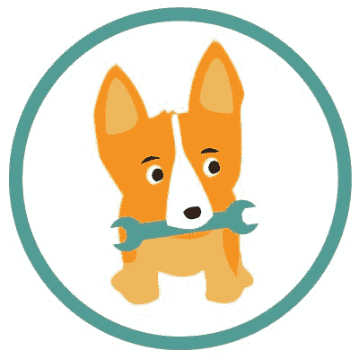
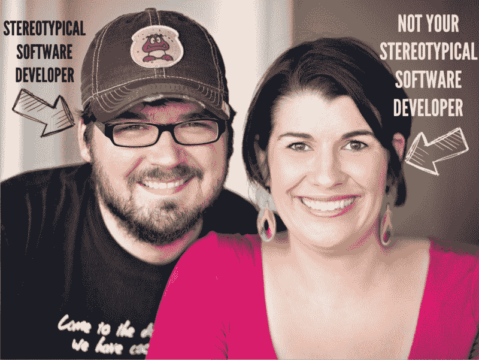
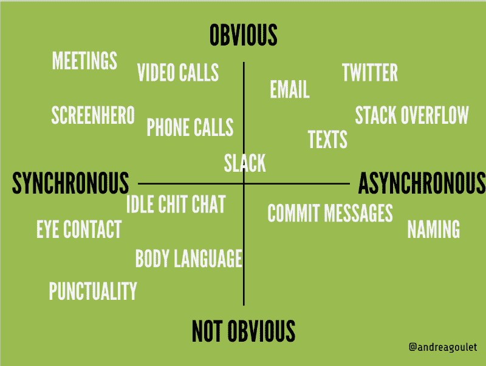
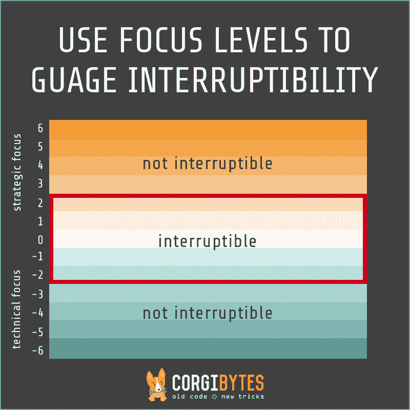
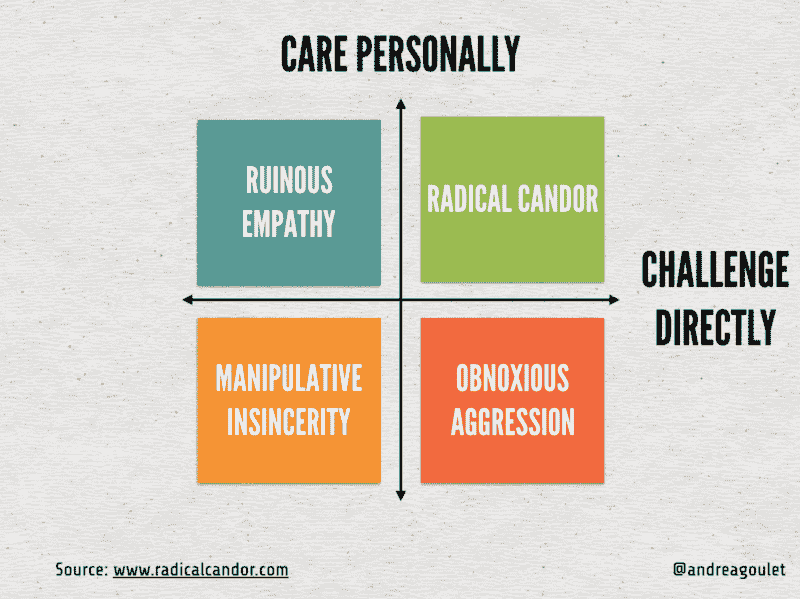

# 交流和代码一样重要

> 原文：<https://www.freecodecamp.org/news/communication-is-just-as-important-as-code-c92c709329ab/>

安德烈·古莱特

# 交流和代码一样重要

在刚刚过去的这个周末，我有幸成为 Ruby Nation 的闭幕主题演讲人。我在 [Corgibytes](http://corgibytes.com/) 详细阐述了一个核心价值观:沟通和代码一样重要。

下面是我演讲的大致记录。我得到了很好的反馈，我期待着在这个话题上做更多的介绍。如果你组织了一个会议，想聊聊我的演讲，请[联系](http://twitter.com/andreagoulet)。

Ruby Nation 对我来说很亲近，因为这是我参加的第一个软件会议。我昨天在一个抽奖问题中看到，今天的观众中有几个人是编程新手。你的第一次科技会议可能会令人生畏。我知道你的感受，因为那是六年前的我。

在我第一次参加 Ruby Nation 大会的几个月前，在我们的十周年同学会上，我联系上了一位高中好友斯科特。他是典型的计算机程序员。当人们问他是做什么的时候，他说他给计算机编程，大多数人回答“是的。我早就料到了。”

我不是你心目中的典型程序员。虽然我从小就伴随着技术成长，但作为一名女性，我这一代人被极力劝阻不要相信我们可以参与到那个行业中。我九岁的时候，没有你好鲁比或者金发碧眼。我有一个十几岁的芭比娃娃，她告诉我数学很难，购物很有趣。

所以，我选择了适合我文化的方向，我成了你们眼中的典型营销人员。

不管怎样，在聚会上，斯科特找到我说他有生意要做。他开发了一个软件产品，但是在 18 个月里没有卖出任何东西。他有一个营销问题。突然间，我的技能不再令人讨厌了。它们很有价值。

他想知道我是否愿意和他一起担任首席执行官，帮助他实现梦想。他是沃兹，我是乔布斯。我知道很多关于建立业务，但我不知道软件，但我认为我可以学习。所以我们一起创立了 Corgibytes，几个月后我们去了 Ruby Nation。

2010 年，情况有些不同。在我的第一次技术会议上，我是房间里仅有的两三位女性之一。房间的大部分看起来像斯科特。但是有一些多样性。有些男人有不同颜色的头发和眼镜，甚至有些人没有胡子。

大部分的谈话我都没听懂。就在午饭前，我觉得自己像个不属于这里的局外人。我想过离开。

然后，在午餐时，我遇到了戴夫·博克。然后后来，[吉姆·盖伊](http://twitter.com/saturnflyer)。他们都让我有归属感，尽管我看起来不像其他人，而且是编程新手。

在我不断学习的过程中，Ruby 社区非常受欢迎。你告诉我:

*   你属于这里。
*   我们怎样才能让它变得更好？
*   我相信你。

我在第一次会议上遇到的一个人是杰夫·卡西米尔，他现在经营着 T2 图灵学校。他做了一个关于成为多语言开发者的演讲，也就是用几种语言编写代码的人。我感到受到新朋友的欢迎和鼓励，所以我鼓起勇气做了一个简短的演讲。

我站在舞台上，对编程一无所知，并建议人们可以在他们的技术堆栈中添加另一种语言……英语！

我们正在迅速接近一个不再需要交流技能的世界。你不能在技术性和非技术性之间做出选择。你必须两者兼得。

所以我想教你我所知道的交流，就像你教我如何编码一样。

在 20 分钟内，我将告诉你在过去的 15 年里我所学到的关于沟通的最突出的观点。这很难提炼出来。我大概可以就这个主题写一整本书，但我认为它是从问一个问题开始的:什么是沟通？

我们可以看事件。有些事情必须同时发生。它们是同步的。其他的不一定要同时发生。它们是异步的。

这里有一些明显的同步例子:电话、会议、Screenhero。而推特、短信、电子邮件——这些都是异步的。

然后是一些不明显的交流形式。

在同步方面，比如眼神交流、肢体语言，以及你是否准时参加活动。

这些同时发生，但是因为它们是非语言的，我们不经常认为它们是交流。

也有闲聊。如果你在非工作场合谈论工作，那仍然是交流。当你在你堂兄的婚礼上排队买自助餐时，有人问你是做什么的，不管你知不知道，你正在对你公司的销售产生影响。

在异步方面，我们有像提交消息这样的东西，我们相信这将永远是最好的文档形式。想想你运行**git debug**的时候，有问题的代码的作者是你自己。解释你提交的理由对其他人非常有帮助。甚至对你未来的自己也有帮助。

我们也有名字:变量，方法，类。在 Cucumber 中编写场景，在 RSpec 中编写示例。你给事物命名的方式对其他人有意义吗？还是 foo 和 bar 是你最好的朋友？如果你想了解更多关于命名的知识，我建议阅读 Arlo Belshee 的系列文章[如何命名是一个过程，而不是一个步骤](http://arlobelshee.com/good-naming-is-a-process-not-a-single-step/)。

好吧。回到格子里。

我们中的许多人是顾问，必须填写时间表。你填写评论吗？这是一种交流方式。

我们对拉取请求进行代码审查。你留下的那些评论？没错。你猜对了。交流。

最后，我最讨厌的是:错误消息。有多少人在工作时遇到过完全无用的错误信息？太让人沮丧了！我有时觉得我人生的使命就是通过教开发人员如何良好地沟通来消除糟糕的错误消息。

所以我是这样定义沟通的:它只是你的想法的人工制品。就是这样。交流与代码并没有太大的不同，而且同样重要。

所以在 Corgibytes，我们所做的就是遗留代码。我们从 Rails 2 或 3 应用程序进行了大量升级，增加了自动化测试套件，偿还了技术债务。我有时说我们是互联网的看门人。

但我们是你见过的最幸福的看门人。我们真的很喜欢我们的工作。很多是因为我们强调沟通。

大多数人讨厌处理遗留代码。其中很大一部分原因是遗留代码缺乏交流。

Michael Feathers [将](http://www.amazon.com/Working-Effectively-Legacy-Michael-Feathers/dp/0131177052)遗留代码定义为“没有测试的代码”，但是我想对此进行扩展。它是没有通信工件的代码，测试只是其中的一小部分。没有交流，在一个不是你写的代码库上工作是困难的。

好吧。那么，为什么这很重要呢？

三个原因。

首先，**提高你的沟通能力是提升你职业生涯的最好方法**。

如果你想成为一名首席开发人员、首席技术官，或者拥有自己的企业，那么每天与不写代码的人进行有效的沟通是你工作的一大部分。

如果你想让人们为你的开源项目做出贡献，交流是让他们感到受欢迎并让他们留在你身边的方式。

如果你想让其他人使用你的想法，你需要学习如何写博客、演讲，甚至写书。所有这些都是交流。

下一个原因是**沟通建立信任**。

在她的书《勇敢无畏》中，布琳·布朗把信任描述成一个大理石罐子。当全班表现好时，她女儿的老师会往罐子里扔一个弹珠，当他们到达顶端时，他们会举办一个披萨派对。信任也是如此。它是由一系列非常小的互动日积月累建立起来的。

那些小的互动就是交流。每个艺术品都是瓶子里的一颗弹珠。每次你留下你的想法，你都在交流，建立信任。

最后，**良好的沟通是确保你不会一直四处奔波救火的最好方式**。

在 Corgibytes，我们的核心价值观之一是平息混乱。我们相信，当你压力过大、肾上腺素激增时，解决问题的最佳方案不会出现。当你冷静、理性并使用你的前额皮质时，它们就会出现。只有当你的文化浸透了良好的沟通，这种情况才会发生。

好消息是，我们可以依靠几种模式和框架来改善我们的沟通。我要回顾一下我最喜欢的三首歌。

但是首先，让我们注意这些并不是静态的。Joshua Kerievsky 在他的书 [Refactoring to Patterns](http://www.amazon.com/Refactoring-Patterns-Joshua-Kerievsky/dp/0321213351/ref=sr_1_1) 中谈到了如何通过你所做的所有小的选择来走向模式或者远离模式。改善你的沟通方式也是一样的。这需要意识，当你有意识地选择改变你的习惯时就会发生。

我们将触及的第一个概念是关于上下文切换的。这是有实际成本的。你知道的。但是你怎么和不编码的队友沟通这个事实呢？

我已经就此写了一篇详细的博客文章，但简而言之，这是我如何学会的。

多年来，当我需要引起斯科特的注意时，我会问:“嘿，斯科特——你有时间吗？”我认为这是礼貌的。我想尊重他的时间，如果他很忙就不打扰他。与此同时，我通常被封锁。

我尽量不去打扰他。答案很可能是“不”，而我的回答可能是“别担心”。有空再来找我。”但是从来没有这样发生过。相反，我感到完全彻底的沮丧。

一天，斯科特感到沮丧后，他回答说:“我在第九级。”

“九级？”

“是啊。就像电影《盗梦空间》里一样。”

在电影《盗梦空间》中，有一个“梦中之梦”的想法这也发生在工程中:心智模型中的心智模型。你必须一次记住的模型越多，建立这种状态所需的时间就越长。如果你走得太快，你几乎会患上相当于减压病的精神疾病。

所以我们开发了一个框架来帮助我们交流我们是否会被打断。

如果他所要做的只是标记他在哪里，他就可以在不切换上下文的情况下传达他是否会被打断。任何高于 2 的数字，当他安全回到地面时，他会回来找我。

接下来是我称之为破碎的玻璃图案。

你想变得不像泰德，更像蒂娜。

在《我是如何遇见你妈妈的》节目中，泰德开始注意到他说“嗯，实际上”这句话的频率。每次他这么做的时候。当他意识到他做了多少时，他的大脑上方的玻璃碎了。

这种语言是分裂的。他的朋友不喜欢。当你的营销朋友问“你有时间吗？”时，他们会像你一样喜欢这个问题

一个更好的方法是用“是的，然后…”来代替你的井

这来自蒂娜·菲的书《Bossypants 》,她在书中描述了她是如何学习即兴表演的。“是的，而且……”是统一的语言。

例如，假设一个客户带着一个变更范围的请求来找你。从来没发生过，对吧？

“实际上，这并没有写在合同里……”促进敌意和防御性。因此，你可以用不同的方式来表达同样的事情，以促进合作。

“是的。我知道这对你有多重要。我们已经开始冲刺了。让我们就这种变化将如何影响事情进行对话，并找到一种对我们双方都有效的方式。”

所以最后一个模式是如何避免听起来像个混蛋。

这是金·斯科特的激进坦白框架。

有两个轴。金·斯科特[描述](http://firstround.com/review/radical-candor-the-surprising-secret-to-being-a-good-boss/)他们的方式是垂直的，标有“个人关怀”，她称之为“给予该死的轴”她说，另一个标有“直接挑战”的轴是“愿意激怒别人”的轴。

当你提供反馈时，你希望两者兼而有之。她给出了 HHIPP 的首字母缩略词，以记住如何以激进的坦诚说话:

> “彻底的坦诚是谦逊的、有益的、直接的，是面对面的——如果是批评就私下里说，如果是表扬就公开说——而且不带有个人色彩。”最后一个 P 做出了一个关键的区分:“我的老板没有说，‘你很蠢。’她说，“你说‘嗯’的时候听起来很蠢。”两者差别很大。“——金·斯科特

如果你从这次谈话中一无所获，请记住:沟通是一种技能。你可以学习它。如果你能学会如何编码，你就能学会如何交流。

知道我相信你。就像你相信我，告诉我当我不相信自己时，我可以学习如何编码，让我全力支持你。

这里有一些资源可以帮助你开始。

我对你们的挑战是回想一下 Elle 的第一次演讲，那是这次会议的开场白。采取成长的心态。相信你可以学习，找一本书或一门课让你开始。

像学习如何编码一样，一头扎进去，对交流充满好奇。

我很乐意帮助你。这是我的联系方式。我希望你在 Twitter 上联系我，告诉我你在做什么。

如果你碰巧喜欢遗留代码，我希望你能通过 [LegacyCode 加入我们的社区。岩石](http://legacycode.rocks/)。有一个 slack 频道，你可以和其他喜欢改造软件的人一起出去玩。

我在[同理心驱动发展](http://www.empathy-driven-development.com/)写博客，所以如果你有什么想贡献的，请联系我。

这里有一个我的日历的链接，这样我们可以安排一个同步活动，更好地了解彼此。我真的希望收到你的来信。

是的，[我有贴纸](https://www.stickermule.com/marketplace/1858-corgibytes)。

谢谢你。

*本帖原载于[Corgibytes.com](http://corgibytes.com)*