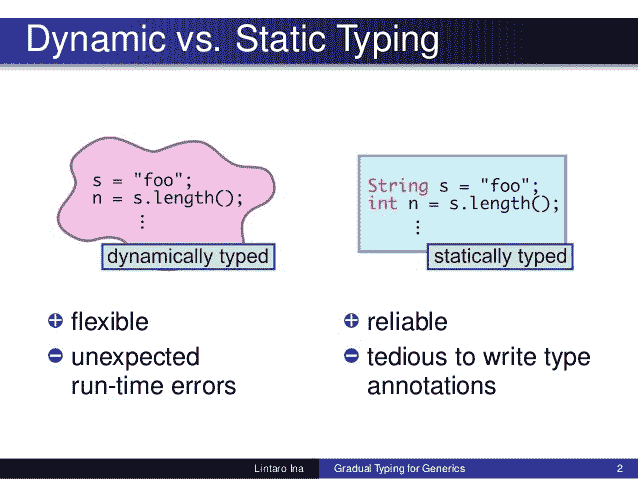

# 在 JavaScript 项目中引入类型安全？重新考虑

> 原文：<https://www.freecodecamp.org/news/stop-bringing-strong-typing-to-javascript-4da0666cba6e/>

作者:詹姆斯·赖特

# 在 JavaScript 项目中引入类型安全？重新考虑

### 更新—2017 年 2 月 1 日

自从我第一次发表这篇文章以来，我已经听到了关于 JavaScript 类型安全的各种反对意见，虽然我仍然相信许多项目不需要使用类型化的 JavaScript 超集，但我承认我发表这篇文章太草率了。一些合适的用例随后引起了我的注意:

*   Ember 背后的底层渲染引擎 Glimmer T1 是用 TypeScript 编写的，用来提升 T2 单态调用点 T3 的性能，帮助 V8 和其他 JavaScript 引擎执行
*   由于项目的庞大，Visual Studio 代码从 TypeScript 中获益；鉴于它是作为桌面应用程序分发的，在我看来，拥有一个代码库而不是在构建时协调各个包是一个明智的选择
*   [门派](https://github.com/jamesseanwright/sect)(诚然是我自己的项目，所以这里有潜在的偏见！)是用 TypeScript 编写的，这样用户就可以为 web 编写大型的模块化游戏，同时可靠地减少由拼写错误导致的运行时错误以及 JavaScript 的动态特性带来的其他问题

我还意识到，用 TypeScript 编写更小的库，同时用构建时生成的类型定义发布它们，可以使它们与类型化的*和*传统 JavaScript 项目无缝集成，从而为开发人员提供了更广泛的技术选择。

尽管如此，为了后代的缘故，这里的原始文章的全部。

今天遇到一篇关于 [JS++](http://sdtimes.com/onux-seeks-fix-javascripts-lack-type-safety/) 推出的文章，号称“修复 JavaScript 缺乏类型安全的问题。”有趣的是，我们已经有了 [TypeScript](https://www.typescriptlang.org/) 、 [ST-JS](http://st-js.github.io/) 和 [Scala.js](https://www.scala-js.org/) ，它们协助开发者最终实现同样的目标。

在我开始这篇长篇大论之前，请允许我强调三个要点:

*   我之前写过一篇关于建立一个简单的 TypeScript 项目的教程。我看到了其中的虚伪，但是自从一年前我发表了这篇文章后，我的观点已经改变了
*   强类型和静态类型是重要的范例。前者对代码中表示的实体、它们的关系以及它们可能被期望提供的功能提供透明性，而后者是复杂系统中一个重要的编译时安全网。我来自 C#背景，所以我有这方面的第一手经验
*   我也喜欢 JavaScript，因为它有一些固有的缺陷，ECMAScript 6 和 7 已经解决了很多问题

那么，为什么我通常反对 JavaScript 中的静态类型呢？

最重要的是，JavaScript 之所以成为如此强大的语言，是因为它的弱类型特性；通过类型强制实现逻辑分支很简单，创建任意类型的对象实例也很容易。此外，只要代码不会导致任何奇怪的行为，缺乏编译(除非使用 transpiler 或构建工具，例如 Babel)会使开发变得非常快。在我看来，这就是它对于前端和简单后端(例如物联网)开发如此强大的原因。

我个人认为，如果一个人正在开发一个如此复杂的系统，以至于它需要类型安全，那么他应该使用一种在其核心支持它的语言；用 JavaScript 编写一个包含复杂数学运算的导航系统是疯狂的。

我对这些 JavaScript 工具和超集的主要担心是它们编译成 JavaScript；因此，这些程序是在一个动态的环境中运行的，因此同样的副作用仍然会发生。例如，TypeScript 可以是静态类型的(即，在编译时收集和分析类型信息)，但是人们必须完全相信最终的代码仍将按预期运行。是的，当然即使是静态类型的语言也通常被编译成低级语言，然后被典型地解释，但是这些目标语言肯定是被设计成一等公民的类型；例如，微软的 JIT 编译器。在编译成本机代码之前，NET 仍然实现了对其中间语言的运行时类型检查。

此外，在进行前端开发时，我仍然认为 JavaScript 应该用来补充 HTML 和 CSS 解决方案，例如向元素添加类，对后端服务进行 HTTP 调用等。虽然 web 在创作更大的基于 UI 的应用程序的框架方面已经成熟(仅供参考，我也用 React.js 和 vanilla JS 编写过更大的应用程序；我都喜欢)，我更喜欢让我的 JS 尽可能的轻。我知道这在现实中并不总是可能的，但是如果后端系统作为基本业务逻辑的来源，那么前端代码会变得更轻，更少冗余；在这方面，类型系统会带来什么好处？

根据我对前端软件规模的观点，我目前的工作需要为整个系统的每个关注点编写集中的 web 应用程序；与我们商店的大型单页应用程序(包含产品列表视图、产品详细信息视图和购买旅程视图)不同，我们为它们提供了各自的 Node.js 支持的应用程序。显然，就松散耦合和弹性而言，这是一个最佳实践，但是从代码的角度来看，它允许人们更容易地关注我们前端的一个领域的实现。

我最后的论点是:JavaScript 真的有那么难学吗？正如我以前说过的，ECMAScript 5 本身就是一种有缺陷的语言；例如，不同的函数调用模式以及它们如何影响“this”关键字和缺乏块范围会使初学者感到困难。然而，有了 ECMAScript 6，再加上大量令人惊叹的资源，很容易克服并意识到这些问题。为什么不跳过中间人直接学习语言呢？

最后，我想说我是所有打字方法的爱好者，但是有些方法比其他方法更适合某些情况。鉴于 JavaScript 在开发团队和他们的项目中无处不在，如果它最适合大多数前端软件，那么它肯定不需要超集。此外，有很多语言本身就是类型安全的，所以不要再多此一举了！