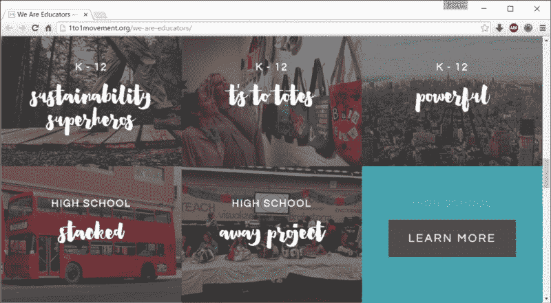
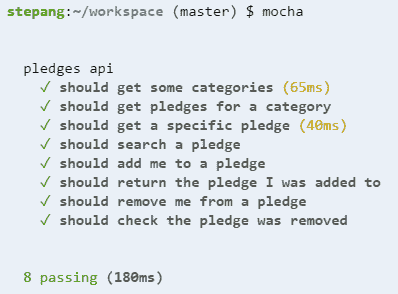

# 这都是关于“可能性”的

> 原文：<https://www.freecodecamp.org/news/its-all-about-the-ilities-875682184dc8/>

乔治·斯捷潘内克

# 这都是关于“感受”


[Wikimedia Commons](https://commons.wikimedia.org/wiki/File:100m_women_Golden_League_2007_in_Zurich.jpg)

我们“功能齐全”

为了构建一个[环境承诺网络应用](http://fcc-1to1-pledge-app.herokuapp.com/)，一个为期 10 周的[自由代码营](https://www.freecodecamp.com/)项目已经进行了 4 周，我们已经让所有的用例正常工作。

这意味着我们结束了，对吗？

差远了！

又花了四周时间才把这个应用提升到专业质量水平。这不仅仅是找到并修复一些剩余的错误。我们仍然要做的大部分工作是整理出“功能性”:[非功能性需求](https://en.wikipedia.org/wiki/Non-functional_requirement)，比如可用性和兼容性。

这款应用运行良好。但是现在我们需要让它工作得更好。

> “两秒钟是电子商务网站可接受性的门槛。在谷歌，我们的目标是不到半秒钟。”—迈勒·欧耶

#### 表演

该应用程序需要一个多页面的外观，这样人们可以共享个人承诺或他们自己承诺成就的 URL，但我们无法使用多页面设计实现我们想要的亚秒级响应时间。下载和渲染页面花费的时间太长了。

我们的解决方案是将其重构为基于 React 的单页面应用程序，该应用程序捕捉超链接的点击事件，以控制显示哪个“页面”:

```
var self = this;$('a').click(function (event) {    var href = $(this).attr("href");    self.setState({ url: href });    window.history.pushState('', '', href);    event.preventDefault();});
```

这意味着应用程序只需完全加载一次*(在慢速连接下可能需要几秒钟)，然后站点内的每次点击都要快得多。*

*

Page load results from [GTmetrix](https://gtmetrix.com/)* 

*我们还积极地用 Adobe Photoshop 优化图像，以减少下载时间，并确保即使图像仍在下载中，页面也是可读的。*

#### *和睦相处*

*当你把一个网络应用放到公共互联网上时，你不知道谁会访问它，他们会使用哪个浏览器，或者他们的浏览器版本会有多旧。它必须对每个人都有效。*

*我们的单页应用程序设计的一个优点是，对于不支持我们需要的 API 的旧版本浏览器来说，它很容易关闭，并退回到按原样使用超链接。当然，以这种方式使用应用程序会慢一些，但它仍然工作得很好。*

*

[Browser availability for the History API](http://caniuse.com/#search=pushstate)* 

*如今，大多数现代浏览器都相当兼容，但是你仍然应该尽可能广泛地进行测试。我们发现我们需要为旧版本的 Internet Explorer(这并不意外)和 iOS(这是意料之中的)加入特殊的规则。*

> *“不要让我思考”——史蒂夫·克鲁格*

#### *可用性*

*我们认为我们的应用程序——包含五个类别，每个类别包含十几个承诺——非常简单。*

*

Breadcrumbs on the [home](http://fcc-1to1-pledge-app.herokuapp.com/), [category](http://fcc-1to1-pledge-app.herokuapp.com/category/transportation) and [pledge](http://fcc-1to1-pledge-app.herokuapp.com/pledge/carpool) pages* 

*但是当我们让我们的朋友和家人做用户测试时，他们中的一些人说他们对他们在应用程序中的位置感到困惑，并且不真正理解如何到达他们想要去的地方。*

*它需要更加直观。*

*因此，我们在标题中添加了图标[面包屑](https://en.wikipedia.org/wiki/Breadcrumb_(navigation))来帮助人们立即了解他们在页面层次结构中的位置，并通过超链接帮助他们返回。*

*我们还添加了*下一个承诺*和*上一个承诺*箭头，这样人们可以轻松地从一个承诺点击到下一个承诺，而不必每次都回到类别页面。*

#### *设计*

*1 对 1 运动将自己描述为一个“品牌组织”，其目标是让环保主义更具吸引力。他们的[主网站](http://1to1movement.org/)有一个现代时尚的设计，我们想把它带到我们的网络应用中。*

*

The [Education page](http://1to1movement.org/we-are-educators/) on the 1to1 Movement website* 

*因此，我们复制了一些主要的设计方面——全出血图像、低对比度缩略图、特定字体、蓝绿色高亮颜色——然后我们请一位知识渊博的朋友给我们设计审核，以确保我们正确、一致地使用它们。*

*我们希望每个人都留下好印象，其中一部分是检查网站在所有屏幕尺寸上都好看，从手机到高分辨率显示器。使用像 [Bootstrap](http://getbootstrap.com/) 这样的响应性 UI 框架已经让我们走了大部分的路，但是我们仍然需要在不同的视口宽度下检查故障。例如，我们必须添加 **{空白:nowrap}** 添加到 breadcrumbs 部分，以防止标题行被换行时它被破坏。*

> *“任何傻瓜都能写出计算机能理解的代码。优秀的程序员会写出人类能理解的代码。”—马丁·福勒*

#### *可维护性*

*其中许多修复和改进是针对不常见的浏览器或版本，或者很少遇到的用例。所以我们做的一件关键事情是添加有意义的注释来解释*为什么*每个组件都是这样编码的。我们希望未来的开发人员了解一切是如何工作的，并让他们在添加新功能时更容易避免破坏现有的功能。*

**

*一套好的单元测试也将帮助未来的开发人员，因为它们可以快速而容易地检查出有问题的代码。我们使用 [mocha](https://www.npmjs.com/package/mocha) 和 [supertest](https://www.npmjs.com/package/supertest) 为 API 调用中的后端业务逻辑创建自动化测试。*

#### *下一步是什么？*

*做完这一切，我们现在可以问心无愧地离开了吗？不完全是！*

*即使我们已经使应用程序生产- *就绪*，我们仍然需要将它实际部署到生产中，并正确地将其移交给客户。*

*但那是另一个时代的故事了…*

*感谢阅读。我希望这篇文章能帮助你更好地理解制作一个产品化的应用程序所涉及的所有细节。*