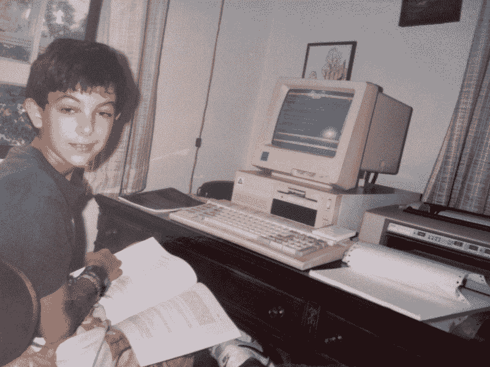
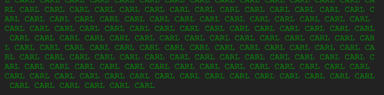
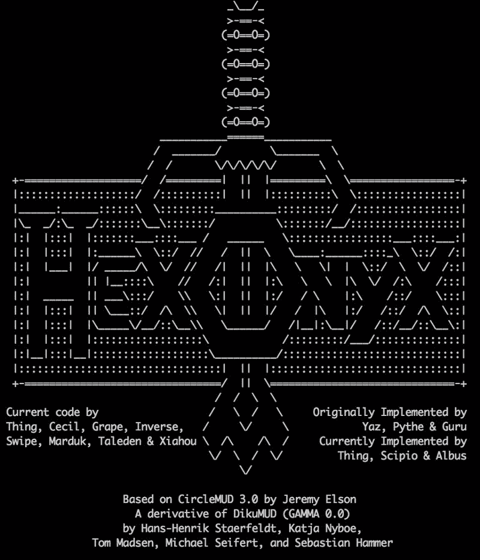

# 多用户地下城如何教我编程

> 原文：<https://www.freecodecamp.org/news/how-i-learned-to-program-f196a5a8bfd3/>

卡尔·塔西安

# 多用户地下城如何教我编程



Little Carl

“妈妈，你想让我写什么？告诉我，我给你写个程序。”那是 9 岁的我，急切地拽着我妈妈的裤腿。

我不记得我最后在我们的 Timex Sinclair 计算机上用 BASIC 写了什么，但我记得我希望被认真对待——希望做一些对某人有用的东西。我想我爸爸是心血来潮从邮购目录中买了那台电脑，这很令人惊讶，因为他不是一个喜欢小玩意的人。我们把它连接到一台旧的 8 英寸黑白便携式电视上。我妈妈写了一个程序，无限循环地在屏幕上打印我的名字。



电脑在召唤我。我哥哥和我在那台电脑上用 BASIC 语言写了一些东西，我们甚至可以用连接在电脑音频插孔上的卡带播放器来加载和保存我们的程序。我们试着在普通的磁带播放器上播放软件磁带，它听起来像尖锐的蝉鸣。

直到后来，在我 14 岁的时候，我才真正对编程产生了兴趣。我迷上了一款在线冒险游戏——一款名为 HexOnyx 的免费多人地下城(MUD)。Hex 是一个流行的虚拟世界，任何时候都至少有一百人在玩。尽管今天的 MMPORGs 一次可以容纳数百万人，但在当时，一个虚拟空间容纳数百人似乎是很多的。我在那里交到了很好的朋友，每天晚上我们都会一起在地下城和黑暗的森林中与邪恶的咆哮的狼人和腐烂的恶魔战斗。这个游戏完全基于文本，所以想象力是强制性的。近 20 年后，我的脑海中仍然有一些游戏中的旧踩踏场地的图片。

放学后的每一天都是泥泞中的新冒险，直到家庭晚餐的铃声把我拉回了现实世界。“我马上就来！”我会大喊，但很久以后，在吃饭的时候，我会偷偷溜进餐厅。当你面对一只想要你的头作为下一餐食物的四条腿的 lamia 野兽时，没有一个容易停下来的地方。

几个月来，我和我的网友们痴迷地与这些电脑生成的生物战斗。我最终把我的角色提升到了不朽的地步，这是游戏的有效终点。*不朽者不再战斗——他们的角色是帮助新玩家，解决争端，归档 bug 等等。

随着我与 Hex 的管理员和开发人员成为朋友，我开始研究 MUD 的设计，试图理解它如何能够触发如此深入的沉浸式体验，并想知道我们如何才能让它变得更好。

当时有几百个 mud，每一个都试图分化自己。为了区分 Hex，开发人员创建了一个自定义的游戏内世界构建器。当其他 mud 不得不编辑一个具有令人困惑的专有格式的平面文本文件时，游戏内的构建器使编写世界变得令人愉快，并允许玩家轻松参与。哈克斯的看守人亚兹说:

> “从我们当时的视角来看，游戏的目标是创造一个可以在世界内部维护的环境。即:没有人真的需要从外部运行游戏。我们和世界建筑商走得很近。”

有了世界构建器，你可以在游戏中写一个新的门和一个新的房间，然后穿过门进入房间，看看感觉如何。这引发了开发热潮，许多新的世界正在建设中，等待完成并与游戏的主地图连接起来。这些未完成的世界是可怕的地方，只有管理员才能进入，到处都是嗜血的怪物，日日夜夜独自游荡。

我对建造世界不感兴趣；即使有了世界构建器，这看起来也是太多的工作了。相反，我想了解软件的机制，并做出结构上的改变。

与现代 MMPORGs 不同，包括 HexOnyx 在内的大多数 mud 实际上都是开源的。我下载了 Jeremy Elson 写的 HexOnyx 的祖先 [CircleMUD](http://www.circlemud.org/) ，并在我的家用电脑上运行。我以前用 BASIC 编程过一些东西，但是 CircleMUD 是用 C 写的——对我来说是一个全新的世界。只是让它编译是一个项目。但渐渐地，我明白了如何做一些小的改变，在泥泞中看到我的改变在当地产生的影响是令人激动的。

典型的 CS 概念是在一些人为的、无聊的商业场景中教授的:客户、订单、产品、教师、课程等等。但是 CircleMUD 是一个真实的、有效的、相当复杂的软件，它生活在一个伟大的神话世界中。我正在通过例子学习计算机科学的基础，像这样调整函数:

```
/* * Function: find_guard * * Returns the pointer to a guard on duty. * Used by Peter, the Captain of the Royal Guard */struct char_data *find_guard(struct char_data *chAtChar){  struct char_data *ch;  for (ch = world[IN_ROOM(chAtChar)].people; ch; ch = ch->next_in_room)    if (!FIGHTING(ch) && member_of_royal_guard(ch))      return (ch);  return (NULL);}
```

在一个短函数中，我们有循环、条件、指针、链表、数组、预处理宏和结构。我们还有彼得，皇家卫队的队长。

以今天的标准来看，Circle 的部分代码会被认为是难闻的和不雅的。它没有测试，因为面向预防的软件测试还没有流行起来。但对我来说，圆形很美。这是一个例子，比我以前写过的，甚至想象过的作品都要大。Circle 本身是 MUD 项目 DikuMUD 的一个分支，由哥本哈根大学的几个人在 1990 年编写，它具有伟大的 C 程序的强大吸引力:它与操作系统的系统调用密切相关，它是高度优化的和事件驱动的，它做了许多现在隐藏在图书馆中的繁重工作。它从头开始管理自己的 TCP 套接字和 I/O 缓冲区，定义自己的游戏文件格式，等等。

在当时，今天被认为是裸机的是堆栈的顶部。Circle 的创建者并没有哀叹缺少动态输入或其他更高级的奢侈品——他们陶醉于超越汇编语言和学习操作系统来完成各种重要任务的便利。

因此，Circle 是一个大机器，在生产中，Hex 可以在 486 上的 20MB 内存中平稳地运行 200 多个并发用户。游戏运行在一个大的 100 毫秒事件循环中，从不阻塞；它只是服务于所有当前连接的用户，将世界向前移动一个节拍，然后在剩余的周期中休眠。我记得在这个循环中做了一些长时间运行的事情，并且艰难地了解到它让每个人都停止了游戏。最优化的早期课程。

经过数周对代码的钻研，以及反复试验，我很高兴地发布了一个小补丁，改变了游戏中命令提示符的风格。在一个 90 年代中期风格的拉请求中，我给 Hex 管理员发了一封电子邮件，附上我的补丁并急切地等待回复。



The ASCII intro art for HexOnyx

他们接受了我的补丁。他们应用了它。看到我的小小改变融入到这么多人每天都玩的游戏中，真是不可思议。开发者——大多数是大学年龄的计算机科学学生——给了我关于我的补丁的反馈，玩家也是如此。

我继续工作，发送了更多的小补丁。最终 Yaz 厌倦了扮演中间人的角色，他说:“为什么不直接编辑我们的代码呢？”他在服务器上为我创建了一个账户。

Hex 的实现者身份是我迄今为止感受到的最个人化的责任。我开始几乎每天晚上发布新的变化，从其他玩家那里收到即时反馈。作为一名资深玩家，我不仅设计和构建了我希望在游戏中看到的功能，更重要的是，我与其他用户在一个紧密的反馈循环中迭代。

反馈回路推动了我的工作。它让我继续前进，穿过那些看似无法修复的错误和看似难以解决的问题。没有时间表——只有每天朝着更好的游戏不断前进。我沉迷于增强人们喜欢使用的东西所带来的深深的满足感，我已经达到了一种不可思议的流畅状态。

我认为这是学习编程的一个很好的方法:与其说“我想学习编程”，不如从渴望改进已经存在的东西开始。人们使用的东西。期待你会遇到障碍和挑战，让来自用户和合作者的反馈成为你坚持下去的动力。许多开源项目提供了这个机会，但我认为游戏环境有一些特殊之处。

在接下来的几个月里，我学习了数据结构和内存分配。我学到了构建过程化软件的合理方法。我学习了套接字、数据序列化(在 JSON 甚至 XML 存在之前)、定时器和中断。除了我在代码注释和系统调用手册中读到的词汇外，我不知道这些东西的词汇。但是我被迷住了。为 MUD 编码是我每天在学校思考的事情，也是我每天晚上在家做的事情。

在接下来的一两年里，我添加了许多新功能。我扩展了 MUDs 的内部经济，为他们建立了一个住房系统(实际上是虚拟储物柜)和一个房地产市场。我在游戏的经济中引入了商品的稀缺性，编写了一个算法来限制最好的装备进入世界的速度。我充当了一只看不见的手，让游戏对人来说更有趣，更有挑战性，简直是爆款。

作为一名开发人员的乐趣促使我学习更多，并努力构建更多人们想要的东西。因为那次经历，我今天成了一名工程师。我很感激 CircleMUD 是可延展的开源代码，Yaz 在 14 岁时大胆地把钥匙交给了我。

我喜欢一种媒介，在这种媒介中，你可以以消费者的身份接近，并平稳地过渡到生产者。今天，《我的世界》允许在一个简单的、受约束的环境中进行一些修改，对于初露头角的程序员来说，这可能是一个很好的入口。但是编程艺术在普及之前还有很长的路要走。当今最流行的多人游戏对玩家来说基本上是不可改变的。因为像 WoW 这样的流行游戏不是开源的，所以在一个真实的、有生命的、有呼吸的系统上，似乎更难进入核心贡献者的角色。

我希望下一代程序员能像我一样享受学习编程的乐趣。改变游戏比玩游戏有趣多了。

*最初发表在我的个人网站上。感谢 Siobhán K Cronin 校对。*

#### 如果你已经走了这么远，你应该[加入我关于科技和人性的邮件列表](http://tashian.com/superstack)。