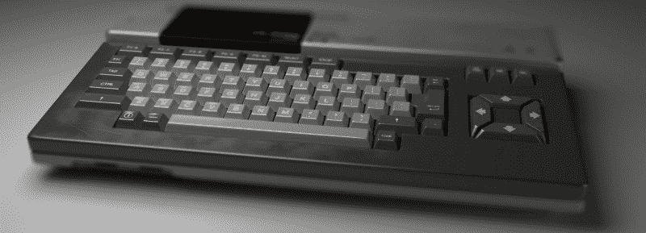
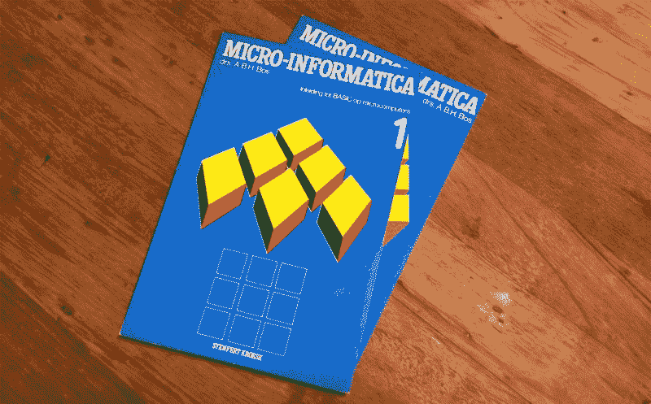

# 这是我必须告诉我爸爸的——在我们的时间用完之前

> 原文：<https://www.freecodecamp.org/news/this-is-what-i-must-tell-my-dad-before-our-time-runs-out-120585a75b31/>

布拉姆·博斯

# 这是我必须告诉我爸爸的——在我们的时间用完之前

我是一个 80 年代的小男孩。像典型的 X 一代孩子一样，我成长在家用电脑时代:Commodore 64、ZX 频谱和 MSX。

当我的一些同学第一次在家里有电脑玩游戏时，我大概是 10 岁左右。显然我也想要一个。但那是在 20 世纪 80 年代，资金紧张。我爸爸有两份工作来养家，电脑非常昂贵。然而他答应给我买一台——有一个条件:我要用它来学习如何编程。

他给我买了一个飞利浦 MSX2，带一个鼠标(我的同学很快就认为这是一个毫无意义的配件——我应该买一个操纵杆来代替)。我们花了无数个下午写基本代码。首先简单的事情——在屏幕上打印我的名字一百次。后来，更先进的东西，如移动 2D 雪碧在屏幕上使用箭头键。可以想象的最好的父子时光。

The books my father wrote back in 1982

我的父亲是一位受过教育的天才科学家，职业上是一位深受爱戴的高中教师。他很快就接受了微型计算机，因为它在教育方面具有内在的潜力。当 MS-DOS 还处于婴儿期时，他就写了关于它的书，并成功地继续在这个课题上进行他的研究和实验，直到他退休。

我选择了不同的职业:我成为了一名交互设计师。一个创意。右脑思考者。乍一看，这似乎与做程序员相反。然而，回顾我现在作为一名 UX 设计师的处境，我只能得出这样的结论——不管是直接还是间接——我把一切都归功于三十年前他教我如何写代码。

编码让我能够将我的想法转化为实际的工作产品，而不仅仅是餐巾纸上的设计和梦想。它通过让我创建真实的原型来帮助我测试 UX 假说。它向我展示了如何建设性地和创造性地与程序员和工程师一起工作。最重要的是，它教会了我如何通过分析问题并将其分解成可管理的小块来解决问题。我用这种方法吃过很多大象(一次一小口),这让 T2 在我的生活中获得了巨大的优势。

我很幸运自己有一个出色的儿子，我将教他如何编程，就像我父亲为我做的那样。我会这样做，不是因为我想让他成为程序员或 IT 人员，而是因为我相信知道如何编写一段代码会带来许多关键技能，这将有利于任何聪明的孩子追求他们选择的任何职业。这是众所周知的持续给予的礼物，我将把它传给我的儿子。

我想我从来没有为此好好感谢过我的父亲，不幸的是，我不得不最后一次和他说再见的时候快到了。所以，当我还有机会的时候，我想借此机会感谢他给了我一个 10 岁男孩和他父亲能做的最棒的交易，也是一个男人为他儿子做过的最明智的事情。

干杯爸爸！

你骄傲的儿子

My dad and I, celebrating my graduation (1993)