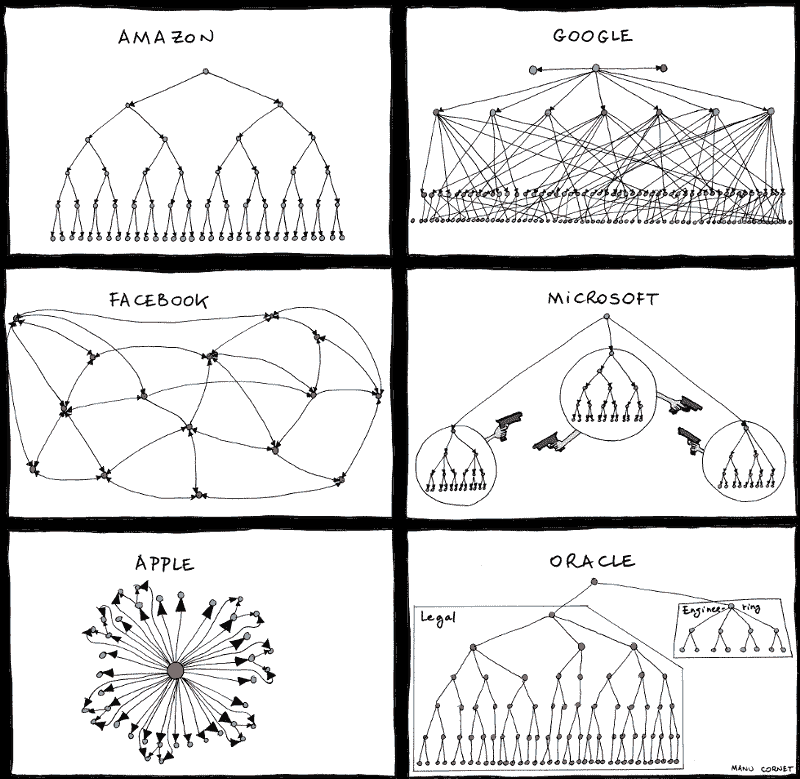

# 谷歌 VS 甲骨文谁赢了？开发商赢了。

> 原文：<https://www.freecodecamp.org/news/why-todays-victory-over-oracle-matters-so-much-to-developers-4e24b4a368b5/>

谷歌成功地从甲骨文 90 亿美元的诉讼中为自己辩护。通过这样做，谷歌的律师阻止了一个危险的先例，这个先例会给囤积版权的老科技公司一个起诉许多初创公司和开源项目的途径。

如果这是你第一次听说审判，我不怪你。基本上，这只是一群律师试图向一群非技术加州人解释 API 和版权法的复杂性，使用像文件柜和书架这样的隐喻。

> 当你前面一排的人在作证期间在 StubHub 上买票时，你知道你在杂草中。

> 布莱恩·贝肖普为《边缘》报道

以下是整个冲突展开的大致时间表:

2005 年:谷歌收购安卓。他们选择使用 Java 而不是微软的 C#，与拥有 Java 的 Sun Microsystems 谈判，但未能达成许可协议。

2006 年:谷歌拒绝了 Sun 公司提出的以 2000 万美元外加 10%的谷歌 Android 相关收入(上限为 2500 万美元)获得为期三年的 Java 许可的提议。

2007 年:谷歌公开宣布 Android，并使用 Dalvik，一种兼容 Java 的虚拟机。

2010 年:甲骨文收购了 Sun 公司的 Java 专利和版权，然后起诉谷歌侵犯了 Sun 公司的七项 Java 专利。

2011 年:美国专利商标局驳回了七项专利指控中的五项。甲骨文寻求高达 60 亿美元的赔偿。无法达成和解。

2012 年:甲骨文和谷歌在旧金山地方法院进行诉讼，谷歌胜诉。

**2014:** 上诉法院推翻了地区法院的判决，声称 API 是受版权保护的。

**2016:** 第二次审判开始，围绕谷歌使用 Java 的 API 是否属于[公平使用](https://www.eff.org/issues/coders/reverse-engineering-faq)。

Sarah Jeong 是一名法律和技术记者，从审判开始就对审判进行了详细报道，她在推特上宣布了审判的结论:

在整个诉讼过程中，我一直在思考甲骨文在这个经典的科技公司组织结构图集中的位置:

你可能会问，“好吧。所以一家大型跨国公司不需要给另一家大型跨国公司 90 亿美元。作为一名开发人员，这怎么会是我的胜利呢？”

好吧，如果你正在开发软件——或者计划在未来——这意味着谷歌的律师刚刚引导你绕过了一个巨大的知识产权雷区。他们能够阻止甲骨文树立一个危险的先例:一家公司可以成功地起诉你编写了你自己的功能相似的 API 实现。

不幸的是，这个案子还没有结束。甲骨文誓言将再次对这一决定提起上诉。这项裁决仍有可能被推翻。

无论如何，甲骨文能够如此接近有利于他们的判决这一事实是非常可怕的，并且可能会鼓励其他拥有 API 版权的公司也开始起诉创业公司和开源项目。

例如，一家名为 Micro Focus 的公司拥有 Unix，其中使用了一个名为 POSIX 的 API。他们可以开始起诉维护 Linux 版本和其他 Unix 兼容的开源操作系统的开发者。

我们还没有脱离险境，但是我们开源世界的所有开发者——以及使用我们软件的人们——可以暂时松一口气了。

如果你有时间，可以看看莎拉·郑的叙述，这场审判是多么的荒谬，甲骨文的胜利对除了甲骨文之外的所有人来说是多么的灾难性。

我只写编程和技术。如果你在推特上关注我，我不会浪费你的时间。？