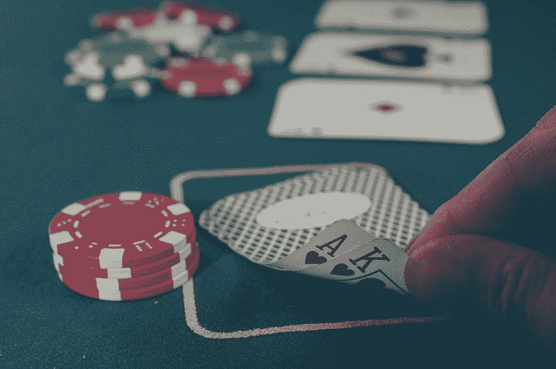
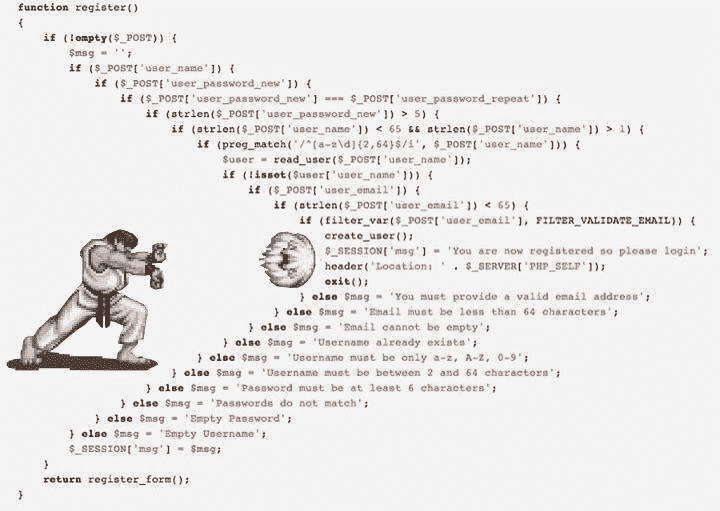
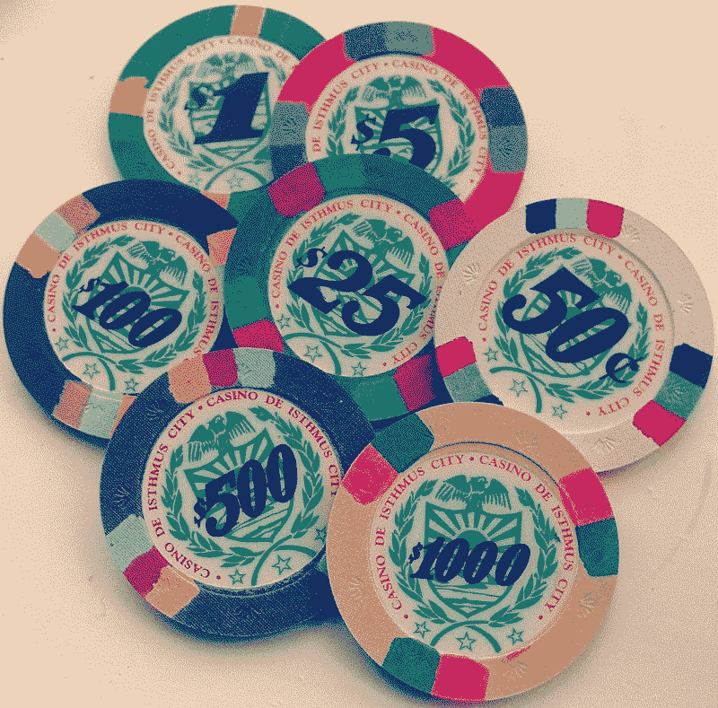

# 赌场赌博解释的 JavaScript 承诺

> 原文：<https://www.freecodecamp.org/news/javascript-promises-explained-by-gambling-at-a-casino-28ad4c5b2573/>

凯文·科诺年科

# 赌场赌博解释的 JavaScript 承诺

#### 承诺可能看起来令人困惑…直到你发现自己在“回拨地狱”那么他们似乎是合理的！

我们都喜欢 JavaScript 的异步功能。事实上，我们太爱他们了，以至于有时我们会过度放纵。然后我们得到类似于这个"[末日金字塔](https://en.wikipedia.org/wiki/Pyramid_of_doom_(programming))"的代码，你会想要通过抛出一个 Hadouken 来回应:

这通常被称为“回调地狱”,因为您可能不想重新阅读该代码并试图理解所有事情是如何工作的，以及它以什么顺序工作。事实上，你的团队中也没有人知道。

下面是另一个更简单的例子:

上面的例子有些困难:

*   错误处理不明确。如果出了问题会怎么样？
*   每个函数都依赖于前一个函数。您不需要异步风格。你想让其他阅读代码的人明白这个顺序。当您将这么多的函数链接在一起时，同步风格的代码将更具可读性。
*   您需要不断地跟踪变量，以便输入到函数中，然后输出。并跟踪每个输出的逻辑。这变得令人疲惫不堪。

你可以使用**承诺**让整个过程更容易理解。如果你像我一样，你可能听说过一两次承诺，但后来因为它们看起来令人困惑而忽略了它们。如果你了解回电，承诺的基本用法其实很简单。

承诺有点像去赌场，如果你正在寻找清理一个讨厌的代码块，他们是一个极好的解决方案。承诺鼓励直截了当的、单一用途的功能，这将允许你编写清晰的代码并理解每一个步骤而不感到头痛。

注意:如果你没有回访的经验，请查看[我对回访原则的解释](https://medium.freecodecamp.com/javascript-callbacks-explained-using-minions-da272f4d9bcd#.slyskqmt8)。如果你在寻找更多关于承诺的技术性解释，可以看看[这个指南](http://www.telerik.com/blogs/what-is-the-point-of-promises)或[这个指南](https://www.promisejs.org/)或[这个视频](https://www.youtube.com/watch?v=obaSQBBWZLk)。

#### 开始下注吧！

承诺具有一种价值，这种价值现在还不存在，但将来肯定会存在。这可以让你清楚地跟随一个函数，了解它的开始和结束。如上所示，承诺是阐明连续异步功能和阐明输入和输出的好方法。

假设你周末去赌场度假。你口袋里有两个星期的薪水，你将享受你赌掉的每一刻，直到最后一毛钱。你去酒店开个房间，然后去赌场。然而，赌场的桌子不接受现金。你需要去收银台把你的钱(比如说 1000 美元)换成赌场代币，就像这些人一样:

By Podknox, User:AlanM1 — Cropped from [1], CC BY 2.0, [https://commons.wikimedia.org/w/index.php?curid=21571904](https://commons.wikimedia.org/w/index.php?curid=21571904)

就停在这里。这是一个承诺的开始！你有一个已知的价值开始，但它是一个替身，而不是一个最终产品。你不能在赌场大厅外消费这些赌场代币，你也不是来赌场收集赌场代币的。你去那里玩游戏，赌场代币是让你将 1000 美元现金转化为最终产品的起点，希望超过 1000 美元。

拿到代币后，你可以尝试所有你喜欢的游戏。你玩了 20 局 21 点，押了 30%的钱，输了 200 美元。真快。你继续玩轮盘赌，在黑棋上下 5%的赌注，直到你赢了$50。你开始玩扑克，赌上 50%的钱，然后因为过于自信而输掉了 500 美元。

下面是这个过程的代码:

关于这个场景，有几点需要注意:

*   你不能同时玩两个桌子，所以一个游戏必须跟着另一个。
*   在赌场里，除了玩游戏，你没什么可做的，所以你想直接从一个游戏转到另一个游戏。
*   当您开始一个特定的游戏时，唯一相关的输入是您可以用来下注的代币数量。
*   来自特定游戏的输出也将是代币。
*   如果您用完了代币，您将无法开始另一场游戏。此时，你可以向经理抱怨，试图获得他们的同情，或者(更有可能的是)开始喝酒。

**三者各一。那么上面序列中的()语句就是承诺**。它以一个确定的替代值开始，并将根据游戏的进展返回未知数量的令牌。一旦游戏结束，它将返回值，并立即将其提供给下一个承诺。之前的承诺视为“履行完毕”。

下面是上面的例子，以一种可扩展的方式:

在这个例子中，所有的函数都是可重用的！因此，如果你想以不同的顺序玩游戏，你可以很容易地在第 4-6 行进行切换。

为了便于比较，下面是没有承诺的相同代码:

很难读懂！此外，错误消息是重复的。如果承诺由于小于或等于$0 的值而被拒绝，您可能会抛出此错误。异步风格是不必要的，因为我们知道这是一系列连续的动作。

#### 在这些例子上加倍努力

如果你在这一点上理解承诺，我真的很惊讶！让我们更深入地研究第一个例子，逐行分解它。

**第 3 行:**您使用 getCasinoTokens()函数将您的 1000 美元现金转换成代币，此处未画出。

**第四行:**该。then()语句表示下一个代码块将使用 getCasinoTokens()函数的结果。这些结果将通过*令牌*参数传入。这部分，第 4-6 行，现在是一个**未实现的承诺**。我们接受了*令牌*的值，在继续下一步之前，我们正在等待转换该值。退货单将满足这一要求。

**第 5 行:**我们用 30%的令牌调用 playBlackjack()函数。因为 21 点只能用代币玩，所以这个参数必须是数字的形式。如果它是一个字符串，或者数组，或者对象，这个函数会抛出一个错误，我们会拒绝这个承诺。当承诺被拒绝时，我们就转向。第 13 行的 catch()函数，看看发生错误时该怎么做。幸运的是，tokens 是一个数，函数完成，这个承诺兑现了。我们输入一个代币金额，下了一些赌注，然后得出一个新的代币金额

**第 7 行:**还有一个。then()函数，这意味着我们现在有另一个未实现的承诺。这个承诺的输入值是前一个函数返回语句的**结果。**在这种情况下，是玩 21 点后的代币计数。这是通过 *moreTokens* 的争论注入到承诺中的。如果你在赌场，你会拿着你得到的一堆代币直接去玩下一个游戏，轮盘赌。

**第 8 行:**如果 playRoulette()函数成功完成，这个承诺就兑现了。在这种情况下，只要 moreTokens 是一个数字，它就会成功完成。然后我们每隔一段时间重复这个过程。then()函数。

第 13 行:catch()函数处理任何错误，所以我们不需要在每个函数中处理错误或者完全忽略错误处理。

承诺的关键是未实现、实现或拒绝的概念。一旦你创建了这些承诺的序列，你就有了一个清晰的输入和输出流程，以及清晰的代码供他人阅读。您可以使用 3 种不同的状态来跟踪整个承诺链的进度。这种方式是同步的(顺序的)，尽管实际的执行是异步的。

感谢阅读。我希望这个类比能帮助您更好地理解 JavaScript 和 promises。

单击？下面，所以其他人会看到这篇文章在媒体上。