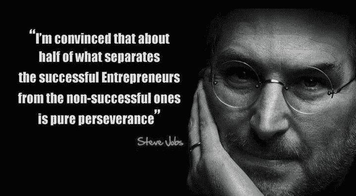

# 请不要放弃——每个专家都曾经是初学者

> 原文：<https://www.freecodecamp.org/news/please-dont-quit-every-expert-was-once-a-beginner-6d8f8933a338/>

作者:阿尤布·奈贾里

# 请不要放弃——每个专家都曾经是初学者

如果你像我一样，在你努力学习编程的某个时刻，你会举起双手说:“*我需要退出，这些废话不适合我！*

当你试图学习像编程这样复杂的东西时，很容易感到气馁。事实上，无论你走到哪里，都会有人告诉你“你做错了”，这让这个过程变得更加艰难。

知道有超过 1800 万的专业软件开发人员，并且这是世界上最常见的职业之一，可以欺骗你认为编码是一项简单的任务，我们可以在很短的时间内学会！你能够建造迷人的东西。

营销人员延续了编程很容易的神话，将其作为另一种在线赚钱的方式，就好像它和联盟营销、建立邮件列表或在 YouTube 上获得订户一样简单。如果您是编程新手，您可能会有这样的印象，即这些成就需要同样多的努力。这些营销活动描绘了一幅扭曲的软件开发真实世界的画面。

所以你决定放手一搏，假设这是在公园里散步。你拿起材料，开始旅程。接下来你遇到的棘手的事情就是热情的介绍。现在我真的很喜欢。令人鼓舞是好事。

但是大多数人——我们相对手把手的教育体系的产物——会得到这样的印象:编程只是阅读材料，如果你这样做了，你就会精通那种语言或技术。

但是，一旦你放下教程，开始独自进行项目，你就会碰到第一堵墙。问题开始出现。你开始感到毫无头绪。当一个概念看起来很难理解时，一个微弱的声音会告诉你，其他人能够克服你遇到的任何困难——为什么你不能？而且越往前走，越觉得失落。你开始变得非常沮丧，也许你开始考虑辞职。

#### 伟大的发展从来不会来自你的舒适区

让我们谈谈如何越过这第一堵墙。

新开发人员遇到这种情况很常见。感到沮丧、生病和头痛是正常的。你知道所有意味着什么吗？这意味着你在工作，在努力，在尽你最大的努力。这意味着你在用你的大脑，你在试图理解。

推动自己更上一层楼总是很难，因为这需要比平时更大的努力。它需要更多的能量，这可能会使你身心疲惫。但是不要想那个。想想结果。的成就。在你追求精通的过程中达到下一个水平。每一次你向专业迈出一步，不管多小，都还是一步。

#### 在扩散模式下学习

这里有一个心理技巧可以帮助你越过第一堵墙。由于第一次阅读时可能很难理解一个概念，你可以做一些对你更好的事情，帮助你快速理解它。

全神贯注地看完全文(第一遍，即使听不懂)，好吗？现在，再读一遍。我很确定这一次很多事情都会有意义。第二次之后，谷歌一下这个概念，试着在不同的文章中读到它。那将有助于你从不同的角度看它，这将有助于你更好地理解它。

下一步是第三遍读课文。你怎么想呢?我确信你现在对这个概念的理解比你第一次读它的时候要好得多，尽管很有可能你仍然处在寻求真正理解这个概念的早期。

我们刚刚描述了一个被称为[扩散模式](https://staciechoice1010.wordpress.com/2014/08/08/focused-vs-diffused-mode/)的学习过程。你可以将这种学习方式应用到视频和教程中。

第二面墙是一旦你完成了所有的材料，你会觉得是时候开始搭建东西了。您设置了您的开发环境并开始编码。过了一会儿，你发现你不知道如何创造你想要创造的东西。你不能把事情做得和你想象的一模一样。错误开始出现，要么你的代码有很多错误，似乎根本不能工作。

这里一个常见的错误是开始为这种情况责怪自己，认为自己不够聪明，不能成为一名开发人员，应该辞职。你开始想到你在新闻中听到的所有著名的程序员，你无法想象你如何能赶上他们。

你忘了！你忘了每个专家都曾经是初学者！你现在想到的专家在某一点上和你一样，他们也责怪自己，他们也有很多和你一样的想法——但他们没有放弃！

这是你——我们——都应该记住的:成功的男人和女人不会放弃！

> “你永远不会失败，直到你停止尝试。”― [**阿尔伯特·爱因斯坦**](http://www.goodreads.com/author/show/9810.Albert_Einstein)

因为软件开发需要大量的批判性思维，即使对于经验丰富的从业者来说，这也是令人疲惫的。这也可能令人沮丧，因为当你编程时，计算机不断地以错误和测试失败的形式给你负面的反馈。你应该努力提高对挫折和疲惫的承受力。

另外，你应该知道达到高水平需要时间。你不可能一夜之间成为下一个史蒂夫·乔布斯。所以，如果你把这作为快速挣钱的方式，你会失望的。

从我开始工作以来，我从经验和其他开发人员那里学到了很多东西——而且我还在学习。以下是我学到的一些东西，我认为会对你有帮助:

*   不要独自工作。如果可以的话，总是和其他开发人员一起工作。
*   不要等待灵感。灵感不是你能控制的，如果你依赖它，你将无法一直工作。通过强迫自己工作来建立纪律。**纪律是可靠的。**
*   真正的工作通常并不有趣。这很艰难，也很累人，不要逃避！
*   **练习，练习，再练习。**熟能生巧。
*   教程代钓，不用自己学怎么钓。你需要读书。
*   总是尝试使用不同的资源来理解一个新概念。这有助于你从不同的角度看问题，从而提高你的理解能力。
*   **不要光看**。**建造。尝试，尝试，继续尝试。**编程就像游泳。你不能把一个花所有时间游泳的人和一个花所有时间阅读游泳和游泳时身体如何工作的人相比较。
*   沮丧、无聊、疲倦、精疲力尽——这些都是正常的。它们并不表明你不适合某个特定的职业。他们只会说你在努力，尽你最大的努力。
*   **问。**不管是不是技术问题，**随便问。**如果你找不到合适的人问，有两个很棒的替代品，你无法想象他们救过我多少次。 [Quora](https://www.quora.com/) 和[栈溢出](http://www.stackoverflow.com/)。

**不要放弃！**切记**每一位专家都曾是初学者。**

我希望这篇文章对你有用！如果你喜欢它，请点击下面的心形按钮并分享它。谢谢！^^