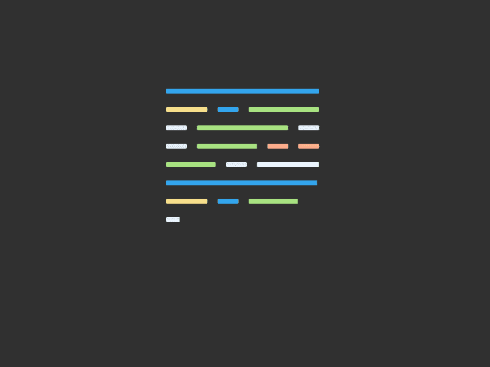
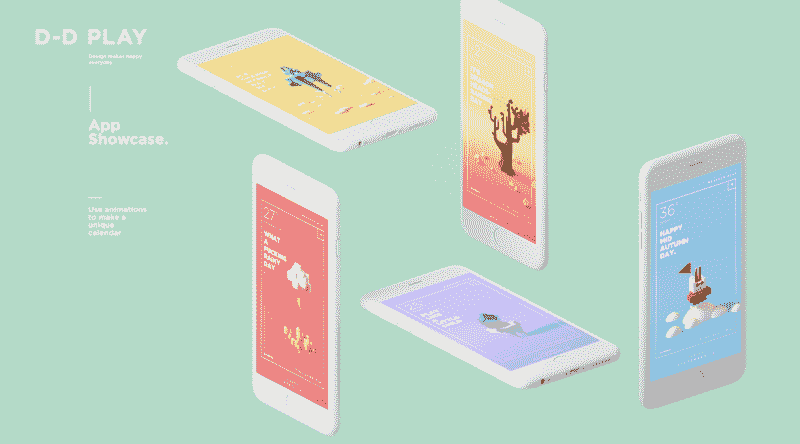
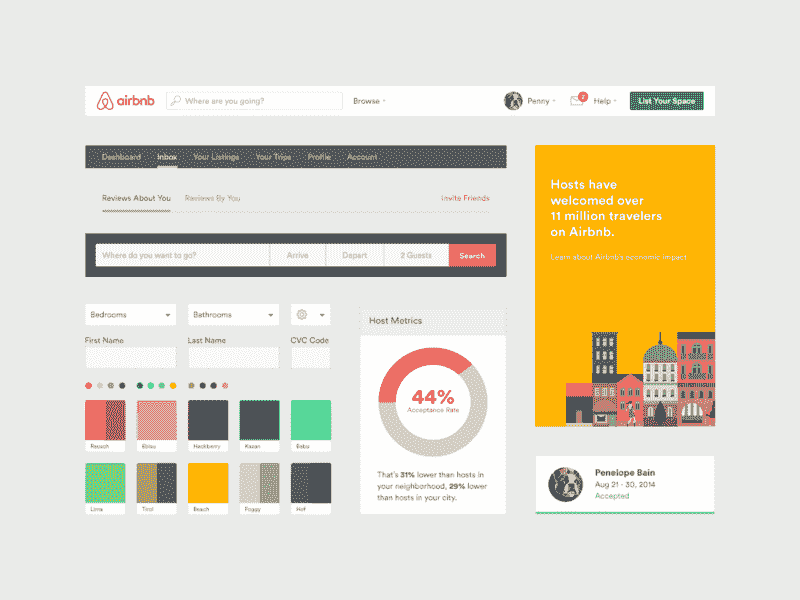
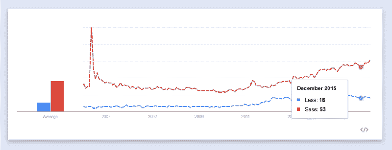
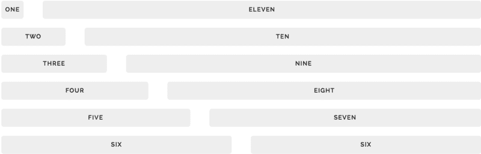
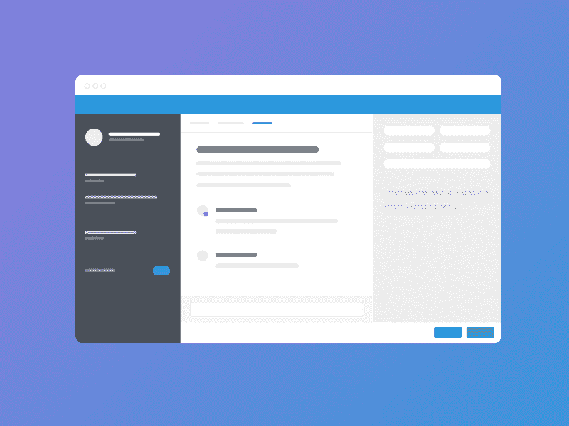
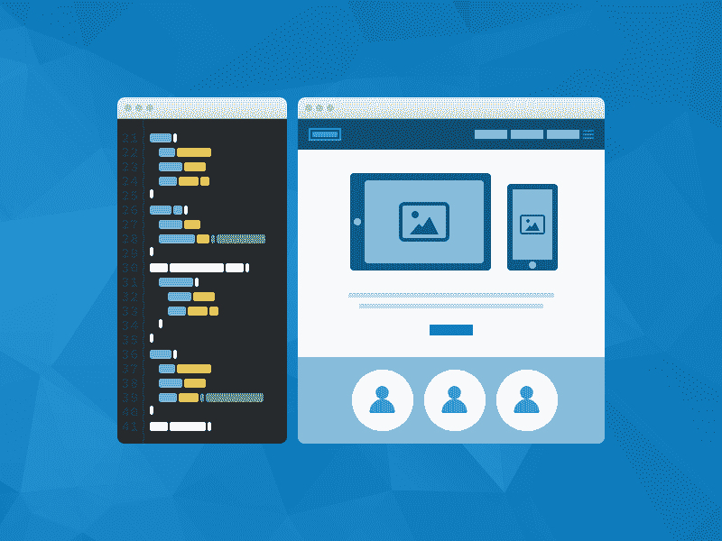
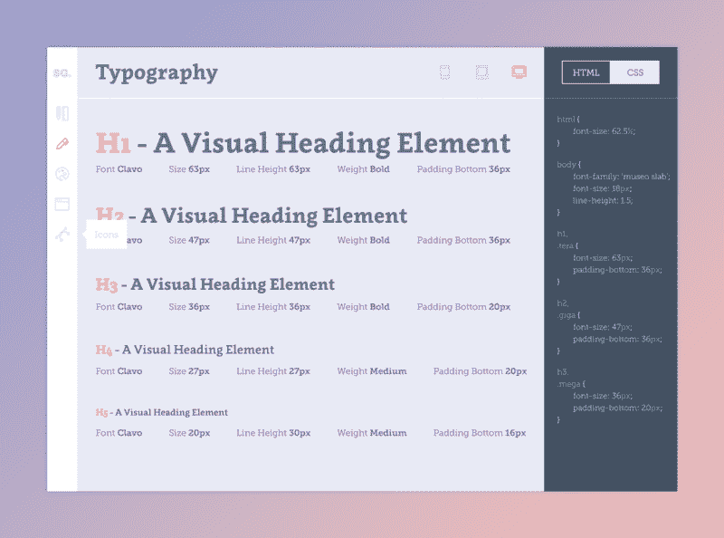

# 从零到前端英雄(第一部分)

> 原文：<https://www.freecodecamp.org/news/from-zero-to-front-end-hero-part-1-7d4f7f0bff02/>

记得刚开始学前端开发的时候。我遇到了太多的文章，被我需要学习的大量材料淹没了，我甚至不知道从哪里开始。

本指南将帮助您学习前端开发。它提供了我过去发现有效的学习资源，以及补充说明。

为了让本指南易于理解，我把它分成了两部分。第一部分介绍用 HTML 和 CSS 开发界面。第二部分介绍 Javascript、框架和设计模式。如果你熟悉 HTML 和 CSS，你可以跳到第二部分，这部分涵盖了 Javascript 的所有内容。

[**从零到前端英雄(下)**](https://medium.com/p/adfa4824da9b)
[*前端开发学习完全指南*medium.com](https://medium.com/p/adfa4824da9b)

### HTML 和 CSS 基础

前端开发，一切从 [HTML](https://en.wikipedia.org/wiki/HTML) 和 [CSS](https://en.wikipedia.org/wiki/Cascading_Style_Sheets) 开始。HTML 和 CSS 控制你在网页上看到的内容。HTML 指示内容，而 CSS 处理样式和布局。

[From code to interface](https://dribbble.com/shots/1746086-Liberio-Code-to-Interface)

首先，请阅读 Mozilla Developer Network(MDN)的 [HTML](https://developer.mozilla.org/en-US/docs/Web/Guide/HTML/Introduction) 和 [CSS](https://developer.mozilla.org/en-US/docs/Web/Guide/CSS/Getting_Started/What_is_CSS) 教程。MDN 逐章解释了重要的 HTML 和 CSS 概念。此外，每一章只有一页长，互动演示链接到 CodePen 和 JSFiddle。

完成这些教程后，看看 CodeAcademy 的[制作网站](https://www.codecademy.com/learn/make-a-website)课程。本教程只需要几个小时就可以完成，是用 HTML 和 CSS 构建网站的好入门。如果你想了解更多，[构建 web 表单](https://www.codecademy.com/courses/web-beginner-en-Vfmnp/0/2?curriculum_id=50b91eda28c2fb212300039e)是 CodeAcademy 的另一个教程，它将带你构建和设计 web 表单。

为了练习 CSS，试试 [CSS Diner](http://flukeout.github.io/) 。这是一个有趣的 CSS 挑战游戏。HTML 和 CSS 的另一个重要方面是布局。 [LearnLayout](http://learnlayout.com/) 是一个交互式教程，向你展示如何用 HTML 和 CSS 创建布局。

此外，学习如何使用[谷歌字体](https://www.google.com/fonts)与[谷歌字体 API](https://css-tricks.com/snippets/css/basics-of-google-font-api/) 的基础知识。排版是界面的基本组成部分。如果你有时间，我强烈推荐你阅读这本免费的在线书籍，唐尼·张的《专业网页排版[。它教会你作为一名前端开发人员需要知道的关于排版的一切。](https://prowebtype.com/)

纵观这些资源，不用太担心背东西。相反，要着重理解 HTML 和 CSS 是如何协同工作的。

### 练习 HTML 和 CSS 基础

既然您已经基本掌握了 HTML 和 CSS，让我们玩得开心点。在这一部分，有两个实验旨在让你练习构建网站和界面。我使用“实验”这个术语是因为在实验中，你从失败中学到的和从成功中学到的一样多。

#### 实验 1

在我们的第一个实验中，我们将使用 [CodePen](http://codepen.io/) 。CodePen 是一个前端游乐场，你可以在这里编写 HTML 和 CSS 代码，而不必在本地存储文件。它也有实时预览，一旦你保存你的代码就会更新。

通过使用 CodePen，你可以一举两得。一方面，你练习 HTML 和 CSS。另一方面，你创建了一个基本的进度投资组合。我们还将使用 [Dribbble](https://dribbble.com/) ，这是一个充满设计灵感的网站。

去 Dribbble 找一个简单到几个小时就能编码的设计。我挑选了几个设计让你入门: [1](https://dribbble.com/shots/2262761-Mobile-Blog-App-Interface/attachments/424147) 、 [2](https://dribbble.com/shots/2492038-Task-List-App/attachments/489171) 、 [3](https://dribbble.com/shots/2144170-Day-014-Location-Card/attachments/392323) 、 [4](https://dribbble.com/shots/2639709-Confirm-Reservation/attachments/528798) 和 [5](https://dribbble.com/shots/2314157-Daily-UI-Day-1/attachments/439137) 。我选择了移动优先的网页设计，因为它们没有桌面设计复杂。然而，也可以随意选择桌面设计。

在你决定了一个设计之后，继续尝试用 CodePen 编码它。如果你陷入困境，记住 [StackOverflow](http://stackoverflow.com/) 是你的朋友。另一个有用的做法是去像 [Medium](http://medium.com/) 、 [AirBnB](http://www.airbnb.com/) 和 [Dropbox](http://www.dropbox.com/) 这样的网站，并使用 i [nspector 工具](https://developer.chrome.com/devtools)来看看他们如何实现不同的布局和风格。另外，看看 CodePen 上的一些[笔。我挑选了一些好的参考资料:](http://codepen.io/pens/)

*   [菜单 App 界面](http://codepen.io/ManarKamel/pen/BooXJw)
*   [推特小工具](http://codepen.io/cameronbaney/pen/gfjLJ)
*   [文章新闻卡片](http://codepen.io/jonathanzwhite/pen/GZVKmE)
*   [简单的平面菜单](http://codepen.io/Jeplaa/pen/adnoH)

如果您的副本看起来与原件不同，请不要气馁。不断练习不同的设计，你会发现每次都有进步。

如果你没有设计背景，很可能你的设计眼光不够发达。一个拥有良好设计眼光的前端开发人员将能够识别好的设计，并完美地复制它们。几周前，我写了一篇关于如何[培养你的设计眼光](https://medium.com/@JonathanZWhite/developing-your-eye-for-design-cce944bbeae4#.tsg9204dm)的文章。

#### 实验二

希望第一个实验给了你编写 HTML 和 CSS 的信心。对于实验 2，我们将查看一些站点，然后编写一些组件代码。

一些网站使用 CSS 框架或者混淆它们的 CSS 类名，让你很难读懂它们的源代码。这就是为什么我选择了几个设计良好、源代码易读的网站。

*   [Dropbox for Business](https://www.dropbox.com/business) :尝试复制他们的[英雄](https://en.wikipedia.org/wiki/Hero_image)版块
*   AirBnB :试着复制他们的页脚
*   PayPal :尝试复制他们的导航条
*   尝试在页面底部复制他们的注册部分
*   尝试复制他们的支付部分

同样，实验 2 的重点不是重新创建整个页面。虽然那肯定不会伤害！选择几个关键组件，如导航栏或英雄部分进行编码。我在网站列表旁边提供了一个建议，但是您可以随意选择其他组件。

你可以在 [CodePen](http://codepen.io/) 中对这个实验进行编码，或者保存在本地。如果您选择将它存储在本地，您可以下载这个[示例项目](https://github.com/murtaugh/HTML5-Reset)作为样板文件，或者从头开始创建文件。我建议使用像 [Atom](https://atom.io/) 或者 [Sublime](https://www.sublimetext.com/) 这样的编辑器。

还有，记住，对于任何一个网站，你总能看到它的 HTML 和 CSS。只需右击页面或页面上的组件，点击 *inspect* ，就会弹出一个面板，左边是 HTML，右边是 CSS。一旦你完成或者卡住了，使用检查器看看你的 HTML 和 CSS 如何比较。

### HTML 和 CSS 最佳实践

到目前为止，你已经学习了 HTML 和 CSS 的基础知识。下一步是学习最佳实践。最佳实践是一组提高代码质量的非正式规则。

#### **语义标记**

HTML 和 CSS 的最佳实践之一是编写语义标记。良好的 web 语义意味着使用适当的 HTML 标签和有意义的 CSS 类名来传达结构意义。

例如， *h1* 标签告诉我们它所包装的文本是一个重要的标题。另一个例子是*页脚*标签，它告诉我们这个元素属于页面的底部。如需进一步阅读，请阅读由 CSSTricks 编写的《T4:正确的 HTML5 语义研究》和《语义类名构成要素》。

#### **CSS 命名约定**

CSS 的下一个重要的最佳实践是正确的命名约定。良好的命名约定，如语义标记，传达了意义，并有助于使我们的代码可预测、可读和可维护。你可以在文章[oocs，ACSS，BEM，SMACSS:它们是什么？我应该用什么？](http://clubmate.fi/oocss-acss-bem-smacss-what-are-they-what-should-i-use/)

总的来说，我建议尝试简单的命名约定，这对你来说有直观的意义。随着时间的推移，你会发现最适合你的。要了解像 Medium 这样的公司如何利用 BEM 这样的命名惯例，请阅读 [Medium 的 CSS 实际上相当不错](https://medium.com/@fat/mediums-css-is-actually-pretty-fucking-good-b8e2a6c78b06#.ef81j61eg)。在那篇文章中，您还将了解到提出一组有效的 CSS 约定是一个迭代过程。

#### CSS 重置

浏览器从边距到行高都有一些小的样式不一致。出于这个原因，总是重置您的 CSS。 [MeyerWeb](http://meyerweb.com/eric/tools/css/reset/index.html) 是一种流行的复位。如果你想深入了解，可以阅读[创建自己的简单 Reset.css 文件](http://code.tutsplus.com/tutorials/weekend-quick-tip-create-your-own-resetcss-file--net-206)。

#### **跨浏览器支持**

跨浏览器支持意味着您的代码支持大多数最新的浏览器。一些 CSS 属性如*转换*需要[厂商前缀](https://developer.mozilla.org/en-US/docs/Glossary/Vendor_Prefix)才能在不同的浏览器中正常工作。你可以在本文 [CSS 厂商前缀](http://webdesign.about.com/od/css/a/css-vendor-prefixes.htm)中阅读更多关于厂商前缀的内容。主要的一点是，你应该在多种浏览器上测试你的网站，包括 Chrome、Firefox 和 Safari。

#### **CSS 前处理器和后处理器**

自 20 世纪 90 年代引入 CSS 以来，CSS 已经走过了漫长的道路。由于 UI 系统变得越来越复杂，人们提出了称为前处理器和后处理器的工具来管理复杂性。

CSS 预处理器是 CSS 语言的扩展，增加了像变量、混合和继承这样的功能。两个主要的 CSS 预处理器是 [Sass](http://sass-lang.com/guide) 和 [Less](http://lesscss.org/) 。2016 年，Sass 普遍应用更广泛。流行的响应式 CSS 框架 Bootstrap 也从 Less 转向 Sass。此外，当大多数人谈论萨斯时，他们实际上是在谈论 [SCSS](https://www.sitepoint.com/whats-difference-sass-scss/) 。

CSS 后处理器在 CSS 由预处理程序手工编写或编译后，将更改应用于 CSS。比如一些像 [PostCSS](https://github.com/postcss/postcss) 这样的后处理器，就有自动添加浏览器厂商前缀的插件。

当你第一次发现 CSS 预处理程序和后处理程序时，到处使用它们是很诱人的。然而，从简单开始，只有在必要的时候才添加扩展，比如变量和混合。我之前提到的那篇文章， [Medium 的 CSS 实际上相当不错](https://medium.com/@fat/mediums-css-is-actually-pretty-fucking-good-b8e2a6c78b06#.ef81j61eg)，它也涵盖了对于预处理程序来说多少才算太多。

#### **电网系统和响应能力**

网格系统是 CSS 结构，可以让你水平和垂直堆叠元素。

像 [Bootstrap](http://getbootstrap.com/) 、 [Skeleton](http://getskeleton.com/) 和 [Foundation](http://foundation.zurb.com/) 这样的网格框架提供了在布局中管理行和列的样式表。虽然网格框架很有用，但是理解网格是如何工作的也很重要。[了解 CSS 网格系统](http://www.sitepoint.com/understanding-css-grid-systems/)和[不要想太多网格](https://css-tricks.com/dont-overthink-it-grids/)是很好的概述。

网格系统的主要目的之一是给你的网站增加响应能力。响应性意味着你的网站会根据窗口宽度调整大小。很多时候，响应是通过使用 [CSS 媒体查询](http://www.w3schools.com/css/css_rwd_mediaqueries.asp)实现的，CSS 规则只适用于特定的屏幕宽度。

您可以在[媒体查询简介](https://varvy.com/mobile/media-queries.html)中了解更多关于媒体查询的信息。同样，因为我们已经进入了一个[移动优先](http://zurb.com/word/mobile-first)的时代，请查看[关于移动优先媒体提问的介绍](http://www.sitepoint.com/introduction-mobile-first-media-queries/)。

### 实践 HTML 和 CSS 最佳实践

现在您已经掌握了最佳实践，让我们对它们进行测试。接下来两个实验的目标是练习编写干净的代码，并观察最佳实践对可读性和可维护性的长期影响。

#### 实验三

对于实验 3，选择一个你以前的实验，用你学到的一些最佳实践重构你的代码。重构意味着编辑你的代码，让它更容易阅读，不那么复杂。

能够有效地重构代码是前端开发人员的一项重要技能。创建质量代码是一个迭代的过程。CSS 架构:重构你的 CSS 是重构你的代码的良好起点。

[It’s not at all important to get it right the first time. It’s vitally important to get it right the last time.](https://dribbble.com/shots/2035328-Fixel-Development-Icon)

当你重构你的代码时，这里有一些事情要问你自己。

*   你们的班名有歧义吗？6 个月后，你还能理解你的班级名字的含义吗？
*   你的 HTML 和 CSS 有语义吗？当浏览你的代码时，你能快速辨别结构和关系的含义吗？
*   你是否在代码中一遍又一遍地重复使用相同的十六进制颜色代码？将其重构为一个 [Sass 变量](http://webdesign.tutsplus.com/articles/understanding-variable-scope-in-sass--cms-23498)是否更有意义？
*   你的代码在 Safari 上和在 Chrome 上一样好用吗？
*   你能把你的一些布局代码替换成像 [Skeleton](http://getskeleton.com/) 这样的网格系统吗？
*   你在用*！重要的*旗常？你如何解决这个问题？

#### 实验 4

最后一个实验将您学到的最佳实践付诸实践。然而，最佳实践的效果通常不会变得明显，直到您将它们应用到更大的项目中。

最后一个实验，给自己建一个作品集网站。作为前端，你的作品集网站是你最重要的数字资产之一。作品集是展示你作品的网站。更重要的是，这是一个持续的记录，可以帮助你跟踪你的进步和发展。所以即使你只有一两件东西要展示，也要展示出来。

[ShiftBrain Studio](http://www.shiftbrain.co.jp/)

首先，跟随 Adham Dannaway 的文章[我的(简单)工作流程去设计和开发一个作品集网站](https://www.smashingmagazine.com/2013/06/workflow-design-develop-modern-portfolio-website/)

如果你的第一个投资组合迭代不完美，*没关系*。投资组合经历许多迭代。重要的是，你用自己的技能建造了它。

### 保持最新

虽然 HTML 和 CSS 不会很快过时，但跟上前端的发展趋势是很重要的。

[The front-end landscape is constantly changing](http://www.deviantart.com/art/Fantasy-Island-160026050)

下面是一个网站、博客和论坛的列表，这些网站、博客和论坛读起来既有趣又有知识性。

*   [CSSTricks](https://css-tricks.com/)
*   [砸弹匣](https://www.smashingmagazine.com/)
*   [设计师新闻](https://www.designernews.co/)
*   [Nettuts+](http://code.tutsplus.com/)
*   [CSS 向导](http://csswizardry.com/)

### 通过例子学习

最后，最好的学习方法是以身作则。这里有一套风格指南和代码约定，将教你如何成为一个更有效的前端。

#### **样式导轨**

[Typography styleguide](https://dribbble.com/shots/1570099-Style-guide-typography-page/attachments/241293)

Web styleguides 是 CSS 组件和模式的集合，可以在整个网站中重用。从这些风格指南中要注意的关键是基于组件的 HTML 和 CSS 方法如何允许你重用代码来保持你的代码[干燥](https://en.wikipedia.org/wiki/Don't_repeat_yourself)。

*   [地图框](https://www.mapbox.com/base/styling/)
*   [孤独星球](http://rizzo.lonelyplanet.com/styleguide/design-elements/colours)
*   [SalesForce](https://www.lightningdesignsystem.com/)
*   [MailChimp](http://ux.mailchimp.com/patterns/)

#### **代码约定**

代码约定旨在使您的代码具有可读性和可维护性。有些链接像 [CSS 指南](http://cssguidelin.es/)是编写更好的 HTML 和 CSS 的指南，而其他链接像 [Github 内部 CSS 工具包和指南](https://github.com/primer/primer)是高质量代码的例子。

*   [CSS 指南](http://cssguidelin.es/)
*   [Github 内部 CSS 工具包和指南](https://github.com/primer/primer)
*   [Airbnb CSS 风格指南](https://github.com/airbnb/css)

### 包裹

希望在本文结束时，您已经熟悉了 HTML 和 CSS，并且已经有了一些项目。学习前端的最好方法是通过构建项目和实验。请记住，每个前端开发人员都必须从某个地方开始。而且今天开始总比明天好。

本文是两部分系列的第一部分。第二篇文章介绍了使用 Javascript 和 Javascript 库/框架增加交互性。此外，如果你想让我详细说明什么或有任何问题，请随时给我留言或发推文。

[**从零到前端英雄(下)**](https://medium.com/p/adfa4824da9b)
[*前端开发学习完全指南*medium.com](https://medium.com/p/adfa4824da9b)

另外，如果你喜欢这篇文章，点击推荐按钮或与朋友分享，这将意味着很多。

如果你想了解更多，你可以在 Twitter 上关注我，我会在这里发布一些关于设计、前端开发、机器人和机器学习的无聊言论。

