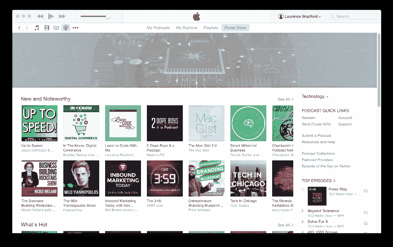
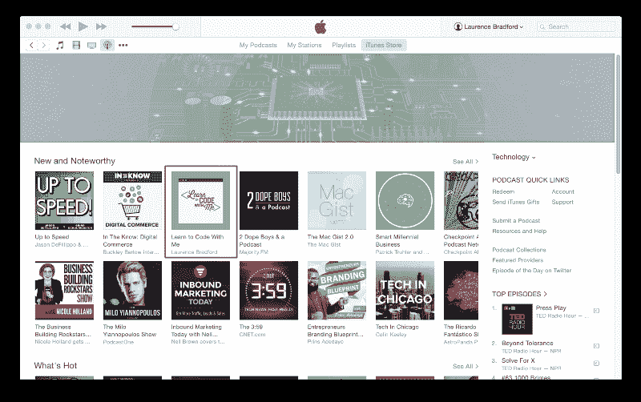
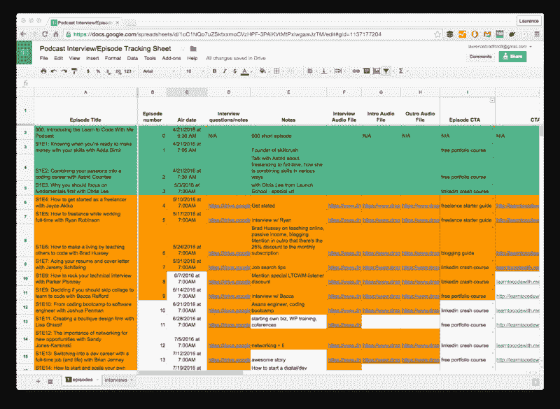
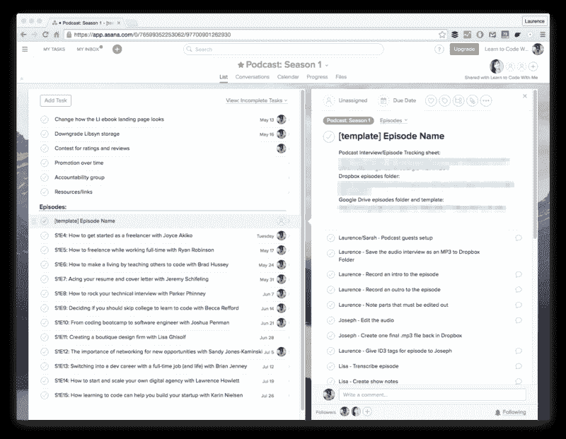
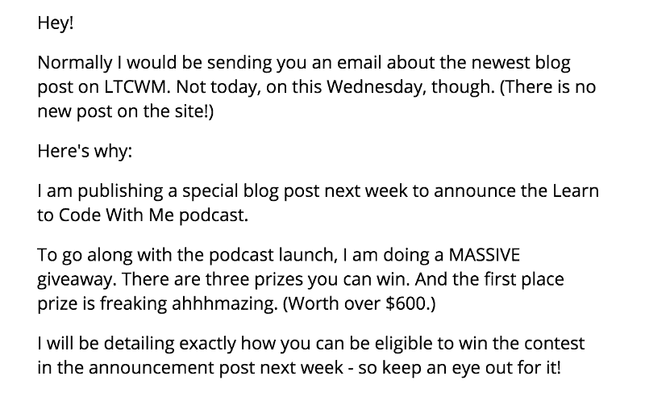
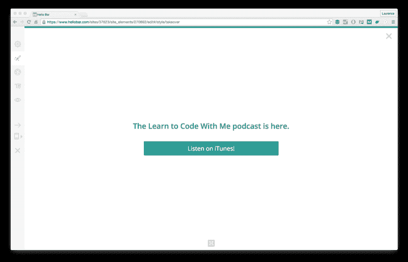
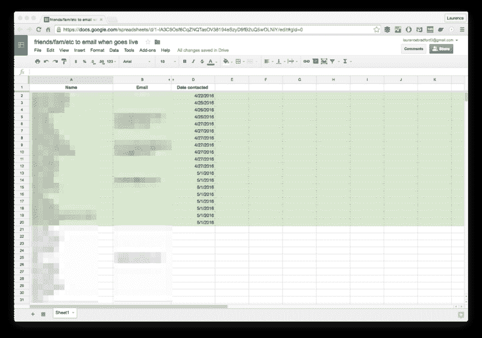
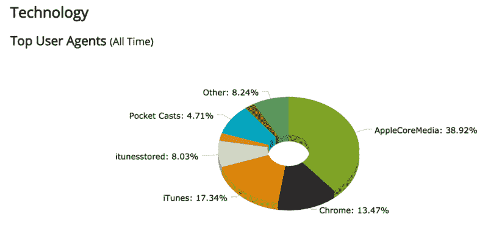
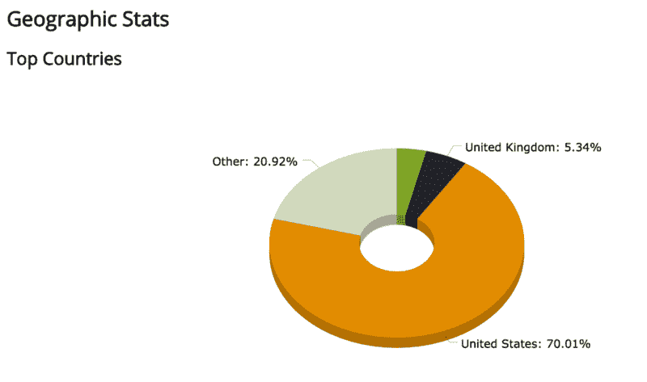

# 播客发布故事(案例研究)

> 原文：<https://www.freecodecamp.org/news/a-podcast-launch-story-case-study-230222b95653/>

我(非常)最近[推出了跟我学编码播客](http://learntocodewith.me/posts/ltcwm-podcast-launch/)。这是我第一次播客。

这个节目最终进入了 iTunes 上新的值得关注的部分，成千上万的下载，以及来自我现有博客观众的总体良好反馈。

我写了这篇文章来分享我是如何准备、推出这个节目的，以及我学到了什么。在很大程度上，这篇文章是针对发布的。但是如果你有任何关于播客的后勤/技术问题，请随时打电话给我。*我仍然是一个播客新手，但我非常乐意与你分享我的见解！*

#### 快速背景故事

我有一个博客[leantocodewith . me](http://learntocodewith.me/blog)(LTCWM)，我已经在那里写了两年了。我非常喜欢写作。事实上，我现在为其他网站— *写文章，并因此获得报酬！*

> 但是写作有它的局限性。别人听不到你的声音。人们不能带你到处跑。通过写作，一个人无法像通过播客那样了解你。

另外，经过两年的写作，我想尝试一些新的东西。接受挑战。你知道吗？此外，我变得有点太舒服了。(没有什么比自我引发的压力更能让你感到活着！)

于是，2016 年初，我决定在 4 月下旬推出播客。跟我学编码播客。

我决定采用季节性的方式，而不是承诺每周甚至每两个月举办一次展览。这样我就可以做一季，看看效果如何。然后，基于(1)我有多喜欢它和(2)观众的反馈，我可以决定是否拍第二季。

#### 开始播客的原因

1.  我想让我现有的观众有机会更好地了解我(音频更加个人化)
2.  我想让我现有的观众(和新观众)有机会在移动中(在健身房、在车里、遛狗等)使用我的内容。音频是唯一可以进行多任务处理的媒体。)
3.  我想接触新的人。那些可能永远也找不到 LTCWM 的人。
4.  我想获得一种新的媒体——音频(我所做的就是写，写，写)
5.  我想提高我的口语技能(因为我不擅长通过口语表达我的想法)
6.  我想提升我的内容创作能力。我喜欢创建鼓励人们学习编程的教育内容。通过音频来尝试这样做很有趣。
7.  我想与我所在领域的同行建立联系(请求面试是一种很好的联系方式！)

#### 我的主要播客发布目标

让它成为 iTunes 上[新的值得关注的部分](https://www.weeditpodcasts.com/get-your-podcast-into-the-new-and-noteworthy/)。(但最好足够高，这样这个节目就会出现在科技类的头版。)**剧透提醒:我的目标在 iTunes 里呆了大约 10 天后实现了！**

#### …为什么我这么关心 iTunes？

2014 年有 [8 亿 iTunes 账户](http://www.forbes.com/sites/nigamarora/2014/04/24/seeds-of-apples-new-growth-in-mobile-payments-800-million-itune-accounts/#399330831e58)。谁知道今天有多少，2016 年。

> iTunes 商店本身就像一个搜索引擎。不同于谷歌，这里的竞争要少得多。

正如我在整个旅程中发现的，播客及其背后的数字是一个很大的谜。但是在 2015 年，iTunes 商店中有 60，000 个活跃的 T2 播客。其他数据指向 [250，000 **商店中独特的**播客](http://www.macworld.com/article/2044958/apple-one-billion-itunes-podcast-subscriptions-and-counting.html)(2013)。

无论确切的数字是多少，它都远远少于在线网站的数量——现在在线网站的数量已经超过了 10 亿。回到 2013 年，**在线博客**的数量已经固定在[1 . 52 亿](http://www.wpvirtuoso.com/how-many-blogs-are-on-the-internet/)左右。

与此同时，收听播客的美国人数量正在上升。T2 的下载量也是如此。

**重点是:**

*   iTunes 有很多用户。
*   播客之间的竞争远没有博客激烈——至少对我来说是这样
*   越来越多的人每天都在听播客。
*   iTunes 是最大的目录
*   在我看来，拥有播客而不在 iTunes 上是疯狂的。

另外，自从 4 月 25 日推出我的节目以来，有新的电子邮件订户告诉我，他们在 iTunes 中通过搜索“*学习编码*”这个词找到了我的播客。嘣。

#### 我是如何推出 LTCWM 播客的

我投资了自己。永远不要低估投资自己的力量。在此之前，我报名参加了约翰·李·杜马斯的[播客天堂](http://podcastersparadise.com/) (PP)课程。这是一笔大投资，但我是认真的。我知道分发现金会促使我保持承诺。因为有了 PP，我能够理解播客是如何工作的，制作一个节目的过程，以及最佳实践。PP 还把你放在了问责小组，我利用了这一点。(在撰写本文时，我仍然每周与我的问责小组会面一次。)

设定一个严格的期限。我尽快设定了一个严格的期限。就像我说的，“如果它不在你的日历上，它就不算数。”我最初的截止日期是 4 月 26 日。但是因为我很早就进入了 iTunes 的故事，所以我最终在 4 月 25 日正式发布。

**尽早安排面试。**我在三月的前两个星期里几乎完成了所有的采访录音。*但是我从二月初就开始安排了。我知道人们会很忙，或者不得不改期，甚至取消。我想*

**得到了帮助。**早些时候，我就知道我不可能在 4 月 26 日之前独自完成一整部剧，同时保持其他责任和理智。我对音频编辑完全没有兴趣。所以，我得到了帮助。当时我已经有一个 VA 帮助我进行组织/项目规划。不过我也找了个人帮忙做音频剪辑。我知道这对播客来说至关重要——你所拥有的只是音频质量。后来，我不得不找其他人帮忙做剧集脚本和节目笔记。

**内容银行。**这是 John Lee 在 PP 课程中谈到的内容。在推出你的节目之前，你应该准备好大约一个月的内容。在我开播之前，我已经把第一季的 15 集都录好了。

**组织为 f$ & @。**在整个过程中，我让[的事情变得非常……非常……非常……有条理](https://www.youtube.com/watch?v=XadNMpvhkzA)。*好吧，你抓到我了*。这与发布没有直接关系。但这间接的联系了起来，因为它帮助我保持理智，不会忘记任何事情。

My big, bad, episode tracking sheet. All important files in one place. Accessible to everyone who worked on the project. Green means published. Orange means scheduled.

在项目管理和分配任务方面，我们也使用了 [Asana](http://asana.com) 。(下面没有显示前几集的原因是因为它们在上线后已经被标记为“完成”。)

I ❤ Asana. For every new episode, simple copy the **[template] Episode Name** task. Then, assign the respective subtasks to the person once ready to be done.

**建立起来。过去，每当发布一个新的东西，我都会保持沉默，直到它即将发布。这次不会。对于播客，我很早就开始谈论它。**

Part of an email that I sent out the week before the launch.

我会在发给我所有名单的电子邮件中，在社交媒体上，在博客帖子中，不经意地提到它。开播前一周，我发了一封关于这个节目的电子邮件。嘲笑比赛。(见下一点。)

**播客发布竞赛。**为了鼓励观众的评分和评论，我组织了一场播客发布比赛。总共有三个奖项，第一个奖金超过 600 美元。价值超过 200 美元的两个二等奖。

比赛现在仍在进行。截至目前，还没有我想象中的那么多参赛作品。但是要进去并不容易。(毕竟有个循序渐进的过程要经历。)

[https://www.youtube.com/embed/OXWrYJfyu5A?feature=oembed](https://www.youtube.com/embed/OXWrYJfyu5A?feature=oembed)

当然，我本可以让参赛变得更容易。或许还能提高订阅量或收视率。但我对自己的做法很满意。因为最终获奖的人是应得的。他们不厌其烦地进入。*(再次声明:你必须在 5 月 10 日午夜之前进入比赛！[详情在此](http://learntocodewith.me/posts/ltcwm-podcast-launch/)。)*

我完全被我所能争取到的奖品惊呆了。给每一个“捐赠”奖品的人:我❤你。

**推出三集。**当我在 4 月 21 日周四将该剧提交到 iTunes 时，我已经有三集发布到我的 RSS 订阅源上了。许多播客专家建议推出一集以上的播客。这个想法是给人们机会听一个以上的节目，如果他们喜欢的话。这将让他们对节目有更好的感觉，并增加你的收听/下载次数。这是进入新的和值得注意的部分时发挥作用的因素。

如果我可以重新启动，我可能会做不同的事情。比如第一周每天发行一集。(而不是第一天就对了三个。)

**电子邮件群发+博客公告+在社交媒体上分享。在节目播出的前十天，我为《T2》做了很多宣传。我发出了电子邮件，写了一个特别的公告帖子，并在社交媒体上发布了多次。(Twitter、脸书、Instagram、Tumblr、Snapchat——应有尽有。)我甚至在我的主页上添加了一个 [Hello Bar](https://www.hellobar.com) 页面接管来宣布这个节目。(我很少做的事情——添加弹出窗口或相关内容。)基本上，我像个疯女人一样宣传这部剧。**

What the page takeover looked like.

向朋友/同事等发送私人邮件。除了向我的订户发送电子邮件广播，我还向我认识的人发送个人信息。

Another tracking sheet — for personal emails.

对于个人信息，我没有一次全部发送出去。我一点点把它们弄出来。我计划在接下来的几周里继续这样做。显然，iTunes 喜欢订阅、评级和评论随着时间的推移而增加，而不是一次就完成。

有些收件人，比如我的朋友布拉德·赫西(Brad Hussey)发来了他们自己的关于这部剧的邮件列表。

#### 挫折/挑战

我在创业之前和创业期间经历了一些挫折或挑战。

*   首先，我讨厌听到自己的声音被回放。这很正常。但有时仍会造成困难。
*   我非常期待采访的一位客人不得不取消了。我最后得到了两个替代客人。不过，我对结果很满意。不是 14 集，我一共 15 集。
*   我很早就被 iTunes 商店接受了。真的，很早。(大约 5 个小时后。平均时间为 12-72 小时。)这总比迟到好。但是……这还是让我在最后一刻重新调整了我的发射计划。
*   当下雨的时候，倾盆大雨。就在我的节目被 iTunes 商店接受的那一刻，我的网站遇到了技术问题。(顺便说一下，那是晚上 10 点。至少可以说这是一个深夜。)然后，第二天发生了一系列意想不到的事情。不一定是坏事，只是很多事情同时发生。

总的来说，没有出乎意料的可怕事情发生。然而，这仍然是我播客生涯的早期。

#### 我学到了什么

说到播客，我还有很多要学习和掌握的。但到目前为止，我了解到:

1.  iTunes 真的很神秘。
2.  总的来说，播客分析有点弱。没有什么能比得上你从谷歌分析中获得的数据。
3.  我比我想象的更喜欢播客。一开始很吓人。但是所有好的东西都是。

#### 结果/数字

我的主要启动目标是进入新的和值得注意的部分——我完成了。就数字而言，现在还为时尚早。(在我写这篇文章的时候，这部剧已经播出两周了。)但是给你一个思路…

大多数人都在 iTunes 上听音乐。

Statistics from my media host, Libsyn

**(B)大多数听众住在美国**

Statistics from my media host, Libsyn

到目前为止，我已经有*差不多*4000 次下载。(参考消息:[下载不等于收听](https://medium.com/@pete/downloads-listens-listeners-and-about-those-podcast-numbers-73a5ee3e2fca#.rpxjf49bo)。)

#### 下一步是什么？

1.  这还是第一个 8 周。新节目可以在新的和值得关注的部分停留长达八周。这意味着我仍然会宣传这部剧——只是频率会低一些。
2.  第二季已经在筹备中。翻译:我正在组建一个潜在的嘉宾阵容。*想被采访？知道谁应该接受采访吗？*了解我:laurence@learntocodewith.me
3.  **赞助。好的播客需要时间。还有钱！(专业音频剪辑可不便宜！)也就是说，我想寻找节目赞助商。*想赞助这个节目？知道谁应该吗？*给我发邮件:laurence@learntocodewith.me**
4.  我正在休息。我总是留出时间休息，但从来没有这样做过。但是我真的希望能在六月和七月享受一些放松的时间。甚至可能去度假。我有几个项目要在五月份完成，但我现在把这两个月的时间留给……*做我想做的事情*。我怀念那些尝试新技术或写作，却没有真正最终目标的日子，你知道吗？

#### 最后:你可以在这里收听“跟我学编码”播客

在以下平台上收听播客:

1.  [LTCWM 网站](http://learntocodewith.me/podcast/)
2.  [iTunes](http://learntocodewith.me/itunes)
3.  [音云](https://soundcloud.com/laurence-bradford)
4.  [装订机](http://learntocodewith.me/stitcher)
5.  [豆荚](https://www.podbean.com/podcast-detail/jh5a4-3fe34/Learn+to+Code+With+Me)

如果你喜欢这个节目，并有几分钟的额外时间，如果你能给这个节目留下一个评价和评论，我会很高兴的！