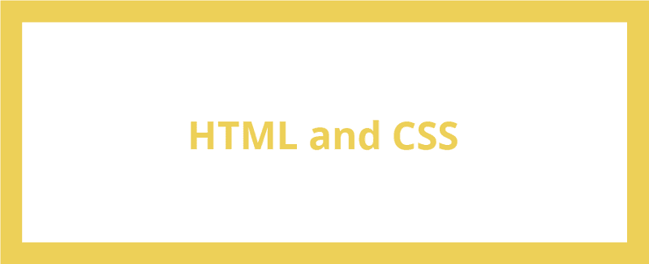
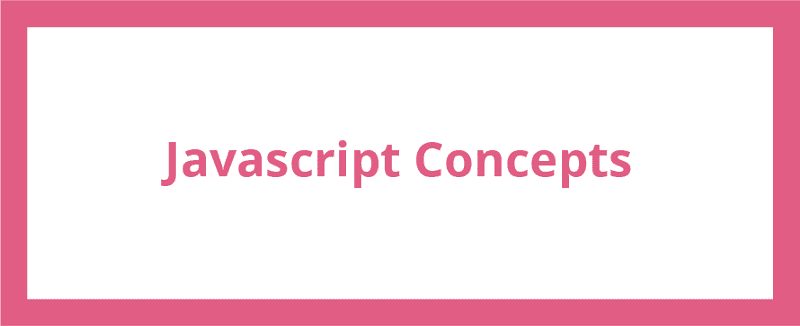
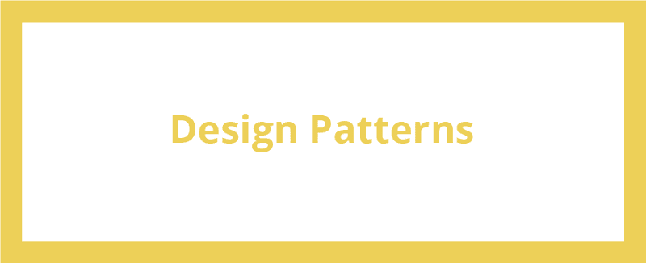
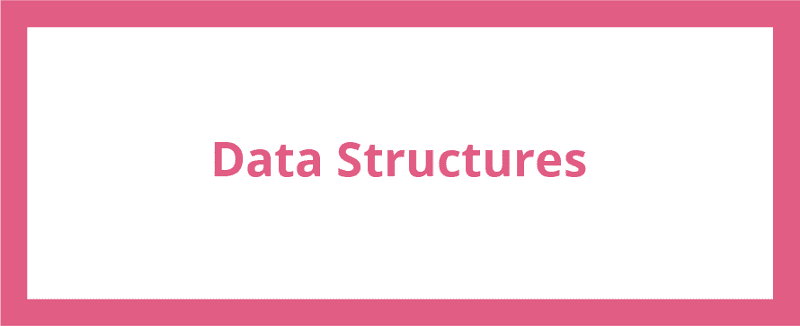

# 破解前端面试

> 原文：<https://www.freecodecamp.org/news/cracking-the-front-end-interview-9a34cd46237/>

技术前端面试很难。这是事实。你不仅需要扎实掌握计算机科学的基础知识，还需要了解诸如 web 性能、构建系统和 CSS 布局引擎之类的东西。

虽然有很多资源，但我发现只有几个*完整的*指南可以帮助你准备前端面试。所以我决定写一个主题接一个主题的提纲，希望能帮助你在下一次面试中胜出。

#### 面试前

所以在你面试之前，问问你的招聘人员面试的形式。一些采访可能会围绕着白板，而其他人可能会使用在线文本编辑器，如 CoderPad。了解这一点很重要，这样你就可以在面试的环境中进行练习。

此外，向招聘人员询问准备时应该关注哪些话题。这背后的原因是，除了前端的具体问题，一些公司会问你传统的计算机科学问题，如搜索和排序算法。

### 前端概念

HTML 和 CSS、Javascript 和 Javascript 设计模式是你将在面试中测试的关键概念。浏览列表，确保你对每个主题都感到满意。

HTML 和 CSS 就像前端开发的面包和黄油。在面试中，你很可能会被问到关于 HTML 和 CSS 的细微差别的问题。此外，要准备好被要求根据模型编写布局。

万一你需要复习 HTML 和 CSS，这里有一些基本的概念。

*   [CSS 动画](https://css-tricks.com/almanac/properties/a/animation/)
*   [CSS 精灵](https://css-tricks.com/css-sprites/)
*   [伪类](https://developer.mozilla.org/en-US/docs/Web/CSS/Pseudo-classes)
*   [电网系统](http://www.sitepoint.com/understanding-css-grid-systems/)
*   [语义标记](http://www.hongkiat.com/blog/html-5-semantics/)

除了这些概念，还要了解 CSS 预处理程序，如 [SASS](http://sass-lang.com/guide) 或 [LESS](http://lesscss.org/) 以及它们的好处。还要熟悉 CSS 命名惯例，比如 [BEM 和 OOCSS](http://clubmate.fi/oocss-acss-bem-smacss-what-are-they-what-should-i-use/) 。

另一个要点是，面试官寻找拥护 CSS 最佳实践的候选人。作为一个很好的参考，这个由 Medium 前端编写的[指南](https://medium.com/@fat/mediums-css-is-actually-pretty-fucking-good-b8e2a6c78b06#.7i1ey8j4g)提供了对 Medium 如何迭代到他们当前 CSS 架构的洞察。

我之前提到过，有些面试官会要求你用 HTML 和 CSS 重新创建布局。在类似于 [CodePen](http://codepen.io/) 的操场上练习这样做。看看 [Dribbble](https://dribbble.com/) ，因为它有许多简单而漂亮的设计，重现起来会很有趣。

最后，作为前端，我们习惯于在编辑器中进行更改，然后在浏览器中验证更改。通常在面试中，你不会有这种奢侈。当你准备面试的时候，试着把你的大部分布局编码*，直到最后才看结果。*

如果说 HTML 和 CSS 是前端开发的面包和黄油，那么 Javascript 就是刀子。公司会在你的面试中花大量时间测试你的 Javascript 知识。许多问题将围绕以下概念。

*   [原型遗传](https://developer.mozilla.org/en-US/docs/Web/JavaScript/Inheritance_and_the_prototype_chain)
*   [范围界定](https://spin.atomicobject.com/2014/10/20/javascript-scope-closures/)
*   [关闭](https://developer.mozilla.org/en-US/docs/Web/JavaScript/Closures)
*   [事件循环](https://developer.mozilla.org/en-US/docs/Web/JavaScript/EventLoop)
*   [事件冒泡](http://javascript.info/tutorial/bubbling-and-capturing)
*   [申请、调用和绑定](http://javascriptissexy.com/javascript-apply-call-and-bind-methods-are-essential-for-javascript-professionals/)
*   [回访和承诺](https://www.quora.com/Whats-the-difference-between-a-promise-and-a-callback-in-Javascript)
*   [变量和功能提升](http://adripofjavascript.com/blog/drips/variable-and-function-hoisting)
*   [阿谀奉承](http://www.sitepoint.com/currying-in-functional-javascript/)

当遇到一个 Javascript 问题时，弄清楚你正在测试这些概念中的哪一个，找出正确的解决方案就会容易得多。如果你对自己的 Javascript 能力有信心，测试一下你的知识[这里](https://www.toptal.com/javascript/interview-questions)，这里[这里](https://www.codementor.io/javascript/tutorial/21-essential-javascript-tech-interview-practice-questions-answers)，这里[这里](http://career.guru99.com/top-85-javascript-interview-questions/)。

Javascript 中的设计模式为您提供了常见问题的可重复解决方案。这些是一些重要的设计模式。

*   [装饰者](https://addyosmani.com/resources/essentialjsdesignpatterns/book/#decoratorpatternjavascript)
*   [工厂](https://addyosmani.com/resources/essentialjsdesignpatterns/book/#factorypatternjavascript)
*   [单个](https://addyosmani.com/resources/essentialjsdesignpatterns/book/#singletonpatternjavascript)
*   [揭示模块](https://addyosmani.com/resources/essentialjsdesignpatterns/book/#revealingmodulepatternjavascript)
*   [立面](https://addyosmani.com/resources/essentialjsdesignpatterns/book/#facadepatternjavascript)
*   [观察者](https://addyosmani.com/resources/essentialjsdesignpatterns/book/#observerpatternjavascript)
*   [MVC](https://addyosmani.com/resources/essentialjsdesignpatterns/book/#detailmvc) ， [MVP](https://addyosmani.com/resources/essentialjsdesignpatterns/book/#detailmvp) ， [MVVM](https://addyosmani.com/resources/essentialjsdesignpatterns/book/#detailmvvm)

除了 Javascript 设计模式，熟悉 Javascript 框架也是很好的。这并不意味着你必须在面试前学习另一个框架。相反，要知道*何时*和*为什么*前端团队使用框架。此外，如果你面试的是 React + Flux 或角度位置之类的东西，那么事先回顾一下框架架构的一些文档。

### 计算机科学概念

有些公司会在前端开发人员之前雇佣软件工程师。这意味着这些公司希望你在良好的软件设计原则、可伸缩的代码架构和测试等方面有良好的基础。

如果你的招聘人员建议你复习一下数据结构和算法的知识，这一部分就是为你准备的。否则，请随意跳过这一部分。如果你没有计算机科学背景，没关系。这些概念中的大多数都很容易学习。

这些是基本的数据结构，我建议你马上了解。不要只是阅读它们，也要花时间用 Javascript 实现它们。如果你不熟悉单元测试，可以用像 [Mocha](https://mochajs.org/) 这样的库来测试你的数据结构。

*   链接列表
*   哈希表
*   堆栈和队列
*   树(二叉树和堆)
*   图形

注意:对于图形，还要知道如何实现深度优先和广度优先的搜索遍历。

对于这些数据结构的实现，可以看一下 [SanFoundry](http://www.sanfoundry.com/java-programming-examples-data-structures/) 。他们所有的例子都是用 Java 编写的，但是用 Javascript 重新实现它们非常容易。

一旦你对数据结构有了信心，你就可以开始排序了。浏览列表，用 Javascript 实现它们，然后记下它们的时间和空间复杂度。

*   二进位检索
*   冒泡排序
*   插入排序
*   合并排序
*   快速排序
*   选择排序

复习完数据结构和算法后，用 [Leetcode](https://leetcode.com/) 和这些[技术 Javascript 题](https://www.interviewcake.com/javascript-interview-questions)测试你的知识。

### 包装它

我知道这需要大量的材料，尤其是如果你是前端开发的新手。提前开始准备你的面试，这样你就可以以一个舒适的速度前进。

另外，记住面试并不是衡量你作为程序员的价值。有些人擅长面试，有些人不擅长。有时你和面试官很合得来，有时则不然。

如果你有任何问题，请随时给我留言或发推文。我也想**知道你的面试经历如何。祝你好运！**

另外，如果你喜欢这篇文章，点击推荐按钮或与朋友分享，这将意味着很多。

如果你想了解更多，你可以在 Twitter 上关注我，我会在这里发布一些关于设计、前端开发、机器人和机器学习的无聊言论。