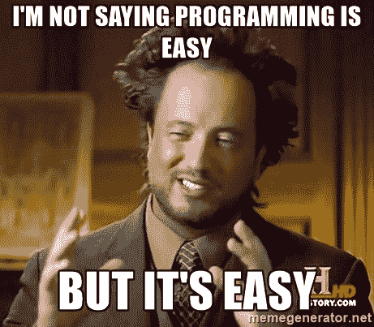

# 像韩国学生学习英语一样学习编码

> 原文：<https://www.freecodecamp.org/news/what-i-learned-as-an-esl-teacher-will-help-you-learn-how-to-code-32a348afdd00/>

作者斯蒂芬·马约

# 像韩国学生学习英语一样学习编码

Human languages are made up of words which are governed by grammar. A bit like programming, isn’t it?

如果这是你第一次听说我，那么你只需要知道一件事:我是一名 ESL 教师，后来成为全栈开发者。

我教英语作为第二语言的职业生涯跨越了近十年，所以我对成年人如何学习第二语言有一个精确的理解。

我看到成千上万来自不同文化、学术和专业背景的学生习得了英语这种困难而又古怪的语言。

经过年复一年对学习的奉献和投入，我的许多学生已经精通英语——如果不是流利的话。我也看到许多聪明、勤奋的人英语水平停留在中等水平，然后因缺乏进步而变得疲惫和沮丧。

成功的语言学习者有几个共同的特点。我对他们掌握英语的观察帮助我比其他情况下更快地学会了 web 开发。

让我们来谈谈一些试图解释第二语言习得的理论框架，以及我从学生身上学到的经验。

#### 如果很简单，那你就没做对

斯蒂芬·克拉申，语言学家，南加州大学名誉教授，可以说是现代第二语言习得的教父。

在 20 世纪 70 年代和 80 年代，他提出了一套 5 个假设，这些假设影响了现代交际教学法。

其中之一被称为 [*输入假设*](https://en.wikipedia.org/wiki/Input_hypothesis) ，它陈述:

> 当学习者理解的语言输入比他们目前的水平稍高时，他们的语言知识就会进步。

确切的事情也可以说是学习如何编码！

回想一下你刚开始学习如何编码的第一个月。你可能从 Codecademy 上的一些教程开始，并按照指导提示进行操作，但却感到“卡住了”,无法在不复制和粘贴的情况下从头创建一个网站。

我可能已经看了三遍他们的 JavaScript 教程，但我仍然觉得我没有学到任何东西。为什么？

因为手把手的教程在第一次之后太容易了！它们可以很好地让你熟悉语言的基本语法，但是它们不会帮助你自己解决算法。

重复这些教程不太可能让你超越目前的理解水平。直到我抛弃那些教程，一头扎进[自由代码营](http://freecodecamp.com)的基本算法挑战中，我才真正开始学习 JavaScript。

If it’s easy, you’re doing something wrong.

这很艰难，接下来的每一次挑战都比上一次更困难！我一直处于被挑战的状态，只是略高于我目前的能力。而且成功了！

我的观点是:你的编码之旅永远不会感觉“容易”或“简单”，如果是这样，你必须停止你正在做的事情，尝试更困难的挑战和项目。从长远来看，不要觉得被卡住或被难住了，因为这不是一个障碍。这是一个信号，表明你将会学到更多。

#### 不要过早追求完美

完美主义者不会成为伟大的语言学习者。他们往往在语法和词汇测试中表现出色，并且能够背诵所有不规则的过去分词。我认为完美主义的学生实际上比以英语为母语的人更了解英语语法。不过，这并不重要。为什么？

因为他们的英语口语很糟糕。

我见过很多这样的学生，并成功地帮助他们中的许多人改掉了不太好的学习习惯。但是很多人都有这种不切实际的理想，认为一个“流利”的英语使用者应该能够做到什么，包括从不犯任何语法错误！

他们擅长阅读和写作，但他们的口语技能受到严重阻碍，因为他们总是绞尽脑汁思考说某事的“最佳”方式。

当你学习编码时不要这样做——尤其是当你刚刚开始的时候。你不需要记住所有的语义 HTML5 标签或者所有的引导类来创建一个网站。当您可以在 API 文档、Google 或 Stack Overflow 中找到您需要的任何内容时，为什么还要这样做呢？

在我学习 HTML 和 CSS 的早期，我实际上制作了抽认卡来帮助我记忆这些东西，我不能相信这是多么浪费时间。我可能每天晚上花两个小时制作抽认卡，我希望我跳过了所有这些，而是练习编码！

仅仅因为你有所有这些知识并不意味着你实际上可以适当地使用它来解决一个特定的问题。

学习任何东西都不要完美主义，尤其是编码！学到足够危险的程度，然后开始建造一些东西。你将根据需要选择细节。

#### 照顾好你自己

在我上一篇媒体文章中，我写道对于那些想在教英语的同时有大量空闲时间学习编程的人来说，韩国是一个可行的选择。

我的大部分学生都是从大学休学一年的年轻人。他们和父母住在一起，不需要找兼职来养活自己。

听起来像天堂！

我任教的语言学院从早上 7 点到晚上 10 点开放，很多年轻的韩国人每天在中心呆上 10 个小时甚至更多。

除了在学校的常规课程外，他们还参加额外的学习小组，把自己关在计算机实验室里几个小时，直到关门。

尽管他们暂时离开工作和大学，但他们经常睡眠不足，因为他们正在准备高风险的考试，这些考试可能会决定他们职业生涯的结果。

我真的很钦佩韩国人的职业道德，这是朝鲜战争后国家快速发展的原因。但是人体只有在 x 小时的睡眠和 y 小时的工作完成后才能发挥最佳功能。

当学习一项新技能时，收益递减法则在起作用。经常休息、会见朋友、充足睡眠和锻炼的学生似乎和利用每一秒空闲时间学习的学生做得一样好——如果不是更好的话。

许多自学成才的程序员也应该留意这个建议。对于你们中的许多人来说，你必须在繁忙的工作和家庭责任之间平衡你的编码计划。

的确，如果你真的想转行做网站开发，你必须努力工作。但是如果你发现自己经常打哈欠，无法集中注意力，那就出去散散步，呼吸一下新鲜空气。周末花几个小时和你的朋友或家人在一起，给自己充电。

Tom and Donna have great advice for self-taught coders.

只要记得不时犒劳自己，否则会有被烧伤的风险。

#### 你的建议

这些建议有没有引起你的共鸣？你想在这个列表中添加一些东西吗？

在下面的评论中分享你的问题和观点，如果你还没有这样做的话，别忘了关注我。犒劳自己。