# #OpenVisConf 的 22 位数据可视化从业者的 10 点心得

> 原文：<https://www.freecodecamp.org/news/10-takeaways-from-22-data-visualization-practitioners-at-openvisconf-a4a3a5b96fcd/>

锡耶纳·杜普兰

# #OpenVisConf 的 22 位数据可视化从业者的 10 点心得

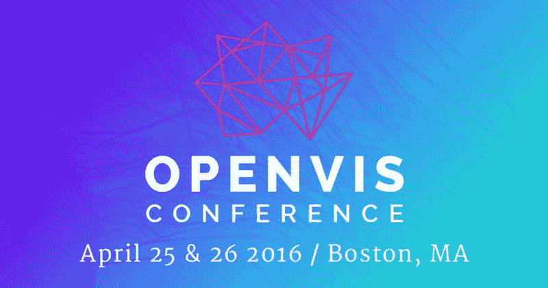

*更新| 2016 . 5 . 13:[所有会谈视频正式直播！](http://openvisconf.com/#videos)*

#### **1。“数据可视化不是你的创造性出路；数据可视化正在让数据变得可以理解。”**

来自美国宇航局喷气推进实验室的雷切尔·宾克斯雄辩地描述了每一个数据，即从业者的斗争:在艺术和实用性之间妥协。

可视化素养和数据素养需要时间。事实上， [Tony Chu](https://www.freecodecamp.org/news/10-takeaways-from-22-data-visualization-practitioners-at-openvisconf-a4a3a5b96fcd/undefined) 教会了我们数据可视化是如何利用*空间*控制*时间*(时空双关？).

直观的数据阐述受到注意力的约束——丹尼尔·卡内曼的《什么是 [*思维》、《快与慢》*](https://en.wikipedia.org/wiki/Thinking,_Fast_and_Slow) *、*会把我们的系统称为 2 思维。

托尼提倡使用动画和调步(想想 [scrollytelling](http://www.r2d3.us/visual-intro-to-machine-learning-part-1/) )等技术向那些消化我们的视觉化图像的人提供微小的信息(双关语)，而雷切尔专注于使用数据 viz 来呈现工具，而不是讲述故事或描绘画面。

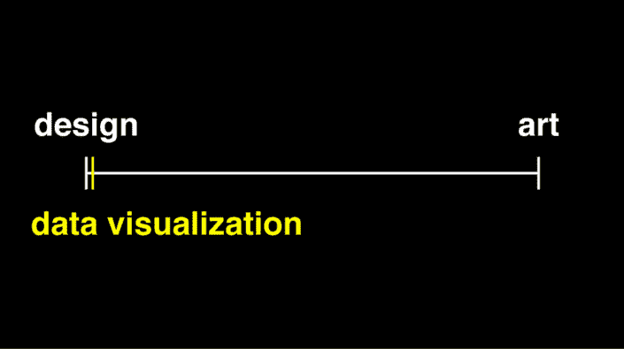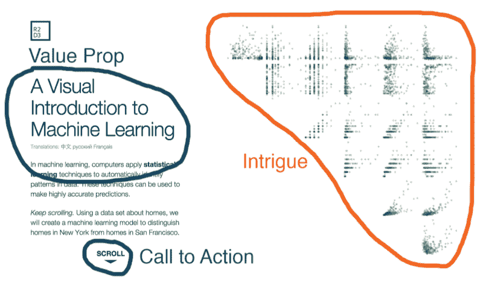

Left/Top: [Slides by Rachel Binx](https://speakerdeck.com/binx/designing-for-spacecraft-operations). Right/Bottom: [Slides by Tony Chu](https://docs.google.com/presentation/d/1GOSyl4-iklcO0kIBFy-31zylaLC1R3uTwxX89bWt5D0/edit#slide=id.g11e8900888_0_2)

#### **2。然而，在寻找可视化复杂数据问题的解决方案时，涉及了如此多的创造力。**

每个演讲者都在他们迷人的视觉效果和技术严谨的方法中探索创造力的领域。[真理子·小坂](https://www.freecodecamp.org/news/10-takeaways-from-22-data-visualization-practitioners-at-openvisconf-a4a3a5b96fcd/undefined)将多项式函数转化为“像素操场”，并通过“像素社交图”赋予内核卷积以生命

[雪莉·吴](https://www.freecodecamp.org/news/10-takeaways-from-22-data-visualization-practitioners-at-openvisconf-a4a3a5b96fcd/undefined) [以多种方式滥用原力](http://vallandingham.me/force_talk/#0) (d3 的原力定向图形布局)来简化 [Illumio](https://www.freecodecamp.org/news/10-takeaways-from-22-data-visualization-practitioners-at-openvisconf-a4a3a5b96fcd/undefined) 的照明产品([雪莉的幻灯片](http://slides.com/shirleywu/building-data-visualizations-for-product#/)将这个复杂的想法提炼为美丽、可理解的简单)。

Amelia McNamara 偷偷教了我们一些统计学知识——特别是一个创造性的解决方案，用来区分数据中的真实模式和随机生成的数据。

尼基·凯斯(Nicky Case)巧妙地将系统思维应用于现实世界的现象，如疾病扩散、生态系统再生和种族隔离。尼基在模拟中使用表情符号来表明世界不是线性的；太多圈了。(旁注:表情符号在今年的会谈中出现的次数打破了纪录。)

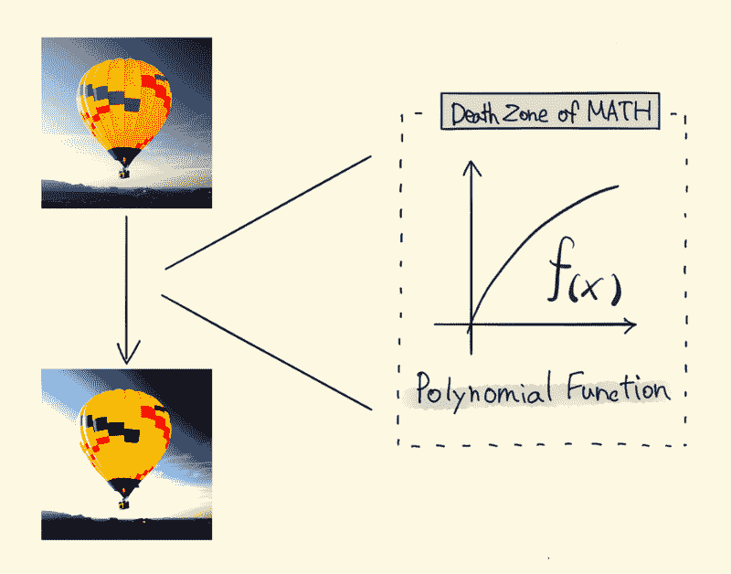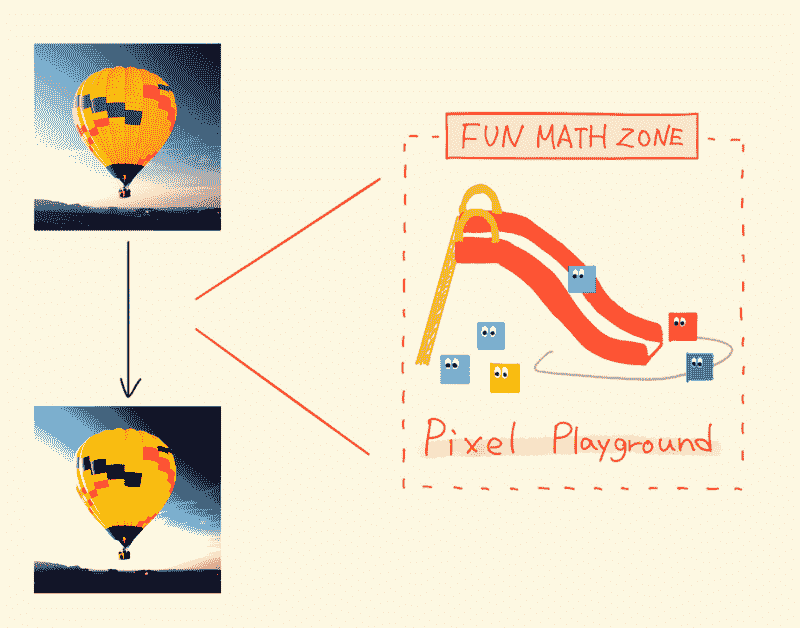

[Slides by Mariko Kosaka](http://kosamari.com/presentation/openvis-2016)

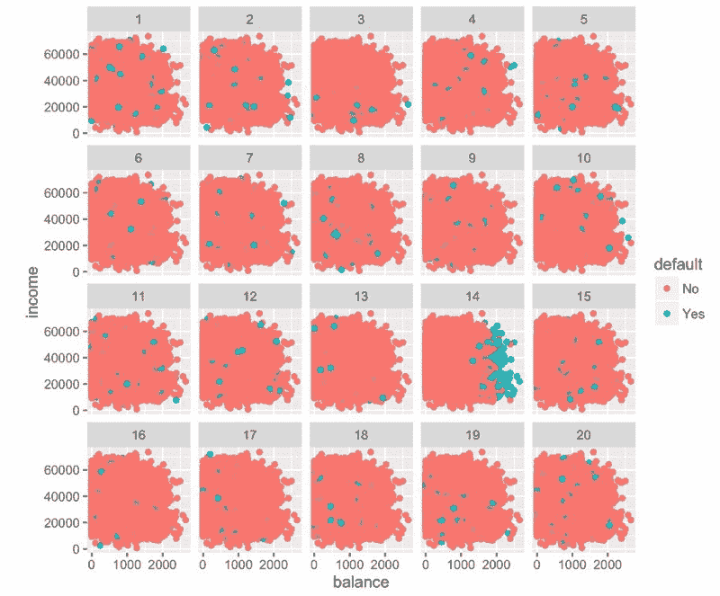

Left/Top: [Slides by Amelia McNamara](http://www.science.smith.edu/~amcnamara/OpenVisConf/assets/player/KeynoteDHTMLPlayer.html#52). Can you spot the real data from the fake data? Right/Bottom: [Slides by Nicky Case](http://ncase.me/OVC2016/)

Nadieh Bremer 一丝不苟地解码 SVG 属性，如渐变、动画、发光滤镜、运动模糊、粘性滤镜和颜色混合。这些赏心悦目的功能甚至可以美化最基本的数据可视化。

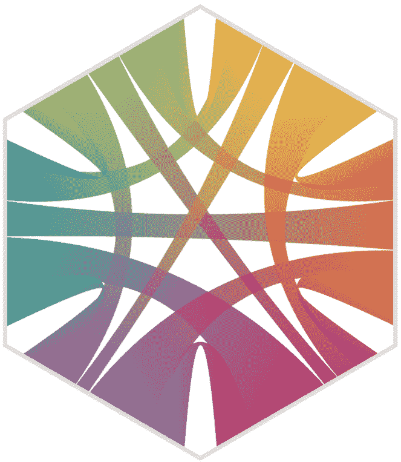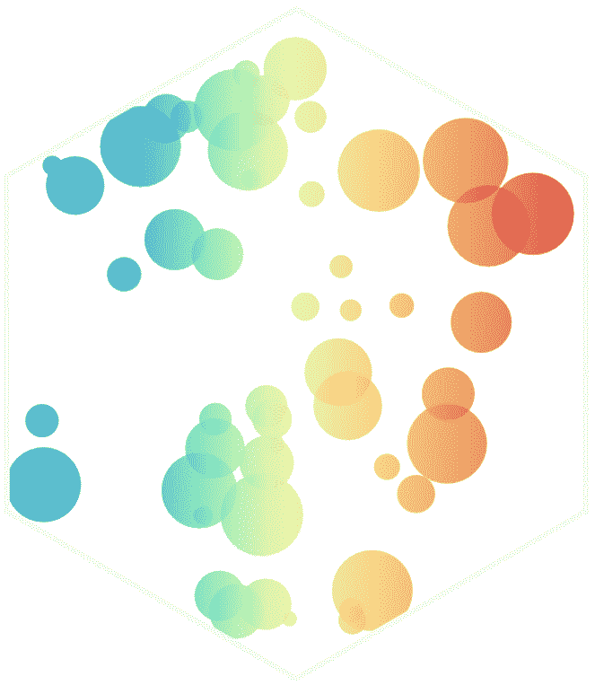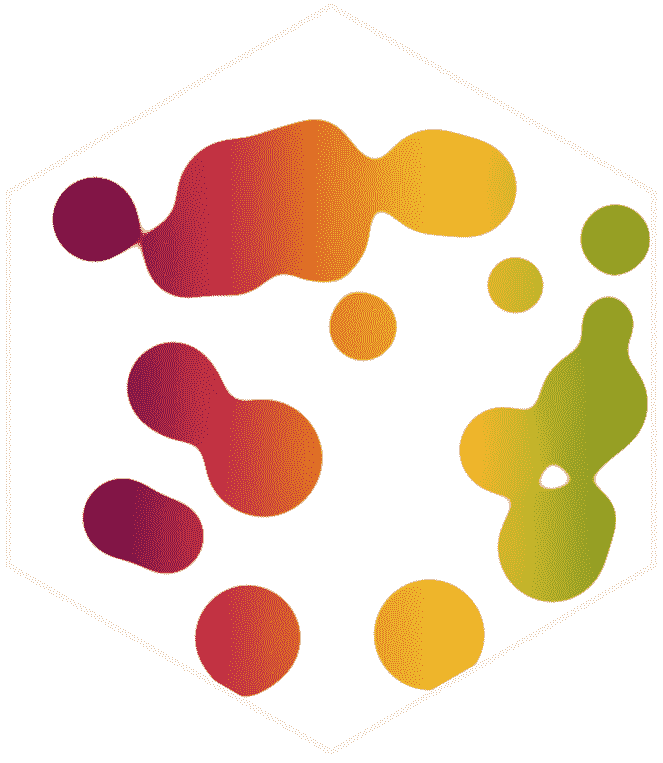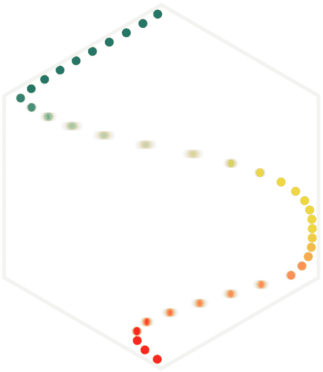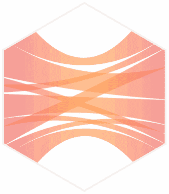

[Nadieh’s blog post](http://www.visualcinnamon.com/2016/04/svg-beyond-mere-shapes.html) on [Visual Cinnamon](http://visualcinnamon.com/). [Slides by Nadieh Bremer](http://nbremer.github.io/openvis2016/slides/).

#### **3。数据可视化的未来是虚拟的、物理的和声音的。**

“数据*可视化”*正迅速成为该领域的一个轻描淡写的说法。OpenVis 会议利用的不仅仅是我们的视觉皮层。我们的耳朵在[凯尔·麦克唐纳](https://www.freecodecamp.org/news/10-takeaways-from-22-data-visualization-practitioners-at-openvisconf-a4a3a5b96fcd/undefined)的演讲中体验了音乐的组成部分，我们在[安娜·阿斯内斯·贝克尔](https://www.freecodecamp.org/news/10-takeaways-from-22-data-visualization-practitioners-at-openvisconf-a4a3a5b96fcd/undefined)的 3D [纳斯达克](http://graphics.wsj.com/3d-nasdaq/)体验了一堂物理课。

虚拟现实正在为数据可视化建立一个新的游乐场——副作用可能包括恶心。Patricio Gonzalez Vivo 展示了 2D 的未来和使用着色器的 3D 地图制作(查看 [Mapzen 的七巧板](https://mapzen.com/projects/tangram/))。

我们还见证了机器人在会议休息时制作物理数据可视化和数据艺术。

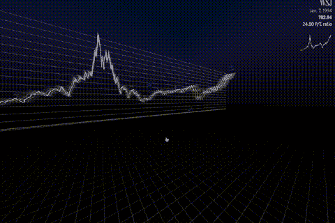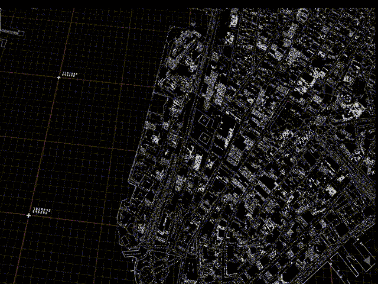

Left/Top: [Slides by Ana Asnes Becker](http://www.anabeckerdesign.com/vr_talk.pdf) Right/Bottom: [Slides by Patricio Gonzalez Vivo](http://patriciogonzalezvivo.github.io/openVis16/#/)

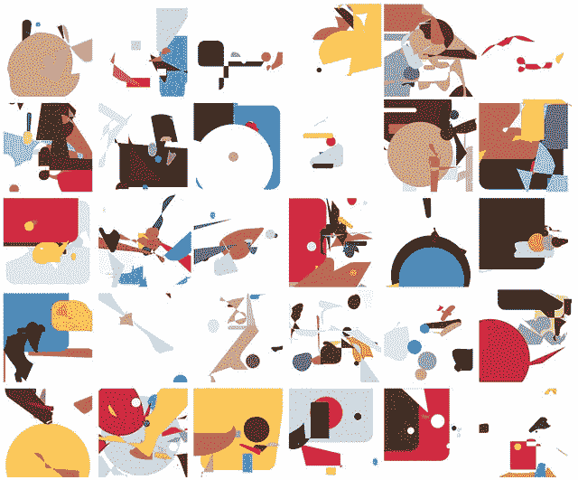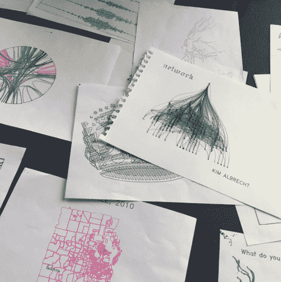

Left/Top: Machine-drawn emoji generated by deep learning. Source: [Kyle McDonald](https://www.flickr.com/photos/kylemcdonald/18630280464) Right/Bottom: Robot drawings

#### **4。特色工程专业**？。

在每一个拟合良好的模型、成功的预测算法和有效的数据可视化的基础上，是数小时的特征工程和数据清理。

通常，可视化只是冰山一角。有时候，一行代码只是冰山一角(*咳咳* [rachel binx](https://www.freecodecamp.org/news/10-takeaways-from-22-data-visualization-practitioners-at-openvisconf-a4a3a5b96fcd/undefined) )！数据可视化人员都是工程师、设计师和艺术家。

[Zan](https://www.freecodecamp.org/news/10-takeaways-from-22-data-visualization-practitioners-at-openvisconf-a4a3a5b96fcd/undefined) Armstrong 教我们如何在建模前探索时间序列数据，选择合适的季节性。Fernanda Viégas 和 Martin Wattenberg 在构建成功的机器学习算法之前，大力强调了明智的特征选择和工程的重要性。

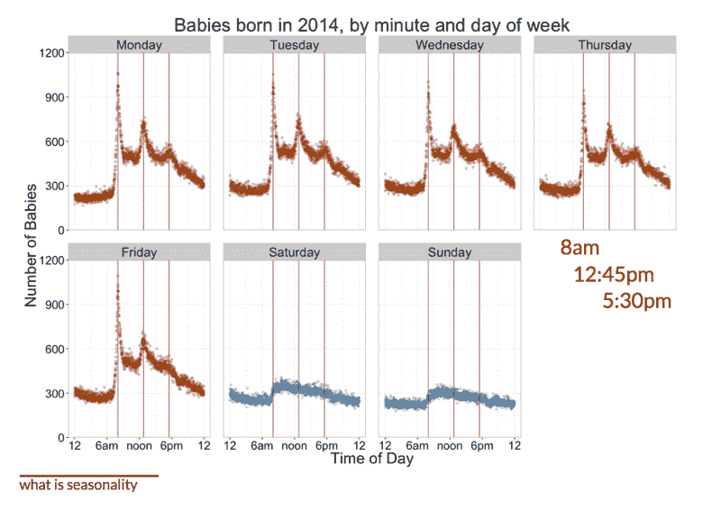

[Slides by Zan Armstrong](http://slides.com/zanarmstrong/everything-is-seasonal#/)

#### **5。神经网络是 2016 年最性感的算法，它们部分是数学，部分是魔法** ✨.

来自谷歌数据可视化团队的费尔南达·维加斯和[马丁·瓦滕伯格](http://www.bewitched.com/)通过演示他们最近发布的 [TensorFlow 游乐场](http://playground.tensorflow.org/#activation=tanh&batchSize=10&dataset=circle&regDataset=reg-plane&learningRate=0.03&regularizationRate=0&noise=0&networkShape=4,2&seed=0.41037&showTestData=false&discretize=false&percTrainData=50&x=true&y=true&xTimesY=false&xSquared=false&ySquared=false&cosX=false&sinX=false&cosY=false&sinY=false&collectStats=false&problem=classification)来揭开神经网络的神秘面纱。

有了适当数量的隐藏层、节点和训练数据，神经网络可以对任何东西进行分类……嗯，除了杯子的图像(再次强调，特征工程是关键)。

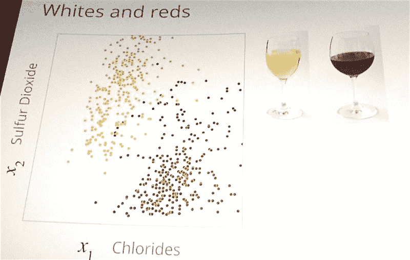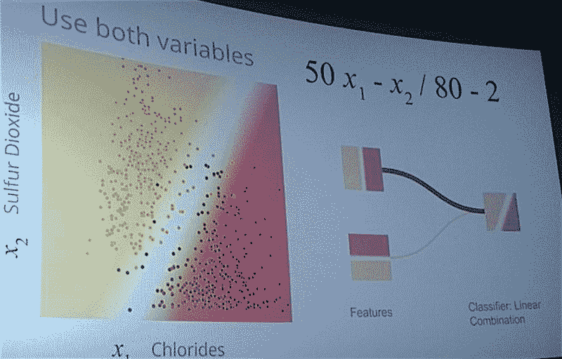

Step 1: drink two glasses of wine

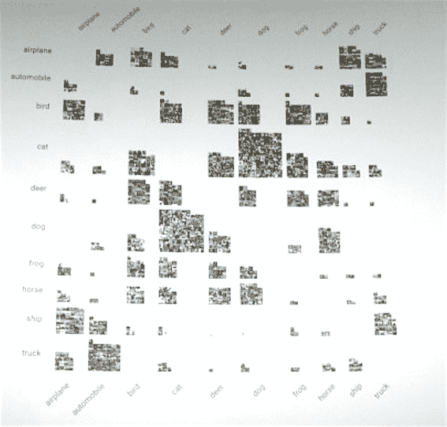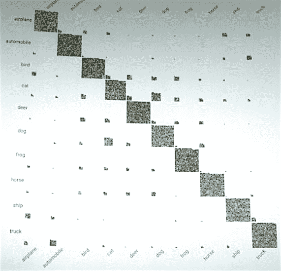

Step 2: Build neural net

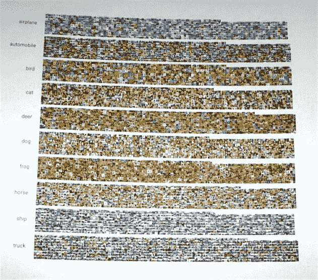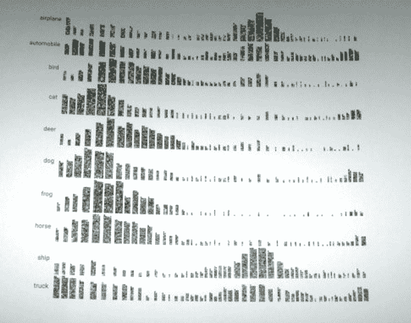

Step 3: ✨

#### **6。文本分析即将在单词云之外爆炸。**

[Christopher Collins](https://www.freecodecamp.org/news/10-takeaways-from-22-data-visualization-practitioners-at-openvisconf-a4a3a5b96fcd/undefined) 带领我们通过文本分析和可视化*狂欢*。在有限的时间里，克里斯托弗带我们浏览了我国法律案件的平行标签云、芭比词典的旭日图，以及异常信息如何在网络上传播。克里斯托弗的技巧是新颖的，标志着文本分析新时代的开始。

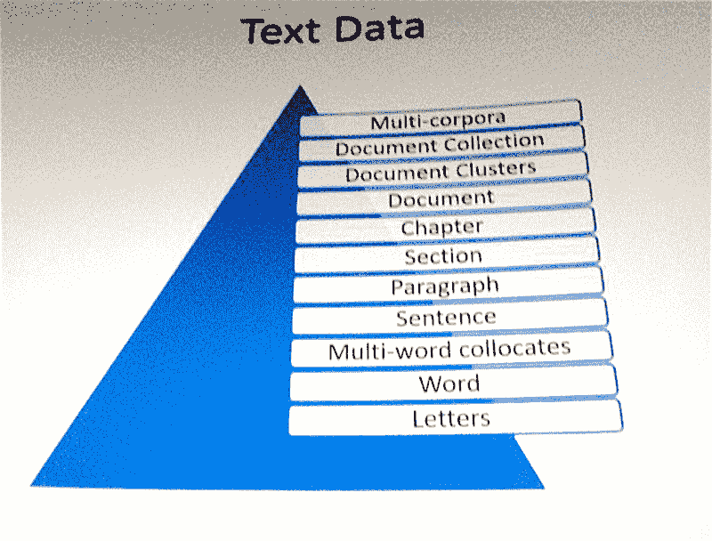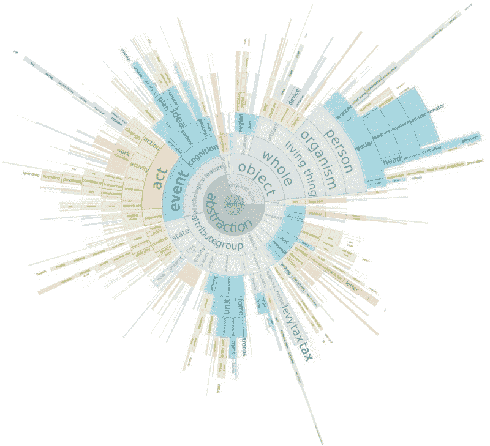

Source: [Christopher Collins](http://vialab.science.uoit.ca/portfolio/christopher-m-collins)

#### 7.自动化是不可避免的。

21 个讲座中有七分之一集中在数据可视化自动化的组成部分。Adam Pearce 在彭博图形公司开发的小工具大大减少了花在重复任务上的时间，比如写多余的代码行。

[David Yanofsky](https://www.freecodecamp.org/news/10-takeaways-from-22-data-visualization-practitioners-at-openvisconf-a4a3a5b96fcd/undefined) 的图表平台使用 d3.js 和 react.js 创建极其简单的点击式仪表盘和图表。 [Arvind Satyanarayan](https://www.freecodecamp.org/news/10-takeaways-from-22-data-visualization-practitioners-at-openvisconf-a4a3a5b96fcd/undefined) 演示了 Vega，这是一个反应式编程工具，允许用户以声明方式定义交互性，并直接在 JSON 中描述可视化的特性。

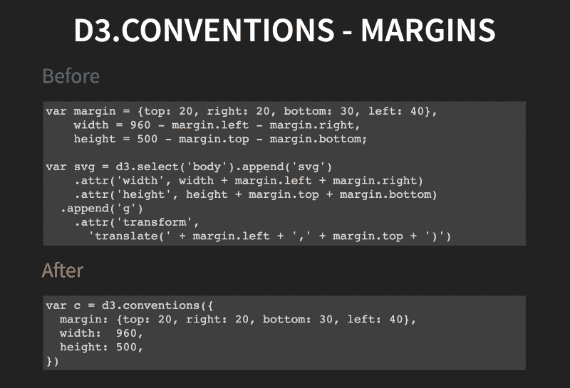

[Slides by Adam Pearce](http://1wheel.github.io/talks/tiny-tools/#/)

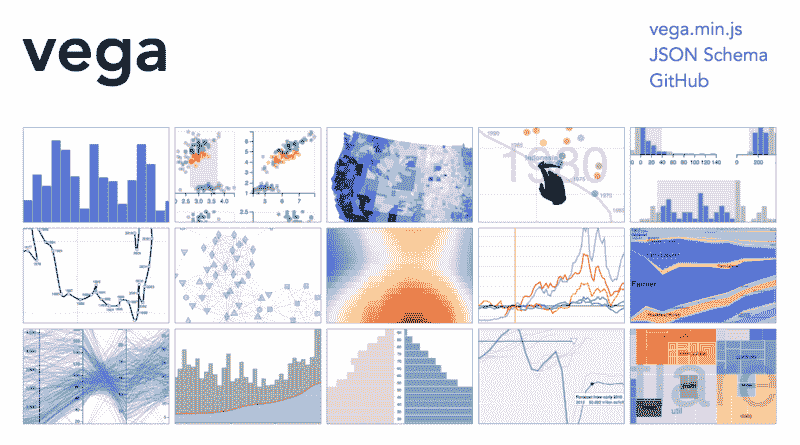

[Slides by Arvind Satyanarayan](http://arvindsatya.com/talks/ReactiveVega-OpenVisConf2016.pdf). [Vega](http://vega.github.io/)!

#### **8。数据可视化不遗余力**。

我说的石头是指研究领域。我们在从葡萄酒和歌曲到外太空和网球的广泛领域中看到了颠覆性的数据可视化技术。作为数据可视化专家，我们可以在每个人的后院玩耍。

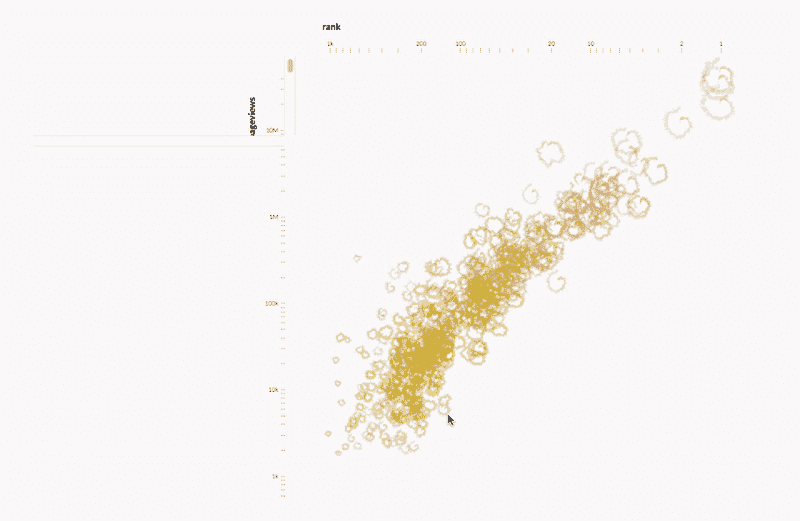

[Untangling Tennis](http://untangling-tennis.net/) by Kim Albrecht

Kim Albrecht 解构了职业网球运动中表现和受欢迎程度之间的关系。Kim 解释了数据科学和数据可视化之间的交叉，以及可视化如何团结科学家并引发公共对话。

克里斯汀·威格尔将我们送入环绕地球的轨道，探索世界上受气候变化和自然灾害影响的地区。我们浏览了她的可视化轨迹，从检索卫星数据到生成高质量的光栅图像。

#### **9。良好的数据可视化符合心理学、神经科学和哲学的原则，这些原则涉及我们的视觉皮层如何与大脑的其他部分进行交流，以及我们如何从道德上交流不确定性。**

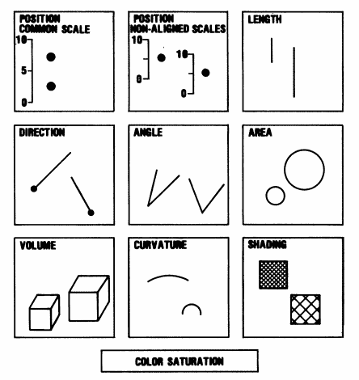

[From Kennedy Elliott’s talk](https://medium.com/@kennelliott/39-studies-about-human-perception-in-30-minutes-4728f9e31a73#.ou753v17e)

[kennedy elliott](https://www.freecodecamp.org/news/10-takeaways-from-22-data-visualization-practitioners-at-openvisconf-a4a3a5b96fcd/undefined) 向我们展示了对颜色、形状、角度、位置、曲率、体积、阴影、面积、长度和方向等图像属性的前注意处理是如何深刻影响人类解读图形的。

作为设计师和数据专家，我们的工作要求我们意识到图形中固有的偏见，以产生准确而有用的工具。

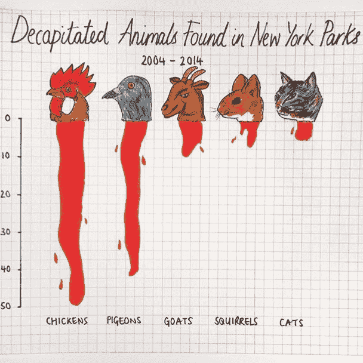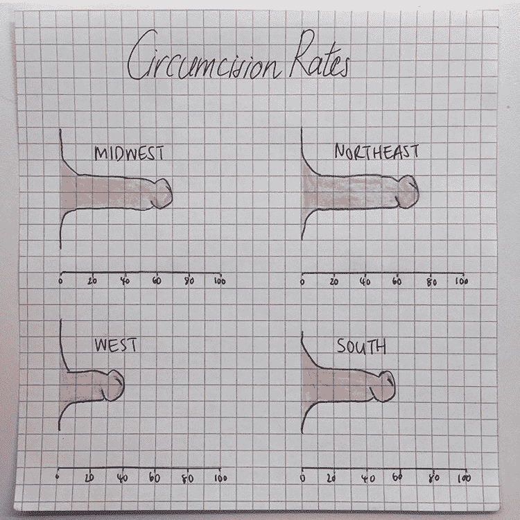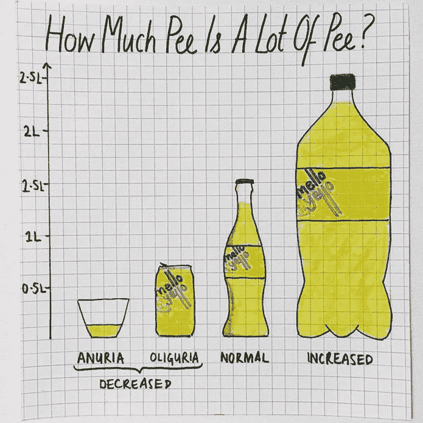

From Mona Chalabi’s slides

Mona Chalabi 提醒我们将数据人性化，接受评论区等批评渠道。莫娜会同意*媒介既是信息又是信使*。

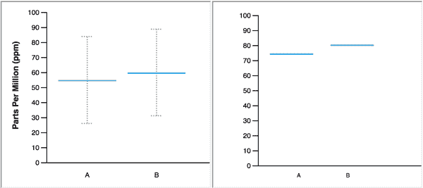

[Slides by Jessica Hullman](http://faculty.washington.edu/jhullman/openvis2016_nonotes.pptx.zip …). [Read more about hypothetical outcome plots here.](https://medium.com/hci-design-at-uw/hypothetical-outcomes-plots-experiencing-the-uncertain-b9ea60d7c740#.abd6zuodl)

在现实生活中，我们从重复的经历中学会驾驭不确定性。杰西卡·胡尔曼使用假想的结果图将我们置于不确定之中。根据 Jessica 的说法，“跳跃使用户能够体验可数事件的不确定性，就像我们在日常生活中体验概率一样。”

#### 10。数据虫是我的人！

毫无疑问，这次会议最有价值的部分是会见那些成就斐然、同样好奇的数据可视化和数据科学探索家。

我非常感谢艾琳·罗斯(Irene Ros)和 Bocoup 团队的其他成员，以及赞助商们组织了一次出色的会议。我了解到，会后抑郁是真实存在的。谢谢你的知识、朋友、技能和想法。此外，非常感谢[销售团队](https://www.freecodecamp.org/news/10-takeaways-from-22-data-visualization-practitioners-at-openvisconf-a4a3a5b96fcd/undefined)赞助我，也非常感谢我出色的经理 Ernest 支持我出席！

我最喜欢的会议故事之一发生在聚会上。我站在[真理子](https://www.freecodecamp.org/news/10-takeaways-from-22-data-visualization-practitioners-at-openvisconf-a4a3a5b96fcd/undefined)旁边，她以分享[如何将她对织毛衣的热爱与对编码的热爱结合起来开始了她的演讲。苹果公司的一名 data viz 工程师转向我，问我自己是否也是一名编织者。作为一个 R 女王，我想他可能想知道我是不是一个 k *nitr* 用户——就像 R 的报告生成包“编织者”一样——对此我肯定地回答道，“是的！我是一个狂热的针织爱好者。”](http://kosamari.github.io/sweaterify/)

在其他任何派对上，我可能都会收到奇怪的目光，然后整晚都在想为什么没人和我说话。但是数据呆子聚会是不同的。他立刻明白了我的意思，对我的误解一笑置之，接着又问了更多关于 knitr 的问题？。