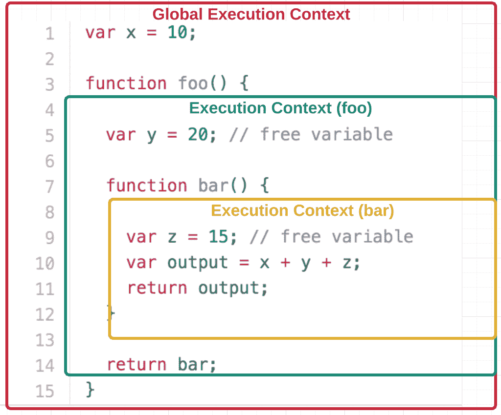
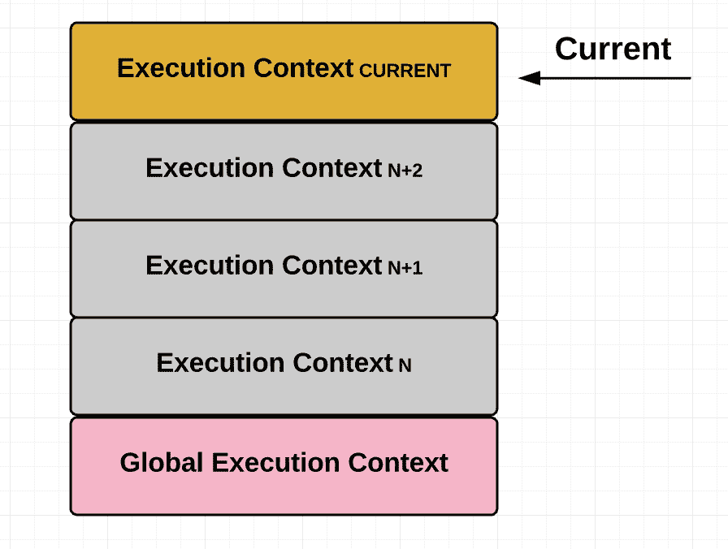
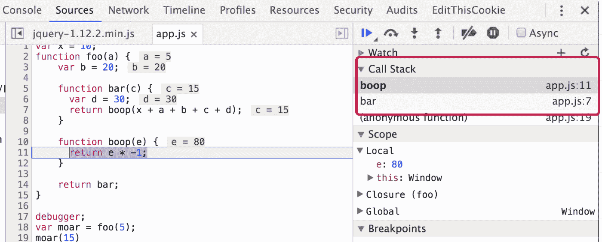
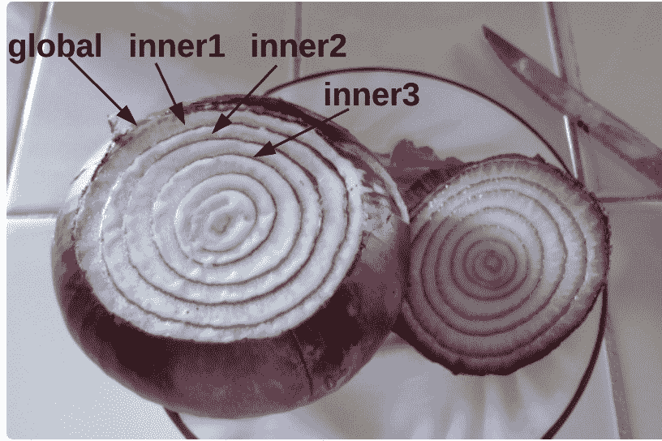
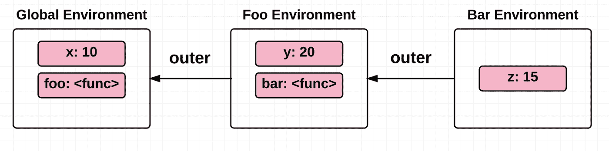

# 通过代码示例学习 JavaScript 闭包

> 原文：<https://www.freecodecamp.org/news/lets-learn-javascript-closures-66feb44f6a44/>

闭包是一个基本的 JavaScript 概念，每个严肃的程序员都应该彻底了解。

互联网上有很多关于闭包“是什么”的解释，但是很少深入到事物“为什么”的一面。

我发现理解内部机制最终会让开发人员更好地掌握他们的工具，所以这篇文章将致力于 **如何** 和 **为什么** 闭包以他们的方式工作。

希望您能够更好地在日常工作中利用闭包。我们开始吧！

# 什么是终结？

闭包是 JavaScript(和大多数编程语言)的一个非常强大的属性。在 [MDN](https://developer.mozilla.org/en-US/docs/Web/JavaScript/Closures) 中定义:

**闭包是 ****函数**** 即 ****引用**** 独立 ****(自由)变量**** 。换句话说，闭包 ****中定义的函数‘记住’它被创建的环境**** 。**

注意:自由变量是既没有局部声明也没有作为参数传递的变量。

让我们看一些例子:

## **例 1:**

```
function numberGenerator() {
  // Local “free” variable that ends up within the closure
  var num = 1;
  function checkNumber() { 
    console.log(num);
  }
  num++;
  return checkNumber;
}

var number = numberGenerator();
number(); // 2
```

在上面的例子中，函数 numberGenerator 创建了一个本地“自由”变量 ****num**** (一个数字)和 ****checkNumber**** (一个将 ****num**** 打印到控制台的函数)。

函数 ****checkNumber**** 没有任何自己的局部变量，但是，由于一个闭包，它可以访问外部函数 ****numberGenerator、**** 中的变量。

因此，即使在****number generator****已经返回之后，它也可以使用 ****numberGenerator**** 中声明的变量 ****num**** 成功地将其记录到控制台*。*

## **例 2:**

在这个例子中，我们将演示一个闭包包含在外部封闭函数中声明的所有局部变量。

```
function sayHello() {
  var say = function() { console.log(hello); }
  // Local variable that ends up within the closure 
  var hello = 'Hello, world!';
  return say;
}
var sayHelloClosure = sayHello(); 
sayHelloClosure(); // ‘Hello, world!’
```

注意变量 ****hello**** 是如何在匿名函数 之后定义 **的——但是仍然可以访问 ****hello**** 变量。这是因为 ****hello**** 变量在创建时就已经在函数“scope”中定义好了，使得它在最终执行匿名函数时可用。**

(别急，我会在帖子后面解释“范围”是什么意思。现在，就顺其自然吧！)

## **了解高级别**

这些例子从高层次上说明了“什么”闭包。总的主题是这样的: **即使在定义变量的封闭函数返回** 之后，我们仍然可以访问在封闭函数中定义的变量。

显然，后台发生了一些事情，使得那些变量在定义它们的封闭函数返回很久之后仍然可以被访问。

为了理解这是如何可能的，我们将需要触及一些相关的概念——从 3000 英尺开始，慢慢地爬回陆地。让我们从运行函数的总体 **上下文** 开始，称为 **【执行上下文】** 。

# **执行上下文**

执行上下文是 ECMAScript 规范使用的抽象概念，用于跟踪代码的运行时评估。这可以是首次执行代码时的全局上下文，也可以是执行流进入函数体时的全局上下文。



在任何时间点，只能有一个执行上下文在运行。这就是为什么 JavaScript 是“单线程的”，这意味着一次只能处理一个命令。

通常，浏览器使用“堆栈”来维护这个执行上下文栈是一种后进先出(LIFO)的数据结构，这意味着你最后放入栈的东西是第一个从栈中取出的东西。(这是因为我们只能在栈顶插入或删除元素。)

当前或“运行中”的执行上下文总是堆栈中的顶部项目。当正在运行的执行上下文中的代码已经被完全评估时，它从顶部弹出，允许下一个顶部项目接管运行的执行上下文。

此外，仅仅因为一个执行上下文正在运行，并不意味着它必须在不同的执行上下文可以运行之前完成运行。

有时，正在运行的执行上下文被挂起，并且不同的执行上下文变成正在运行的执行上下文。挂起的执行上下文可能会在稍后的某个时间点从它停止的地方重新开始。

每当一个执行上下文被另一个这样的执行上下文替换时，就会创建一个新的执行上下文并将其推送到堆栈上，成为当前的执行上下文。



有关此概念在浏览器中的实际应用示例，请参见下面的示例:

```
var x = 10;
function foo(a) {
  var b = 20;

  function bar(c) {
    var d = 30;
    return boop(x + a + b + c + d);
  }

  function boop(e) {
    return e * -1;
  }

  return bar;
}

var moar = foo(5); // Closure  
/* 
  The function below executes the function bar which was returned 
  when we executed the function foo in the line above. The function bar 
  invokes boop, at which point bar gets suspended and boop gets push 
  onto the top of the call stack (see the screenshot below)
*/
moar(15); 
```



然后当 ****boop**** 返回时，它弹出堆栈，并且 ****条**** 被恢复:


当我们有一堆一个接一个运行的执行上下文时——通常在中间暂停，然后再恢复——我们需要某种方法来跟踪状态，以便我们可以管理这些上下文的顺序和执行。

事实上也是如此。根据 ECMAScript 规范，每个执行上下文都有各种状态组件，用于跟踪每个上下文中的代码进度。其中包括:

*   ****代码评估状态:**** 执行、暂停和恢复与该执行上下文相关的代码评估所需的任何状态
*   ****函数:**** 执行上下文正在求值的函数对象(如果正在求值的上下文是 **脚本** 或 **模块** ，则为空)
*   ****领域:**** 一组内部对象，一个 ECMAScript 全局环境，在该全局环境范围内加载的所有 ECMAScript 代码，以及其他相关联的状态和资源
*   ****词法环境:**** 用于解析代码在该执行上下文中所做的标识符引用。
*   ****变量环境:**** 词法环境，其 EnvironmentRecord 保存由该执行上下文内的 VariableStatements 创建的绑定。

如果这听起来让你很困惑，不要担心。在所有这些变量中，词法环境变量是我们最感兴趣的一个，因为它显式地声明它解析代码在这个执行上下文中产生的 **【标识符引用】** 。

您可以将“标识符”视为变量。因为我们最初的目标是弄清楚即使在函数(或“上下文”)返回后，我们如何能够神奇地访问变量，所以词法环境看起来像是我们应该深入研究的东西！

******注****** **:技术上，变量环境和词法环境都是用来实现闭包的。但为了简单起见，我们将其概括为“环境”。关于词法和变量环境的区别的详细解释，参见 Alex Rauschmayer 博士的优秀** [**文章**](http://www.2ality.com/2011/04/ecmascript-5-spec-lexicalenvironment.html) **。**

# **词汇环境**

根据定义:

> **词法环境是一种规范类型，用于根据 ECMAScript 代码的词法嵌套结构定义标识符与特定变量和函数的关联。词法环境由环境记录和对外部词法环境的可能的空引用组成。通常，词法环境与 ECMAScript 代码的某些特定语法结构相关联，例如 FunctionDeclaration、BlockStatement 或 TryStatement 的 Catch 子句，并且每次评估此类代码时都会创建新的词法环境。—**[**ECMAScript-262/6.0**](http://www.ecma-international.org/ecma-262/6.0/#sec-lexical-environments)

我们来分析一下。

*   ****【用于定义标识符的关联】:**** 词法环境的目的是管理代码内的数据(即标识符)。换句话说，它赋予标识符以意义。例如，如果我们有一行代码“**. console . log(x/10)”、** ，如果没有为变量提供含义的东西，那么拥有一个变量(或“标识符”) ****x**** 是没有意义的。词汇环境通过它的环境记录提供了这个意思(或“关联”)。
*   ****“词法环境由环境记录组成”:**** 环境记录是一种奇特的说法，它记录了词法环境中存在的所有标识符及其绑定。每个词汇环境都有自己的环境记录。
*   ****“词汇嵌套结构”:**** 这是有趣的部分，它基本上是说一个内部环境引用它周围的外部环境，并且这个外部环境也可以有自己的外部环境。因此，一个环境可以作为一个以上的内部环境的外部环境。全局环境是唯一没有外部环境的词汇环境。这里的语言很复杂，所以让我们打个比方，把词汇环境想象成洋葱的多层:全局环境是洋葱的最外层；下面的每个后续层都嵌套在。



抽象地说，伪代码中的环境如下所示:

```
LexicalEnvironment = {
  EnvironmentRecord: {
  // Identifier bindings go here
  },

  // Reference to the outer environment
  outer: < >
};
```

*   ****“每次评估这样的代码时创建一个新的词法环境”:**** 每次调用封闭的外部函数时，创建一个新的词法环境。这很重要——我们将在最后再次回到这一点。 **(旁注:函数并不是创造词法环境的唯一方式。其他包括块语句或 catch 子句。为了简单起见，我将在整篇文章中关注由函数创建的环境)**

简而言之，每个执行上下文都有一个词法环境。这个词法环境保存变量和它们的相关值，并且还具有对其外部环境的引用。

词法环境可以是全局环境、模块环境(包含模块顶级声明的绑定)或函数环境(由于调用函数而创建的环境)。

# **范围链**

基于上面的定义，我们知道一个环境可以访问它的父环境，它的父环境可以访问它的父环境，以此类推。每个环境都可以访问的这组标识符被称为 **“范围”** 我们可以将作用域嵌套到一个层次化的环境链中，称为 **【作用域链】** 。

让我们来看一个这种嵌套结构的例子:

```
var x = 10;

function foo() {
  var y = 20; // free variable
  function bar() {
    var z = 15; // free variable
    return x + y + z;
  }
  return bar;
}
```

可以看到， ****条**** 嵌套在 ****条**** 条内。为了帮助您可视化嵌套，请参见下图:



我们将在后面的文章中再次讨论这个例子。

这个作用域链或与函数相关联的环境链在创建时就被保存到函数对象中。换句话说，它是由源代码中的位置静态定义的。(这也称为“词法范围”。)

让我们快速了解一下“动态作用域”和“静态作用域”的区别，这将有助于澄清为什么静态作用域(或词法作用域)对于闭包是必要的。

# **迂回:动态范围与静态范围**

动态作用域语言有“基于堆栈的实现”，这意味着函数的局部变量和参数存储在一个堆栈中。因此，程序堆栈的运行时状态决定了您所引用的变量。

另一方面，静态作用域是指在创建 的 **时刻记录上下文中引用的变量。换句话说，程序源代码的结构决定了你所指的变量。**

此时，您可能想知道动态范围和静态范围有什么不同。这里有两个例子来帮助说明:

## **例 1:**

```
var x = 10;

function foo() {
  var y = x + 5;
  return y;
}

function bar() {
  var x = 2;
  return foo();
}

function main() {
  foo(); // Static scope: 15; Dynamic scope: 15
  bar(); // Static scope: 15; Dynamic scope: 7
  return 0;
}
```

我们在上面看到，当函数栏被调用时，静态范围和动态范围返回不同的值。

对于静态范围， ****栏**** 的返回值是基于 ****foo**** 创建时 ****x**** 的值。这是因为源代码的静态和词法结构，导致 ****x**** 为 10，结果为 15。

另一方面，动态作用域给了我们一堆在运行时跟踪的变量定义——这样我们使用哪个 ****x**** 取决于什么确切地在作用域中并且已经在运行时被动态定义。运行函数 ****bar**** 将 x = 2 推到栈顶，使得 ****foo**** 返回 7。

## **例 2:**

```
var myVar = 100;

function foo() {
  console.log(myVar);
}

foo(); // Static scope: 100; Dynamic scope: 100

(function () {
  var myVar = 50;
  foo(); // Static scope: 100; Dynamic scope: 50
})();

// Higher-order function
(function (arg) {
  var myVar = 1500;
  arg();  // Static scope: 100; Dynamic scope: 1500
})(foo);
```

类似地，在上面的动态范围示例中，变量 ****myVar**** 在函数被调用的地方使用 ****myVar**** 的值来解析。另一方面，静态作用域将 ****myVar**** 解析为在创建 时保存在两个生命函数 **的作用域中的变量。**

正如您所看到的，动态范围经常会导致一些歧义。没有明确说明自由变量将从哪个范围开始解析。

# **关闭**

有些可能会让你觉得跑题了，但是我们实际上已经涵盖了理解闭包所需要知道的一切:

每个函数都有一个执行上下文，它由一个环境和一个对其父环境的引用组成，该环境赋予函数中的变量以意义。对父环境的引用使得父作用域中的所有变量对所有内部函数都可用，而不管内部函数是在创建它们的作用域之外还是之内被调用。

**所以，看起来好像函数“记住”了这个环境(或作用域)，因为函数字面上有一个对环境(以及在那个环境中定义的变量)的引用！**

回到嵌套结构的例子:

```
var x = 10;

function foo() {
  var y = 20; // free variable
  function bar() {
    var z = 15; // free variable
    return x + y + z;
  }
  return bar;
}

var test = foo();

test(); // 45
```

基于我们对环境如何工作的理解，我们可以说上面例子的环境定义看起来像这样(注意，这纯粹是伪代码):

```
GlobalEnvironment = {
  EnvironmentRecord: { 
    // built-in identifiers
    Array: '<func>',
    Object: '<func>',
    // etc..

    // custom identifiers
    x: 10
  },
  outer: null
};

fooEnvironment = {
  EnvironmentRecord: {
    y: 20,
    bar: '<func>'
  }
  outer: GlobalEnvironment
};

barEnvironment = {
  EnvironmentRecord: {
    z: 15
  }
  outer: fooEnvironment
};
```

当我们调用函数 ****test**** 时，得到 45，这是调用函数 ****bar**** 的返回值(因为 ****foo**** 返回了 ****bar**** )。 ****bar**** 即使在函数 ****foo**** 返回后，也可以访问自由变量 ****y**** ，因为 ****bar**** 通过其外部环境，即 ****foo**** 的环境，引用了 ****y**** ！ ****栏**** 也可以访问全局变量**因为 ****foo**** 的环境可以访问全局环境。这被称为 **“范围链查找”****

**回到我们对动态范围和静态范围的讨论:对于要实现的闭包，我们不能通过动态栈使用动态范围来存储变量。**

**原因是，这意味着当函数返回时，变量将从堆栈中弹出，不再可用——这与我们最初对闭包的定义相矛盾。**

**取而代之的是，父上下文的闭包数据保存在所谓的“堆”中，这允许数据在使它们返回的函数调用之后(即，即使在执行上下文从执行调用堆栈中弹出之后)保持不变。**

**有道理吗？很好！既然我们已经在抽象的层面上理解了内部原理，让我们再看几个例子:**

## ****例 1:****

**一个典型的例子/错误是当有一个 for 循环时，我们试图将 for 循环中的计数器变量与 for 循环中的某个函数相关联:**

```
`var result = [];

for (var i = 0; i < 5; i++) {
  result[i] = function () {
    console.log(i);
  };
}

result[0](); // 5, expected 0
result[1](); // 5, expected 1
result[2](); // 5, expected 2
result[3](); // 5, expected 3
result[4](); // 5, expected 4`
```

**回到我们刚刚学过的，发现这里的错误变得超级容易！理论上，当 for 循环退出时，环境看起来是这样的:**

```
`environment: {
  EnvironmentRecord: {
    result: [...],
    i: 5
  },
  outer: null,
}`
```

**这里不正确的假设是结果数组中所有五个函数的作用域都是不同的。相反，实际发生的是环境(或上下文/范围)对于结果数组中的所有五个函数都是相同的。因此，每次变量 ****i**** 递增时，它都会更新所有函数共享的作用域。这就是为什么试图访问 ****i**** 的 5 个函数中的任何一个都返回 for 循环退出时 I 等于 5)。**

**解决这个问题的一个方法是为每个函数创建一个额外的封闭上下文，这样它们每个都有自己的执行上下文/范围:**

```
`var result = [];

for (var i = 0; i < 5; i++) {
  result[i] = (function inner(x) {
    // additional enclosing context
    return function() {
      console.log(x);
    }
  })(i);
}

result[0](); // 0, expected 0
result[1](); // 1, expected 1
result[2](); // 2, expected 2
result[3](); // 3, expected 3
result[4](); // 4, expected 4`
```

**耶！修好了:)**

**另一个相当聪明的方法是使用 ****let**** 而不是 ****var**** ，因为 ****let**** 是块范围的，所以在 for 循环中为每次迭代创建一个新的标识符绑定:**

```
`var result = [];

for (let i = 0; i < 5; i++) {
  result[i] = function () {
    console.log(i);
  };
}

result[0](); // 0, expected 0
result[1](); // 1, expected 1
result[2](); // 2, expected 2
result[3](); // 3, expected 3
result[4](); // 4, expected 4`
```

**Tada! :)**

## ****例 2:****

**在这个例子中，我们将展示每个 **调用** 到一个函数如何创建一个新的单独的闭包:**

```
`function iCantThinkOfAName(num, obj) {
  // This array variable, along with the 2 parameters passed in, 
  // are 'captured' by the nested function 'doSomething'
  var array = [1, 2, 3];
  function doSomething(i) {
    num += i;
    array.push(num);
    console.log('num: ' + num);
    console.log('array: ' + array);
    console.log('obj.value: ' + obj.value);
  }

  return doSomething;
}

var referenceObject = { value: 10 };
var foo = iCantThinkOfAName(2, referenceObject); // closure #1
var bar = iCantThinkOfAName(6, referenceObject); // closure #2

foo(2); 
/*
  num: 4
  array: 1,2,3,4
  obj.value: 10
*/

bar(2); 
/*
  num: 8
  array: 1,2,3,8
  obj.value: 10
*/

referenceObject.value++;

foo(4);
/*
  num: 8
  array: 1,2,3,4,8
  obj.value: 11
*/

bar(4); 
/*
  num: 12
  array: 1,2,3,8,12
  obj.value: 11
*/`
```

**在这个例子中，我们可以看到，每次调用函数****iCantThinkOfAName****都会创建一个新的闭包，即 ****foo**** 和 ****bar**** 。随后对任一闭包函数的调用都会更新该闭包本身中的闭包变量，这表明在****iCantThinkOfAName****返回后很久，****iCantThinkOfAName****的 ****doSomething**** 函数仍然可以使用每个 闭包中的变量。**

## ****例 3:****

```
`function mysteriousCalculator(a, b) {
	var mysteriousVariable = 3;
	return {
		add: function() {
			var result = a + b + mysteriousVariable;
			return toFixedTwoPlaces(result);
		},

		subtract: function() {
			var result = a - b - mysteriousVariable;
			return toFixedTwoPlaces(result);
		}
	}
}

function toFixedTwoPlaces(value) {
	return value.toFixed(2);
}

var myCalculator = mysteriousCalculator(10.01, 2.01);
myCalculator.add() // 15.02
myCalculator.subtract() // 5.00`
```

**我们能观察到的是 ****神秘的计算器**** 在全局范围内，它返回两个函数。抽象地说，上述示例的环境如下所示:**

```
`GlobalEnvironment = {
  EnvironmentRecord: { 
    // built-in identifiers
    Array: '<func>',
    Object: '<func>',
    // etc...

    // custom identifiers
    mysteriousCalculator: '<func>',
    toFixedTwoPlaces: '<func>',
  },
  outer: null,
};

mysteriousCalculatorEnvironment = {
  EnvironmentRecord: {
    a: 10.01,
    b: 2.01,  
    mysteriousVariable: 3,
  }
  outer: GlobalEnvironment,
};

addEnvironment = {
  EnvironmentRecord: {
    result: 15.02
  }
  outer: mysteriousCalculatorEnvironment,
};

subtractEnvironment = {
  EnvironmentRecord: {
    result: 5.00
  }
  outer: mysteriousCalculatorEnvironment,
};`
```

**因为我们的 ****add**** 和 ****subtract**** 函数引用了****mysterious calculator****函数环境，它们能够利用那个环境中的变量来计算结果。**

## ****例 4:****

**展示闭包重要用途的最后一个例子是:在外部作用域中维护对变量的私有引用。**

```
`function secretPassword() {
  var password = 'xh38sk';
  return {
    guessPassword: function(guess) {
      if (guess === password) {
        return true;
      } else {
        return false;
      }
    }
  }
}

var passwordGame = secretPassword();
passwordGame.guessPassword('heyisthisit?'); // false
passwordGame.guessPassword('xh38sk'); // true`
```

**这是一项非常强大的技术——它赋予闭包函数****guesspawshaw****独占访问 ****密码**** 变量的权限，同时使其无法从外部访问 ****密码**** 。**

# ****TL；博士****

*   **执行上下文是 ECMAScript 规范使用的抽象概念，用于跟踪代码的运行时评估。在任何时间点，只能有一个执行上下文在执行代码。**
*   **每个执行上下文都有一个词法环境。这个词法环境包含标识符绑定(即变量及其相关值)，并且还包含对其外部环境的引用。**
*   **每个环境可以访问的标识符集合称为“范围”我们可以将这些作用域嵌套到一个层次化的环境链中，称为“作用域链”。**
*   **每个函数都有一个执行上下文，它由一个词法环境和一个对其父环境的引用组成，词法环境为函数中的变量赋予意义。所以看起来好像函数“记住”了这个环境(或范围),因为函数确实引用了这个环境。这是一个终结。**
*   **每次调用封闭的外部函数时，都会创建一个闭包。换句话说，内部函数不需要返回来创建闭包。**
*   **JavaScript 中闭包的范围是词法性的，这意味着它是由它在源代码中的位置静态定义的。**
*   **闭包有许多实际的用例。一个重要的用例是在外部作用域中维护对变量的私有引用。**

# ****结束语****

**我希望这篇文章对你有所帮助，并给你一个关于闭包如何在 JavaScript 中实现的心理模型。正如您所看到的，理解它们如何工作的具体细节使得发现闭包变得更加容易——更不用说在调试的时候省去很多麻烦了。**

**PS:我是人，也会犯错——所以如果你发现任何错误，我希望你能告诉我！**

## ****延伸阅读****

**为了简洁起见，我省略了一些读者可能感兴趣的话题。以下是我想分享的一些链接:**

*   ******执行上下文中的可变环境是什么？**** 阿克塞尔·劳施迈尔博士做了非常出色的解释，所以我给你留了一个他博客的链接:[http://www . 2 ality . com/2011/04/ecmascript-5-spec-lexical environment . html](http://www.2ality.com/2011/04/ecmascript-5-spec-lexicalenvironment.html)**
*   ******有哪些不同类型的环境记录？**** 看这里的规格:[http://www . ECMA-international . org/ECMA-262/6.0/# sec-environment-records](http://www.ecma-international.org/ecma-262/6.0/#sec-environment-records)**
*   ******MDN 关于闭包的优秀文章:****[https://developer . Mozilla . org/en-US/docs/Web/JavaScript/Closures](https://developer.mozilla.org/en-US/docs/Web/JavaScript/Closures)**
*   **其他？请建议，我来补充！**