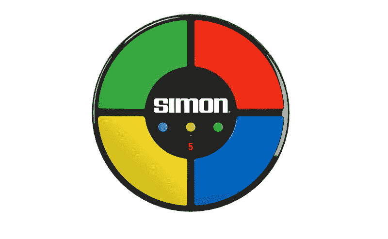

# 免费代码营需要多长时间？

> 原文：<https://www.freecodecamp.org/news/how-long-does-free-code-camp-take-f986202346ef/>

坐科林渡轮

# 免费代码营需要多长时间？

我在犹他州北部的一个太阳能取暖小屋里度过了冬天。没有淋浴，但我们在屋顶安装了一个卫星，并设法接入了比我在旧金山的公寓还快的网络。我决定学习编码。

我想利用这种孤立来学习新的东西。从我记事起，我就对技术感兴趣，但是我过去在编码方面的尝试产生了不起眼的结果。

我在高中时学过一些 C++，但大部分时间都在写大量重复的代码，因为我不懂函数。我考了 Visual Basic。网络课程，但我对那里发生的事情几乎没有任何记忆。几年前，我在危地马拉的吊床上完成了 Codecademy 的 JavaScript 课程。

我认为这条曲折的不完全学习的道路确实在某些方面为我做了准备。我还获得了计算机图形学的学位，这个学位更侧重于设计、动画和建模，而不是编码，但它确实给了我一些 HTML/CSS 的基础知识。

关于“为什么编码”已经写了很多，所以我不会在这里白费口舌。

简而言之，聪明的人似乎都同意，知道如何编码是你生活中几乎所有事情的力量倍增器。

在网上搜索了一下，确定了开始的最佳地点后，我决定通过[自由代码营](http://www.freecodecamp.com/)开始工作。亚军是 Odin 项目，但 Reddit 似乎同意 FCC 是更强的起点。不管出于什么原因，我相信 Reddit 在这方面的智慧。

所以我设定了一个 2 小时/天的小目标，并安装了 RescueTime 来跟踪自己。这里有一瞥它是如何进行的。

**第一天**

我很快地看完了前三部分。HTML5/CSS、带 Bootstrap 的响应式设计和 jQuery 预计总完成时间为 13 个小时，但根据 RescueTime，我只用了 4 个小时就完成了。此时我怀疑自己是不是做错了什么，但我决定恭喜自己，继续前进。

**第 3–4 天**

我一直顺风顺水，顺利地完成了基础 Javascript 部分。第三天的一大早，我开始第一次感觉自己被困在了一个[概要查找](https://www.freecodecamp.com/challenges/profile-lookup)练习中，这个练习涉及到使用一个循环来遍历一个对象数组。但是到晚上 10:30，我已经完成了基本算法脚本的一半(根据 RescueTime，我在自由代码营总共花了 12 小时 20 分钟)。

第二天早上，我开始研究其余的基本算法，在 3-5 分钟内写出了一些解决方案。我在 FCC 的聊天中证实，许多人开始时相对较快，随着时间的推移，随着相对难度的增加而变慢(从而使估计的完成时间变得更加现实)。

也就是说，到第四天晚上，我在 FCC 上总共花了 18 个小时完成了这些算法(估计还有 22 个小时的总劳动时间花在其他研究资源上，比如 Mozilla 开发者网络。此时的估计时间为 75 小时。

我最初的 2 小时/天的微目标让我想到，当我离开犹他州的藏身处时，我已经完成了 100 个小时的工作。现在我真的受到了工作的鼓舞，在仅仅四天的时间里，我已经完成了 75%的目标。

**第 17 天**

我进入了主要的低头模式，两个星期没有做任何进度笔记。坏消息是那里没什么可报道的，但好消息是 FCC 让我连续两周处于流畅状态。此时，我已经完成了一个框架[投资组合](http://s.codepen.io/collinferry/debug/obJvgW)(现在有点多了)，并建立了一个随机报价机以及一个非常糟糕的[受指环王启发的天气应用](http://s.codepen.io/collinferry/debug/obmKgm)。第 17 天，我提交了我的[维基百科浏览器](http://s.codepen.io/collinferry/debug/mVgjQG)。学习如何使用 API 既有趣又有用。事实证明，您可以在不了解后端服务器或数据库的情况下构建中等复杂程度的东西(您可以直接插入别人的东西)！

**第 23–24 天**

通过研究中间算法，我发现自己开始看到干净代码和丑陋代码之间的区别。我也开始在我的代码中嵌入更多的注释，以供以后审查。不知何故，我花了这么长时间才意识到 console . log(“tests”)总是在浏览器的 JS 开发人员控制台中出现。我已经开始使用 [https://repl.it](https://repl.it) 来运行将控制台日志显示为清晰输出的代码。现在有点尴尬，但是嘿——我没有让它阻止我，现在你更清楚了。

我第一次在浏览所有素数的总和时崩溃了。不管怎样，我最终解决了这个问题，并且在没有任何外部研究的情况下解决了 99%的质数函数，这让我感觉非常棒。

**第 31–33 天**

我发现高级算法挑战相当…嗯…高级。当我在 90 分钟内完成了“友好日期范围”高级算法时，我欣喜若狂。在其中两个高级算法中，我引用了 StackOverflow 的特定函数来帮助我的代码保持整洁。当时我担心这可能会伤害我，但我遇到的许多资源都认为，让一个伟大的程序员能够向搜索引擎提出特定的问题。例如，从头开始创建一个 JS 版本的 [Heap 的算法](https://en.wikipedia.org/wiki/Heap%27s_algorithm)将会是一个高水平的数学和一个车轮的重新发明。找到一个我可以使用的 JavaScript 模型让我真正完成了汽车的制造。

在第 33 天，我完成了最后一个高级编码挑战。下一个项目(第一个高级前端开发项目)需要构建一个 JS 计算器。深入研究 HTML/CSS 方面的东西很不错。我在 FCC 的 Twitch 频道上通过现场编码提高了挑战，最终在 24 名现场观众的参与下完成了这个项目。这是一次很棒的经历，它要求我在编写代码时解释我的代码。现场编码也有一个内在的需求来保持势头。它鼓励“快速移动和打破东西”的编码风格，而不是更多的研究方法。

**第 40 天**

编写井字游戏代码被证明是(对我来说)最累人的项目。对我来说，编写人工智能代码并不有趣，也不令人满意。在我看来，我的最终结果是弱人工智能和低于标准的界面。当时我想，也许构建这样的交互式东西根本不是我的激情所在。

**第 45 天**

我在最后一个项目中疯狂地工作，要求用 JavaScript 复制 1970 年的游戏《西蒙》,完成一个可选的“严格模式”和一个增加的游戏速度。我决心让它与众不同。写这篇文章的时候，我仍然觉得我的西蒙是最好看的版本之一。在第 45 天，我完成了这个项目，拿到了我的前端开发证书！

**最终统计:**

77 小时参考和学习
67 小时软件开发
41 小时沟通(包括 [FCC 聊天](https://gitter.im/FreeCodeCamp/FreeCodeCamp) )
= **185 小时 45 天(或~4 小时/天)**

我用了大约一半的时间完成了课程。

我不能推荐自由代码营的前端开发程序不够。不管花了你多长时间，它都是免费的，很容易开始，并且它有一个智能的和可访问的社区(如果我自己这么说的话)。

我发现自己感觉智力匮乏，学习编码为旧的精神肌肉提供了令人满意的伸展。我将搬回旧金山，并打算继续我的科技之旅。

如果你正在学习编程，就像对待工作一样对待你的教育。跟着我，让我知道我能帮上什么忙！在此之前，迭代过程的巨大收益从未像学习编码时那样明显。

Click the heart if this breakdown helped you!