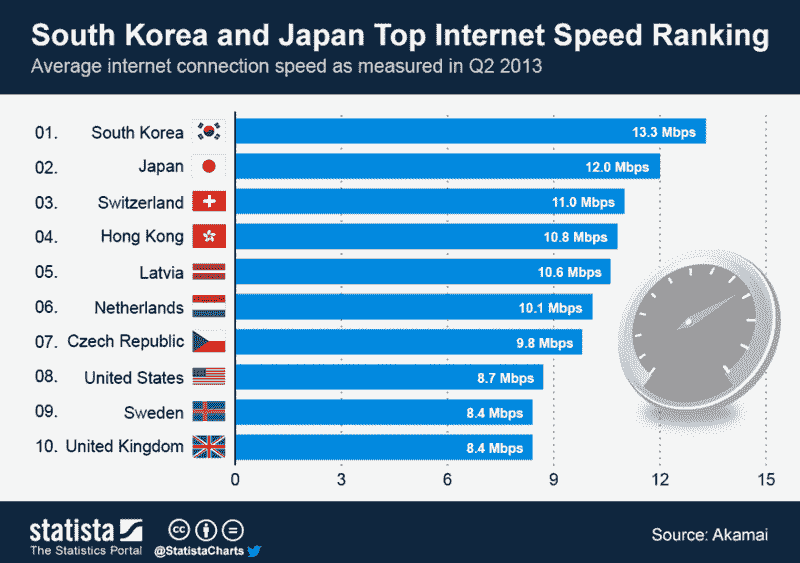

# 韩国是自学成才的程序员的天堂

> 原文：<https://www.freecodecamp.org/news/south-korea-will-pay-you-to-learn-coding-5947fa625659/>

作者斯蒂芬·马约

# 韩国是自学成才的程序员的天堂

If you’re not tied down to a job or family, South Korea could fund your coding education.

需要更多的时间投入编码？韩国和亚洲许多其他国家可以帮助你做到这一点。

最近我发表了一篇文章，讲述了自从我 9 个月前开始自学编程以来我学到的所有很酷的东西。反响非常积极，许多有抱负的开发人员向我咨询我是如何做到的。

一些极端的外部激励力量是我成功的很大一部分。虽然我对过去 8 年来当英语老师并不后悔，但是收支平衡很难，如果我想摆脱学生债务的束缚，我绝对必须获得更多有利可图的技能。

但这不全是钱的问题。用代码解决问题非常有趣！

我也得到了妻子的大力支持。她非常通情达理，每次我都把自己锁起来几个小时，没有她做我那份家务，我不可能学得这么快。

> 给老婆的提示:我并不比你更爱我的电脑！

但毫无疑问，我必须把我的成功至少部分归功于在韩国的生活。

矛盾的是，我正在倒计时，直到我完成我的教学合同，然而正是这份教学工作给了我可观的收入和大量的空闲时间来从事编程。在韩国生活加速了我的学习，如果你和我的情况相似，你至少应该考虑搬到这里的可能性。

#### 成为一名英语教师= >学习编码

在韩国教英语只有三个简单的要求:

1.  持有英语国家的护照，
2.  没有犯罪记录，并且
3.  拥有英语国家大学的 4 年学位。

如果你满足这些要求，你可以相对容易地在韩国找到一份教学工作，并在 2 或 3 个月内进入该国。有教学经验和证书会帮助你找到条件更好、薪水更高的工作，但这方面没有硬性规定。

大多数在韩国的外籍人士在大学、公立中小学和被称为 hagwons 的私立语言学院任教。大学和公立学校提供最多的带薪假期和休息时间，获得这些工作的竞争越来越激烈。Hagwon 的老师教得最多，休息时间也较少，但他们每周最多工作 40 个小时。

事实上，在韩国寻找教学工作的网站是戴夫的 ESL 咖啡馆，你可以在那里找到你需要知道的一切。在这篇文章中，我不会涉及签证申请过程的细节或避免哪些学校，但请在下面的评论中留下你的问题，我保证会逐一回答。

#### 为什么是韩国？

有很多理由让韩国资助你的编码教育。

首先，在这个国家，你的个人财务永远不会成为担忧的原因，你会有大量的可支配收入来购买 Udemy 课程和参加在线训练营。这怎么可能呢？

除了杂货店的新鲜农产品，生活成本相对较低。公共交通、家庭用品、餐馆、酒吧和娱乐都非常实惠，你不必花很多钱就能享受高质量的生活。你的雇主会支付你一半的健康保险，而且看医生也没有美国那么高的保险费。(我不是想在这里展开一场辩论。)

更糟糕的是…你的雇主支付你的房租！

因此，虽然韩国的英语老师挣的钱和开发人员挣的钱不太一样，但你在这里不用花很多钱。当你要离开的时候，你会从你的学校得到一笔丰厚的合同完成奖金。到我九月份离开的时候，我将会带走相当于四个月工资的奖金！这将直接用于我今年秋天即将到来的工作面试的差旅费。

这里还有一个蓬勃发展的自学成才的开发者社区，他们中的许多人都参加了自由代码营的当地分会。不是吹牛什么的(好吧，完全是吹牛)，但是[昆西](http://medium.com/@quincylarson)自己已经公开称釜山和首尔的自由代码营为露营地的“黄金标准”。

哦，是的…韩国也有世界上最快最便宜的互联网服务。

These are figures from 3 years ago. Much faster today.

#### 为什么不是韩国？

如果你没有工作或家庭的束缚，那么韩国可能是一个可行的选择来资助你的编程教育。也就是说，它并不适合所有人。

如果你有孩子，我不认为来这里是个好主意。国际学校非常昂贵，你的雇主只会提供适合一个人，也许两个人的公寓。你要负责为自己买一个更大的房子，并支付疯狂的保证金。与许多国家不同，韩国的月租金较低，但押金从 5000 美元到 20000 美元不等。

对于不喜欢离开舒适区的人来说，韩国也不是一个好地方。我喜欢认为我是一个思想开放的人，有文化意识和敏感，但有些日子住在这里是一种挣扎。

我不会说韩国社会的坏话(毕竟我是在说服你搬来这里！)，但本着完全透明的精神，你需要知道，大多数韩国人都工作过度，压力过大。

我在一所私立语言学院教大学生、全职父母和商人。总的来说，与其说我是老师，不如说我是治疗师。韩国高压的工作环境和竞争激烈的教育体系给韩国人民带来了很大的压力，以至于我作为一名外籍人士都感觉到了这一点。

有些人喜欢住在韩国。有些人讨厌它。我现在处于两者之间，但是我一直很忙，周围都是积极的人，他们也喜欢编程。这使得我在这里的时间是值得的。

#### 问题

我会提前回答你的一些问题，现在就回答。如果我在文章中没有提到什么，请在下面的评论中问我。

1.  在韩国教书，我必须会说韩语吗？绝对不会，而且你的学校通常会禁止你说韩语。也就是说，你可能应该学习韩国字母表(超级简单！)和一些让你生活更轻松的生存短语。
2.  韩国最适合居住的地方是哪里？首尔是一个很酷的城市，有一个新的创业场景，但它变得非常冷。釜山是一个有海滩和山脉的沿海城市，但是它不像首尔那样优雅。大邱有一个很棒的外国人场景，但是在夏天它变得非常热。
3.  我对公立学校系统感兴趣。那些程序叫什么？用谷歌搜索 EPIK、格皮克和 SMOE。很棒的项目，如果你能进入的话。
4.  我想成为一名教师来资助我的编码之旅，但我不想去韩国。还有其他选择，支付体面的薪水，让你过上和韩国一样的生活质量。如果你对亚洲感兴趣，我会去日本、越南和台湾看看。