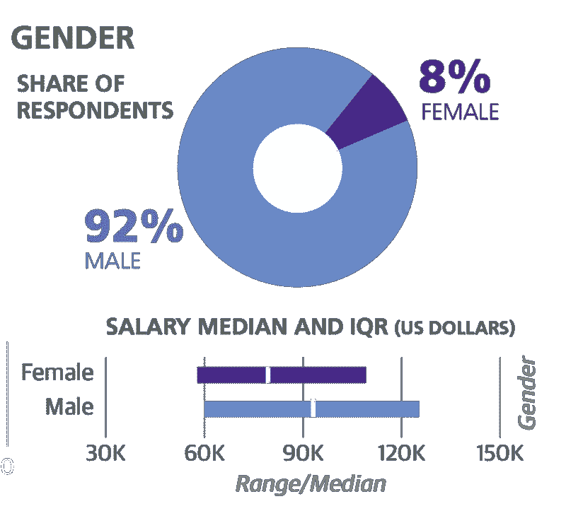
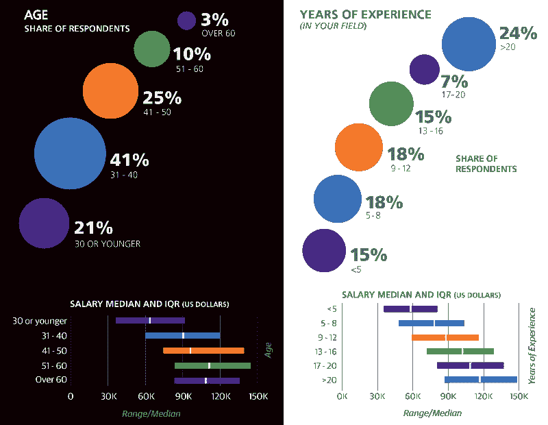
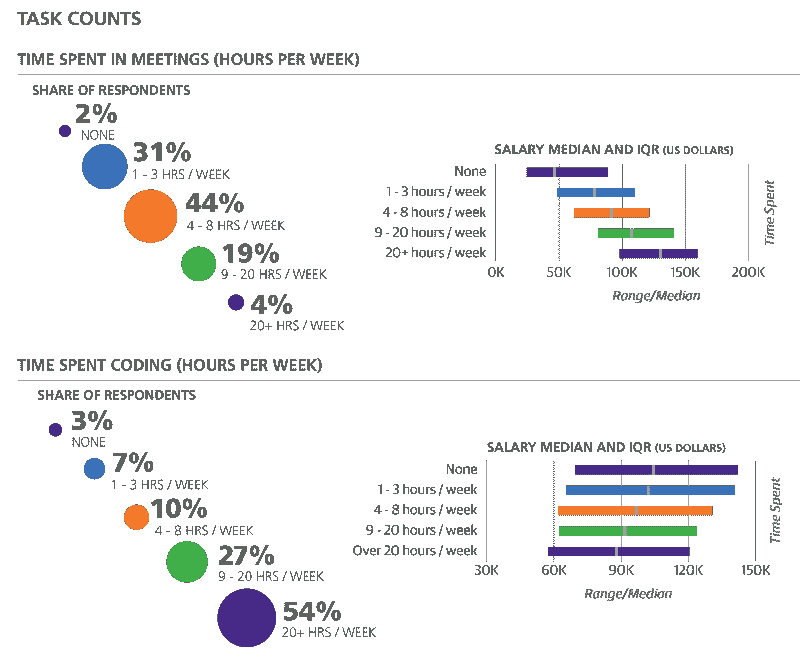
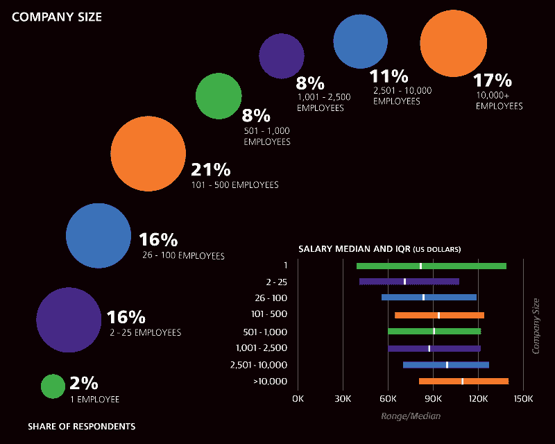
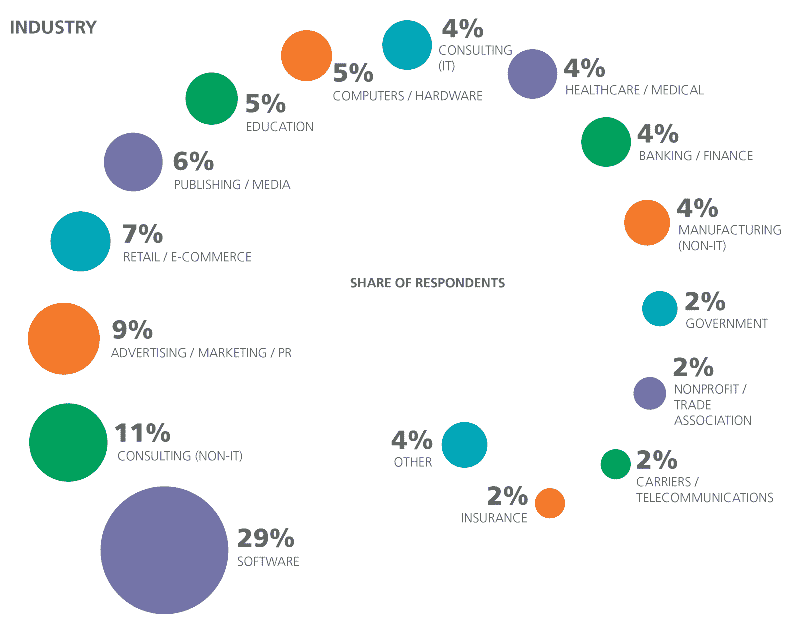
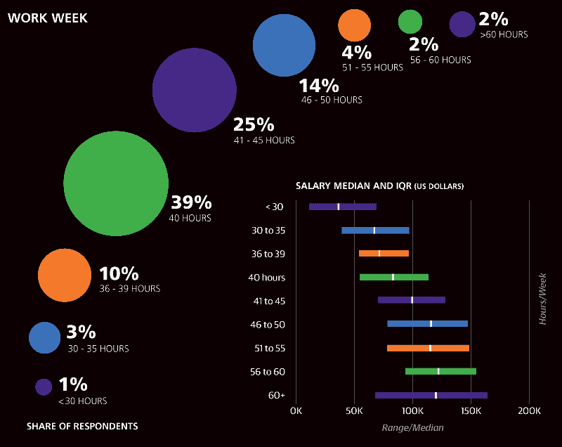

# 5000 个开发者谈论他们的薪水

> 原文：<https://www.freecodecamp.org/news/5-000-developers-talk-about-their-salaries-d13ddbb17fb8/>

让我们来看看 O'Reilly 2016 年对 5000 名开发人员(不包括经理和学生)的薪酬调查中最有趣的结果。

#### 性别薪酬差距是真实存在的

女性不仅在开发人员中的代表性严重不足，而且她们的工资也非常低。

女性的平均收入比男性低 1.3 万美元。

即使你控制了位置、头衔和工作经验，女性每年仍比男性少 5000 美元。

#### 雇主确实看重年龄和经验

对编程最常见的误解之一是它是“年轻人的游戏”

但是，在脸书这样的公司，最近大学毕业生的天文数字般的薪水并不能代表整个领域。

有一个可预测的相关性:你的经验越多，而且一般来说，你的年龄越大，你得到的报酬就越多。准确地说，每年多 1194 美元。

#### 逃避会议的开发者要付出代价

不管你喜不喜欢，花更多时间开会——花更少时间编码——的开发人员往往会赚更多的钱。

#### 公司越大，你的薪水越高

这一部分可能是由较小的公司(初创公司？)以股权代替高薪。

有趣的是，当你控制经验和地点时，自由职业者每年比全职员工多赚 12000 美元(尽管不清楚其中有多少用于支付自己的保险。)

#### 大多数软件工作实际上不属于科技行业

几乎每个大型组织都雇佣开发人员。只有大约 1/3 的开发人员在我们传统上认为的“技术”行业工作。

#### 但是有些行业比其他行业工资高

开发人员的平均年薪为 9 万美元。

但同样的金融工作每年多支付 11，000 美元。

教育付出最少——比中位数少 11，000 美元。

#### 你工作越多，得到的报酬就越多

聪明工作不能代替努力工作，至少就报酬而言是这样。

大约一半的开发人员称他们每周工作 40 小时或更多。由于在办公桌前花费最多时间的开发人员通常会拿走最多的钱，因此很难责怪他们。

#### 刚接触开发的人呢？

我们调查了超过 15，000 名软件开发新手。我们已经以[公开数据](https://github.com/FreeCodeCamp/2016-new-coder-survey)的形式发布了结果。

这里是[完整的奥赖利调查分析](https://www.oreilly.com/ideas/2016-software-development-salary-survey-report)(注意:这是电子邮件墙)。

我只写编程和技术。如果你在推特上关注我，我不会浪费你的时间。？