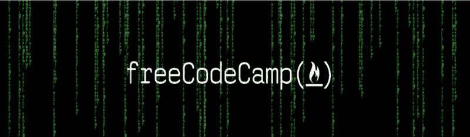

# 让它下雨代码-矩阵风格

> 原文：<https://www.freecodecamp.org/news/canmaking-it-rain-code-matrix-style-ec6e1386084e/>

作者库尔特

# 让它下雨代码-矩阵风格



#### HTML 5 画布动画介绍

在 HTML 5 带给我们的所有美好事物中，我最喜欢 canvas 元素。我希望一旦你看到它的强大，你会愿意花时间自己掌握画布动画。

#### 什么是画布？

画布正如它的名字所暗示的那样。这是一块空白画布，您可以随意绘制，然后在浏览器中以图像形式呈现。真正的美妙之处在于，它不仅允许你创建图像，还允许你不断地重画和渲染它们——从而创建一个动画。

画布的力量只受你想象力的限制。我使用 canvas 元素创建了从动态静态图像到游戏、图形用户界面的所有东西。甚至还有 MailChimp 风格的电子邮件生成器。您甚至可以在 3D 中渲染画布！

对我来说，画布元素改变了一切。我不再局限于使用默认的 HTML 标签。我可以在浏览器中创建任何我想要的东西。你最好相信这将我的 JavaScript 技能提升到了一个全新的水平。

#### 入门指南

我不是简单地演示如何在画布上画画，而是想让你看一看你可以用它来创作什么。如果你还没看过黑客帝国，现在就停止阅读，去看看吧。如果你看过，你会从标题中认出著名的“坠落的代码”。让我们用画布创作这个吧！

为了节省时间，我不做一步一步的教程，我将发布下面的代码，并带你浏览它，解释每一部分在我们进行的过程中是怎么做的。

HTML:

```
<canvas id=”canvas” width=”600px” height=”400px”></canvas>
```

CSS:

```
body{ background-color:#d2d2d2;}#canvas{ background-color:#000; display:block; margin:auto;}#logo{ display:none;}
```

JavaScript:

```
var canvas = document.getElementById(‘canvas’);var ctx = canvas.getContext(‘2d’);var t = text();var logo = document.getElementById(‘logo’);var lines = [];window.setInterval(draw, 100);
```

```
function draw() { if (Math.floor(Math.random() * 2) === 0 && lines.length < 100) {  lines.push(new textLine()); } ctx.clearRect(0, 0, canvas.width, canvas.height); lines.forEach(function(tl) {
```

```
 ctx.drawImage(tl.text, tl.posX, tl.animate(), 20, 1000); }); ctx.drawImage(logo, 100, 155, 400, 70);
```

```
}
```

```
function textLine() { this.text = t; this.posX = (function() {  return Math.floor(Math.random() * canvas.width); })(); this.offsetY = -1000; this.animate = function() {  if (this.offsetY >= 0) {   this.offsetY = -1000;  }  this.offsetY += 10;  return this.offsetY; };}
```

```
function text() { var offscreenCanvas = document.createElement(‘canvas’); offscreenCanvas.width = “30”; offscreenCanvas.height = “1000”; offscreenCanvas.style.display = “none”; document.body.appendChild(offscreenCanvas); var octx = offscreenCanvas.getContext(‘2d’); octx.textAlign = “center”; octx.shadowColor = “lightgreen”; octx.shadowOffsetX = 2; octx.shadowOffsetY = -5; octx.shadowBlur = 1; octx.fillStyle = ‘darkgreen’; octx.textAlign = “left”; var step = 10; for (i = 0; i < 100; i++) {  var charCode = 0;  while (charCode < 60) {   charCode = Math.floor(Math.random() * 100);  }  octx.fillText(String.fromCharCode(charCode), 0, step);  step += 10; } return offscreenCanvas;}
```

#### 它是如何工作的？

在第 1 行，我们根据 id 获取 canvas 元素。每个画布元素都有自己的*上下文—* 一个操作其内容的接口。这就是第 2 行的 *ctx* 变量所指的。

为了创建动画背景，我们将需要一条垂直的随机文本线，然后我们将在 X 轴上多次重画，并在 Y 轴上递增动画，以给我们最终效果。

由于文本总是水平呈现，我们将在另一个不可见的画布上呈现文本，并在原始画布上将其绘制为图像。

在第 3 行，我们将变量 *t* 设置为 *text()* 函数的结果，该函数生成并返回我们不可见的画布元素。

在这个函数中，我们创建一个新的画布，设置它的宽度和高度，并将其 display 属性设置为 none 以隐藏它，然后将它附加到文档正文中。然后，我们为将要绘制的文本设置颜色、阴影和偏移量。

为了生成垂直随机字符，我们循环并绘制一个新的随机字符 100 次，并在每个时间间隔在 Y 轴上增加 10px。为了生成一个随机字符，我使用 *Math.random()* 得到一个 60 到 100 之间的数字，然后使用 *String.fromCharCode()将其转换成一个字符。*

这将绘制带有阴影的垂直文本，并将画布返回给 t 变量。

#### 动画循环

在接下来的 3 行代码中，我检索 FreeCodeCamp 徽标，声明一个数组来保存组成背景的独立行，并使用 *window.setInterval* 每隔 100 毫秒运行一次 *draw()* 函数。

当制作画布动画时，最好使用*window . requestanimationframe()，*但是我觉得这对初学者来说太混乱了，因为设置帧速率有点棘手。

*draw()* 函数做的第一件事是生成一个介于 1 和 0 之间的随机数。如果数字为 0，并且在背景上动画显示的文本少于 100 行，它会将新的 *textLine()* 推入行数组。

函数的作用是:返回一个包含

1.  产生的垂直文本保存在 *t* 变量中。
2.  将在 X 轴上呈现的偏移量(在对象的每个实例上随机生成)。
3.  Y 轴上的初始偏移量为-1000px，正好位于画布上方。
4.  一个 animate 方法，每次调用它时都在 Y 轴上增加 10px，并返回使文本向下移动的结果。如果 Y 轴偏移达到 0，它将被重置为-1000px，提供连续的动画。

画布被清空，然后 *draw()* 函数遍历 *lines* 数组中的每一行文本，并在画布上绘制它，每次绘制一条线时调用其 *animate* 方法将其向下移动。

因为每一行在 X 轴上都有一个随机的偏移量，并且每隔一段时间就会添加一个新行，所以文本行在画布上以不同的速度落下，产生了雨点般的代码效果！

最后，FreeCodeCamp 的标志被绘制在背景上，给了我们最终的动画。

#### 现在去哪里？

如果你对 canvas 感兴趣，你可以在 Mozilla 文档中了解更多。

我计划像创建一系列更基本的一步一步的教程，当我找到时间的时候，通过画布动画。

如果你不觉得上面的代码太难，并想弄乱它，这里有一些很酷的想法:

1.  使尺寸动态化，以便画布在您调整浏览器大小时缩放并继续显示动画。
2.  与其随机生成字符，不如从 GitHub 中抓取一个你自己的代码文件，并制作成动画。
3.  用你的名字代替 FreeCodeCamp 的标志，让它看起来像黑客帝国的海报。
4.  不是随机生成每一行，而是将一个 click 事件绑定到画布，并在鼠标单击的 X 坐标处呈现一个新行。

我希望你喜欢这篇介绍，如果你有空的话，可以看看我写的其他文章。

将代码变成现金——作为一名网络开发人员如何赚钱并活下去。
[*所以你才学会了编码。你很渴望，任何不会编码的人都认为你是天才，消息传出去，所有的…*medium.com](https://medium.com/p/f5eedc557b3e)[**如何用 71 行代码编写一个像库一样的 jQuery 了解 DOM**](https://medium.com/p/e9fb99dbc8d2)
[*JavaScript 框架风靡一时。你打开的任何一个与 JavaScript 相关的新闻提要都有可能是杂乱无章的……*medium.com](https://medium.com/p/e9fb99dbc8d2)[**学习编程时要记住的 5 件事**](https://medium.com/p/1ed8e734b04f)
[*学习编程很有挑战性。除了选择语言或建立开发环境，你……*medium.com](https://medium.com/p/1ed8e734b04f)[**我是如何成为一名程序员的。当我开始自称为 One**](https://medium.com/p/54a0533c4335)
[*的时候，我已经想开始写关于编程的博客好几个月了，就像我之前的许多人一样，我开始写满了……*medium.com](https://medium.com/p/54a0533c4335)[**预防性编程——如何在错误发生之前修复它们**](https://medium.com/p/9df82cf215c5)
[*……以及为什么夏洛克·福尔摩斯会成为一名出色的程序员*medium.com](https://medium.com/p/9df82cf215c5)