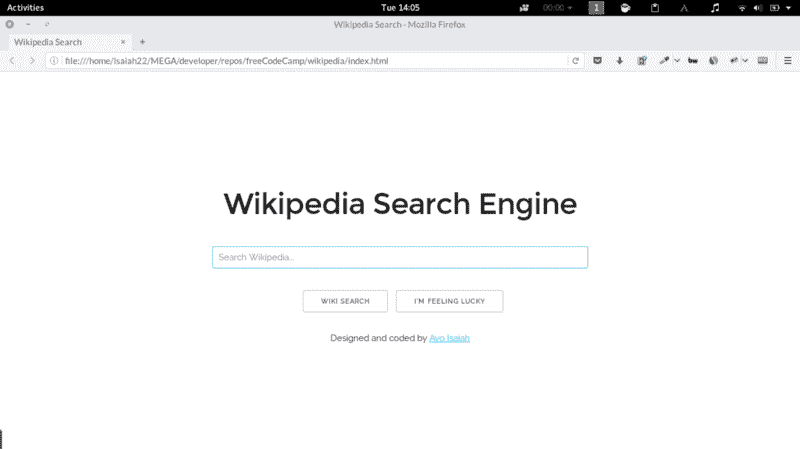
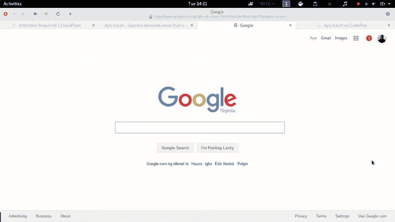

# 构建维基百科搜索应用

> 原文：<https://www.freecodecamp.org/news/building-a-wikipedia-search-engine-project-4d84de3841d2/>

作者 Ayo Isaiah

# 构建维基百科搜索应用


我刚刚完成了自由代码营的[维基百科浏览器](https://www.freecodecamp.com/challenges/build-a-wikipedia-viewer)应用程序，你可以使用 MediaWiki Web API 从维基百科中并排提取文章。

敏捷用户案例包括:

*   用户可以在搜索框中输入查询，并查看结果维基百科条目。
*   用户可以通过点击一个按钮来查看任意的维基百科文章。

我很快就完成了这个项目，因为看了 MediaWiki API 后，我知道该做什么，这也许要归功于我在[天气项目](http://www.ayoisaiah.com/weather-app/)中的经验。

#### 设计



在构思这个项目的设计思路时，我决定查看谷歌的主页及其搜索结果页面，看看他们是如何处理事情的。正如你将看到的，我最终从他们那里获得了大部分设计灵感。

首先，主页的中心有标题、搜索框和按钮。“我感觉很幸运”按钮会把你带到一个满足第二个用户故事的随机维基百科页面。

当页面加载时，焦点会被放在搜索框上，这样用户就可以立即输入他们的查询，这要感谢下面的 JavaScript:

```
window.onload = function() { document.getElementById("wiki-search-input").focus();};
```

我尝试的一件事是，当你开始在搜索框中输入内容时，让结果页面立即显示出来，模仿谷歌搜索的这一功能。



我能够在我的应用程序上复制这一点，但我不确定它在触摸屏上的效果如何，因为在我的测试中，页面对我手机上的按键没有反应。

所以为了避免意外的行为，我放弃了这个想法，只在完全输入查询，并按下“搜索”按钮或回车键时才显示结果页面。这在我测试的所有移动和桌面平台上都运行良好。

总的来说，我的设计没有什么革命性，但只要它能在所有类型的设备上正常扩展，对我来说就足够好了。

#### 逻辑

老实说，深入研究从维基百科中提取结果的代码，使用 API 并不困难。

我试图使用 jQuery *$来应对这个挑战。getJSON* 方法进行 API 调用，就像我对 Open Weather API 所做的那样，但是它返回了一个关于跨源资源共享(CORS)的错误消息。

经过进一步研究，我发现了另一个 jQuery 方法 *$。ajax()* 对堆栈溢出有效。显然，我必须将数据类型指定为“JSONP”(带填充的 JSON)才能让它工作。

```
function ajax (keyword) {  $.ajax({     url: "https://en.wikipedia.org/w/api.php?action=query&list=search&srsearch=" + keyword + "&prop=info&inprop=url&utf8=&format=json",    dataType: "jsonp",   success: function(response) {       console.log(response.query);       if (response.query.searchinfo.totalhits === 0) {         showError(keyword);       }
```

```
 else {         showResults(response);       }  },
```

```
 error: function () {    alert("Error retrieving search results, please refresh the page");   }  });
```

```
}
```

我发现每个页面的 URL 和标题几乎完全相同。唯一的区别是标题中的空格被 url 中的下划线所取代。

所以“JavaScript 库”在 url 中变成了“JavaScript_Libraries”。

简单地通过抓取每个标题，我用一点正则表达式(不可否认，我还不是很了解它)用下划线替换空格，并把它附加到相应的搜索结果上。

```
var title = callback.query.search[m].title;var url = title.replace(/ /g, "_");
```

```
$(".title-" + m).html("<a href=’https://en.wikipedia.org/wiki/" + url + "' target='_blank'>" + callback.query.search[m].title + "</a>");
```

我做的最后一件事是创建一个错误函数，这样如果用户的查询与任何结果都不匹配，它就会在页面上显示一些提示来帮助用户改进搜索。


正如你所看到的，自由代码营的开源社区还没有一篇维基百科文章(尽管有超过 300，000 名成员)。如果你是维基百科的常客，这里有[个优秀文章请求](https://en.wikipedia.org/wiki/Wikipedia_talk:WikiProject_Education#Open_source_community_focused_on_coding_education_wants_your_help)让你创建一个。

这就是这个项目的大部分内容。您可以在 [Codepen](http://codepen.io/ayoisaiah/full/Kzvrbp) 上查看最终结果。

#### 下一步是什么

在写这篇文章的时候，我已经完成了 Twitch API 项目的一半。大部分设计已经完成，只需要用 API 弄清楚一些事情。

随着我的大学新学期本周开始，自由代码营的事情可能会变得有点慢，但尽管如此，它不应该阻止我每天投入几个小时。

如果你想和我联系，你可以在推特上找到我或者发邮件给我。

感谢阅读。

这篇文章的一个版本最初发表在我的个人博客上。