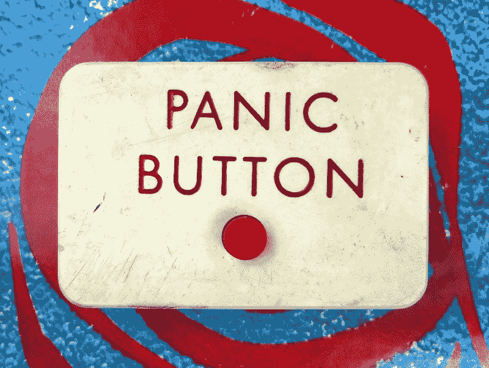
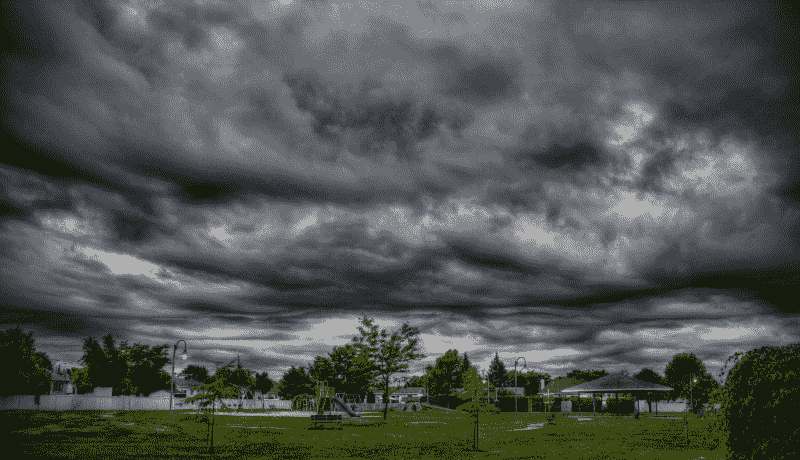
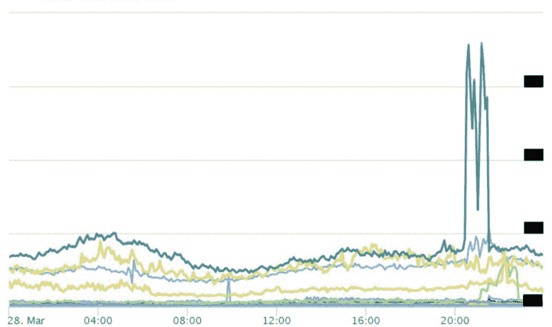

# 回顾:我们从两次重大 API 故障中吸取的教训

> 原文：<https://www.freecodecamp.org/news/insights-into-two-recent-service-outage-incidents-6e9a9c93c225/>

科里·肯尼迪·达比

# 回顾:我们从两次重大 API 故障中吸取的教训

我属于一个团队，该团队通过 API 向公司内的其他团队提供内部服务。这些团队越来越依赖我们提供的服务。

听起来不自私，这些服务可能是公司最重要的。当这些服务不完全运行和稳定时，它会影响几乎所有其他团队，并对收入产生巨大的直接影响。

在内部，公司中使用我们服务的其他团队被称为“客户”为了清楚起见，本文将把术语“客户”和“团队”视为可互换的。

#### 周三——我们开始收到大量的请求

我走进办公室，喝了点咖啡，然后通过检查我们的指标和日志开始我的一天。公司的大多数人从前一天晚上就已经知道托管我们服务的负载平衡器出现了一些小问题。我的经理希望我专注于一项重要的计划，并将所有其他不相关的任务交给他。

几个小时后，我注意到我们的一封错误日志邮件中出现了大量验证错误。这些验证错误没什么特别的。我们通过日志通知任何发送给我们不符合验证规则的不正确有效负载参数的客户端。

我所属的团队没有部署任何更改，基础架构处于健康状态，我们这边没有任何地方需要如此大规模的增加。

我的经理早些时候明确表示，我应该将任何与我当前正在进行的项目无关的东西交给他。当我问他在哪里可以找到给我们发送所有这些验证错误的团队的团队领导时，我很快意识到我犯了一个错误。

错误在于，当我问他这个问题时，他想知道我为什么这么问。简而言之，他认为这是我没有专注于计划，并解释说他会处理验证错误。在我们谈话后不久，我收到一封电子邮件，抄送给我和另一个团队，向他们指出了他们的问题。

#### 突然，办公室里一片恐慌

有一系列关于我们服务问题的电子邮件，每个人都指责前一天晚上负载平衡器的问题。

我不再主动处理运营任务，而让数据中心人员处理负载平衡器。经过一番讨论，他们决定开始将我们的部分流量重新路由到其他负载平衡器。

负载平衡器神奇地开始稳定下来。

#### 暴风雨(或大动荡、激烈辩论)前的平静

办公室里的恐慌消失了，一切都恢复了正常。几个小时后，这个问题似乎又出现了，我们的服务又一次被大量的请求破坏了。

**丁！**

收到错误日志电子邮件后，我注意到这些验证错误再次出现。我一直专注于处理数据中心，以至于没有注意到当负载平衡器变得稳定时，它们已经停止了。

坚持住！我打开我们的 Kibana 仪表板，查看一段时间内的请求，并比较验证错误的时间戳和一段时间内的请求总数。他们几乎完全匹配。

我相当有信心这就是问题所在，我决定不再重复从早上开始的同样的错误。我问一位同事另一个团队在哪里，并带着峰值发生的时间和一切变得不稳定的时间之间的相关性的知识前往那里。

在向其他团队解释情况的 10 分钟内，他们意识到这与他们部署特性的时间、禁用特性的时间以及意外重新部署特性的时间完全一致。

他们禁用他们那边的功能，我们的服务恢复稳定。他们部署的功能有一个 bug，它会在任何情况下调用我们的服务，甚至在不需要的时候。

#### 星期一—终端请求量的大约 600%

周末过去了，自周三的事件以来，我们的服务没有出现任何问题。周一开始正常，没有任何问题，但到了工作结束时，我们的服务开始变得不稳定。

快速浏览 Kibana 事件和我们的访问日志，我注意到来自一个团队的请求数量惊人。周三的同一支队伍。

我匆忙赶到公司团队区域，解释了细节，询问他们是否错误地从周三重新推出了 buggy 功能。

为了确保该特性没有被错误地再次部署，他们检查了他们的部署日志，并在 git 上验证了该特性没有被错误地合并到另一个分支中。

周三的功能还没有重新部署。

我回到办公桌前，开始和数据中心运营团队聊天。由于服务受到影响的时间，这一点上的情况变得很严重。运营团队正在调查，当运营副总裁出现时，我正坐着等待答案。

他显然不高兴，因为我们的 API 影响了业务运营方面的许多产品和服务。他有一些关于绕过我们的服务、利用一些回退方法以及服务恢复正常状态的预计时间的问题。

几分钟后，一切稳定下来。

#### 修好了？除非我相信独角兽和神话生物

数据中心运营团队解释说，我们的 stage server 上的一个功能导致负载平衡器进程不断崩溃。我根据他们的回答打电话给 BS，因为这个特性已经成功运行了近两个月，没有出现任何问题。我不愿意接受他们的答案的另一个原因是，我注意到在我们的 Kibana 仪表板上，我们的总请求量大约翻了两番。

我们的临时服务器上如此稳定的特性会随机引发如此大的问题，这似乎太疯狂了。

#### 周二——利益相关者想要答案

周二早上，我的经理要求我提供周一发生的事件的清晰概要，以便他为利益相关方撰写一份事件报告。

前一天晚上，我花了很多时间思考最近的情况，我意识到一个重大的痛点是使用我们的 Kibana 仪表板。当您想要查看所有请求时，我们的 Kibana 仪表板是令人惊讶的，但是使用我们当前的映射，很难深入和隔离来自特定客户端的请求。

问题？这需要一点工作，没有人指派我做这件事，这不是最初给我的任务。当场我决定，我要建立这个。高绩效员工不会要求别人允许他们做自己的工作。他们去交付成果。

> 高绩效员工不会要求别人允许他们做自己的工作。他们去交付成果。

> -科里·达比

我开始编写一个脚本，使用正则表达式和我们的 Elasticsearch 将结果传递到 Highcharts。在此期间，我们的 CTO 停下来询问周一发生的情况。我解释说，目前没有证据，但从我在日志、图表和指标中看到的情况来看，我的直觉是另一个团队的缓存已经失效。另一个团队的缓存死亡将迫使他们向我们的服务发出大量请求。

他离开去从另一个团队那里得到答案，我一起完成了对脚本的破解。这不是优雅的代码，但它完成了工作，这意味着我们不再被蒙在鼓里。

刚结束 10 分钟，我们的 CTO 回来了。他解释说，另一个团队在他们这边找不到任何问题。此时，我向他展示了图表，其中显示了使用我们服务的每个团队所分组的每个请求:

This chart shows all the requests to our service originating from +100 client services.

上图中的巨大尖峰是另一个团队，他们刚刚解释说他们这边一切看起来都很健康。

另一个团队的进一步调查显示，他们推出的新功能需要大量的缓存。他们的缓存规则是驱逐最旧的缓存对象，为新对象腾出空间。被驱逐的数据恰好是我们服务的所有缓存数据。

他们的缓存工作正常，但不再缓存我们的任何服务。另一个队几乎对我们的每一个要求都穷追不舍。

### 需要改进的地方

在任何重大工程事故之后，重要的是要涵盖事故暴露的原因、解决方案、预防和任何痛点。

#### 有洞察力的指标和监控

使用我们服务的客户需要更好地了解他们的使用情况。在我们这边，我们将提供更简单的方法来深入了解具体的指标。

在这些事件之后，很明显我们需要为客户和我们自己创建一个真正的仪表板。仪表板将取代我构建的将数据推入 Highchart 图的脚本。仪表板图表将对接收的数据进行监控，以便提供最早的警报。

#### 减少团队孤岛

理想情况下，我们将允许公司中的其他团队在部署到他们的生产环境时能够将精确定位推送到仪表板。如果单个团队的请求在部署后大量增加，那么这个部署很可能是造成这个高峰的原因。

#### 沟通

在这些停机期间，利益相关者在整个公司制造了很多干扰。这些干扰的形式包括电子邮件、聊天信息以及出现在团队空间询问服务的个人。

为了减少干扰，我们将有一个内部仪表板，包括当前状态和事件的进展。事件将包括创建时间、情况描述和估计恢复时间(如果已知)。

### 包扎

这从来都不是一个“如果”会有中断的问题。这是一个“何时”的问题

每一个事件——无论多小——都是一个学习的机会，可以防止类似的事情再次发生，减少其负面影响，并做好更充分的准备。

免责声明:这些是我的观点，不是别人的，也不代表我雇主的观点。