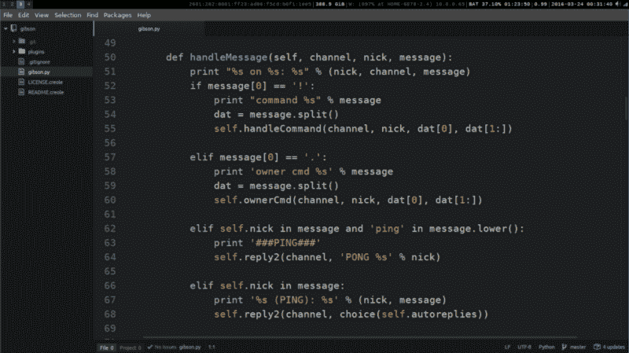

# 你好世界！Pythonic 式的方法

> 原文：<https://www.freecodecamp.org/news/hello-world-the-pythonic-way-ea006c56038c/>

托马斯·诺伊

# 你好世界！Pythonic 式的方法



IRC bot in Python

### 你好世界

开发人员经常接触的第一个程序是臭名昭著的 Hello World。不管你用的是什么语言，你可能已经见过了。如果不是在教程中，也比在野外好。

#### 为什么

这篇文章是为了庆祝[自由代码阵营](https://www.freecodecamp.com)扩展到支持 Python 和其他酷语言。亲自查看一下[的公告](https://medium.freecodecamp.com/java-ruby-and-go-oh-my-6b5577ba2bc2)。

注意，这篇文章并不是给新程序员的教程。我包含了帮助读者开始使用 Python 的链接。

### 给我看一些代码

说够了。让我们看看如何用 Python 编写 Hello World。深呼吸。我们出发了。

#### Python3

```
print('Hello World!');
```

迷人吧？那些习惯了 JavaScript 的人可能不会有什么印象。JS Hello World 的例子不会有太大的不同。

#### Java Script 语言

```
console.log('Hello World!');
```

#### 红宝石

鲁比的也差不多

```
puts "Hello World!"
```

为了使这些变得简单，让我们看另外两个例子。

#### C

```
#include <stdio.h>
```

```
int main(int argc, char* argv[]){    printf("Hello World!\n");    return 0;}
```

#### Java 语言(一种计算机语言，尤用于创建网站)

```
public class HelloWorld {    public static void main(String[] args) {        System.out.prinln("Hello World!");    }}
```

在过去的几年中，编程社区已经开始倾向于使用前三种语言作为介绍性语言，而不是后两种。也许这些 Hello World 给了你一点为什么。你怎么想呢?

好了，回到 Python。

### 这个蟒蛇的东西呢？

我将用这最后一节来略述 python 这个词的表面，我们将看看 python 的 Hello World。

#### Pythonic 是什么鬼？

当人们想到这个问题时，他们可能会想到 Python 著名的

```
import this
```

举例。冉会给你这个:

```
Beautiful is better than ugly.Explicit is better than implicit.Simple is better than complex.Complex is better than complicated.Flat is better than nested.Sparse is better than dense.Readability counts.Special cases aren't special enough to break the rules.Although practicality beats purity.Errors should never pass silently.Unless explicitly silenced.In the face of ambiguity, refuse the temptation to guess.There should be one-- and preferably only one --obvious way to do it.Although that way may not be obvious at first unless you're Dutch.Now is better than never.Although never is often better than *right* now.If the implementation is hard to explain, it's a bad idea.If the implementation is easy to explain, it may be a good idea.Namespaces are one honking great idea -- let's do more of those!
```

你想拿什么就拿什么。让我们把注意力集中在课文中的一行。

> 应该有一种——最好只有一种——显而易见的方法来做这件事。

对我来说，这句话描述了 Python 和地道的 Python 这个词背后的思想。

如果你在键盘前睡着了，至少[把这个加入你的阅读清单](http://python.net/~goodger/projects/pycon/2007/idiomatic/handout.html)。

#### 难道不应该总有一种‘做这件事的方法’吗？

这取决于你。不管你用什么语言。让我们看一个来自 Perl 社区的例子(Ruby 继承了这个例子。)

> 做这件事的方法不止一种 ( **TMTOWTDI** 或 **TIMTOWTDI** ，发音为*蒂姆·今天*)

[**方法不止一种——维基百科，免费百科**](https://en.wikipedia.org/wiki/There's_more_than_one_way_to_do_it)
[*方法不止一种(TMTOWTDI 或 TIMTOWTDI，读作 Tim Toady)是 Perl 编程的座右铭。…*en.wikipedia.org](https://en.wikipedia.org/wiki/There's_more_than_one_way_to_do_it)

(直到有了发音！)

#### 回到代码

让我们跳过哲学课的其余部分，深入研究 Pythonic Hello World 代码示例。我将包含一个非常基本的函数(*天啊！*)所以我们看台词的时候就不那么混乱了。

#是如何开始 Python 注释的

```
# section onedef main():  print("Hello World!")
```

```
# section two
```

```
if __name__ == "__main__":  main()
```

好吗？

#### 拆掉它

**第一节**

```
def main():  print("Hello World!")
```

定义一个没有参数也不返回任何名为 main 的值的函数

打印 Hello World！当 main 被调用时

**第二节**

```
if __name__ == "__main__":  main()
```

__name__ 被分配给调用模块…

简而言之:

*   如果模块被导入，那么 __name__ 将被设置为导入模块
*   如果文件是直接运行的，那么执行 if 语句

在结束之前，让我们再看一个修改过的例子

```
# fcc-greet.py
```

```
def greet(name):  print("Hello {}, welcome to Free Code Camp!".format(name))
```

```
if __name__ == "__main__":  from sys import argv  greet(argv[1]) # first command argument
```

对于一些新用户来说，print 语句和最后一行可能有点多。我将向您展示使用我们新 Python 程序的两种不同方式，而不是解释它们。

第一种是通过终端/命令提示符:

```
$ python fcc-greet.py t3h2mas
```

它将这个打印到控制台

> 你好 t3h2mas，欢迎来到自由代码营！

使用“fcc-greet.py”作为模块:

```
# my-program.py
```

```
import fcc-greet
```

```
users = ["t3h2mas", "BoilingOil", "mamptecnocrata"]map(fcc-greet.greet, users)
```

*感谢上述用户允许使用他们的用户名:+1:*

它会输出

> 你好 t3h2mas，欢迎来到自由代码营！

> 你好，欢迎来到自由代码营！

> 你好 mamptecnocrata，欢迎来到自由代码营！

最后一个例子可能有点过了。只关注输出！

这就完成了我们使用 Pythonic 习语的示例程序。我们完成了一个程序，它可以通过一个提供的参数从提示符中调用，也可以作为一个模块从不同的程序中轻松使用。

### 包裹

这就结束了我们对地道 Python 的浅尝辄止。这篇文章旨在作为补充阅读，而不是一个完整的教程。Python 社区当然知道自己喜欢什么。看见

*pep8 Python 风格指南*

[**欢迎来到 Python.org**](https://www.python.org/dev/peps/pep-0008/)
[*本文档给出了 Python 代码的编码约定，这些代码包括主 Python 中的标准库……*www.python.org](https://www.python.org/dev/peps/pep-0008/)

*pep257*

[**欢迎来到 Python.org**](https://www.python.org/dev/peps/pep-0257/)
[*本 PEP 的目的是标准化文档字符串的高层结构:它们应该包含什么，以及如何表述…*www.python.org](https://www.python.org/dev/peps/pep-0257/)

更多关于 Pythonic 指南的信息。

#### 不熟悉 Python？

这看起来是一个很好的起点

[**Python 入门——Python 大师**](http://thepythonguru.com/getting-started-with-python/)
[*Python 是 Guido Van Rossum 创建的一种通用编程语言。Python 最为人称道的是它的优雅……*thepythonguru.com](http://thepythonguru.com/getting-started-with-python/)

这里有一个很棒的教程列表…

对于程序员:

[**BeginnersGuide/程序员- Python Wiki**](https://wiki.python.org/moin/BeginnersGuide/Programmers)
[*因为这是一个 Wiki 页面，用户可以编辑它。因此，您可以自由添加其他 Python…*wiki.python.org](https://wiki.python.org/moin/BeginnersGuide/Programmers)的材料细节

对于初学者

[**BeginnersGuide/non programmers-Python Wiki**](https://wiki.python.org/moin/BeginnersGuide/NonProgrammers)
[*如果你以前从未编程过，这一页的教程推荐给你；他们不会假设你有…*wiki.python.org](https://wiki.python.org/moin/BeginnersGuide/NonProgrammers)

#### Python 社区

**纬度:T1**

[**Python Education */r/learn Python**](http://reddit.com/r/learnpython)
[*Subreddit 用于发布内容、问题和寻求关于学习 Python 编程语言的一般建议。*reddit.com](http://reddit.com/r/learnpython)[**Python */r/Python**](http://reddit.com/r/python)
[*关于动态的、解释的、交互式的、面向对象的、可扩展的编程语言 Python*reddit.com](http://reddit.com/r/python)[**学习编程*/r/learn programming**](http://reddit.com/r/learnprogramming)
[*关于任何语言编程相关的所有问题的子编辑。*reddit.com](http://reddit.com/r/learnprogramming)

**吉特尔:**

[**/FreeCodeCamp**](http://gitter.im/FreeCodeCamp/FreeCodeCamp)
[*欢迎来到我们的主聊天室。我们有很多官方聊天室，可以出去玩，寻求帮助。下面是列表…*gitter . im](http://gitter.im/FreeCodeCamp/FreeCodeCamp)[**FreeCodeCamp/python**](http://gitter.im/FreeCodeCamp/Python)
[*这是讨论 Python 并获得帮助的最佳地方。一定要看看 https://github.com/freecodecamp…*gitter . im](http://gitter.im/FreeCodeCamp/Python)

IRC:

[**Python.org-IRCGuide**](https://www.python.org/community/irc/)
[*Python 编程语言的官方主页*www.python.org](https://www.python.org/community/irc/)