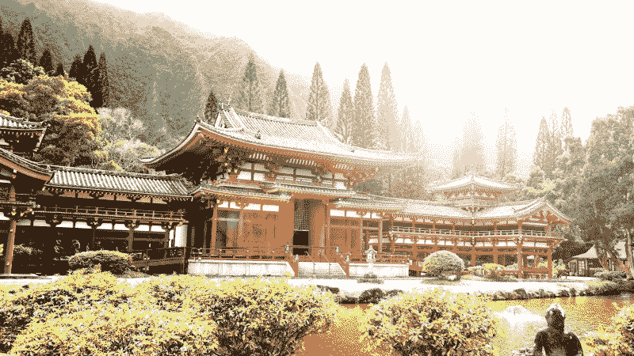

# 如何像云大师一样训练

> 原文：<https://www.freecodecamp.org/news/train-like-an-aws-certified-cloud-ninja-534f1770eba2/>

> *“先用头脑看，再用眼睛看，最后用身体看。”—柳生宗矩*

在我经历大规模企业云采用流程的过程中，我发现大规模迁移的最大障碍不是工程挑战，而是缺乏具备云相关技能的开发人员。

云已经成为主流，大公司正在争夺训练有素的开发人员。云计算技能对现代软件商店至关重要。

这篇文章将向你展示*一个云宗师的道路，*以及通往觉悟的道路。你获得这些抢手技能的旅程从*每个人*开始的地方开始——作为训练中的白带。

### 白腰带

> 白色的带子象征着种子的诞生，因为它在冬天躺在雪下。

云计算简介对于渴望知识和寻找“什么是云计算？”答案的学生来说是一个很好的地方。

这个免费的课程充满了优秀的材料，让你朝着正确的方向前进。简介将引导您了解云计算的基础知识，并探索一些有助于揭开云神秘面纱的术语。

### 黄色腰带

> 黄色的带子象征着照射在种子上的第一缕阳光，给了它新的力量。

探索 AWS 服务将有助于黄带学员获得第一缕知识并开阔思路。免费的 [AWS 技术要点](https://acloud.guru/learn/aws-technical-essentials)课程教授你需要知道的关于 AWS“如何”和“为什么”的一切。

这对初学者来说非常好——不需要 AWS 或编程经验。1 小时的课程将引导您了解云计算的基础知识，直到您对 AWS 概念和术语更加自信。

### 橙色腰带

> 橙色带代表太阳不断增长的力量，因为它温暖了地球，为新的增长做准备。

随着橙带学员开始感受到身心的开放和发展，你应该注册一个 [AWS 免费等级](https://aws.amazon.com/free/)账户。一旦你注册并创建了 AWS 账户，你就可以在一定的使用限制内免费使用任何 AWS 服务*。*

免费层提供 AWS 服务的实践经验，没有实验室环境的安全网或指导。考虑应用从实验室培训中学到的知识，创建自己的个人网站或使用多种服务的 Alexa 技能。

### 城市绿化带

> 绿带象征着种子的成长，因为它从地球上发芽，伸向太阳。

为了建立强大的根基和坚实的基础，绿带学生应该寻找机会应用他们早期的知识。一个有趣而简单的方法是通过使用你的自由层帐户来创建一个基本的 Alexa 技能。

[**为什么学习编写 Alexa 技能是获得云计算工作的途径**](https://medium.freecodecamp.org/why-learning-to-code-alexa-skills-is-the-gateway-to-a-cloud-computing-job-fa13c1c0c853)
[*经济正在发生根本性的转变。社会正从基于商品的资本转向知识资本……*medium.freecodecamp.org](https://medium.freecodecamp.org/why-learning-to-code-alexa-skills-is-the-gateway-to-a-cloud-computing-job-fa13c1c0c853)

免费的 Alexa 简介培训系列旨在帮助任何人学习如何设计和编程 Alexa 技能。

你不仅会学到创建 Alexa 技能的基础，还会学到使用 Node 的基础。JS 和基本的 Amazon Web Services (AWS)服务，如 Lambda、DynamoDB 和简单存储服务(S3)。

### 蓝色绶带

> 随着植物继续向上生长，蓝带象征着蓝天。就像植物长得更高一样，随着知识和经验的增长，蓝带学生的排名也会上升。

对于有兴趣增长云知识的学生来说，助理级 [AWS 认证解决方案架构师](https://acloud.guru/learn/aws-certified-solutions-architect-associate)是连续两年排名第一的云认证。云架构师认证培训面向任何想要学习 Amazon Web Services (AWS)主要组件的人。

鉴于 AWS 提供新功能和服务的速度很快，讲师必须是主题专家，并保持他们的内容是最新的。Ryan Kroonenburg 提供的认证培训反映了他作为 AWS 社区英雄的专业知识以及向他人传授云计算知识的热情。

### 紫色腰带

> 紫色带代表黎明时变化的天空。随着学生向高级水平过渡，紫带开始理解黑带的含义。

在安排认证考试之前， [AWS 白皮书](http://aws.amazon.com/whitepapers)和 [AWS 常见问题解答](http://aws.amazon.com/faqs)为紫带学员提供了填写细节和巩固知识的机会。

“必读”白皮书包括:

*   [AWS 云最佳实践的架构设计](http://d0.awsstatic.com/whitepapers/AWS_Cloud_Best_Practices.pdf)
*   [AWS 架构良好的框架](https://d0.awsstatic.com/whitepapers/architecture/AWS_Well-Architected_Framework.pdf)
*   [AWS 安全最佳实践](https://d0.awsstatic.com/whitepapers/Security/AWS_Security_Best_Practices.pdf)
*   [AWS 存储服务概述](http://d0.awsstatic.com/whitepapers/AWS%20Storage%20Services%20Whitepaper-v9.pdf)

### 褐腰带

> 棕色带代表种子成熟。棕带是技术开始成熟的高材生。

为了更全面地了解云计算，棕带学生理解探索整个服务生态系统的重要性。

对于那些寻求拓展他们不断变化的视野的人来说，[一位云计算专家](https://acloud.guru/courses)提供了一系列关于各种云计算服务的课程。AWS 不断改进他们的平台，每年发布 1000 多种产品。

为了保持最新，深入探索 AWS 服务，如 CloudFormation、DynamoDB、S3、应用程序负载平衡器、成本控制、安全性和代码部署。

你可以通过收听每周五分钟一集的 [AWS This Week](https://acloud.guru/series/aws-this-week) 轻松跟上最新的发布。

[**AWS 本周头条**](https://acloud.guru/aws-this-week)
[*注册独家访问 AWS 本周所有视频，发送到您的收件箱。它是免费的。acloud . guru*](https://acloud.guru/aws-this-week)

### 红带

> 红带象征着植物继续茁壮成长时炽热的太阳。红色是危险的标志，红带随着知识和能力开始变得危险。

通过 AWS 认证考试后，云专家有义务与社区中的其他人分享学习成果。当云大师们“向前支付”时，他们的学生在队伍中茁壮成长。

加入你所在地区的 AWS 用户组,解释和探索新兴趋势，同时寻找机会指导当地社区的其他人。

### 黑腰带

> 黑带象征着太阳之外的黑暗，因为学生寻求更深刻的知识。当学生开始教别人的时候，新的种子就被种下成长和成熟。

在这个启蒙阶段，云大师不断渴望新知识。探索其他云提供商的免费介绍，包括[微软 Azure](https://acloud.guru/learn/intro-to-azure) 和[谷歌云平台](https://acloud.guru/learn/gcp-101)——开始学习[如何在云中编码](https://acloud.guru/learn/coding-for-cloud-101)永远都不晚！

一位云专家还支持一份来源于社区的出版物，里面有来自工程师和行业领导者的文章。这是云见解的另一个免费来源——有许多实践教程和有趣的项目。

云大师的旅程是一个永无止境的自我成长、知识和启迪的过程。既然你已经知道了开悟之路，今天就迈出你的第一步吧。

### 关于作者

我帮助人才向云迁移。在 Twitter 上关注我 [@drewfirment](https://twitter.com/drewfirment) 。