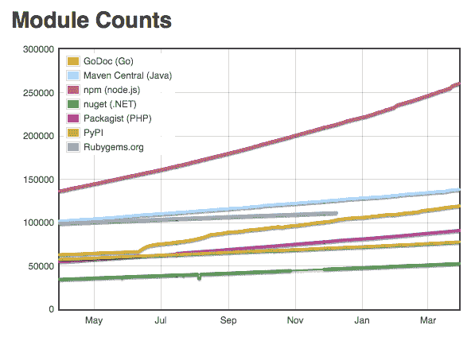

# 为超模块化 JavaScript 辩护

> 原文：<https://www.freecodecamp.org/news/in-defense-of-hyper-modular-javascript-33934c79e113/>

作者:迈克·格罗塞斯

# 为超模块化 JavaScript 辩护

上周，npmgate 是 JavaScript 社区的一个大话题。对于那些没有关注发生了什么的人，这里是 TL；博士:

一家名为 Kik 的公司要求[Azer kou Lu](https://www.freecodecamp.org/news/in-defense-of-hyper-modular-javascript-33934c79e113/undefined)给他们 npm 上的 *kik* 项目名称。阿泽说没有(因为他已经在用了)。Kik 又问了一遍，这次威胁要让律师介入商标侵权。Azer 强有力地说不，Kik 升级为 npm。npm 站在 Kik 一边，把模块的所有权从 Azer 那里拿走了。作为回应，Azer 写道[我刚刚解放了我的模块](https://medium.com/@azerbike/i-ve-just-liberated-my-modules-9045c06be67c#.qcyr9y1u3)，并从 npm 移除了他的所有包。他拆的其中一个包是 [*左垫*](https://github.com/azer/left-pad) *。*

从 npm 中移除*左填充*实质上破坏了任何使用它作为依赖项的项目的安装过程。这一点的影响是巨大的，因为它被大量非常受欢迎的项目(Babel、Atom 和 React 等)所使用。

网络火了？。

所有这些都引起了一些问题，其中大部分可以归类如下:

1.  这是商标侵权吗？一个法律问题。
2.  npm 应该站在 Kik 一边吗？一个商业问题。
3.  如果一个模块依赖于另一个模块，你应该能够取消发布它吗？一个技术问题。
4.  npm 模块应该是可变的吗？一个技术问题。
5.  社区应该一开始就使用像 left-pad 这样的模块作为依赖吗？一场更大的讨论。

npm 和他们的法律团队将是最终需要解决业务和法律问题的人(上面的第 1 和第 2 点)。将由他们来决定这是否真的是商标侵权，以及对此类请求的政策将如何发展。

对于上面的#3(取消发布一个依赖于另一个已发布模块的模块的能力), npm 做出了以下声明:

> npm 需要安全措施来防止任何人造成如此大的破坏。如果这些东西昨天就放好了，这次验尸就没有必要了。

> - @izs from [kik、left-pad 和 npm](http://blog.npmjs.org/post/141577284765/kik-left-pad-and-npm)

虽然 [npm-shrinkwrap](https://docs.npmjs.com/cli/shrinkwrap) 可以帮助解决一些可变性问题(#4)，但我所见过的唯一真正的缓解方法是将您的依赖项与您发布的包捆绑在一起。 [Rich Harris](https://www.freecodecamp.org/news/in-defense-of-hyper-modular-javascript-33934c79e113/undefined) 在他的文章[中解释了这一点:如何用这一个怪异的技巧](https://medium.com/@Rich_Harris/how-to-not-break-the-internet-with-this-one-weird-trick-e3e2d57fee28#.12cx6pe8z)不破坏互联网。

这让我们想到了第六点，这篇文章存在的原因:

#### 社区应该一开始就使用像 left-pad 这样的模块作为依赖吗？

为了理解为什么这甚至是一场辩论，我们应该首先理解 *left-pad* 。给定一个字符串(str)、长度(len)和字符(ch)，*左填充*将用 *ch* 填充 *str* 的左侧，直到字符串长度等于 *len* 。

以下是驱动*左键盘*的完整代码:

互联网爆炸背后的 17 行代码(221 个字符)的想法在 JavaScript 社区内引起了很多关于使用超模块化包的抱怨。

就这样，(终于)我开始了。

#### npmgate 与左键盘模块的大小无关

*左边的尺寸*是一个转移注意力的东西。它包含多少行代码与讨论它从 npm 生态系统中的移除如何破坏其他包完全无关。可能是从生态系统中移除任何包装导致了这种情况。

阿泽在逃离国家预防机制期间拆除了 272 个模块。可以肯定地说， *left-pad* 是由一个已经在社区中立足的开发者编写的。

那些认为拥有像 *left-pad* 这样的依赖关系会给他们的项目增加风险的人实际上是在反对在他们的项目中拥有**任何**外部 npm 依赖关系。

#### 是的，我们都可以从头开始编写像 left-pad 这样的模块

但是我们为什么要这么做呢？

创建像 [jQuery](https://jquery.com/) 和 [lodash](https://lodash.com/docs) 这样的实用程序库的全部原因是为了让开发者体验更好。

当然，*左键盘*后面的代码并不复杂，我们任何人都可以在几分钟内重写它。有些人甚至喜欢绕道而行。也就是说，从编写解决问题的代码到编写操作字符串的方法的上下文切换似乎是对时间和精力的浪费。记住，我们能做一些事情并不意味着我们应该做。

每天我们都应该让自己关注比前一天更大更好的问题。

#### 社区

source [http://www.modulecounts.com/](http://www.modulecounts.com/)

在增长方面，npm 的表现优于所有其他包装经理是有原因的。通过向 npm 发布包来参与的障碍非常小。

让更多的开发者参与到这个过程中来，不管贡献大小，只会让社区变得更强大。

#### 自由市场 JavaScript

标准可能永远无法跟上 JavaScript 社区发展的势头和速度。这是可以的。在这个自由市场 JavaScript 的新世界中，希望最好的模块能够胜出。好的模块应该随着它们获得更多的下载和社区参与而增长，而没有被使用或支持的模块将慢慢消失在虚拟的深渊中。事实上，在某些情况下，比如蓝鸟，社区库的表现会超过标准库(参见[为什么本地 ES6 promises 比蓝鸟慢并且占用更多内存？](http://programmers.stackexchange.com/questions/278778/why-are-native-es6-promises-slower-and-more-memory-intensive-than-bluebird))

那么，对于所有这些模块，您如何知道哪些模块可以安全使用呢？事实是，就像任何开源软件一样，你永远无法确定。但是在我的项目中包含任何来自 npm 的东西时，我会使用以下石蕊测试:

1.  包装是否有文件证明？
2.  它有测试吗？
3.  有人在用吗？
4.  社区对此有意见吗(通常这仅适用于较大的模块)？

#### 这不是大小的问题，而是功能的问题

我们的生态系统的美妙之处在于，模块化开发封装了责任，并迫使关注点分离。模块的大小应该与讨论无关，而功能才是关键。

任何好的超模块包的优点是它将有一个定义良好的接口，清晰的文档，和良好的测试。难道我们不希望我们所有的代码都由这样的模块组成吗？

#### 模块是关于可组合性的

> 把节点模块想象成乐高积木。你不一定关心它是如何制作的细节。你只需要知道如何使用乐高积木来建造你的乐高城堡。— [来自](https://www.freecodecamp.org/news/in-defense-of-hyper-modular-javascript-33934c79e113/undefined) [AMA 的辛德雷·索胡斯](https://github.com/sindresorhus/ama/issues/10#issuecomment-117766328)第 10 位

说到底，这都是作文。所以，让我们继续构建模块，让我们用那些模块来构建其他模块，用那些模块来构建系统。让我们将这些系统组合在一起，开始构建以前从未做过的东西。

最后一点:我应该清楚，我并不是说**所有的东西**都应该是一个微小的模块。如果有的话，我希望在社区中看到更多大型的固执己见的图书馆。但与此同时，我们应该记住，现在被抱怨的一些事情正是让 JavaScript 社区如此伟大的那些事情。

谢了。