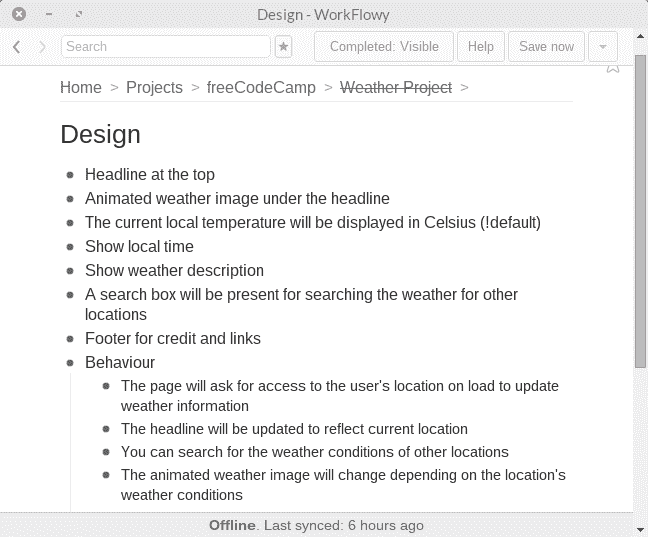
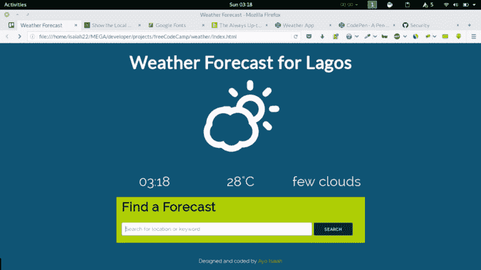

# 构建天气应用程序

> 原文：<https://www.freecodecamp.org/news/building-a-weather-app-a3cec42b11fa/>

作者 Ayo Isaiah

# 使用地理定位和 API 构建天气应用程序


上周，我处理了自由代码营的[显示当地天气](https://www.freecodecamp.com/challenges/show-the-local-weather)项目，该项目包括构建一个应用程序，显示用户碰巧所在位置的天气。

我必须实现以下用户故事:

*   用户可以查看他/她当前位置的天气。
*   用户可以切换温度单位(摄氏度或华氏度)。
*   天气图标或背景图像将根据天气情况而变化。

我决定进一步增加一个用户故事

*   用户可以搜索其他地方的天气信息。

#### 设计

我对这个应用程序的设计有很多想法，我也从社区中看了一些完成的项目(当然，没有检查他们的代码),看看其他人在他们的应用程序中显示了什么，看起来怎么样。

想出一个最终的布局有点棘手，但我发现它有助于决定我想要向用户显示的元素，并以此为基础进行构建。

保持事情简单是这里的目标。我决定除了当地时间之外，只显示温度和天气描述。

我也喜欢在[示例项目](http://codepen.io/FreeCodeCamp/full/bELRjV)中的动画天气图标，并认为这比背景图像更好地代表了当前的天气，所以我想在我的应用程序中实现它。

像往常一样，我把所有的事情都放在我的工作流程中。



除了找到一个合适的动画图标集，设置一切都很简单。我不得不搜索了一下，才找到了我最终使用的 Skycons。

另一件让我纠结的事情是为应用程序找到一个好的配色方案，这是我几乎一直在纠结的事情。在最终产品落地之前，我尝试了不同的组合。



#### 逻辑

在查看了来自 [Open Weather](http://openweathermap.org/current#geo) 的示例 API 响应后，我认为我需要获取用户的经度和纬度，以便能够在页面加载时提供天气信息。

最简单的方法是使用 HTML5 地理定位 API，这非常简单，在课程的 JSON 和 API 部分已经介绍过了。

我将返回值存储在已经声明的变量中，并使用它们来发出 AJAX 请求。

```
if (navigator.geolocation) {
```

```
 //Return the user's longitude and latitude on page load using HTML5 geolocation API
```

```
 window.onload = function () {    var currentPosition;    function getCurrentLocation (position) {        currentPosition = position;        latitude = currentPosition.coords.latitude;        longitude = currentPosition.coords.longitude;
```

```
 //AJAX request
```

```
 $.getJSON("http://api.openweathermap.org/data/2.5/weather?lat=" + latitude + "&lon=" + longitude + "&APPID=******************", function (data) {            var rawJson = JSON.stringify(data);            var json = JSON.parse(rawJson);            updateWeather(json); //Update Weather parameters        });    }
```

```
 navigator.geolocation.getCurrentPosition(getCurrentLocation);
```

```
 };
```

开放天气 API 给了我一种更新位置、温度和天气描述的方法，但我仍然需要找到一种更新当地时间的方法。经过一番搜索，我在 Geonames.org 找到了另一个 API 来解决这个问题。

```
$.getJSON('http://api.geonames.org/timezoneJSON?lat=' + latitude + '&lng=' + longitude + '&username=ayoisaiah', function(timezone) {            var rawTimeZone = JSON.stringify(timezone);            var parsedTimeZone = JSON.parse(rawTimeZone);            var dateTime = parsedTimeZone.time;            timeFull = dateTime.substr(11);            $(".local-time").html(timeFull); //Update local time            timeHour = dateTime.substr(-5, 2);    });
```

我做的最后一件事是更新用户所在位置或感兴趣城市的天气图标。我认为一个好方法是检查天气描述，然后根据天气改变图标。

因此，我考虑了一些可能的场景，如晴朗的天空、云、雪、晴天、下雨等，并编写了一系列条件语句来检查天气描述是否包含关键字之一，然后更新天气图标。

```
//Update Weather animation based on the returned weather description
```

```
 var weather = json.weather[0].description;
```

```
 if(weather.indexOf("rain") >= 0) {        skycons.set("animated-icon", Skycons.RAIN);    }
```

```
 else if (weather.indexOf("sunny") >= 0) {        skycons.set("animated-icon", Skycons.CLEAR_DAY);    }
```

通过各种测试，我发现这种方法并不是 100%万无一失的，但它足够让我坚持下去。

你可以在 [Codepen](http://codepen.io/ayoisaiah/full/LNLzgx/) 上查看全部代码和效果。

#### 关键外卖

我从这个项目中得到的主要收获是，我学会了如何从 API 响应中访问返回的 JSON 数据的每一部分，并以不同的方式使用它。虽然我的方法需要一些改进，但通过更多的实践，它一定会变得更好。

#### 下一步是什么…

我的下一个项目是[维基百科浏览器应用](https://www.freecodecamp.com/challenges/build-a-wikipedia-viewer)。当我写这篇文章的时候，我已经完成了一半，所以最迟应该在周四完成。

如果你想和我联系，你可以在[推特](https://twitter.com/ayisaiah)或[电子邮件](mailto:ayisaiah@gmail.com)上找到我。感谢阅读。