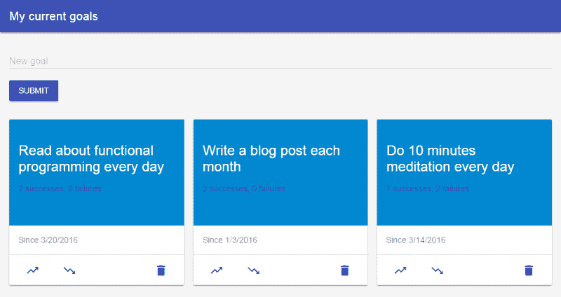
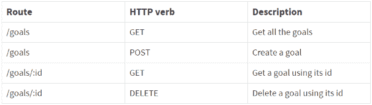

# 在 Android 上构建 Node.js 应用程序

> 原文：<https://www.freecodecamp.org/news/building-a-node-js-application-on-android-part-2-express-and-nedb-ced04caea7bb/>

由 aurélien giraud

# 在 Android 上构建 Node.js 应用程序

#### 第 2 部分:Express 和 NeDB


在第 1 部分中，我们看到了如何使用 Termux，一个终端仿真器和 Android 的 Linux 环境。我们还用 Vim 编辑了文件，并了解了如何运行 Node。我们现在将使用 Express 框架构建一个小节点应用程序，并将 NeDB 用于数据库。

### 这个故事，以及谁能从中受益

当我发现我可以在我的 Android 平板电脑上用类似 Mongo 的数据库构建一个完整的 Node.js 应用程序时，我非常兴奋。所以我决定试一试，分享一下我的经验。

事实证明，一旦 Termux 在 Android 上运行并且安装了 Node，我们在 Android 而不是 Linux 上的事实并没有太大的区别。事实上，所有特定于 Termux 的设置都在第 1 部分中完成了，欢迎您在自己喜欢的设备/计算机/云 IDE 上编写代码…

这也意味着，除了我们用 Mongo 代替 NeDB 之外，这篇文章就像是构建 RESTful API 的一般介绍，主要面向对 Node、Express 和 Mongo/NeDB 相当陌生的人。

### 我们要做什么



A basic recurrent goals tracker

为了演示如何开始使用 Express web 框架和 NeDB 数据库，让我们来看一个我为自己构建的基本目标跟踪器。现阶段看起来如上图所示。

用户可以:

*   提交新目标
*   删除目标
*   记录目标的成功
*   记录目标的失败

实际上，在这篇文章中我们只打算实现前两个功能，如果你对剩下的两个功能感兴趣，我会在最后提供一个完整实现代码的链接。

因此，不需要记录成功和失败，我们的代码看起来会简单一些:


以下是我们将要经历的步骤:

1.  用 **Express 设置服务器。**
2.  描述几个**用户故事。**
3.  设置 **NeDB** 。
4.  构建一个 RESTful API 。

### 先决条件

我们将从第 1 部分停止的地方开始。因此，唯一的要求是安装节点。

### 1.使用 Express 设置服务器

[Express](http://expressjs.com/) 是一个用于 Node 的 web 框架，帮助构建节点应用程序。如果你不明白 Express 给 Node 带来了什么，我建议你看看埃文·哈恩的文章[了解 Express](http://evanhahn.com/understanding-express/) 。

让我们开始一个新项目:

```
$ mkdir goals-tracker && cd goals-tracker$ npm init$ touch server.js
```

并安装 Express:

```
npm install express --save
```

我们将使用 Express 来定义路由*、*，即定义应用程序端点(URIs)并设置应用程序如何响应客户端请求。

打开 *server.js* ，复制-粘贴/写入:

准备就绪后，您就可以启动应用程序了:

```
$ node server.js
```

这应该会将服务器正在监听的端口号打印到控制台。如果您在浏览器中访问[**http://localhost:8080**](http://localhost:8080)(假设 8080 是打印到控制台的号码)，您应该在页面上看到:*我们的第一条路线正在工作。:)*

#### 一些解释

**app.get( … )** 中的 **'/'** 定义了我们想要从服务器附加一些行为的路径。使用'/'指的是基本 URI，在我们的例子中: [http://localhost:8080](http://localhost:8080/goals) 。注意，如果我们使用 **app.get('/goals '，…)** 并访问[http://localhost:8080/goals](http://localhost:8080/goals)，我们将在浏览器窗口中获得相同的结果。

**app.get( … )** 中的第二个参数是一个[回调](http://javascriptissexy.com/understand-javascript-callback-functions-and-use-them/)函数，它使我们能够定义当作为第一个参数给出的路由被访问时，服务器应该做什么。在此功能中:

*   **req** 代表**请求:**这是服务器从客户端接收到的信息(例如，这可能来自使用网站/应用程序前端部分的人)。
*   **res** 代表**响应:**这是服务器返回给用户的信息。这可以是网页，也可以是其他数据，比如图像、JSON 或 XML。

#### Nodemon

在本教程的下一部分，我们将对文件 *server.js* 进行多处修改。为了避免每次手动重启服务器才能看到结果，我们可以安装 [**nodemon**](http://nodemon.io/) 。

Nodemon 是一个实用程序，它将监视代码中的变化，并自动重启服务器。我们将使用标签 *save-dev:* 将它安装为一个开发依赖项

```
npm install nodemon --save-dev
```

现在，您可以使用 *nodemon* 命令而不是*节点*来重启服务器:

```
nodemon server.js
```

### 2.用户故事

在我们进入有关 NeDB 的部分之前，让我们暂停一下，思考一下业务逻辑。为了了解我们需要实现什么，我们从定义几个用户场景开始。

一个[用户故事](https://en.wikipedia.org/wiki/User_story)是一个需求的非常高层次的定义。用户故事对于用非技术术语与客户讨论产品、估计一个特性的实现需要多少时间和精力、指导应用程序的整体开发以及进行[测试驱动开发](https://en.wikipedia.org/wiki/Test-driven_development)非常有用。

以下是我们将要使用的 4 个用户案例:

1.  作为用户，我可以保存新目标及其创建日期。
2.  作为用户，我可以访问所有已保存的目标。
3.  作为用户，我可以访问目标的全部信息。
4.  作为用户，我可以删除目标。

在我们的例子中，故事与我们将在第 4 部分讨论的 4 个 CRUD 操作一一对应。

### 3.使用 NeDB

NeDB 易于安装，有良好的文档记录，并且使用 MongoDB 的 API，这使得它非常适合在 Android 上开发 Node.js 应用程序。如果需要的话，甚至还有一个[工具](https://github.com/louischatriot/nedb-to-mongodb)来帮助你以后切换到 MongoDB(虽然我还没有试过)。

因此，让我们将 NeDB 添加到项目中:

```
$ npm install nedb --save
```

在 *server.js* 中添加几行代码来设置数据库，并确保我们可以保存到其中:

一个**数据存储库**指的是在 Mongo 中被称为集合的东西。如果我们需要几个集合，我们可以创建多个数据存储。如 NeDB 的文档所示，每个集合将保存在一个单独的文件中。这里，我们选择将目标集合存储在一个名为 *goals.db.* 的文件中

#### 检查它是否工作

如果服务器是用 *nodemon* 更早启动的，那么它应该在 *server.js* 中的更改被保存后更新。这意味着 *db.insert(…)* 应该已经运行，目标应该已经记录到控制台:

```
$ nodemon server.js[nodemon] 1.9.1[nodemon] to restart at any time, enter `rs`[nodemon] watching: *.*[nodemon] starting `node server.js`Listening on port 8080[nodemon] restarting due to changes...[nodemon] starting `node server.js`Listening on port 8080{ description: 'Do 10 minutes meditation every day', successes: [], failures: [], _id: 'ScfixKjsOqz9xBo5', createdAt: Fri Mar 18 2016 22:10:58 GMT+0000 (UTC), updatedAt: Fri Mar 18 2016 22:10:58 GMT+0000 (UTC) }
```

还应该创建了一个名为 *goals.db* 的新文件。

```
$ ls goals.db  node_modules/  package.json  server.js
```

它应该包含刚刚保存的目标。

```
$ less goals.db{"description":"Do 10 minutes meditation every day","_id":"ScfixKjsOqz9xBo5","createdAt":{"$$date":1458339058282},"updatedAt":{"$$date":1458339058282}}
```

请注意，字段 ***_id*** 、 ***createdAt*** 和 ***updatedAt*** 已经由 NeDB 自动填充，因为我们在设置数据存储时将选项***timestamp data***设置为 *true。*

### 4.构建 RESTful API

接下来，让我们为应用程序构建一个 RESTful API。简而言之，这意味着我们想要使用 **HTTP 动词**和 URIs，以便允许客户端执行 [**CRUD**](http://en.wikipedia.org/wiki/Create,_read,_update_and_delete) 操作(创建、读取、更新和删除)。这些操作通常还会将数据发送回客户端。

用 CRUD 术语来说，我们可以:

*   **用**岗位**创建**数据，
*   **用**获取**读取**数据，
*   **更新**数据用 [**贴**或**贴**](http://williamdurand.fr/2014/02/14/please-do-not-patch-like-an-idiot/) ，
*   **用**删除**删除**数据。

在这篇文章中，我们将使用的 HTTP 动词是 post、GET 和 DELETE。

#### 我们的 API

下表显示了我们将要设置的路由、如何访问这些路由(即使用哪个 HTTP 动词)以及每条路由可能实现的功能:



如果你想了解更多关于 RESTful APIs 的知识，你可以看看马蒂亚斯·汉森的 [*设计 RESTful Web API*](https://scotch.io/bar-talk/designing-a-restful-web-api) 或者使用 HTTP 方法为 RESTful 服务 的[。](http://www.restapitutorial.com/lessons/httpmethods.html)

#### 测试 API

我们将使用 [curl](https://github.com/curl/curl) 在终端中手动测试 API。如果你不在 Android 上，而是想使用 GUI 来测试 API，你可以使用[邮递员](https://www.getpostman.com/)。

让我们看看如何使用 curl 的第一个例子。确保服务器正在运行，打开另一个终端(在 Termux 中从左边界向右滑动并点击*新会话*)并键入:

```
$ curl -X GET "http://localhost:8080"
```

这应该会将我们之前在浏览器窗口中得到的内容打印到控制台，即:*我们的第一条路由正在工作。:)*

我们现在将一点一点地向 *server.js* 添加代码。如果你想先看“大”图，你可以去[最终的 server.js 文件](https://gist.github.com/aurerua/6679d82cc9939247ffa7)。

#### 正文分析器

为了处理服务器收到的请求，我们将安装[主体解析器](https://github.com/expressjs/body-parser)。它处理传入的请求，使我们更容易访问相关的部分。

```
npm install body-parser --save
```

将主体解析器设置代码添加到 *server.js* 的顶部(例如，紧接在端口号设置之后):

#### 获得所有目标

如果服务器在***/目标*** 收到 **GET** 请求，将执行回调，并使用 ***db.find({})*** 查询数据库。这里传递给 *find()* 的对象是空的。这意味着没有对我们正在寻找的对象设置任何约束，并且应该返回数据库中的所有对象。

还要注意，没有为 *find()* 指定回调。这样就返回了一个 Cursor 对象，在我们使用***【exec(回调)*** 完成查询之前，可以先用 **sort** 、 **skip** 或 **limit** 进行修改。这里，我们使用**排序**来返回目标，最近更新的目标在顶部(即，最后更新日期“更早”的目标)。

如果一切顺利，查询结果(在我们的例子中是一个目标数组)会以 JSON 格式发送回客户机。如果出现问题并产生错误，错误消息将被发送回客户端。

让我们测试一下它是否有效:

```
$ curl -X GET "http://localhost:8080/goals/"
```

这应该会在控制台上打印出一个数组，其中包含我们之前保存到数据库中的目标。

#### 创建目标

***req.body*** 包含在请求体中提交的数据的键值对。默认情况下，它是未定义的，由 [*主体解析器*](https://www.npmjs.org/package/body-parser) 中间件填充。在我们的例子中，请求应该包含一个键-值对，它的键被命名为' *description'* ，它的值通过使用***req . body . description***来检索。

因此，首先，我们要插入数据库的目标是使用 *req.body.description* 从请求构建的。然后可以将其插入数据库，如果没有错误，响应将作为 JSON 发送回服务器。

现在让我们尝试使用 curl 发布一个新目标:

```
$ curl -X POST -H "Content-Type: application/x-www-form-urlencoded" -d "description=Read about functional programming every day" "http://localhost:8080/goals/"
```

这应该打印出已经发送回客户机的目标的 JSON 表示。

我们将数据发布为 *x-www-form-urlencoded* 。这将数据作为查询字符串发送，由*主体解析器*解析。

#### 使用 id 获取目标

***req.params*** 是包含映射到路线“参数”的属性的对象。在这里，它使我们能够访问目标 id 的值，该值应该位于请求中 URL 的 */goals/* 之后。要做到这一点，我们必须在 URI 中，在我们希望用 *req.params* 访问的属性前面使用一个冒号。

除了我们使用 *findOne(…)* 而不是 *find(…)* 之外，这里没有什么新的东西。所以我们来测试一下。为此，您可以检查在我们使用 POST 保存一个新目标并使用其 *"_id"* 值后打印到控制台的内容。以下是我的命令和我得到的 id:

```
$ curl -X GET "http://localhost:8080/goals/JJtcFVQnoAxW7KXc"
```

这应该将带有给定 id 的目标打印到控制台。

#### 使用目标 id 删除目标

我们使用 *remove(…)* 从数据库中删除一个目标。如果删除成功，则发送带有 HTTP 状态代码 200 的响应( [200 表示删除成功](http://www.restapitutorial.com/lessons/httpmethods.html))。

### 包装它

我们用 Express 和 NeDB 搭建了一个服务器，构建了一个 REST API。我们仍然缺少的是一个前端和一点布线。

下一步可能会带我们走很多不同的路:我们会选择模板引擎吗？如果是，会选择哪一个？Bootstrap 还是类似的框架？有棱角的，有反应的，奥雷利亚？这个清单还在继续。

如果你想看看前端的最小实现——也许可以在你的浏览器中玩玩——你可以通过访问 GitHub 上的 repo[或通过克隆它来查看我一直在使用](https://github.com/aurerua/goals-tracker.git)[手柄](http://handlebarsjs.com/)、[材料设计精简版](https://www.getmdl.io/)和[获取 API](https://developers.google.com/web/updates/2015/03/introduction-to-fetch)实现的一个可能的解决方案的代码:

```
$ git clone --branch rest-and-view https://github.com/aurerua/goals-tracker.git --depth 1
```

#### 更进一步

我们构建的后端仍然提出了一个问题:为了更好的模块化和可维护性，应该如何将代码分割到不同的文件和文件夹中？

如果你好奇的话，我还写了另一个版本的应用程序，它使用了模型-视图-控制器的文件夹结构。请随意看一看:

```
$ git clone https://github.com/aurerua/goals-tracker-mvc.git
```

如果您有任何问题或反馈，请随时联系我！