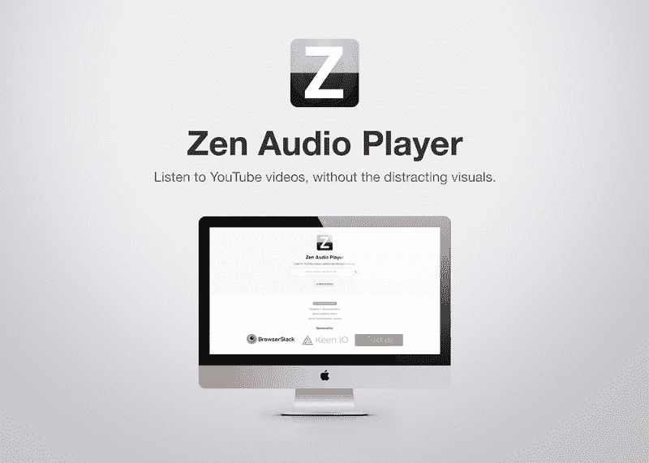
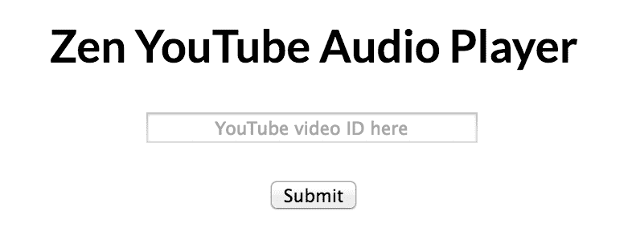

# 对 Zen 音频播放器一年的反思

> 原文：<https://www.freecodecamp.org/news/reflecting-on-1-year-of-zen-audio-player-57ee759365ee/>

作者:沙克尔·穆罕默德

# 对 Zen 音频播放器一年的反思

今天是我在 GitHub 上第一次提交 Zen 音频播放器(ZAP)项目的一周年纪念日！在阅读了 [Robby Russell 关于 Oh my Zsh](https://medium.com/@robbyrussell/d-oh-my-zsh-af99ca54212c) 的帖子后，我意识到 ZAP 在第二年有很大的潜力。在过去的一年里，这个项目以我从未想象过的方式发展。到目前为止，我们已经有了 20 个贡献者，大多数是在过去的 4 个月里！

A current render of the website, made by [Yuri Brunetto](https://github.com/YuriBrunetto).

### 发展的简要时间表

#### 出生

去年，我有一个非常简单的想法:在 YouTube 视频上隐藏视频播放器，只听音频。我认为这是一件相当容易做到的事情，事实也的确如此。在拖延我的[高级项目](https://medium.com/@_shakeel/hacker-s-first-logo-designing-in-powerpoint-7eeeb6925097)的时候，我在几个工作日的晚上拼凑了一个网站的工作版本。我的“创新”是将 YouTube 播放器的高度设置得足够小，这样就只能看到控件。

This was the entire website: 1 heading, 1 text box, 1 button.

有几个月生活很美好。我在工作的时候听着[渐进恍惚混合](https://www.youtube.com/results?search_query=progressive+trance)，没有因为这些视频中大多数的 NSFW 缩略图/幻灯片而感到尴尬。在晚上和周末的空闲时间，我开始添加一些功能。突然有一天，YouTube 重新设计了他们的视频播放器。

#### iFrame API

为了解决 YouTube 新的不受欢迎的 UI (自动隐藏播放器控件)，需要大量的 JavaScript 来以我们想要的方式操作 YouTube iFrame API。我们为使用 YouTube 的 iFrame API(而不是直接的 HTML 嵌入)所做的更改今天仍然存在于 ZAP 中。我们[目前正在用](https://github.com/zen-audio-player/zen-audio-player.github.io/pull/153) [Plyr](https://plyr.io/) 替换大部分代码。Sam Potts 在为我们实现功能方面帮了我们很大的忙，我们希望继续与他合作。

#### 投稿人！

10 月的一天，ZAP 突然收到了我们的第一个投稿人[来自](https://github.com/zen-audio-player/zen-audio-player.github.io/pull/40)[马特·斯坦内特](https://github.com/BeigeBadger)的拉稿请求！在马特之前，回购实际上是在我的个人 GitHub 账户上。过了一段时间，我把回购转给了 [ZAP GitHub 组织](https://github.com/zen-audio-player)。和他一起做一些改变激励我花更多的时间在 ZAP 上。他最初的参与激励我在[上发布这个项目以供竞拍](http://up-for-grabs.net/)，导致比预期更多的贡献。

#### 新功能

一些功能仅仅由 ZAP 的贡献者实现，这仍然让我感到惊讶。其中一些是:

*   呈现 YouTube 视频的描述(带有适当的超链接)
*   带有自动补全功能的 YouTube 搜索
*   显示搜索结果，在不离开 ZAP 网站的情况下播放该视频的音频

### 工具

GitHub 在推广开源项目的免费工具方面做得非常好。以下工具非常有用，并将在未来继续让 ZAP 受益:

*   GitHub 页面——没有什么比免费托管我们的静态网站更好的了！
*   [Gitter](https://gitter.im/zen-audio-player/zen-audio-player.github.io) —我们棒极了的聊天室，集成了我们的其他服务
*   特拉维斯·西(Travis CI)——总得有人来做测试
*   代码环境——一个伟大的自动化代码质量分析服务
*   [TrackJS](https://trackjs.com/) —用于跟踪&报告用户 JavaScript 错误
*   [谷歌分析](http://www.google.com/analytics/) / [Keen。IO](https://keen.io/)——这样我们就可以知道用户是如何使用网站的

### 谢谢

我非常感谢到目前为止的贡献者，我期待着在未来与更多的人合作。
我要特别感谢以下个人:

*   马特·斯坦内特——第一个贡献者，如果没有他，我可能几个月前就放弃这个项目了！
*   [**伊恩·斯宾塞**](https://github.com/ecnepsnai)——他买了域名！ [ZenPlayer.audio](https://zenplayer.audio/)
*   [**Monica Cheung**](https://github.com/monicacheung)——她是目前为止为这个项目贡献最多代码的人，并且加入了最棒的功能:YouTube 搜索！