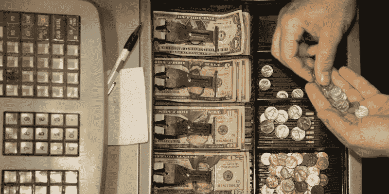
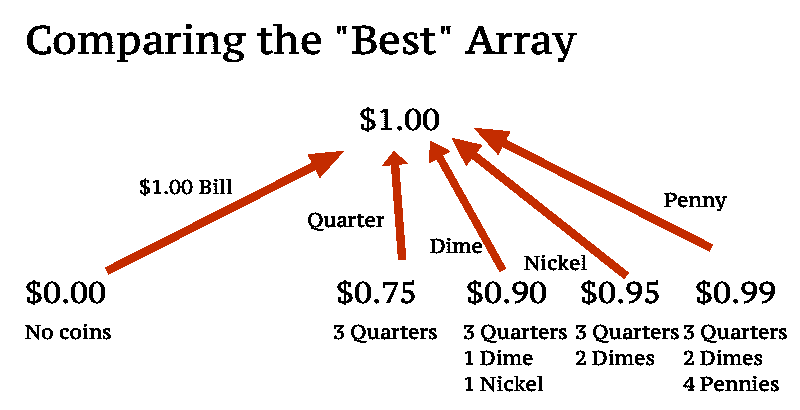

# “精确变化”的精确解

> 原文：<https://www.freecodecamp.org/news/exact-solution-for-exact-change-81e1d23bfe58/>

按半像素

# “精确变化”的精确解



注意:如果你正在自由代码营工作，还没有完成这个问题，我真的建议你先试试！

我在自由代码营里乱搞，有人向我挑战，要我试着正确地完成“精确变化”的问题。

#### 问题是

[精确找零问题](https://www.freecodecamp.com/challenges/exact-change)要求您编写一个函数，输出最少数量的硬币来累加给定金额和给定的 2D 硬币数组，格式如下:

```
[[“PENNY”, 1.01], [“NICKEL”, 2.05], [“DIME”, 3.10], [“QUARTER”, 4.25], [“ONE”, 90.00], [“FIVE”, 55.00], [“TEN”, 20.00], [“TWENTY”, 60.00], [“ONE HUNDRED”, 100.00]]
```

请注意，它显示我们有 1.01 美元的便士，而不是“101 便士”。

#### 不正确的解决方案

所以自由代码营是为初学者准备的，所以我可以理解他们提供的答案对于试图理解它如何工作的人来说是最直观的。不幸的是，该算法并不总是能达到预期的效果。你可以在这里看到完整的代码片段[，但这是它的简短摘要:](https://github.com/FreeCodeCamp/FreeCodeCamp/wiki/Algorithm-Exact-Change)

```
coinList = []
```

```
for each denomination    while amountLeft < coinValue && coinLeft > 0        Add the coin to coinList        coinLeft--        amountLeft -= coinValue
```

```
if (coinList.length == 0 || amountLeft > 0)  return "Insufficient Funds"otherwise return the array
```

虽然这似乎是一个简单而聪明的解决方案，但我们会遇到一些问题。我特别接受了以下测试的挑战:

#### 0.30 美元，10 美分和 25 美分

假设我们想用 10 个一角硬币和 10 个二角五分硬币得到 0.30 美元(所以我们有足够多的一角硬币或二角五分硬币)。这是前面的算法出错的地方。

它使用的方法是使用最高面额，往下走，直到到达目标或最低面额。它首先尝试使用 25 美分硬币(因为这是最大的面值),剩下 0.05 美元。

由于 amountLeft(可以制造硬币的剩余金额)大于 0，因此它返回“资金不足”，因为一角硬币超过 0.05 美元，并且没有其他面值。然而，我们都知道正确的解决方法是用三个一角硬币赚 0.30 美元！

我们不能从最低面额开始，然后向上(例如从一角开始，然后到二角五分)，因为我们可能会遇到像 1 个镍币、3 个一角硬币和 1 个二角五分硬币的 0.40 美元这样的问题。

该计划将首先尝试使用镍币(0.05 美元，最低面额)，然后是 3 个一角硬币(0.35 美元，第二个使用的符号)，并将返回“资金不足”，因为我们无法用一角硬币或两角五分硬币赚到剩余的 0.05 美元。它没有尝试 1 个镍币、1 个一角硬币和 1 个 25 分硬币(正好是 0.40 美元)。

#### 较小的问题

让我们从简单的开始。如果我们想让硬币变成 0.01 美元，我们该如何解决这个问题呢？嗯，我们检查面额，并检查以确保我们有足够的硬币(即，足够的便士)，并且硬币的价值< = 0.01 美元(一便士是多少)。

现在我们来看 0.02 美元。对于人类来说，很容易看出 0.02 美元与 0.00 美元相差两便士。

然而，对于一台计算机来说，事情并没有那么简单。我们能为计算机做的是将达到 0.02 美元表达为“比 0.01 美元多 1 便士”。我们也可以将 0.03 美元表示为比 0.02 美元多一便士。



The best way to get $1.00 is to try and use each denomination and see what other coins you would need. The best here is the $1.00 bill because it would require no other coins.

一个更大的例子是 1 美元。1.00 美元是 1 便士+0.99 美元或 5 美分+0.95 美元或 10 美分+0.90 美元或 25 美分+0.75 美元或 1 美元+0.00 美元。因为一张五美元的钞票大于 1 美元，我们简单地忽略它(和任何更高的符号)。

所以如果我们回到最初的问题，想从一角硬币和两角五分硬币中计算出 0.30 美元，我们首先需要计算并保存硬币的组合来得到 0.01 美元。然后计算并节省 0.02 美元。然后是 0.03 美元、0.04 美元、0.05 美元等等，直到我们得到 0.30 美元。

每次我们想要下一个值(例如$0.20)，我们查看$0.20 的值并减去我们在面额循环中使用的硬币类型(例如一角硬币)。

这就剩下 0.20 美元减去 1 角，也就是 0.10 美元，我们可以简单地说“加上 1 角+组成 0.10 美元的硬币”。这可能会被表示为一个硬币数组，所以假设$0.10 是['dime']。因为我们说“一角硬币+组成 0.10 美元的硬币”给出 0.20 美元，我们可以说 0.20 美元是['一角'，'一角']，因为我们在我们的列表中添加了一个额外的硬币(一角硬币)。

完美！0.20 美元是两个一角硬币。

#### 最佳值

如果我们回到我们的 1.00 美元，我们有很多方法来实现同样的价值。我们怎么知道哪个是最好的？我们怎么知道是用一美元的钞票好，还是用一角硬币+0.90 美元的硬币好？我们可以说“面额越大越好”。由于一美元钞票是我们最大的可用面额，我们将简单地声明一美元钞票是最佳选择(并将$1.00 设置为['1 美元'])。

那么，给定 5 便士、3 个一角硬币和 1 个 25 分硬币，那么 0.30 美元是多少呢？使用“最大面额”法，我们将尝试从“一角硬币+ $0.20”或“二角五分硬币+ $0.05”中得到$0.30。看起来 25 美分是更好的选择(25 美分+ $0.05)，但实际上这给了我们一个 6 个硬币的答案(25 美分和 5 便士)，而我们想要一个 3 个硬币的答案(3 个 10 美分)！

我们真正想要的是比较硬币的数量。因为 0.20 美元(两个一角硬币)的硬币比 0.05 美元(五个一便士)的硬币少，所以 0.20 美元+一角硬币是 0.30 美元的最佳选择。

#### 在实践中

因为我们只是在寻找$0.01，然后$0.02，然后$0.03 的最佳值，以此类推，我们可以简单地使用 for 循环来代替递归或 while 循环！

现在，实际上不可能像我上面所说的那样将值存储为['dime '，' dime '，' quarter']。我存储它的方式是用一个整数数组，格式是[便士、镍币、一角硬币、二角五分硬币等等]。所以 3 个 25 美分和 2 个 10 美分就是[0，0，2，3，0，0，0，0](上升到 20 美元，因为这是问题中的最大面值)。

在我的代码中，我把硬币的数量称为“分数”。如果你不熟悉它，O(_)，它是一种格式，允许程序员显示一个特定的程序有多高效，以及当按比例增加时它将执行得有多好。

现在，我希望算法是 o(货币*面额)，但是每次都要重新计算分数会使它成为 O(money*denominations^2).我决定做的只是创建另一个变量来存储分数，就像我存储最好的数量一样。因此，如果我想从一角硬币+0.20 美元中得到 0.30 美元，我可以查看 bestScoreList[$0.20]并看到它给出的值是“2”。

因为一角硬币是一个硬币，所以我们只做 bestScoreList[$0.20] + 1，也就是 3。如果这让你困惑，不要担心。只要记住 bestScoreList[i] (ex value: 5)是要保存 best[i] (ex value: [2，0，3，0，0，0，0，0]中的币数，而不必总是重新计算。

最后，在 0.30 美元的问题中，我们得到 0.20 美元+一角硬币或 0.05 美元+一个季度。因为 0.05 美元是 0 个硬币(因为没有办法从 25 美分硬币和 10 美分硬币中得到 0.05 美元)，所以它表示 1 个 25 美分硬币是最佳解决方案。

抵消这一点的最佳方法是，如果分数为 0，并且没有访问$0.00，则简单地破坏分数。例如，面值为 10 美分的 0.10 美元可能会返回分数“1”，因为 0.00 美元的分数为 0，因此它会加 1。然而，如果我们有只有一角硬币的 0.15 美元，它将返回“0”的分数，因为 0.05 美元的分数为 0(没有办法用一角硬币得到 0.05 美元！)而 0.05 美元并不是 0.00 美元(很明显)。

我们破坏了分数，因为这意味着这是一个不可能的解决方案(因为我们希望达到 0.00 美元，而这对于这个特定的面额是不可能的)。

#### 密码

这是 0.30 美元硬币和 25 美分硬币问题的代码和测试案例。它使用了一点 ES6，所以如果你因为某种原因不能使用它，就改变它。还要注意，问题给出了价格中的“cash given”(现金)和“price of item”。这意味着我们实际上是在给他们现金价格的硬币。在这里！