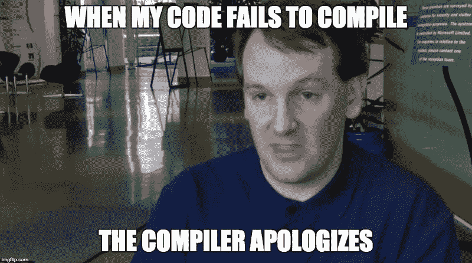

# 乔恩·斯基特——编程界的查克·诺里斯

> 原文：<https://www.freecodecamp.org/news/jon-skeet-the-chuck-norris-of-programming-ee5781c7e18a/>

作者:Prosper Otemuyiwa

# 乔恩·斯基特——编程界的查克·诺里斯

昨天，我在推特上疯狂地谈论乔恩·斯基特的事实，我突然意识到，把所有事情都放在一个帖子里，比浏览我的可怕的 T2 推特 T3 时间线更有意义，让人们去阅读，去消化 T4 让他笑掉大牙。

> 首先，乔恩·斯基特到底是谁，他为什么这么出名？

答案很简单，Jon Skeet 目前是谷歌的高级软件工程师。他是 C#的传奇人物，多次获得微软 MVP 奖，也是一名 Java 开发人员，他实际上在谷歌编写 Java。

Jon Skeet 在 StackOverflow (寻找问题解决方案的头号程序员资源)上成名，他一直是 StackOverflow 上编程问题的头号回答者。他帮助了数百万程序员，为他们的编程挑战提供了高质量的、描述性的答案。

Jon Skeet 让我印象深刻的一点是，他实际上是一名全职开发人员，受雇于一家机构，但他也从繁忙的日程中抽出时间来分享他的知识并帮助其他程序员。因此，我们决定给他贴上编程界的查克·诺里斯的标签，以表彰他的知识、热情和帮助其他程序员提高技能的意愿。

现在，让我们开始吧。我会问第二次。

***乔恩·斯基特到底是谁？***——stack overflow 上一个程序员问。

接下来的回答是令人兴奋的、滑稽的、幽默的和滑稽的。做好准备迎接死亡和窒息的漫长旅程&在这个长长的回答列表中多次复活。

1.  乔恩·斯基特的代码没有遵循编码惯例。这是编码惯例。
2.  用户不会将 Jon Skeet 的答案标记为已接受。宇宙接受他们是出于真理和正义感。
3.  乔恩·斯基特能被零除。
4.  Jon Skeet 的 SO 名声一般是因为整数溢出(SQL Server 没有足够大的数据类型)。
5.  乔恩·斯基特是前 100 名中唯一的人类用户。其他的是他编写的机器人，用来在提问之间打发时间。
6.  Jon Skeet 完全用 Microsoft Paint 编写了他最后一个项目的代码，只是为了迎接挑战。
7.  Jon Skeet 在编程时不使用异常。他还不能识别出他的代码中没有例外的。
8.  当 Jon Skeet 的代码编译失败时，编译器会道歉。
9.  乔恩·斯基特不使用修订版控制软件。他的代码从来都不需要修改。
10.  当你在谷歌上搜索 ***【古鲁】*** 时，它会说 ***“你是说乔恩·斯基特吗？”***
11.  有两种类型的程序员:好的程序员和不是乔恩·斯基特的程序员。
12.  当乔恩·斯基特指向空时，空恐惧地颤抖。
13.  乔恩·斯基特是旅行推销员。只有他知道最短的路线。
14.  乔恩·斯基特服用了红色药丸和蓝色药丸，可以随意在母体中进出相移。
15.  当 Jon 将一个值压入堆栈时，它会保持压入状态。
16.  当调用 Jon 的一个回调时，运行时会添加“please”。
17.  司机敢打断乔恩的代码前要三思。
18.  乔恩·斯基特不睡觉…他等待着。
19.  Jon Skeet 不识别。网..他认识他们中的每一个人，知道他们住在哪里。
20.  乔恩·斯基特不回答这样的问题..他盯着他们，直到他们回答自己。
21.  乔恩·斯基特只要想想就能停止无限循环。
22.  Jon Skeet 不需要调试器，他只是盯着 bug 直到代码承认。
23.  乔恩·斯基特的电脑上没有“CTRL”键。乔恩·斯基特总是掌控一切。
24.  Jon Skeet 通过开发一个单字节程序赢得了“用不到 20 个字节的内容创建 Hello World”比赛。
25.  乔恩·斯基特不解决软件问题。他一走进办公室，问题就迎刃而解了。
26.  乔恩·斯基特可以在提问之前就回答问题，然后在他还没有打完答案的时候就获得几个赞成票。
27.  乔恩·斯基特徽章是为了奖励比乔恩·斯基特答得更好的人。只有乔恩·斯基特才能获得这枚徽章。
28.  上帝说:“要有光，”只有这样他才能看到乔恩·斯基特在做什么。
29.  乔恩·斯基特的键盘没有 F1 键，电脑向他求助。
30.  当 Jon Skeet 按下 **Ctrl+Alt+Delete** 时，全球范围内的计算机重启启动。同样的道理也适用于*格式。*
31.  Jon Skeet 使用 Visual Studio 刻录 CD。
32.  乔恩·斯基特不是接近完美，完美是接近乔恩·斯基特。
33.  上帝并不是真的用六天创造了世界，因为乔恩·斯基特把它优化成了一天。
34.  乔恩·斯基特在 1 和 0 中做梦。当两个出现时，那是一场噩梦。但这只是理论上的。对乔恩来说两个是不存在的。
35.  数据库规范化的第七个范式(7NF)是 Jon Skeet。
36.  当乔恩·斯基特解方程时，变量变成了常数。
37.  如果有人写 ***删除 JonSkeet*** 在 C 国，天启就要来了。
38.  一旦乔恩·斯基特去了图书馆…从那时起图书馆就被动态链接了。
39.  乔恩·斯基特拥有开源的钥匙。他只是不想关闭它。
40.  乔恩·斯基特的字典里不存在兼容性。他可以在苹果电脑上轻松使用微软的 Linux 办公软件。
41.  Jon Skeet 编程时，垃圾收集器会休息。这些物体知道何时自我毁灭。
42.  如果互联网是网，那么乔恩·斯基特就是蜘蛛。
43.  当乔恩·斯基特在节食，不吃快餐的时候，所有硬盘都从**胖**变成 **NTFS。**
44.  乔恩·斯基特已经写出了最好的编程语言。它的来源只有一个命令…**void JonSkeet()；**
45.  乔恩双向飞碟不使用[**#包括**](https://twitter.com/search?q=%23include) **。他认为这是欺骗。**
46.  当一个空引用异常进入睡眠状态时，它会在床底下检查 Jon Skeet。
47.  乔恩·斯基特不需要代表，他自己做所有的工作。
48.  乔恩·斯基特不叫后台工作人员，后台工作人员叫乔恩·斯基特。
49.  乔恩·斯基特不写书，文字是出于恐惧而组合起来的。
50.  当乔恩·斯基特抛出一个异常时，没有任何东西能接住它。
51.  。NET 使用即时编译，因为每条指令都必须首先得到 Jon Skeet 的批准。
52.  乔恩·斯基特超越图灵——完成；他是图灵无敌的。
53.  在约翰·斯基特的 10 米半径范围内根本不存在停机问题，因为计算机总是在他面前停机。
54.  乔恩·斯基特不追求名誉。名誉寻找乔恩·斯基特。
55.  乔恩·斯基特可以和自己结对编程。
56.  当 Jon 安装 Visual Studio 时，他选择不安装调试器。
57.  当 Jon 保存一个文件时，文件会感谢他。
58.  乔恩·斯基特是不可改变的。如果有什么东西要改变，那一定是宇宙的其他部分。
59.  乔恩·斯基特的加法运算符不通勤；它会传送到他需要的地方。
60.  匿名方法和匿名类型都叫做 Jon Skeet。他们只是不喜欢自夸。
61.  乔恩·斯基特没有性能瓶颈。他只是让宇宙等着轮到他。
62.  杰夫·阿特伍德买了一个巨型 GPU，只是为了计算约翰·斯基特在堆栈溢出方面的表现。CPU 都不剪了。
63.  当约翰·斯基特在谷歌上搜索时..唯一的结果就是“我马上回来”。
64.  约翰·斯基特归还了智能感知并拿回了他的钱！
65.  诺曼·贝茨今天过着正常的生活……约翰·斯基特修改了不想要的试镜，重写了《母亲》。处置()。
66.  当约翰·斯基特按下 F5 键时，垃圾收集器就会自动收集垃圾..没有其他垃圾。
67.  Jon Skeet 曾经在没有电池的 Treo 上睡觉时写了一个完整的操作系统，只靠他的意志力供电。
68.  乔恩·斯基特唯一一次犯错是在他认为自己犯了一个错误的时候。
69.  如果你有 10000 点名誉点，乔恩·斯基特有 10000 点名誉点，乔恩·斯基特的名誉比你多。
70.  乔恩·斯基特不运行他的程序。他只是低声说“你最好快跑”。它跑了。
71.  乔恩·斯基特曾经排名第二，在乔恩·斯基特之后。
72.  乔恩双向飞碟代码只有最终密封的方法。从来没有人需要推翻乔恩·斯基特的任何准则。
73.  乔恩·斯基特是智能感知。
74.  乔恩·斯基特的心率是 5 GHz。
75.  。NET Jon Skeet 特别版有一个 JIT 编译的改进实现，叫做‘以防万一’编译。
76.  一旦 Jon Skeet 的代码需要，其他库中的私有方法就会自动变成公共方法。
77.  当尤达需要建议时，他会打电话给乔恩·斯基特。
78.  只有乔恩·斯基特获得了梦寐以求的**“乔恩·斯基特”**徽章。
79.  尝试回答一个堆栈溢出问题，却发现 Jon Skeet 已经明确地回答了这个问题，而且比你做得更好。
80.  如果 Jon Skeet 在 StackOverflow 上发布了一个重复的问题，**原始问题将作为重复的问题**关闭。

乔恩·斯基特的资料在[的 StackOverflow](http://stackoverflow.com/) 上。我们也有 Quora 上的 [**杰夫·迪恩的**](https://www.quora.com/What-are-all-the-Jeff-Dean-facts) 。如果你喜欢这篇文章，请点击推荐按钮，这样其他人就可以发现&笑得前仰后合。

让我知道哪些陈述在 ***堆溢出的笑声*** 中获得了你的大脑记忆，并在评论部分添加你自己的**乔恩·斯基特事实**！