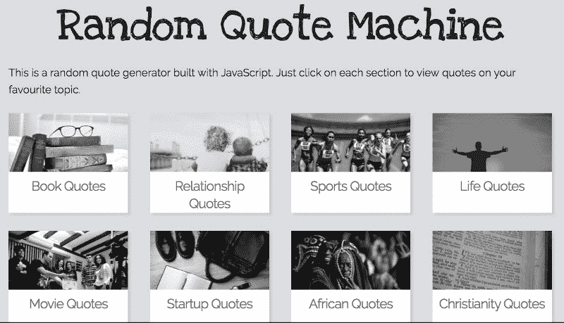
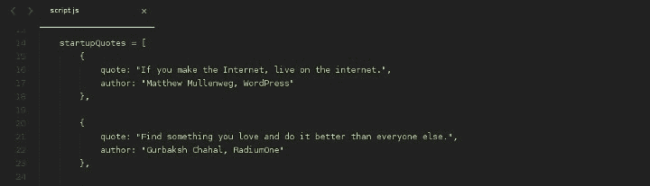
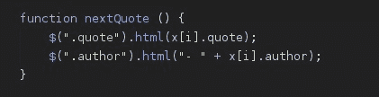
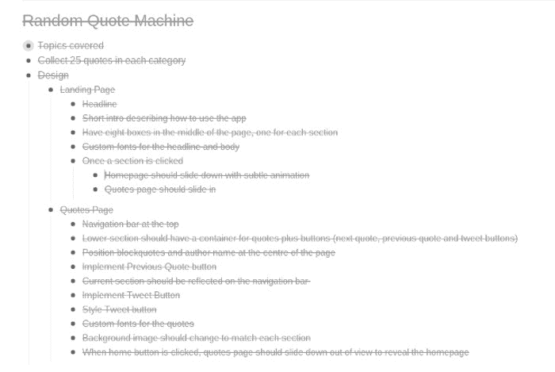
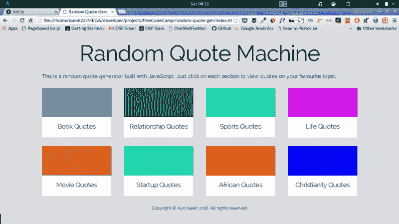
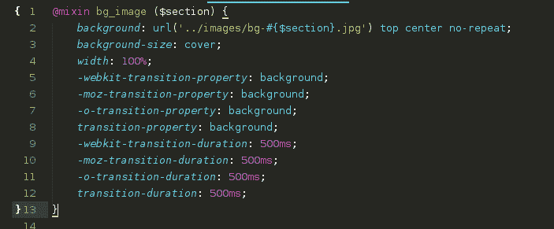
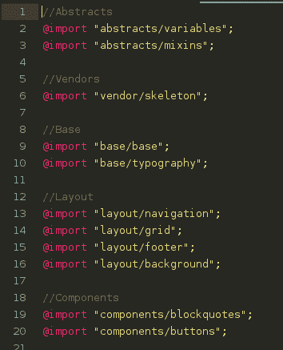

# 建立一个随机报价机

> 原文：<https://www.freecodecamp.org/news/building-a-random-quote-machine-project-6e8d10430f4a/>

作者 Ayo Isaiah

# 建立一个随机报价机

我真的对我在自由代码营上第一次尝试构建一个随机报价生成器不太满意。它很难看，而且引号太长，所以我懒得实现“tweet”功能。那样做没有任何意义。

因此，在我完成了番茄钟项目后，我强烈渴望重新审视我的随机报价机，用不同的方法重新开始。

我想要一个更有趣的设计，有一些动画。我也有这个想法，将报价放入不同的类别，以便用户可以查看他们最喜欢的类别的报价。

我的考试结束了，所以我有足够的时间来完成它。

#### 逻辑

我选定了八个报价类别，并为每个类别收集了 25 条报价。每个类别都是一个带有引用和作者属性的对象数组，这样我就可以很容易地检索到每个类别。

然后，我创建了一个函数，在点击“下一个报价”按钮时将报价放入 HTML 中，并为“上一个报价”按钮创建了一个类似的函数。

如果您查看代码，您会发现引号根本不是随机生成的，而是从第一个到最后一个反复出现。这是我有意做出的设计选择。

#### 设计

第一次尝试最让我恼火的甚至不是它实际上是如何工作的，而是它看起来如何。所以设计是我在这个项目中最关注的部分。

我做的第一件事是列出我希望我的应用程序做的所有事情，以及我希望它看起来怎么样。随着时间的推移，我认识到处理任何事情的最佳方式是将它分解成简单可行的步骤，这就是我在这里使用 [Workflowy](https://workflowy.com/invite/2dbe7482.lnx) 所做的。

每当我想做一个基于网格的布局时，我总是使用[框架 CSS 样板](http://getskeleton.com/),所以这次我也继续使用它。

不过这一次，我使用了 [Sass 版本](https://github.com/WhatsNewSaes/Skeleton-Sass),它可以很容易地改变一些变量，并在不接触原始文件的情况下对其进行一些定制。

一旦准备就绪，我就开始设计登陆页面。在我的脑海中，我想要一个 2x4 的网格，每个部分都有卡片，顶部有标题。这很容易。

嘭！我把我的网格放好了。接下来的事情是弄清楚我将如何设计报价页面的样式，并使用动画在两个页面之间切换。

报价页面花了我更多的时间来完成。我在顶部有一个导航栏，用于在各部分之间切换，在中间有一个显示报价的框。显示报价的按钮在底部。

此时，我脑海中闪现的一个想法是，当用户在不同部分之间移动时，改变背景图像。背景图像将与主页上卡片中的特色图像相对应。

我还想让这个变化在微妙的动画中变得平滑，所以我为此使用了 CSS transition 属性，它在 Chrome 上工作得很好，但我无法让它在 Firefox 上工作(如果有人知道如何解决这个问题，请告诉我)。

一旦我把两个布局都排序好了，就该用动画把两个页面连接起来了。我的第一个想法是使用 CSS 动画，但我没有得到任何地方，所以我寻找 jQuery 动画代替。经过一些试验，我找到了我想要的。slideUp()和 slideDown()函数非常适合我的需要。

基本上，一旦你点击主页上的任何部分，报价页面将滑入视图，你可以查看不同部分的报价。同样，当您单击导航栏上的主页按钮时，页面会向下滑动以显示主页。

就这样了。

从那时起，我所做的就是用真实的图像替换占位符图像，并使用一些谷歌字体来美化。最后，我做了 tweet 按钮。

可以在 CodePen 上查看[最终版本](http://codepen.io/ayoisaiah/full/RaGpoM)。

#### 经验教训

在从事这个项目的过程中，我学到了一些宝贵的经验:

*   在某些情况下，使用背景图像可以给你更多的控制和不同高度的图像更多的灵活性，因为你可以设置背景大小:封面，它不会溢出容器。此外，你可以创建一些很酷的悬停效果，就像我对登录页面上的特色图片所做的那样。我并不总是知道这一点，但是 CodeNewbie Slack group 的某人向我指出了这一点。
*   我还学会了如何将我的 Sass 文件分解成部分文件，并将它们导入主样式表。这有助于组织，并使解决问题变得容易。我有一个正在使用的工作架构，它并不完美，但我会随着时间的推移不断改进。

我很想听听你对我的方法的想法，以及我可以改进的地方，所以一两条评论将不胜感激。

#### 接下来

这个周末我会在做“[展示当地天气](https://www.freecodecamp.com/challenges/show-the-local-weather)”项目，我希望在周日之前完成。这将是我第一次真正体验使用 API，我希望我能尽快掌握它。

下周我会就这个项目写一篇类似的文章，所以请密切关注。

如果你想和我联系，你可以在推特上找到我或者发邮件给我。

这篇文章的一个版本发表在我的个人博客上