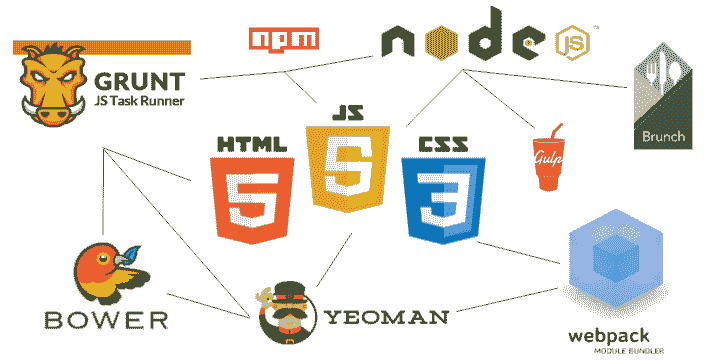
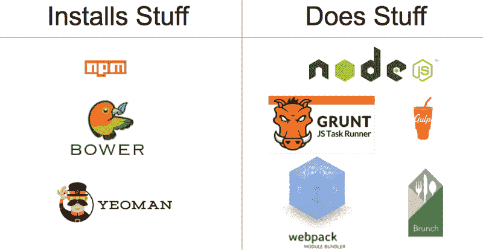
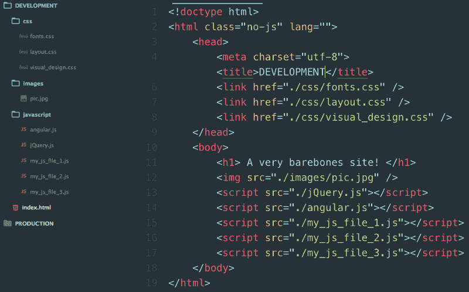
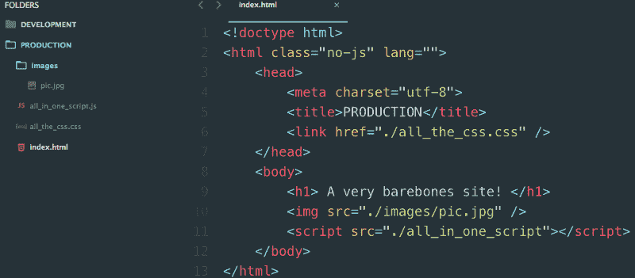
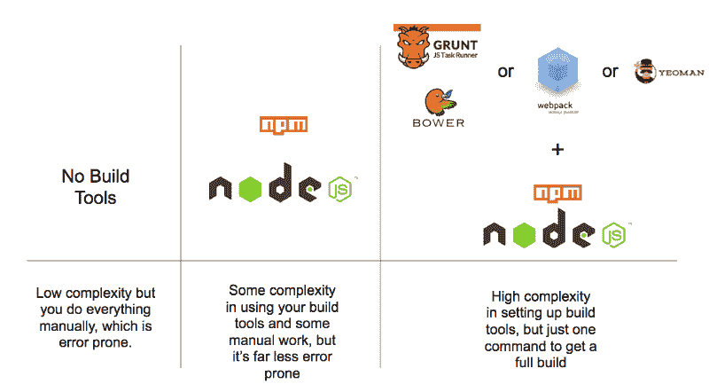

# 我终于理解了前端构建工具。你也可以。

> 原文：<https://www.freecodecamp.org/news/making-sense-of-front-end-build-tools-3a1b3a87043b/>

作者 Roneesh

# 我终于理解了前端构建工具。你也可以。

前端构建工具甚至会让像我这样有经验的开发人员感到困惑。解决方案是在概念层面上理解它们是如何工作的——以及如何一起工作的。

这篇文章展示了我自己的理解前端构建工具的方法。我将带您浏览我的思维模型，了解这些工具如何工作以及它们能完成什么，而不是深入研究代码。

### 不要被最先进的技术吓倒

Node、NPM、Grunt、Gulp、Bower、Webpack、Browserify、Yeoman、Brunch……有这么多的前端构建工具，似乎很难跟上。

关键是不要咄咄逼人。所有这些项目都是为了让你的生活更轻松。

要理解这些工具的用途、原因和方式，您只需要掌握一些概念。

#### 概念 1——构建工具的核心二分法是“安装与执行”

构建工具做两件事:

1.  安装东西
2.  做事

当面对一个新的构建工具时，你要问自己的第一个问题是:“这个工具是打算为我安装东西，还是为我做事？”

像 npm、Bower 和 Yeoman 这样的“安装”工具几乎可以安装任何东西。他们可以安装 Angular.js 或 React.js 这样的前端库，可以为你的开发环境安装服务器。他们可以安装测试库。他们甚至帮助您安装其他前端构建工具。

简而言之，他们安装了你能想到的几乎所有与代码相关的东西。

Grunt、Webpack、Require.js、Brunch 和 Gulp 等“执行”工具要复杂得多。“做”工具的目标是自动化 web 开发中所有琐碎的和容易出错的任务。他们做的事情有时被称为“任务”

为了完成这些“任务”,他们经常使用自己的软件包和插件生态系统。每个工具以不同的方式编写任务。这些工具也不都做同样的事情。一些“做”工具试图处理你扔给它的任何任务(咕哝，吞咽等)。还有的专注于一件事，比如处理 Javascript 依赖(Browserify、Require.js 等)。

有时，您最终会在同一个项目中使用几个这样的工具。

以下是我用这些“做”工具自动完成的“任务”的简短列表:

1.  替换文件中的文本字符串
2.  创建文件夹并将文件移动到这些文件夹中
3.  用一个命令运行我的单元测试
4.  保存文件时刷新浏览器
5.  将我所有的 JavaScript 文件合并成一个，将我所有的 CSS 文件合并成一个
6.  缩小我连接的 JavaScript 和 CSS 文件
7.  修改 html 页面上

一旦你理解了工具安装东西或做东西，对它们进行分类就变得容易多了:

Build tools sorted by whether they primarily install things or do things

#### 概念 2——所有构建工具的祖辈是节点和 npm

Node 和 npm 安装并运行所有这些构建工具，因此在您的项目中总会有它们的踪迹。正因为如此，许多开发人员在求助于安装一个额外的工具之前，试图尽可能多地使用这两个工具。

节点和 NPM 属于我们的“建立”和“做”二分法。Node 是“做”的工具，npm 是“安装”的工具。

npm 可以安装 Angular.js 或 React.js 之类的库，也可以安装服务器在本地运行你的应用进行开发。它甚至可以安装工具来做诸如缩小你的代码之类的事情。

另一方面，Node 为您“做”事情，比如运行 JavaScript 文件、服务器等等。

如果你需要一个地方开始学习，从 Node+npm 开始，在那里呆一段时间。当您的项目变得足够大时，您将达到 Node 和 npm 能够为您实现自动化的极限。此时，您可以有机地整合另一个构建工具。

#### 概念 3——构建只是应用程序的生产就绪版本

开发人员经常将 JavaScript 和 CSS 分解到不同的文件中。单独的文件让你可以专注于编写更多的模块化代码块来完成一件事情。做一件事的文件降低你的认知负荷。(如果你认为单独的文件比一个大文件更令人困惑，试着在一个 5000 行的文件中工作，你会很快改变主意？)

但是当需要将应用程序投入生产时，拥有多个 JavaScript 或 CSS 文件并不理想。当用户访问你的网站时，你的每个文件都需要一个额外的 HTTP 请求，这使得你的网站加载速度变慢。

因此，为了补救这一点，您可以创建我们的应用程序的“构建”,它将您的所有 CSS 文件合并到一个文件中，并对您的 JavaScript 执行相同的操作。这样，您可以最小化用户获得的文件的数量和大小。要创建这个“构建”，您需要使用一个“构建工具”

下面是一个正在开发的 app 的截图。注意它是如何有 5 个

Your app in development

下面是同一个应用程序，在一个构建工具发挥了它的魔力之后。

注意我们只有一个脚本标签和一个链接标签？现在生产文件夹只有 4 个文件，而开发文件夹有 10 个。

该应用程序是一行一行的相同。我们刚刚把它压缩成一个我们称之为“构建”的小软件包

Your app in its build form

你可能会想，如果一个构建只是为你的用户节省了几毫秒的加载时间，为什么它是值得的。好吧，如果你只是为你自己或其他一些人做一个网站，你不必为此而烦恼。只有在高流量网站(或者你希望很快就会有高流量的网站？).

如果你只是在学习开发，或者只是制作流量很低的网站，生成一个版本可能不值得你花时间。

#### 概念 4——“安装”和“执行”之间的界限可能很模糊

没有一种工具只能做一件事而不能做另一件事。他们都混合了“安装”和“执行”但是一般来说，一个工具倾向于做更多的事情。

有时“安装”工具会运行文件。npm 经常这么做。npm 也可以[运行命令和脚本](https://medium.freecodecamp.com/why-i-left-gulp-and-grunt-for-npm-scripts-3d6853dd22b8)——不仅仅是安装文件。像 Yeoman 这样的工具会在你的电脑上安装预建的样板应用程序，但它也会根据需要动态生成新文件，模糊了安装和执行之间的界限。

#### 概念 5——没有一种正确的工具组合

您使用的工具组合可以完全由您决定。

你可以选择不使用任何工具。请记住，复制，粘贴，缩小，启动服务器，以及其他所有涉及到的事情会很快变得令人不知所措。

或者，您可以只使用 Node 和 npm，而不使用其他工具。这对于初学者来说很好，但是随着项目的增长，可能会感觉过程过于手工化。

或者您可以选择在项目中使用 Node 和 npm 之上的一些其他工具。所以你的应用会使用 Node+npm 作为核心，然后可能是 Grunt+Bower 或者 Webpack 或者 Gulp+Bower。

在 Node+npm 上使用类似这些工具的某种组合，可以让您自动完成项目中的许多任务。你付出的代价是这些工具有一个陡峭的学习曲线。

Build Tools in order of increasing complexity, but decreasing tediousness

#### 概念 6——构建工具有一个陡峭的学习曲线，所以只学习必要的东西

打造一个 app 已经够难了。你可能正在使用一种新的语言或者一个新的框架。或者你可能有非常复杂的商业逻辑。所以合并一个构建工具会给你的项目增加额外的一层复杂性。尤其是在一个项目中，其他人编写了与构建工具相关的代码。

我的建议是只学习你工作需要的东西，不要学别的。

学习新事物的最好方法是当你有一个现实世界的任务需要完成的时候。例如，不要为了学习而学习如何用 Grunt 复制文件。相反，等到你的项目真正需要它的时候，再去想办法。

记住:过早的复杂会让你慢下来。

#### 概念 7——所有的构建工具都有一个共同的目标:通过自动化许多琐碎的任务来让你快乐

当你达到我所说的“构建工具涅槃”时，你就充分发挥了你的构建工具的潜力当你保存了一个文件，或者运行了一个命令，大量的任务就会“自动”为你完成。

如果您的构建工具仍然需要您手动移动文件、更改值或运行命令来获得新的构建，那么您还没有到达构建工具的天堂。

构建工具的最大好处之一是，只需保存一个文件，您就可以触发应用程序的新构建，并将其发送到您的浏览器。这可以大大加快您的前端开发工作流程。

那么，您应该在配置和设置您的构建工具上投入多少精力呢？很简单:当你对它为你做的事情感到满意时就停止。

#### 概念 8——不仅仅是你。文档通常很糟糕。

不是你，我保证。对于这些工具中的许多，文档是相当缺乏的。有时候，弄清楚如何完成基本任务可能很难。

请记住，构建工具很少有预定义的方法。你会看到人们以完全不同的方式得到相同的结果——有时都是同一个 StackOverflow 问题的答案！

虽然这很烦人，但它也给你提供了一个机会来展示你的编码能力和实现一些创造性的东西。

毕竟，这不正是我们这么做的原因吗？

感谢您阅读这篇文章！希望这几点能让开发工具变得不那么令人困惑。如果没有，我很乐意澄清任何问题(或纠正你在这里发现的任何错误)，发微博给我@ [Roneesh](https://www.freecodecamp.org/news/making-sense-of-front-end-build-tools-3a1b3a87043b/undefined) ！

当然，如果你喜欢你所读的，请一定在下面❤并与你的朋友分享。作为一个作家，这对我来说意味着整个世界！