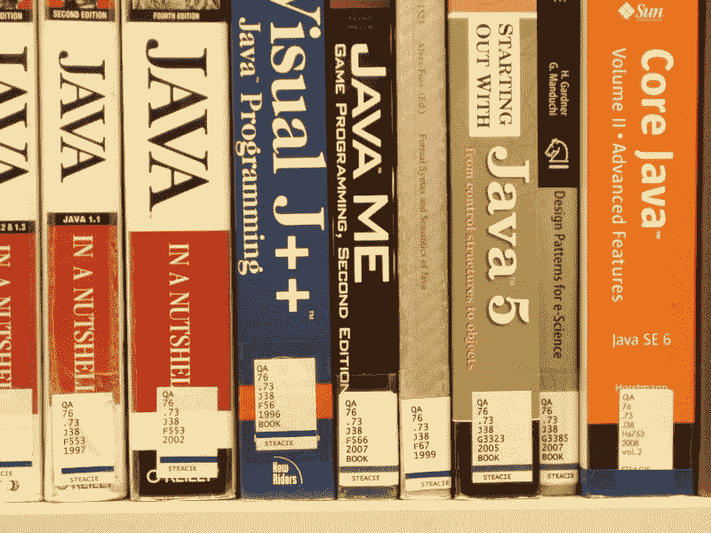
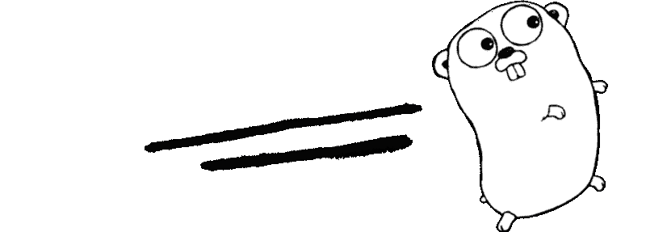
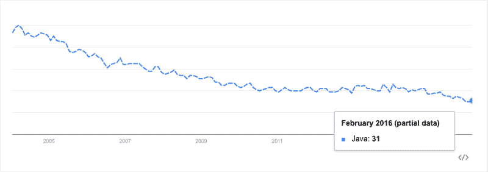
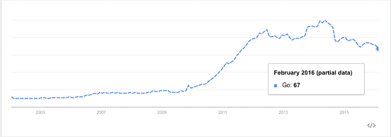
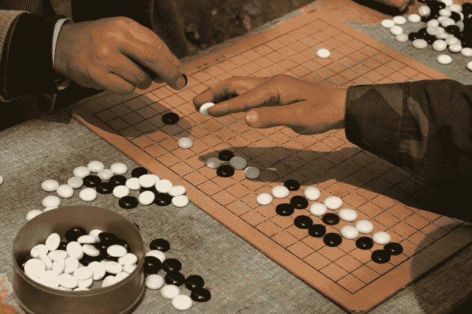

# 比较早期的 Go 和 Java

> 原文：<https://www.freecodecamp.org/news/comparing-early-days-of-go-and-java-db8163bc6798/>

作者 Harshavardhana

# 比较早期的 Go 和 Java

在过去的两年里，Golang(或简称“Go”)已经上升到主流编程语言的行列，如 Java、Python 和 C/C++。像 Google、Docker、DigitalOcean 等公司已经选择使用 Go 来构建他们的现代云基础设施工具。

自从 1996 年 1 月 21 日第一次发布以来，Java 的成功远远超出了任何人的预期。从移动应用程序到关键财务软件，Java 如今无处不在。将 Go 的发展速度与 Java 进行比较，一些人热情地推测 Go 是否会成为下一个 Java，或者至少提升到一个同等的地位。

虽然 Java 已经存在了近 20 年，但 Go 却相对年轻。三年前才出现了第一个稳定版本。现在比较 Go 和 Java 可能还为时过早。然而，有初步的数据来比较这两种语言的早期和当前趋势。

### Java 和 Go 的早期

#### Java 语言(一种计算机语言，尤用于创建网站)

**语言历史**

> 詹姆斯·高斯林、迈克·谢里丹和帕特里克·诺顿于 1991 年 6 月发起了 Java 语言项目。Java 最初是为交互式电视设计的，但对于当时的数字有线电视行业来说，它太先进了。这种语言最初被称为 Oak，是以高斯林办公室外的一棵橡树命名的。后来这个项目被命名为 Green，最后从 Java coffee 改名为 Java。

在 1991 年，Java 无疑走在了时代的前面。在最初的 4 年里，Java 在它达到最终形式之前，重新化身了几次。Java 受到了 Objective-C、Smalltalk 和 Modula 的强烈影响。Java 的目标是成为一种现代的面向对象的可移植语言，同时也是高性能、健壮和安全的。它的基本原理恰到好处，既复杂又简单。Java 的字节码方法和虚拟机实现非常出色。

Java Books sorted by Library of Congress Classification call number at the York University in Toronto. — Source: [https://commons.wikimedia.org/wiki/File:LibraryOfCongressClassification.jpg](https://commons.wikimedia.org/wiki/File:LibraryOfCongressClassification.jpg)

#### 去

**语言历史**

> 罗伯特·格里斯默、罗布·派克和肯·汤普森于 2007 年末开始在谷歌设计围棋，以解决谷歌面临的软件开发问题。

Go 从概念到版本 1 的成熟也用了同样的四年时间，类似于 Java 和其他大部分语言。围棋受到了 Modula、Pascal、Oberon 和 Newsqueak 的强烈影响。它诞生于对现有系统编程语言的失望。Go 被设计成一种有趣的语言，同时它是高效的、实用的、有表现力的和强大的。程序员可以感觉到 Google 可能会如何影响 Go 的设计选择和工具，但是谁不想继承 Google 的最佳实践呢？围棋的亮点是高效的围棋套路、通道和快速编译。

Source: [https://commons.wikimedia.org/wiki/File:Golang.png](https://commons.wikimedia.org/wiki/File:Golang.png)

#### **Java 中流行的开源项目**

Java 在开源和专有领域都很流行。使用 Java 的热门项目和公司不胜枚举。它是我们这个时代最成熟的现代语言之一。Java 最大的优势是可以在世界范围内获得经验丰富的高质量软件开发人员。以下是 Java 中著名开源项目的要点。

*   朱尼特
*   黯然失色
*   春天
*   索尔
*   哈德森和詹金斯
*   Hadoop
*   机器人
*   弹性搜索
*   Apache common(Apache 公共)

#### **Go 中流行的开源项目**

由于 Go 还处于被采用的早期，它的列表还远不能与 Java 相提并论。然而，值得注意的是，Go 在现阶段已经被 Google、Dropbox、MongoDB、BBC 和 SoundCloud 等组织采用。当今行业的主导趋势是企业软件堆栈的云化。作为云基础设施和工具项目的首选语言，Go 正在迅速发展。这里列出了 Go 中值得注意的开源项目。

*   码头工人
*   库伯内特斯
*   戴斯
*   科里奥斯
*   InfluxDB
*   包装商，领事——哈希公司

#### **Java 增长趋势**

Java 已经超出了它的预期，并且已经开始走下坡路了。自 2005 年以来，它一直在逐渐下降。2005 年之前公开收集的数据不多，但这足以与 Go 进行比较。

Source: [http://www.google.com/trends/explore?hl=en-US&q=/m/07sbkfb&tz=Etc/GMT%2B8&content=1](http://www.google.com/trends/explore?hl=en-US&q=/m/07sbkfb&tz=Etc/GMT%2B8&content=1)

#### **围棋增长趋势**

自 2011 年以来，围棋经历了惊人的增长。Java 一直在走下坡路，而围棋却在飞速发展。然而，如果你叠加的情节，你会注意到围棋还有很长的路要走。

Source: [http://www.google.com/trends/explore?hl=en-US&q=/m/09gbxjr&cmpt=q&tz=Etc/GMT%2B8&tz=Etc/GMT%2B8&content=1](http://www.google.com/trends/explore?hl=en-US&q=/m/09gbxjr&cmpt=q&tz=Etc/GMT%2B8&tz=Etc/GMT%2B8&content=1)

#### 成熟

毫无疑问，Java 是当今最成熟的编程语言之一。在企业世界中，任何高于版本 3 的东西都被认为是“准备好迎接黄金时代”了。Java 已经在向版本 9 迈进了。所有主要的操作系统和硬件架构都支持它。

Java 的主要发布版本及其发布日期:

*   JDK 1.0(1996 年 1 月 21 日)
*   JDK 1.1(1997 年 2 月 19 日)
*   J2SE 1.2(1998 年 12 月 8 日)
*   J2SE 1.3(2000 年 5 月 8 日)
*   J2SE 1.4(2002 年 2 月 6 日)
*   J2SE 5.0 (September 30, 2004)
*   Java 参见 6(2006 年 12 月 11 日)
*   Java SE 7(2011 年 7 月 28 日)
*   Java SE 8(2014 年 3 月 18 日)

相比 Java，Go 还处于起步阶段。Go“v 1.6”的最新稳定版本是在几周前发布的。Go 有一个活跃的协作社区驱动的方法和频繁的发布周期，大约每 6 到 8 个月一次。用这种方法很容易预见 Go 将比 Java 更快达到成熟。

Golang 的主要发布版本及其发布日期:

*   go1(发布于 2012 年 3 月 28 日)
*   go1.1(发布于 2013 年 5 月 13 日)
*   go1.2(于 2013 年 12 月 1 日发布)
*   go1.3(发布于 2014 年 6 月 18 日)
*   go1.4(发布于 2014 年 12 月 10 日)
*   go1.5(发布于 2015 年 8 月 19 日)
*   go 1.6(2016 年 2 月 17 日发布)

### 结论

现在判断‘Go’是否会取代 Java 或者甚至达到它无处不在的程度还为时过早，但是可以肯定的是，Go 将永远对通用编程语言类别产生持久的影响。在它对 Java 前景产生任何显著影响之前，它很可能会取代更多的 Python、Ruby、NodeJS、Perl、C、C++环境。

Playing Go — Source: [https://commons.wikimedia.org/wiki/File:Playing_weiqi_in_Shanghai.jpg](https://commons.wikimedia.org/wiki/File:Playing_weiqi_in_Shanghai.jpg)