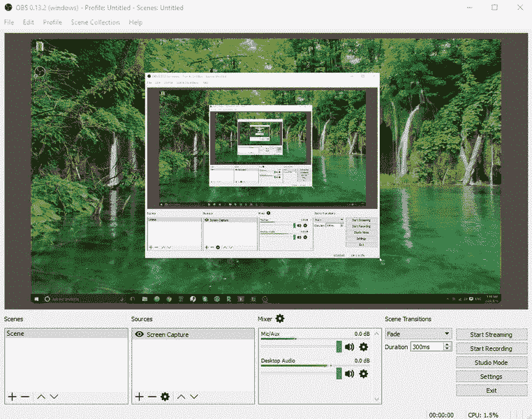
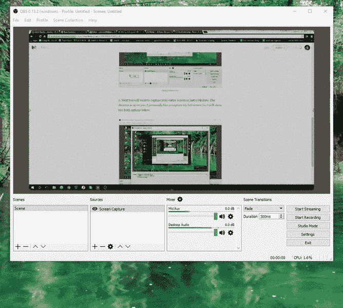
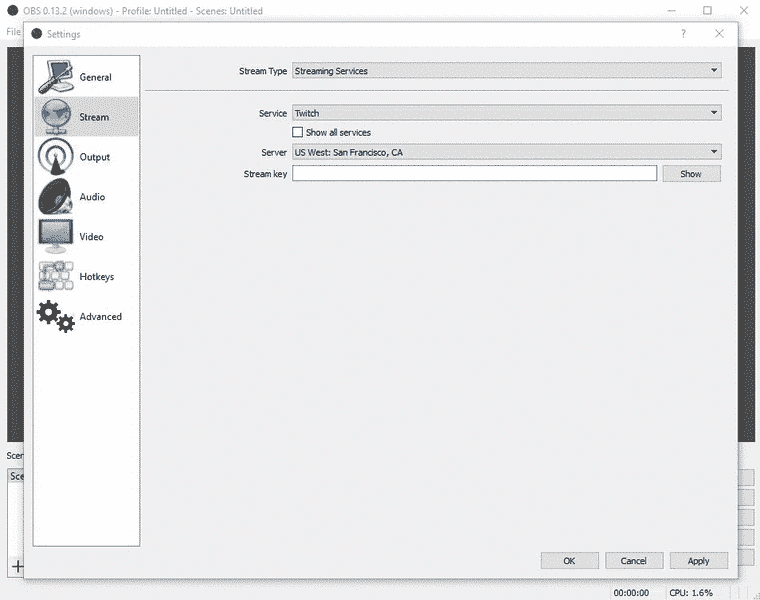
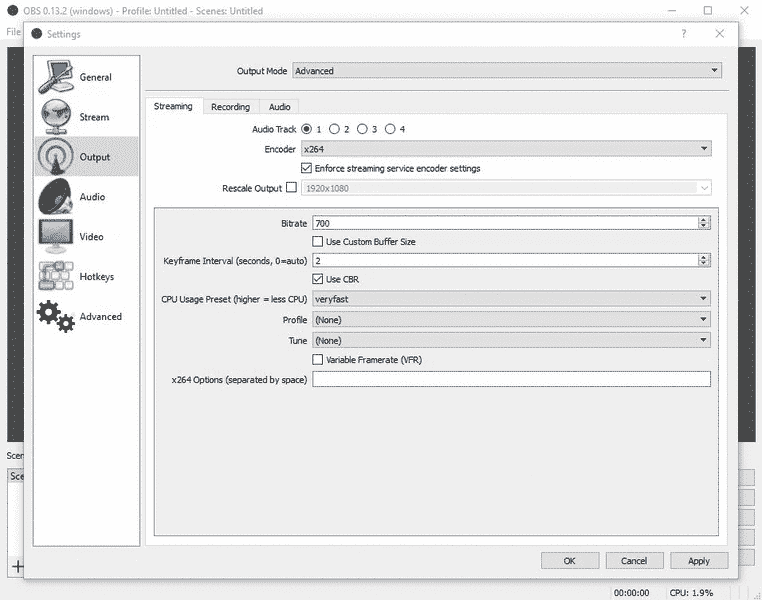
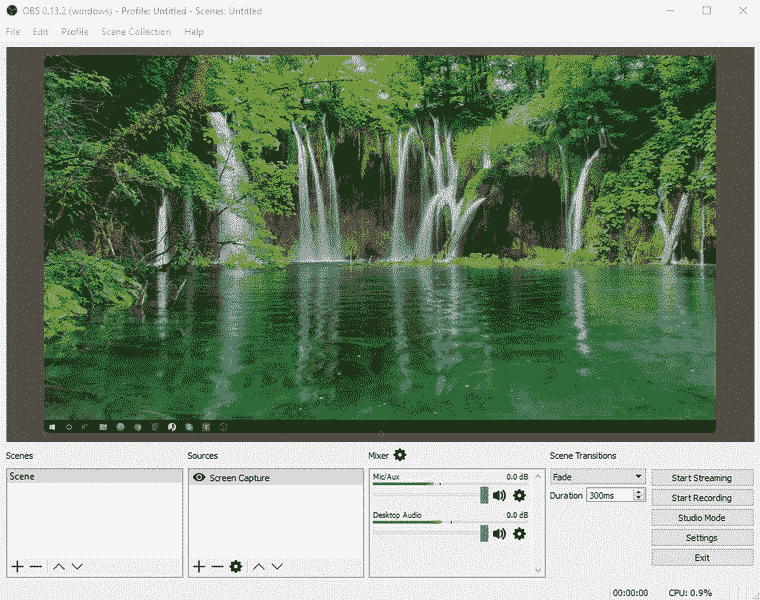

# 通过 7 个步骤为实时编码设置 OBS

> 原文：<https://www.freecodecamp.org/news/setting-up-obs-for-live-coding-7-steps-99b8986e7249/>

韦斯利·麦肯

# 通过 7 个步骤为实时编码设置 OBS

This is where Free Code Camp livestreams

Twitch TV 是一种流行的直播服务。你传统上使用 Twitch 来流式播放视频游戏，但最近 Twitch 开始鼓励人们流式编码。

虽然典型的视频游戏实时流配置可以用于实时编码，但它们太过了。当流式实时编码时，您可以使用低得多的设置，使连接速度较慢的人更容易观看您的实时流。

本文将向您展示如何配置流行的 OBS(开放广播软件),以保持您的流的高质量，同时最大限度地减少观众的带宽需求。

**注意:为了保持这篇文章合理的简短，我们将只展示 OBS 的 Windows 版本的屏幕截图。请注意，在 Mac 和 Linux 上，大部分应该是相同的。**

#### 第一步

1.  您需要为您的平台下载并安装 OBS。OBS 网站位于[这里](https://obsproject.com/)。我更喜欢 OBS studio(这是非 windows 用户的唯一选择)，因为它是目前正在开发的最新版本，似乎更好地利用了带宽。
2.  一旦安装完毕，你将会想要从设置场景开始。首先，你要确保在最左边的盒子里有一个场景。这应该是默认的，但是，如果它不只是右键单击框内，并选择“添加->场景”。

Adding a new scene

3.接下来，你会想要捕捉整个屏幕或只是一个窗口。决定权在你。我个人喜欢捕捉我的全屏，但我会告诉你以下两个选项。

Adding a display capture

4.一旦你设置好了，你就会想让你的麦克风工作，这样你就可以和你的听众交流了。在 windows 上，您需要单击设置按钮>音频选项卡。在这里，您将需要找到“麦克风/辅助音频设备”,并使用下拉菜单选择您的输入设备。

Adding an input capture device

5.现在你已经设置好了捕捉显示器和麦克风的场景，你需要设置一个流媒体服务。为此，打开您的**设置>流**选项卡。一旦到了，selec**T:**
Stream Ttype:Streaming Servic**es**
**Serv**ice:Twit**ch**
**Ser**ver:选择离 y**ou**
**Stream**key:Twitch 提供的 stream key

Setting up your streaming service

6.接下来，您需要更改输出设置。您可以通过进入**设置>输出**输入来完成此操作。从这里你会想 selec**t:**
输出 Mode:Advanced
Be on " Streaming Ta**b "**
**Bitr**ate:不高于 1200。试着匹配你的上传速度。比如我的上传速度通常在 800Kbps-900Kbps 之间。我已经将我的比特率设置为 70 **0。**
**关键帧间**val:2 secon**ds**
**用户**CBR:Che**CK**
**CPU Us**年龄:Veryfast。如果您不确定您的硬件***e .***
***这是推荐值，所有其他设置保留默认设置*** lt。

Setting up your Output settings

7.最后，您需要检查流的每秒帧数(FPS)。没有正确配置 FPS 可能是现场编码时浪费带宽的最大方式。导航至设置>视频。在那里，你需要点击下拉菜单“公共 FPS 值”并选择“整数 FPS 值”。在显示的输入框中，将 30 更改为 15。对于实时编码来说，15 FPS 应该没问题。

Setting your FPS

这应该是你设置 OBS 开始现场编码所需要做的全部工作！

还有一些事情，你可能想做的，如捕捉输出音频播放音乐流。我将很快写另一篇关于这个问题的文章，用特定于 Windows 和 Mac 的 gif。

如果你有任何问题，请随时在 Gitter 上给我发[消息，或者在](http://gitter.im/septimus) [@septimus98](https://twitter.com/septimus98) 上发微博给我。