# ？？用户体验(UX)资源和工具的完整列表？？

> 原文：<https://www.freecodecamp.org/news/the-complete-list-of-user-experience-ux-resources-tools-7af32aa129f6/>

杰森·赫里哈

# ？？用户体验(UX)资源和工具的完整列表？？

#### 超过 100 个链接指向最好的书籍、课程、时事通讯和工具…

这是一个不断更新的最佳 UX 资源列表。

*2016 年 3 月 17 日最后更新*

多年来，我收集了大量不同的资源来帮助我的产品& UX 作品。我已经注册了几十个简讯和博客邮件，购买了一堆书，查看了一些在线课程，并使用了各种工具来帮助我实现我的想法。最后，我决定检查我所有的书签、电子邮件和文本文件，并将所有这些资源放入一个综合列表中。

尽情享受吧！

### UX 时事通讯

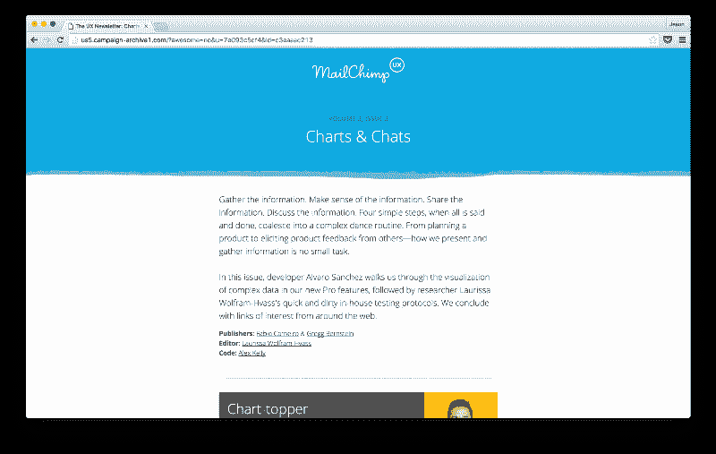

The Mailchimp UX Team’s Newsletter

*   [Mailchimp UX 简讯](http://www.theuxnewsletter.com/)
*   [UX 掌握时事通讯](http://uxmastery.com/newsletter/)
*   [UX 周刊简讯](http://uxwkly.com/)
*   [UX 展台快讯](http://www.uxbooth.com/newsletter/)
*   [UX 设计周刊简讯](http://uxdesignweekly.com/)
*   [粉碎杂志简讯](https://www.smashingmagazine.com/the-smashing-newsletter/)
*   [用户焦点简讯](http://userfocus.co.uk/uxnews/index.html)
*   [UX 笔记本简讯](http://www.sarahdoody.com/ux-newsletter/#.Vsko7xhGsUE)
*   [我的**日报**简讯](https://app.convertkit.com/landing_pages/210894?v=6)？

### UX 博客和杂志:

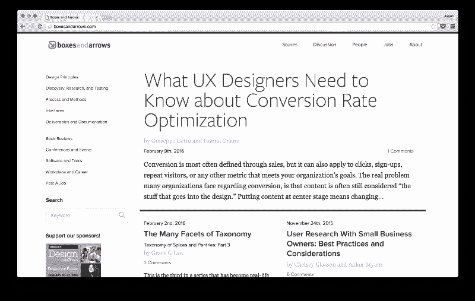

Boxes and Arrows — A Terrific UX Blog

*   [信息设计](http://www.informationdesign.org/)
*   [网络可信](http://www.webcredible.com/blog/)
*   [自适应路径思路](http://adaptivepath.org/ideas/)
*   [尼尔森诺曼集团—文章](https://www.nngroup.com/articles/)
*   [UX 杂志](http://uxmag.com/)
*   [方框和箭头](http://boxesandarrows.com/)
*   [一份名单分开](http://alistapart.com/)
*   [UX 问题](http://www.uxmatters.com/)
*   [对讲机博客—设计](https://blog.intercom.io/category/design/)
*   [HeyDesigner](http://heydesigner.com/ux-design/)
*   [UIE 的大脑火花](http://www.uie.com/brainsparks/)
*   [形式和功能](http://www.lukew.com/ff/)
*   [Bokardo](http://bokardo.com/about/)
*   [UXHandy](http://www.uxhandy.com)
*   [UXSwitch](http://www.uxswitch.com/thinking/)

### 书籍:

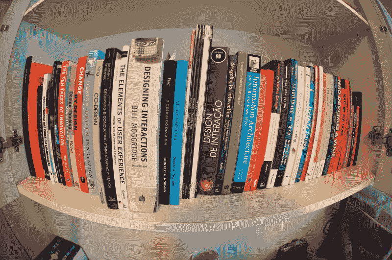

*   [不要让我思考— *史蒂夫·克鲁格*](http://amzn.to/1VvZ2H5)
*   [火箭手术变得简单——史蒂夫·克鲁格**](http://amzn.to/1VvZ4i3)
*   [观察用户体验— *迈克·库尼亚夫斯基*](http://amzn.to/1VvZ7dM)
*   [日常用品的设计——唐·诺曼的**](http://amzn.to/21hdWUU)
*   [黑客攻击人性的好处——*丹·艾瑞里、杰森·赫里哈和克里斯汀·伯曼*](http://amzn.to/1Txon5u)
*   [说服技术—*BJ·福格*](http://amzn.to/1VvZepL)
*   [初学者的 UX:100 节短课速成班——乔尔·马什著**](http://amzn.to/1T6vp13)

### 在线课程

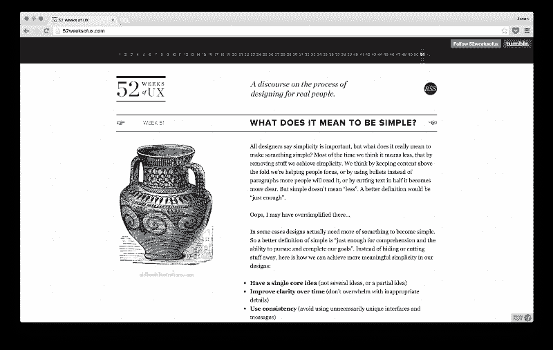

52 Weeks of UX — A Great (Free) Intro UX Course

#### 免费:

*   [《UX 的 52 周》——*约书亚·波特和约书亚·布鲁尔*](http://52weeksofux.com/)
*   [用户体验设计— *乘跳板*](https://www.springboard.com/learning-paths/user-experience-design)
*   [UX 速成班— *由嬉皮士组成*](http://thehipperelement.com/post/75476711614/ux-crash-course-31-fundamentals)
*   [产品心理学—*Nir Eyal 的一门课程&其他*](http://www.productpsychology.com/) *[(还有我！)](http://www.productpsychology.com/lesson-15-behavioral-design-toolkit/)*
*   [人机交互— *作者斯科特·克莱默(斯坦福 Coursera)*](https://class.coursera.org/hci/lecture)
*   [如何运行一个便宜、快速、非常有用的用户测试— *杰森·哈瑞哈*](https://medium.com/@jhreha/how-to-run-a-quick-effective-user-test-for-25-or-less-bc2cf3706787#.ezb90usst) (简短介绍)

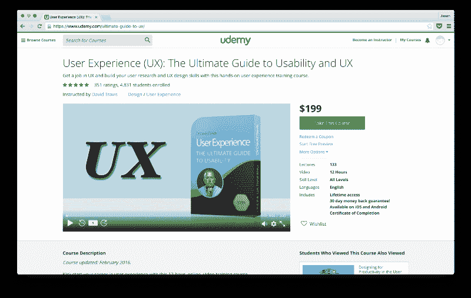

David Travis’ Udemy Course — One of the best online UX courses

#### 有报酬的

*   [可用性和 UX 的终极指南— *大卫·特拉维斯*](https://www.udemy.com/ultimate-guide-to-ux/) **(我听说过这个，也许是最好的在线 UX 课程)**
*   [可用性测试训练营— *大卫·特拉维斯*](https://www.udemy.com/usability-testing/)
*   [UX:真实世界 UX 的实用要点— *作者布伦丹·波顿-克林格*](https://www.udemy.com/learn-real-world-ux/)
*   [用户体验设计基础— *乔·纳托利*著](https://www.udemy.com/user-experience-design-fundamentals/)
*   [UX 与网页设计硕士课程:战略、设计、开发— *作者乔·纳托利*](https://www.udemy.com/ux-web-design-master-course-strategy-design-development/)
*   [交互设计专业化——Coursera 上的**](https://www.coursera.org/specializations/interaction-design)
*   [UX & UI 基础— *按集团*](https://www.bloc.io/ux-design-bootcamp)
*   [成为 UX 设计师— *通过 Thinkful*](https://www.thinkful.com/courses/learn-ux-online/)
*   科尔曼·沃什
*   [成为 UX 设计师— *由 CareerFoundry*](http://careerfoundry.com/courses/how-to-become-a-user-experience-designer)
*   [开展智能用户研究— *贾内尔·埃斯蒂斯*](https://www.skillshare.com/classes/business/Intro-to-UX-Conducting-Smart-User-Research/1186754238?via=search-layout-grid)
*   [创造卓越的全渠道体验——斯特夫·米勒的**](https://www.skillshare.com/classes/business/Intro-to-UX-Creating-Great-Omnichannel-Experiences/345063307?via=search-layout-grid)
*   [可用性基础— *作者玛丽埃克·麦克洛斯基*](https://www.skillshare.com/classes/design/Intro-to-UX-Fundamentals-of-Usability/538580770?via=search-layout-grid)
*   [用户体验设计:完整的 UX 基础课程— *亚当·特莱斯特&巴勃罗·史丹利*](https://www.udemy.com/user-experience-design-the-accelerated-ux-course/)
*   [从零开始的手机应用设计:设计原则，UX — *马克西姆·科尔米耶*](https://www.udemy.com/mobile-app-design-from-scratch/)
*   [如何打造形成习惯的产品— *作者 Nir Eyal*](https://www.udemy.com/how-to-build-habit-forming-technology/)
*   [获奖用户体验设计— *牛津学习实验室*](https://www.udemy.com/winning-user-experience-design/)
*   [用 7 个简单的步骤设计您的用户体验— *阿米尔·凯拉*著](https://www.udemy.com/ux-for-founders/)
*   [卡片分类信息架构—*U1 集团/森喜朗*](https://www.udemy.com/developing-an-information-architecture-with-card-sorting/)
*   [交互设计— *由设计实验室*提供](http://trydesignlab.com/interaction-design-course/)
*   [UX 基础——作者 Lis Hubert @ Treehouse](http://treehouse.7eer.net/c/231199/228915/3944?u=https%3A%2F%2Fteamtreehouse.com%2Flibrary%2Fux-basics)
*   [课程由*交互设计基础*](https://www.interaction-design.org/courses)

### 讨论组

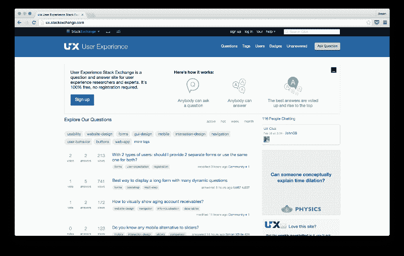

UX Q&A on StackExchange

*   [堆叠交换—用户体验](http://ux.stackexchange.com/)
*   [Reddit —用户体验](https://www.reddit.com/r/userexperience/)

### 软件

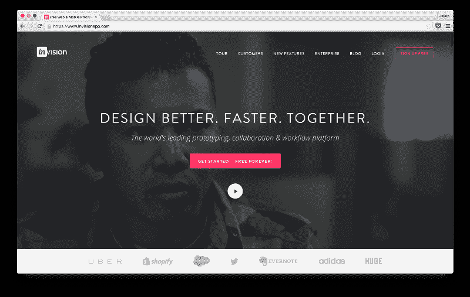

Invision — One of the best prototyping products

#### 样机研究

需要用模型快速创建一个健壮的产品原型吗？这些是给你的工具。

*   [视觉](https://www.invisionapp.com/)
*   [漫威](https://marvelapp.com/)
*   [白银](http://silverflows.com/)
*   [Pixate](http://www.pixate.com/)
*   [协议 io](https://proto.io/)
*   [砰然一声](https://popapp.in/)
*   [流体](https://www.fluidui.com/)
*   [波特](https://prottapp.com/)
*   [CanvasFlip](http://www.canvasflip.com/)
*   [弗林特](https://www.flinto.com/)
*   [值得注意的(Zurb)](http://zurb.com/notable/features/prototypes)
*   [轴](http://www.axure.com)
*   [靛蓝工作室](http://www.infragistics.com/products/indigo-studio)
*   [原理](http://principleformac.com/)

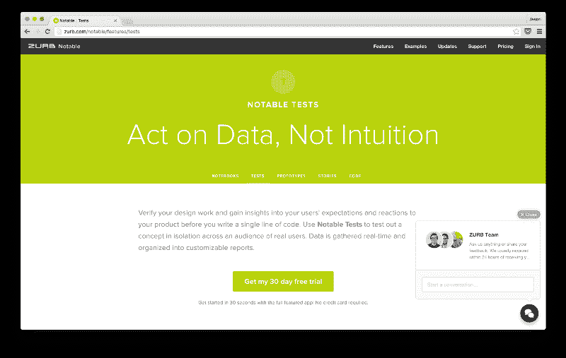

Zurb’s Testing Product — Notable

#### 测试服务

如果你需要将你的设计(或原型)展示给用户，并收集他们的反馈，这些都是适合你的工具。

*   [值得注意的(Zurb)](http://zurb.com/notable/features/tests)
*   [五秒测试](http://fivesecondtest.com/)
*   [冲刺(由 dscout)](http://dscout.com/research/sprint)
*   [用户测试](https://www.usertesting.com/)
*   [Usersthink](http://usersthink.com/)
*   [可用性提供商](https://usabilityprovider.com/#/)
*   [可用性中枢](https://usabilityhub.com/)
*   [用户大脑](https://userbrain.net/)
*   [Userbob](https://userbob.com/)
*   [用户缩放](http://www.userzoom.com/)
*   [99 项测试](https://99tests.com/)
*   [UXeria](http://en.uxeria.com/)
*   [有效地](https://validately.com/)
*   [用户感受](http://www.userfeel.com/)
*   [TrymyUI](http://www.trymyui.com/)
*   [用户解析](http://www.userlytics.com/sitepublic/)
*   [什么用户做什么](http://whatusersdo.com/)

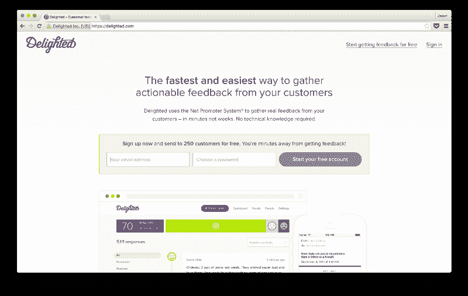

Delighted — An elegant way to gather NPS

#### 反馈收集

想大致了解一下你的情况吗？像 jockey 和 Usabilla 这样的反馈收集工具可以让你感觉到你在 0-10 或“悲伤的脸”到“欣喜若狂的脸”的范围内做得如何。

*   [乌萨比拉](https://usabilla.com/)
*   [欣喜— NPS](https://delighted.com/)
*   [Wootric](https://www.wootric.com/)
*   [对讲机](https://www.intercom.io/)
*   [委婉地询问](http://www.asknice.ly/)
*   Qeryz
*   [Promoter.io](https://www.promoter.io/)
*   [CustomerGauge](https://customergauge.com/)
*   [满意度指数](https://www.satismeter.com/)
*   [Satmetrix](http://www.satmetrix.com/)
*   [Hellocustomer](https://www.hellocustomer.com/en-US/Home)
*   [网络推广](http://netpromotive.com/)

### 记录和查看用户会话

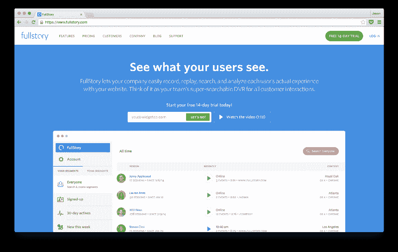

我第一次看到 FullStory 的时候，我想:“我的上帝——我不再需要用户研究协调员了。”虽然这不是真的(我喜欢研究协调员)，但这些工具应该是每个产品团队的武器库的一部分。

*   [完整的故事](https://www.fullstory.com/)
*   [UXCam](https://uxcam.com/)
*   [可用性工具](http://usabilitytools.com/)

### 卡片分类

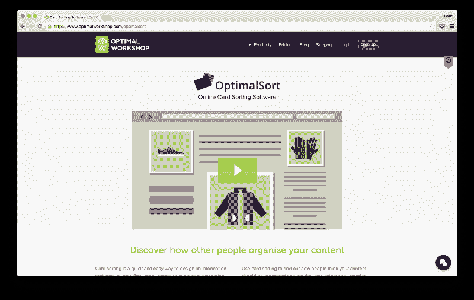

糟糕的信息架构？从这里开始。

*   [最佳排序](https://www.optimalworkshop.com/optimalsort)
*   [树杰克](https://www.optimalworkshop.com/treejack)

### 测量

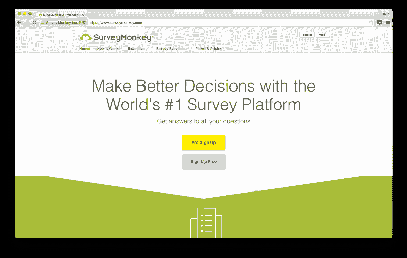

使用调查工具从用户那里获得定性反馈。

*   [质量标准](http://www.qualtrics.com/)
*   五福
*   [调查猴子](https://www.surveymonkey.com/)
*   [SurveyGizmo](http://www.surveygizmo.com/)
*   [字体](https://www.typeform.com/)
*   [皮克福](https://www.pickfu.com/)

### 用户研究招募

Ethnio 拥有这个类别。如果你想对你的网站或应用程序的访问者进行筛选，并将其添加到预定义的用户研究小组中，这就是你要的工具。

*   [民族](https://ethn.io/)

### 如果你喜欢这篇文章，请[注册我的每日简讯](https://app.convertkit.com/landing_pages/210894?v=6)。？