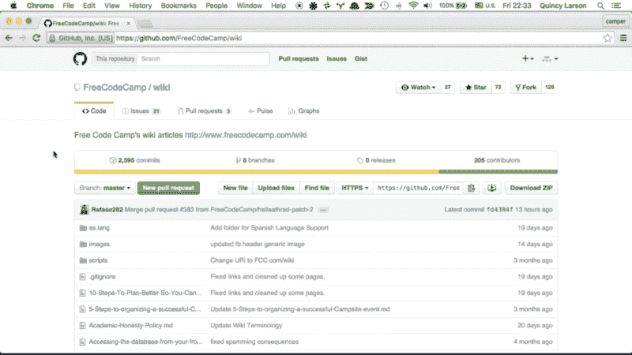
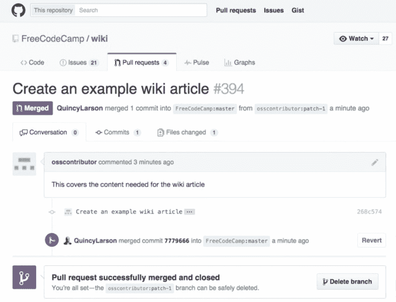
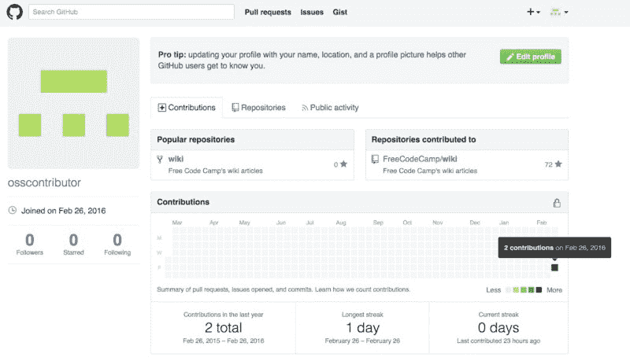

# 如何在 15 分钟内从你的浏览器登陆你的第一个开源贡献

> 原文：<https://www.freecodecamp.org/news/how-to-land-your-first-open-source-contribution-from-your-browser-in-15-minutes-756d9bbf81ad/>

Automattic 的创始人马特·莫楞威格最近向有抱负的开发人员提出了这个建议:“(T2)为开源做贡献。

Mullenweg 是一名政治学辍学生，他的软件(Wordpress)现在为近四分之一的网站提供支持。他说，通过开源贡献来证明自己的能力，你可以“100%弥补专业经验的不足”。

> 如果你能在一个开源项目中成长为一个公认的职位，这将使你领先应用程序十步，即使是在该领域有 20 年经验的人，至少是像 Automattic 这样偏向开源的公司。

而开源世界无可争议的中心就是 GitHub。有些人甚至说 GitHub 账户已经取代了简历。

或者就像 jQuery 的创始人约翰·瑞西格(John Resig)开玩笑说的那样:“说到招聘，我会随时选择 GitHub 提交日志，而不是简历。”

自由代码营 Wiki 维护者 Rafael Rodriguez 提出了一种方法，你可以在几分钟内开始为开源做贡献，甚至不用离开 GitHub 的网站。

Rafael Rodriguez maintains Free Code Camp’s wiki and is active in our [Wiki chat room](https://gitter.im/FreeCodeCamp/Wiki).

#### 向自由代码营的维基添加一篇文章

自由代码营的维基充满了关于技术的文章。学术文章的目标是详细，技术文档的目标是精确，而我们的 wiki 文章的目标是让新开发者容易理解。

以下是一些你可以在我们的维基上写的例子:

*   像 Redux 这样的新 JavaScript 库
*   软件世界的重要人物，比如丹·阿布拉莫夫
*   如何部署一个 Wordpress 电子商务网站
*   如何在 Windows 上安装 Ruby on Rails
*   如何将树莓派接入恒温器
*   Git 的历史
*   你所在城市的女人们码章

基本上，任何与技术有关的事情都是公平的。我们会在包容方面犯错误。

首先，检查[以确保文章不存在](https://gitter.im/FreeCodeCamp/wiki)(如果存在，您可以帮助我们扩展它。)

如果你一时想不出什么，你可以从我们的[文章请求](https://github.com/FreeCodeCamp/wiki/issues)中选择一个主题，写几段关于它的文字。

我们也欢迎将现有文章翻译成任何世界语言。

然后，您可以按照以下步骤做出贡献:

A recording of me making an example contribution in less than a minute.

1.  去[自由代码营的开源维基知识库](http://www.github.com/freecodecamp/wiki)。(如果您还没有 GitHub 帐户，[您可以在大约 2 分钟内创建一个](http://www.freecodecamp.com/challenges/create-a-github-account-and-join-our-chat-rooms)。)
2.  单击“新建文件”按钮。这将自动创建一个库的分支(您自己的个人副本)。
3.  将您的文件命名为“your-wiki-article-name . MD”(“MD”代表 Markdown，是 plain 的一种流行替代方式。txt 文件)。
4.  把你的文章打出来。如果你不熟悉 Markdown，你可以[在这里](https://jbt.github.io/markdown-editor)写你的文章，然后复制粘贴到 GitHub 上。
5.  向下滚动并填写提交消息(例如，“创建关于 Minimax 算法的 wiki 文章”)，并可选地添加描述。如果你写这篇文章是为了回应一篇文章的请求，你应该在描述中这样引用它:“关闭问题#177。”
6.  单击“提议新文件”
7.  点击“创建拉动式请求”
8.  您的拉取请求将已经从您的提交消息和描述中填充。因此，再次单击“创建拉式请求”以完成它。

瞧啊。您已经创建了一个文件、一个提交和一个拉请求(甚至可能在这个过程中关闭了一个问题)！

Raphael 或另一名志愿者将审查您的 pull 请求，并可能要求您对您的文章做一些进一步的改进。(在某些情况下，您可能需要在本地克隆存储库来粉碎提交或解决合并冲突——如果出现这种情况，我们会帮助您。)

如果你对此有任何疑问，请到我们的维基聊天室提问。

一旦他们接受了你的 pull 请求，GitHub 就会把它合并到自由代码营的 Wiki repo 中，看起来大概是这样的:

一旦您的 pull 请求被接受，您就可以检查您的 GitHub 档案。看到你热图日历上的绿色方块和条纹了吗？您已经做出了开源贡献！

#### 这是有意义的事情的开始。

向我们的 wiki 投稿是轻松进入开源的好方法。

写了几篇 wiki 文章(并对现有文章进行了编辑)后，您会想尝试一下，看看您还能为哪些项目提供帮助。

如果不离开相对舒适的浏览器和 GitHub 网站，你将无法为这些项目做出贡献。但是不要被在本地计算机上开发的过程所吓倒——这并不困难。

随着您对越来越大的项目做出贡献，您将会更好地学习代码库，以便跟踪 bug 并添加功能。

这就是你学习的方式。作为一名开发人员，这就是你成长的方式。这就是你如何向未来的雇主证明你可以与其他人合作并写出值得使用的代码。

*如果您喜欢，请点击？下面。关注我和免费代码营，获取更多关于技术的文章。*

