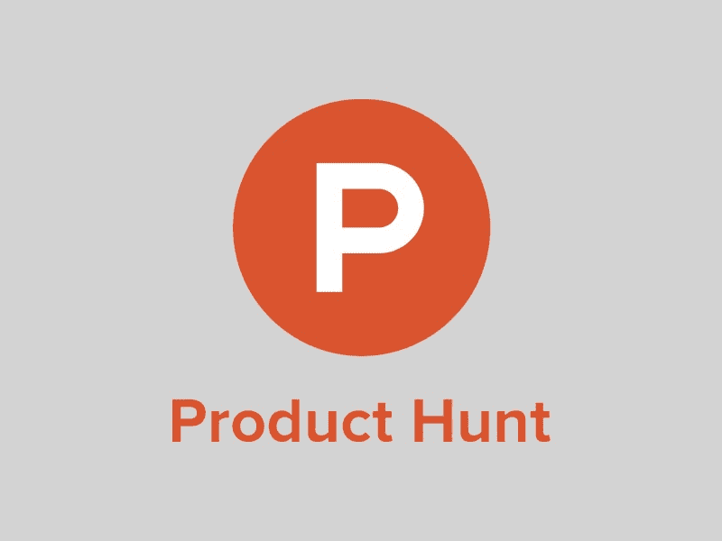
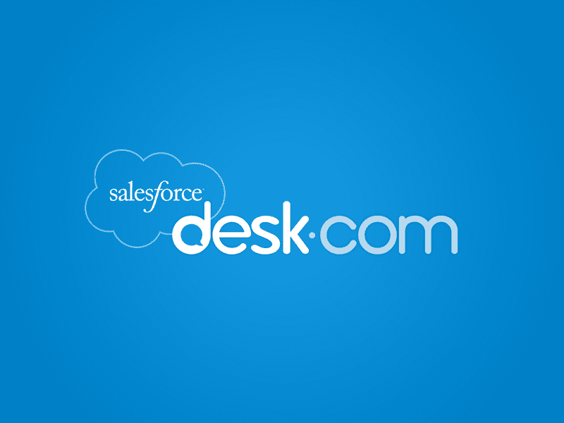
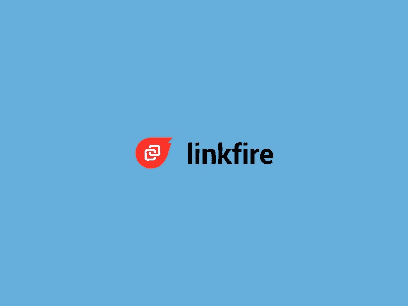
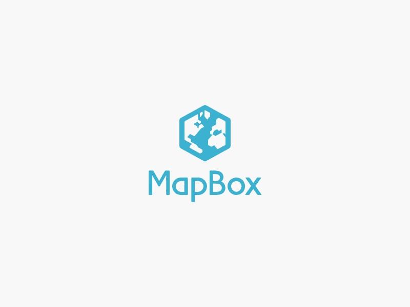
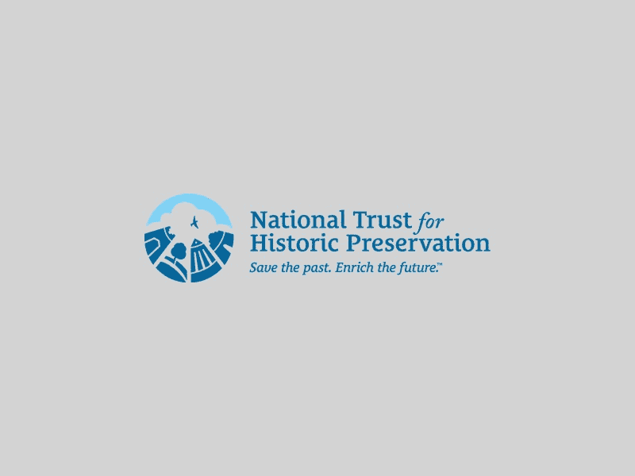
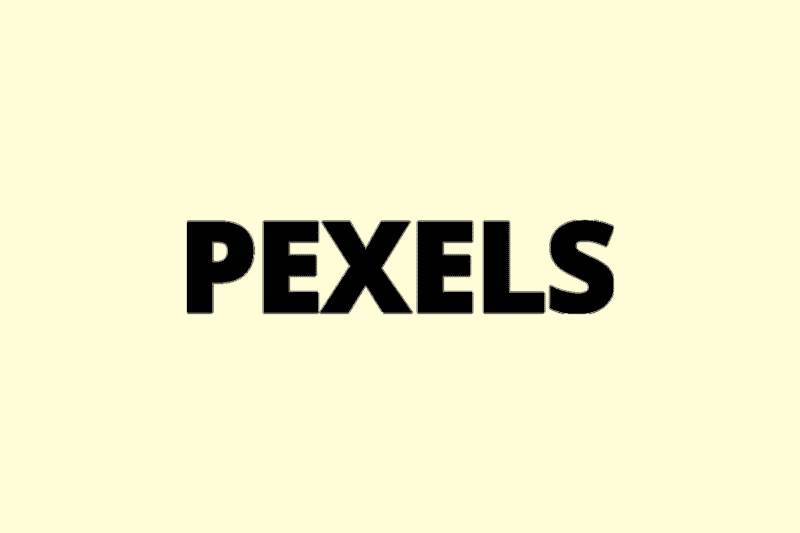
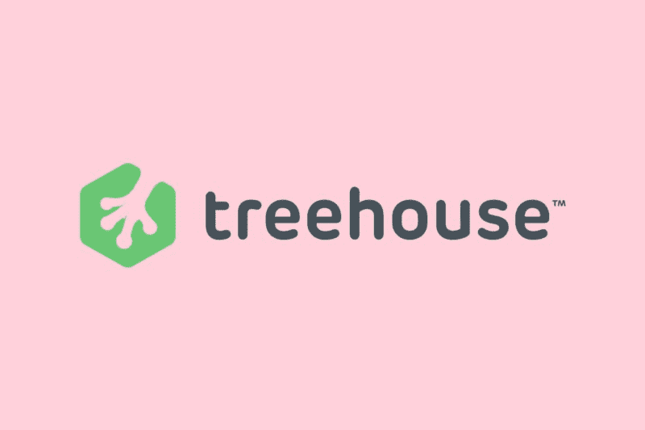

# 挑选方法和一系列鼓舞人心的网站

> 原文：<https://www.freecodecamp.org/news/the-pick-and-choose-approach-and-a-list-of-inspirational-websites-361b2048c114/>

by Kristoffer Andreasen

# 挑选方法和一系列鼓舞人心的网站

在过去的几年里，我创建了不少网站。一开始，我几乎不知道如何编码或设计。但是我对我的网站有一个目标和愿景。这在当时绝对是一个长期目标，但我知道这是可能的。从那以后，我在一年的时间里多次创建和重新设计网站。只是在你看来从来没有完成过。

踏上创建网站的道路让我明白，美丽的网站是多种多样的技能结合成一个产品的结果。起初，我肯定忽略了设计部分，并认为我自己的美感足以创造出我想要的外观和感觉。

我大错特错了。设计是创建网站的重要组成部分。在我看来，这是网站最重要的目的之一:传达专业性。一个网站通常连接到一个企业，在这种情况下，目的是将访问者转化为客户。

专业是我成为客户的一个极其重要的指标。我本人在该领域工作，肯定是有偏见的，在决定产品时，我倾向于将制作精美的网站作为一个因素。这可能适用于任何产品。不仅仅是现代科技产品。在与小公司打交道时，一个漂亮的网站会产生更大的影响，因为它可能会成为竞争对手的一个重要优势。

我艰难地认识到我不是最好的设计师。在创建了我认为是成品的东西之后，我看了看它们，得出的结论是它们看起来一点也不像网络上的流行网站。

在我意识到这种差异后，我开始在页面的各个部分寻找个体差异。是什么让他们的网站看起来令人惊叹，而我的却很普通？

答案不仅仅是一件事。它既是单个元素，也是页面的整体构成。我对这个问题的解决方案是一种让我坚持了一段时间的方法。

#### 挑选你喜欢的元素

我的解决方案是创建一个包含励志网站的文件夹。不是因为所有这些网站创造了一个完美的设计，而是因为他们设法将单个元素设计得很漂亮。我的灵感网站主要是根据他们的登陆页面选择的。这并不意味着网站上的其他页面执行得不好。看看这些网站，为你自己的网站寻找灵感。

#### 我的一些励志网站

让我们深入我列出的 8 个鼓舞人心的网站，并讨论是什么因素让这些网站如此令人愉快。

Product Hunt 和 Desk 的登陆页面都有漂亮的个性化元素。

产品搜索有几个我觉得特别漂亮的功能。特色产品和边框半径上微妙的悬停效果吸引用户探索网站。

除了这些元素，总体布局是惊人的简单和有效。用户根本不会在页面上迷路，因为所有产品都以弹出窗口的形式出现在应用程序中。

Desk.com 有多种元素，我建议你为自己的网站“窃取”。登录页面上的推荐执行得非常漂亮。微妙的动画与一个漂亮的风格标志栏和一个简单的颜色为每个客户。这可能是相当棘手的重建，但将提供一个极好的学习过程中的挑战。

Desk 继续擅长在产品页面上使用各种颜色[desk.com/product](http://www.desk.com/product)。它展示了如何包含渐变来为信息显示提供令人惊叹的背景。

Infogram 和 Linkfire 提供了另一个灵感来源。我通常不太喜欢视差效果，因为它在很多网站上被滥用了。然而，与常规的图像视差效果相比，Infogram 真正抓住了在单色背景上使用它的一种简单方法。除此之外，他们设法在所有元素中创造出一种独特的风格。它们包括时尚的旋转木马和在悬停时加载的个人 gif。所有促使用户增加对产品兴趣的因素。

Linkfire 最初具有通用模板网站的外观和感觉。在折叠上方的部分之后，显示了一些有趣的设计。应用程序功能显示在 iPhone 上，悬停效果显示各个部分。此外，下一部分的特点是用简单的视差背景效果显示记录网格的实时数据。两者都执行得很好。

除了页面上的单个元素，两个网站都有一个优雅的导航栏过渡。这些网站从一个透明的导航条开始，在滚动时可以看到。这使得网站可以充分利用折页上方的空间。

另外两个伟大的灵感来源。MapBox 提供了一个非常广泛的登录页面，展示了该软件包含的丰富功能。突出的一点是他们使用 gif 来显示功能。他们设法保持 gif 简单且与产品相关。此外，所有使用的“图标”或圆形图像都是他们网站定制的。当涉及到通过你的网站创建你自己的品牌时，网络上常见的免费图标并不能真正地削减它。

另一个很棒的特性是底部的一个部分，在那里他们展示了不同行业的 Mapbox 实现。这涉及到一个微妙的动画切换时，浏览器图像，可以很容易地用于其他网站。

在这些软件公司中，国家历史保护信托基金是一个异类。然而，它仍然以漂亮的网页设计为特色。背景图像的初始慢速缩放是优雅执行的第一个元素。一般来说，在整个网站中，他们设法坚持简单的效果，这些效果都有助于可用性，而不包括设计。除了效果之外，它们还有美丽的组成部分。图像标题都是不同的，这强调了他们项目的不同性质。最后，他们倾向于放弃直线，让网站更有边缘感。这与简单的布局配合得很好。

Pexels 是我获取高质量库存图片的首选之地。他们设法创造出了我想要的东西。一个简单的设计，让我快速得到正确的图像。没有多余的功能干扰，网格是完美的。图像网格在许多流行的网站上被使用，但是 Pexels 设法保持它的简单。这种网格布局绝对值得在自己的项目中重新创建。

树屋拥抱简单。登陆页面在文件夹上方有一个简单的行动号召表单，在我看来，这比简单的图片和按钮更有优势。除此之外，他们的网站有一个漂亮精致的导航栏动画，邀请用户免费试用。关于推荐的一个很好的例子，请查看制作精美的[故事](https://teamtreehouse.com/stories)页面，其中有简单的动画和文字图像的组合。

所有这些设计在我看来都很美。你可能对网站的设计和布局有完全不同的看法。重要的是创建网站的方法。找到一个励志网站的列表，并保存它们。在其他网站上挑选你喜欢的元素，用你自己独特的风格和内容重新创建它们。除了是一种创建漂亮网站的方法，它还是一种发现挑战以提高编程技能的简单方法。

编码快乐！