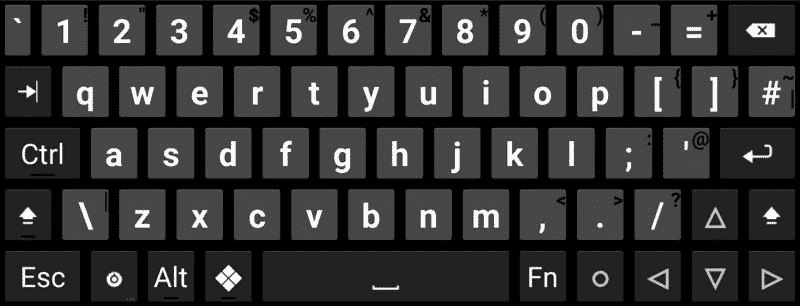
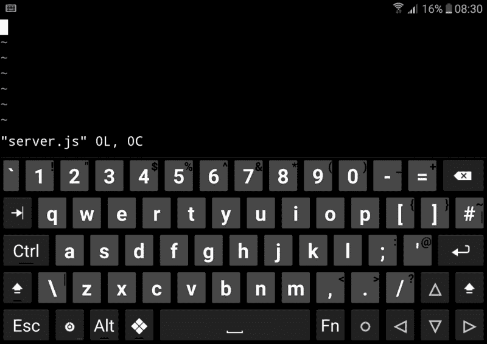
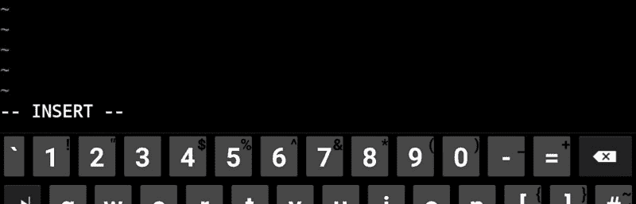

# 在 Android 上构建 Node.js 应用程序

> 原文：<https://www.freecodecamp.org/news/building-a-node-js-application-on-android-part-1-termux-vim-and-node-js-dfa90c28958f/>

由 aurélien giraud


# 在 Android 上构建 Node.js 应用程序——第 1 部分:Termux、Vim 和 Node.js

如果你对 Node.js 感到兴奋，并且拥有一台 Android 设备，毫无疑问你会喜欢在上面运行 Node.js。感谢 Android 的终端模拟器和 Linux 环境，开发 Node.js web 应用程序的乐趣就在几个 npm 安装程序之外！

### 我们要做什么

我将展示如何在 Android 上使用 Termux 开始使用 Node.js。我们还将使用 Express，看看如何在 NeDB 中存储我们应用程序的数据，NeDB 是一个轻量级 JavaScript 数据库，其 API 是 MongoDB 的一个子集。

在第一篇文章中，我们将仅限于设置 Node.js 开发环境，即:

1.  **安装并配置 Termux。**
2.  安装并查看如何使用 Vim 作为文本编辑器。(如果你已经了解 Vim，可以跳过这一节。)
3.  **安装并运行 Node.js.**

### 1.泰尔穆克


The Termux CLI

Termux 结合了终端仿真和 Linux 包集合。它是一个免费的应用程序，可以直接从 [Play Store](https://play.google.com/store/apps/details?id=com.termux) 或 [F-Droid](https://f-droid.org/en/packages/com.termux/) 目录中安装。

#### 配置

当你打开 Termux 时，迎接你的是一个[命令行界面](https://en.wikipedia.org/wiki/Shell_%28computing%29) (CLI)。安装 Termux 后，建议立即检查是否有更新，并根据需要进行升级。因此，在提示符下键入以下命令——也就是在“$”符号之后——并按下< Enter >:

```
$ apt update && apt upgrade
```

Termux 附带了一个最小的基本系统，因此您还应该为[基本 CLI 实用程序的成熟变体安装“coreutils”，如“mv”、“ls”等。](https://devdactic.com/10-basic-bash-commands/)

```
$ apt install coreutils
```

#### 储存；储备

Termux 中有三种主要的[存储类型:](https://wiki.termux.com/wiki/Internal_and_external_storage)

1.  **App-private storage** :这就是你启动 Termux 的地方。
2.  **共享内部存储**:设备中可供所有应用使用的存储。
3.  **外部存储**:外部 SD 卡上的存储。

虽然 Termux 中的环境设置类似于现代 Linux 发行版的环境设置，但在 Android 上运行意味着不同，到目前为止，我只成功地完全运行了 Node.js，同时将我的数据存储在 Termux 的私有存储中(上面的选项 1)。

因此，让我们为我们的应用程序创建一个目录，并更改到此目录:

```
$ mkdir test-node && cd test-node
```

#### 键盘

到目前为止，我一直只使用软键盘，在使用[音量增大键](https://termux.com/touch-keyboard.html)替代< Esc >、< Tab >或箭头键时，我遇到了一些默认触摸键盘的问题。

为了规避这些问题，我从 Play Store 安装了 [Hacker 的键盘](https://play.google.com/store/apps/details?id=org.pocketworkstation.pckeyboard)，我非常喜欢它。它是一个触摸键盘，可以用来代替默认键盘，拥有编写代码和使用终端所需的所有按键。

您可以直接在[帮助页面](https://termux.com/help.html)上找到关于使用 Termux 触摸或硬件键盘的有用信息。



The Hacker’s keyboard

#### 使用多个会话

关于 Termux，还有一点我想提一下:如果你从屏幕的左边缘向左向右滑动，它会打开一个菜单，允许启动多个 Termux 会话或在多个 Termux 会话之间切换。

#### 在 Termux 中访问帮助

在 Termux 中，您可以通过长按屏幕，首先点击“更多”，然后点击“帮助”来访问包含所有必要信息的帮助文档。请注意，当您的设备未接入互联网时，将无法访问此帮助文稿。

### 2.精力

Vim 是一个文本编辑器，可以直接在命令行界面中使用，它是 Termux 中的一个包。所以让我们安装它:

```
$ apt install vim
```

Vim 的界面不是基于菜单或图标，而是基于文本用户界面中给出的命令。如果你是新手，我将指导你了解 Vim 的基础知识。

首先，创建文件“server.js”:

```
$ touch server.js 
```

要用 Vim 编辑这个文件，只需输入:

```
$ vim server.js
```



Vim displaying the content of the empty file server.js

#### 使用不同的模式

根据您所处的模式，Vim 的行为会有所不同。开始时，你处于所谓的*命令模式*。您应该在第一行看到一个光标，在其他行看到波浪号(~)，文件名在最底部。

波浪线在这里表示这些行不是文件内容的一部分。

要开始写入文件，需要切换到*写入模式。*所以只需输入字母“I”。在最底部，您应该会看到类似这样的内容:



Vim is now in writing *mode*

所以现在继续。写点东西。

完成了吗？所以这里是你如何保存你的改变/退出 Vim。首先你需要通过按下< Esc >返回到*命令模式*，然后你可以选择:

1.  键入 **:w** 并按<回车>保存(写入)更改。
2.  键入 **:wq** 并按<回车>保存更改并退出。
3.  Type **:q！**并按<回车>退出，不保存更改。

这就是我们对 Vim 的简短介绍。

#### 不要迷路，了解更多关于 Vim 的信息

如果迷路了，可以按<esc>和**键输入**:帮助后按<键输入>。这将打开 Vim 帮助文档。</esc>

如果您是 Vim 新手，像这样简单的 [Vim 引用](https://simpletutorials.com/c/1238/Simple+Vim+Reference)可能会有用。或者，你也可以在终端输入“vimtutor”获得 30 分钟的教程，在 http://vim-adventures.com/的[玩一个学习游戏，或者在 http://www.openvim.com/的](http://vim-adventures.com/)[跟随互动教程。](http://www.openvim.com/)

### 3.节点. js

安装 [Node.js](https://nodejs.org/en/) 非常简单:

```
$ apt install nodejs
```

如果您还没有这样做，为应用程序创建一个文件夹，移动到其中并键入:

```
$ npm init
```

这会问你一堆问题，然后给你写一个‘package . JSON’文件。(您可以针对每个问题按<enter>。)</enter>

现在让我们检查一下是否一切正常。打开 server.js

```
$ vim server.js
```

并输入它

```
console.log('This is Node.js running on Android.')
```

保存更改并退出 Vim。

现在一切就绪，我们终于可以运行 node:

```
$ node server.js
```

这应该打印文本“这是运行在 Android 上的 Node.js。”在终点站。


### 简单地

概括一下，这是整个过程(略有不同，因为都是直接从命令行完成的)。

```
Update and upgrade Termux:  $ apt update && apt upgrade
```

```
Install some core utilities, Vim and Node.js:  $ apt install coreutils  $ apt install vim  $ apt install nodejs
```

```
Create a directory called test-node and move into it:  $ mkdir test-node && cd test-node
```

```
Create an empty file called server.js:  $ touch server.js
```

```
Interactively create a package.json file:  $ npm init
```

```
Add some content to server.js:  $ echo “console.log(‘This is Node.js running on Android.’)” > server.js
```

```
Run node:  $ node server.js
```

### 包装它

我们已经看到了如何在 Android 上使用 Termux，如何用 Vim 编辑文件以及如何运行 Node.js。

以下是与 Termux 相关的主要链接:它的[网页](https://termux.com/)，它的[维基](https://wiki.termux.com/)和它的 [GitHub 库](https://github.com/termux)。它可以从 [Play Store](https://play.google.com/store/apps/details?id=com.termux) 或者从 [F-Droid](https://f-droid.org/en/packages/com.termux/) 目录中安装。

在下一篇文章中，我们将使用 [Express](http://expressjs.com/) web 框架和一个名为 [NeDB](https://github.com/louischatriot/nedb) 的轻量级 JavaScript 数据库构建一个基本的 Node.js 应用程序，该数据库使用 [MongoDB](https://www.mongodb.org/) 的 API，可用于在 Termux 中开发和运行 web 应用程序。

同时，祝您编码愉快！