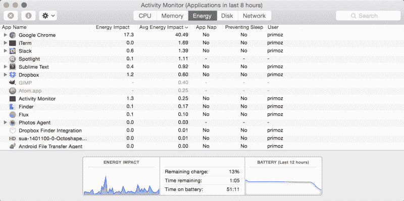
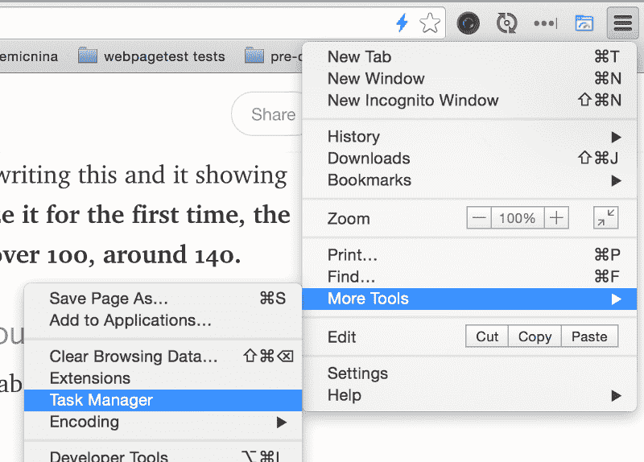
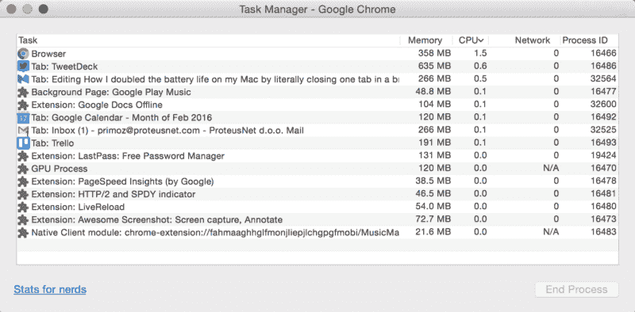
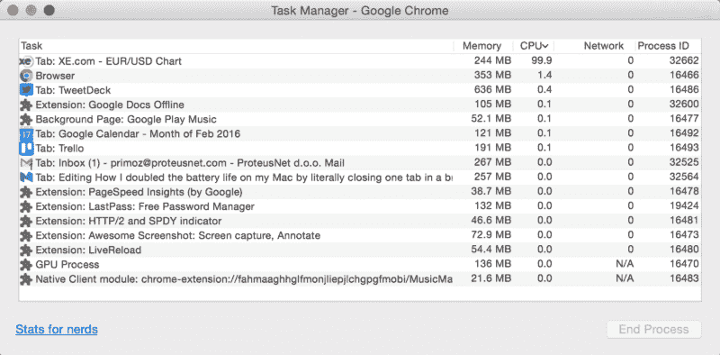

# 我是如何通过关闭浏览器中的一个标签来延长 Mac 电脑的电池寿命的

> 原文：<https://www.freecodecamp.org/news/how-i-doubled-the-battery-life-on-my-mac-by-literally-closing-one-tab-in-a-browser-d96f2c5374db/>

by Primož Cigler

# 我是如何通过关闭浏览器中的一个标签来延长 Mac 电脑的电池寿命的

今天，我想分享一个快速简单的方法，让我的笔记本电脑的电池续航时间增加了一倍。

一旦你知道去哪里找，就很容易做到。

我在笔记本电脑上的大部分时间都在浏览器中度过。这主要是因为我阅读材料，坚持社交媒体或开发网站。为此我使用 Chrome，我很少打开其他浏览器——大部分时间只是为了测试。

众所周知，Chrome 不是一个节能的应用程序，所以这是一个权衡，但我发现它比其他任何东西都好(特别是对开发人员来说)。

很长一段时间以来，我开始注意到电池不像一年半前我买这台笔记本电脑时那样耐用了。随着时间的推移，它正在失去力量，这是正常的。但是大约 2 周前的一天，当我生病躺在床上时，我决定检查一下是什么让我的电池这么快就没电了，我是否能修好它。

幸运的是，OS X 配备了活动监视器，它还可以让你概述哪些应用程序对你的电池寿命影响最大。

Activity Monitor

如果你按列*平均能量影响*对列表排序，你会找到最麻烦的应用。在我的情况下，谷歌浏览器。你可以通过退出应用程序轻松解决这个问题，但正如我提到的，这在我的情况下是不可行的，因为我想使用 Chrome。

上面的截图是在我写这篇文章的时候拍摄的，它显示了“修复”的 Chrome。**当我第一次去分析它的时候，Chrome 的*平均能量影响*值远远超过 100，大约为 140** 。

#### 那么，我是如何把它缩减到三分之一的呢？

这很简单。我不得不关闭 Chrome 浏览器中的一个标签页，这个标签页占用了大量的 CPU。

我在 Chrome 中的工具栏是这样的:

我有几个固定的标签，我想一直打开，然后是“*来来去去”*的标签。

Chrome 中有一个不太知名的工具，可以让你分析**单个标签页消耗了**多少资源。它叫做**任务管理器**，你可以在**菜单>更多工具>任务管理器**中找到。

Where to find Task Manager in Chrome

当打开时，它会显示 Chrome 中 CPU 和 RAM 消耗的更多细节。

Chrome Task Meneger

你感兴趣的是 CPU——这是消耗你电池的东西。

> 找到那些不断贪婪你的 CPU 的 tab，用火杀死它们！

我的案子。我让货币汇率(美元对欧元)一直处于开放状态。这一页是。看看这个，当我打开这一页并把它钉住的时候:

Tab XE.com is sooooooo CPU intensive (the tab was inactive when I created the screenshot)

这是显而易见的选择。如果能让我的笔记本电脑多活一倍的时间，我就能过没有汇率标签的生活。

如果你觉得你的笔记本电脑电池因为 Chrome 而在挣扎，检查一下 Chrome 任务管理器。用火杀死最贪婪的网站，并通知他们的开发者。他们可能正在 JavaScript 中做一些肮脏的事情，这将耗尽你的电池。

你可能会在推特上关注我，但我们都知道推特非常嘈杂。所以你可以[给我你的电子邮件](http://eepurl.com/bLlBLj)，我会偶尔给你发一些我觉得有用的东西。