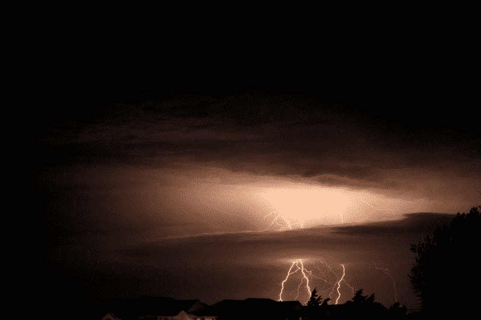
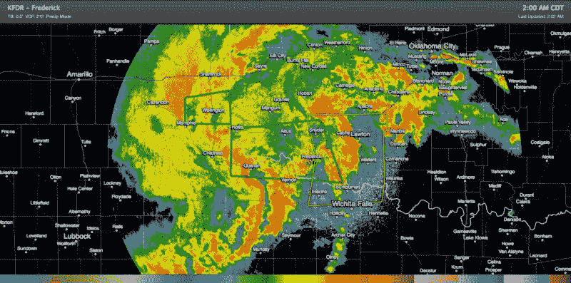

# 从气象学家的角度看编码

> 原文：<https://www.freecodecamp.org/news/coding-from-a-meteorologist-s-perspective-3c81aa9c1160/>

贾斯汀·林恩·里德

# 从气象学家的角度看编码

Cloud-to-Ground Lightning over Norman, Oklahoma 2014 — Taken by Justin Lynn Reid

除了研究人员和电视气象人员，很少有人精通气象学和大气科学的技术方面。

大气科学是一个兼收并蓄的领域，它将数学、物理、技术写作、学术研究和大众传播的各个方面结合成一个具有独特视角的领域。

我从事过许多大气科学的相关工作。我现在的专业与大多数气象学家在训练中所做的有所不同。

我不再专注于传统的业务预报、电视或政府研究，而是被称为**气象程序员**:一部分是气象学家，一部分是软件开发者。

引用我的一位前同事的话，气象学是“第一个大数据问题”，其中存在许多数据科学新领域的先驱。地球观测网络(如卫星、地面气象站、气象气球和多普勒天气雷达)本质上是一个 24 小时运行的低分辨率物联网。从这些网络中，几个物理模型(称为*数值天气预报(NWP)模型*)由政府机构或私人公司在超级计算机上运行，产生一组对未来大气条件的最佳猜测，由预报员进行解释和分析。正是这些幕后的东西产生了你在网上或通过当地媒体渠道获得的天气预报。

你可能会问，所有这些与像[自由代码营](https://www.freecodecamp.org/news/coding-from-a-meteorologist-s-perspective-3c81aa9c1160/undefined)、JavaScript 或网络开发有什么关系？我将强调一些我认为这个主题直接有助于软件开发过程，甚至有助于更好地理解它的方法。

#### 科学方法与“弗里兹尔女士原则”

“Take Chances, Get Messy, Make Mistakes!” — Image Source: [lead_large.png](http://cdn.thewire.com/media/img/upload/wire/2014/06/11/Screen_Shot_2014_06_11_at_11.24.39_AM/lead_large.png)

在大气科学中，正如在其他 STEM 领域一样，新的发现或见解是通过实验、测试和同行评议获得的。即使在从事气象行业多年之后，我仍然称这个过程为“弗瑞斯女士原理”

在《神奇校车》的一集里，弗里兹尔和她的学生们正在实地考察一座海底火山，其中一个角色一直引用已经写好的研究作为她主要的理解来源。在旅途中，学生丢失了她的书，从而失去了访问她一直引用的“研究”的机会。在这个过程中，她必须学会根据自己的观察得出结论。在节目的最后，学生的结论最终被证明是正确的，因为她推断海底火山将爆发并形成一个新的岛屿。

如果在我所做的编程工作中有什么是一致的，那就是我在完成每个项目或任务时都遵循这种过程。尽管我确实可以通过文档、论坛帖子和协作的形式来访问“研究”;没有人告诉我如何将所有的部分放在一起，以创建我必须创建的应用程序。

为了正确地编写应用程序，我必须将一个大问题分解成一系列小问题。对于每一个较小的问题，我都必须努力寻找想法之间的联系，以便制定一个可能的解决方案。

这是一个假设，在编程中，我可以把我最好的猜测写成代码行。然后，我针对给定的小问题测试这些代码行，看看它们是否有应该正确的行为。如果代码成功了，我就进入下一个小问题，如果失败了，我就试着去了解*为什么*代码失败了。然后利用这些信息再次尝试解决这个小问题。

当你解决了所有的小问题，应用程序就完成了。这就是为什么当我听说像 [Jasmine](http://jasmine.github.io) 这样的测试驱动开发和框架时，我发现以那种方式看代码对我个人来说是很自然的。它只是被置于一种正式的做事方式中。

如果我可以给你两条关于编程的建议，那就是:

*   永远不要从整体上解决一个大问题
*   永远不要让缺乏知识吓倒你，因为每个新项目都是一次未知之旅，失败总是伴随着未知。

#### 气象领域的技术和网络是非常密切的关系

除了科学方法之外，气象学还有大量特定领域的技术，这使得向 web 开发的过渡并不困难。

除了暴露在网络上，如 API 或通过使用气象数据的网络应用程序，许多大气科学计算的基本概念直接转换过来。

例如，你在电视上看到的雷达图像等事物是*数据可视化，*可以有效解释的大量观察/数据的简化形式。

在雷达和卫星的情况下，每次观察都是通过*遥感*收集的像素，而不是将像素值放在表格中。数据以更有用的形式呈现。

An example of a standard weather radar image. The variable visualized is called Reflectivity and correlates with heavier precipitation. Data visualizations like these are the bread and butter of operational weather forecasting. Source: RadarScope by WDT

在 web 开发中，数据是应用程序行为和外观的核心，也是应用程序内容的核心。

在网络上，相同的概念以一种更普遍的方式使用，比如用 [D3.js](https://d3js.org) ，而不是在一个普通的气象学设置中操作数据(比如找到平均或最高温度)。

甚至在可视化之外，常见的气象技术也有更多的 web 行业标准类似物，例如 [Unidata LDM](http://www.unidata.ucar.edu/software/ldm/ldm-current/factsheet.html) 和 [Node.js](http://nodejs.org) 。气象学不可避免地与编程和网络联系在一起，这两者都是成为大气科学家和专业技术人员的重要组成部分。

总之，这就是我如何从个人角度看待编程的。每个人编程的理由都不一样。我希望这能给你一些如何将它应用到科学领域的观点。