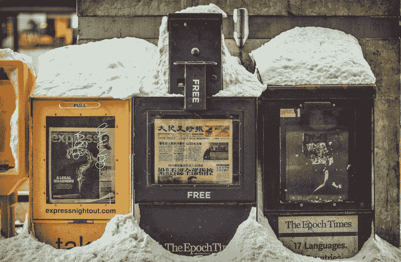
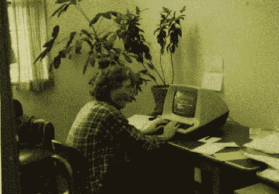
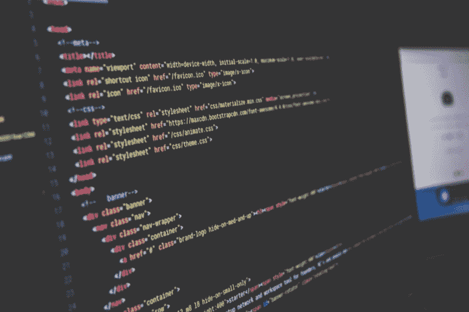
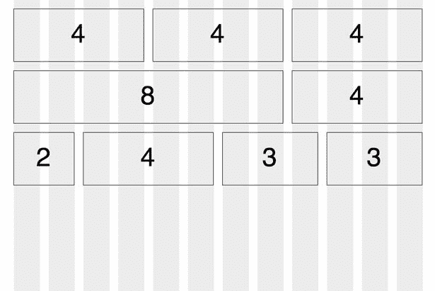
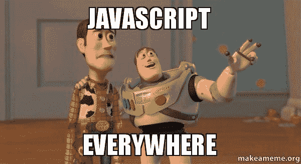
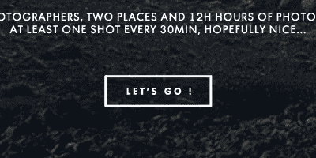

# 捆绑你的收件箱成为一个更好的开发者

> 原文：<https://www.freecodecamp.org/news/bundle-up-your-inbox-to-be-a-better-dev-f9f52e6d6bf/>

作者丹·麦克亨利

# 捆绑你的收件箱成为一个更好的开发者

#### 面向前端人员的七份最佳简讯

Baby, it’s cold outside, but we’ve got some excellent reading material for you. Photo credit: [Matt Popovich](https://unsplash.com/mattpopovich)

我们可能再也回不到在网络早期建立社区和分享知识的邮件列表和论坛的好日子了，但是时事通讯又开始流行了。他们中的佼佼者在新的大规模多渠道社交网络中发挥了巨大的作用。它们是集中的，由有知识的人管理，他们都过滤和提取重要的东西，我们从来没有时间独自完成。

Duke grad student Stephen Daniel, who wrote the software that first powered Usenet. Photo credit: Duke University

这里收集了一些真正有价值的时事通讯，涵盖了从事网络工作的人，尤其是前端开发人员感兴趣的一系列领域。

***热门提示:*** *把这些用一个普通的标签捆绑在你的收件箱里，比如“时事通讯”这在 Gmail 中很容易实现，在收件箱中甚至更好。*

#### 关于网络开发的一般问题

Photo credit: [Sai Kiran Anagani](https://unsplash.com/iamkiran)

[*网页开发阅读清单*](http://wdrl.info)**【WDRL】作者[安瑟伦·汉纳曼](https://medium.com/@helloanselm)
[*前端开发周刊*](http://frontenddevweekly.com) 作者[盖伦·温特](https://medium.com/@gvinter)**

**这些列表的主题涵盖了从 JavaScript 到 Sass、从 web 性能到可访问性的所有内容。**

**WDRL 拥有一些令人印象深刻的代言人，比如阿迪·奥斯马尼，他们说他们每周都会发现一些有趣的东西。它提供了大量的链接和高质量的评论，并定期点击该领域一些知名人士的作品。**

**前端开发周刊是两者中知名度较低的，但值得一看。简讯本身的设计在手机上看起来更容易。(Vinter 肯定是在考虑 HTML 电子邮件的移动体验，所以有双倍的好处。)但是质量超越了设计，时事通讯应该拥有更广泛的读者群。**

**这是一个更简短，更容易消化的选择，但令人惊讶的是几乎没有重叠，这两个策展人的选择往往会很好地互补。**

**[**【WDRL-Web 开发阅读清单| Web 开发阅读清单**](https://wdrl.info/)
[*一份手工制作、精心挑选的 Web 开发相关资源清单。通常每周出版。* wdrl.info](https://wdrl.info/) [**前端开发者周刊**](http://frontenddevweekly.com/)
[*前端开发者每周精选新闻、工具、灵感。订阅，永不错过任何一期。*frontenddevweekly.com](http://frontenddevweekly.com/)**

#### **关于 CSS**

**

CSS Grid Layout image borrowed from an old [Web Designer Depot](http://www.webdesignerdepot.com/2010/07/30-useful-frameworks-for-designers/) post.** 

**[*CSS 周刊*](http://css-weekly.com)by[Zoran Jambor](https://medium.com/@zoranjambor)
[*CSS 版面新闻*](http://csslayout.news)by[Rachel Andrew](https://medium.com/@rachelandrew)**

**有了像萨拉·苏伊丹和 T2·瑞秋·纳伯斯这样的人的支持，你真的不需要我在《CSS 周刊》上推销你。格式非常一致:两篇特色文章，大约五篇教程和其他有用文章的列表，两个推荐的工具，以及一个启发您自己使用 CSS 工作的站点。你保证每周都能学到一些东西。**

**CSS 布局新闻更有针对性，但极具启发性，不仅涵盖了构建页面的基本重要主题——尤其是跨设备的主题——而且始终以高质量内容为特色。重点通常是一个学习资源列表，附有简短的评论，然后是一个较短的有趣阅读列表，所选内容涵盖从 flexbox 到网格布局再到响应图像的主题。**

**[**CSS 周刊**](http://css-weekly.com/)
[*每周电子邮件综述最新 CSS 文章、教程、工具和实验。*css-weekly.com](http://css-weekly.com/)[**CSS 布局新闻**](http://csslayout.news/)
[*上周我在奥地利林茨的 TopConf 上展示了 CSS grid。您可以从演示文稿中找到幻灯片和链接……*CSS layout . news](http://csslayout.news/)**

#### **关于 JavaScript**

****

**[*JavaScript 周刊*](http://javascriptweekly.com) 作者[皮特·库珀](https://medium.com/@peterc)**

**这本书让我想起了一本学术评论期刊，精简到电子邮件通讯格式所要求的简洁。它以一组推荐文章的简要概要开始，通常还附有一个关于文章的质量、性质或重要性及其方法的注释。**

**接下来是 JavaScript 工作的简要列表，最后是“简要”项目的全面列表:没有评论或概要的链接，但用标签编码，如“教程”、“工具”、“新闻”和“观点”。库珀有一大堆其他的时事通讯，他是如何做到这一切的令人费解。**

**[**【JavaScript Weekly 】:免费的每周电子邮件简讯**](http://javascriptweekly.com/)
[*免费的每周一次的 JavaScript 新闻和文章的电子邮件摘要。*javascriptweekly.com](http://javascriptweekly.com/)**

#### **论网络动画**

**

Animation of the week from The UI Animation Newsletter #16.05** 

**[*网页动画周刊*](http://rachelnabors.com/newsletters/) 作者[瑞琪儿](https://medium.com/@rachelnabors)
[*UI 动画快讯*](http://valhead.com/newsletter/) 作者 [Val 负责人](https://medium.com/@vlh)**

**Web Animation Weekly 通常以一段左右的文字(或偶尔一篇短文)开始，讲述作者的个人经历，从在该领域学到的经验教训，到重要的项目，到推荐的书籍等等。接下来是一个非常简洁的标签链接列表(例如，UX、交互设计、灵感),以及为什么该资源值得研究的简要说明。**

**UI 动画简讯以自己的一点经验开始，以个人的声音撰写，通常充满有用的链接。接下来的不仅仅是一个链接列表。每种资源都有一个经过深思熟虑的总结，并被分成不同的类别，如工具、灵感、教程，甚至是即将到来的研讨会。**

**同样，这是两份互补多于竞争的时事通讯。**

**[**邮件列表和简讯我跑**](http://rachelnabors.com/newsletters/)
[*您好！我是瑞秋·纳伯斯，获奖漫画家，国际演说家，用代码创作故事。*rachelnabors.com](http://rachelnabors.com/newsletters/)**

**这指出了一个重要的事实:这个领域对我们所有人来说都足够大。我们不能单独解析，我们都有贡献。所以，勇往直前，从别人的努力中获取你所能获取的，但不要忘记回报。**

#### **Mac/iOS 类型的额外热门提示。**

**你可以开发一个工作流程，把你最感兴趣或最相关的链接放在一起，比如打开，然后从浏览器发送到 Pocket 或 Instapaper 等应用程序。一个接一个的链接。从电子邮件切换到浏览器，加载你还没有准备好阅读的页面。但是，如果你正在寻找一种更干净、更有效的方式来浏览收件箱，并从列表中进行挑选，以供你以后阅读，Safari 是你的朋友。**

**iOS 上的任何电子邮件客户端都可以让你发送一个指向 Safari 阅读列表的超链接。只需长按链接，从对话框中选择*添加到阅读列表*。你不需要打开页面，也不会离开你的邮件客户端。将 iCloud 设定为同步后，您现在可以从任何 Apple 设备上阅读您选取的文章。**