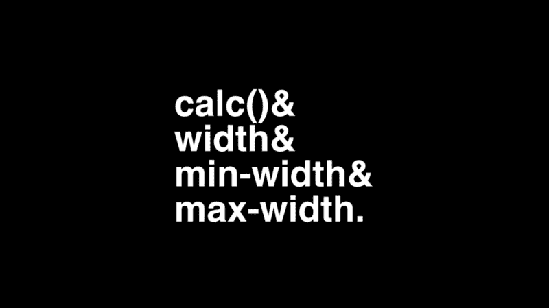
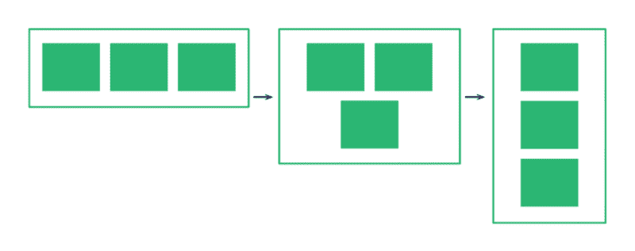
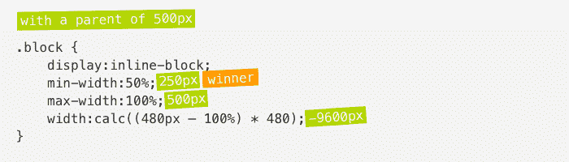
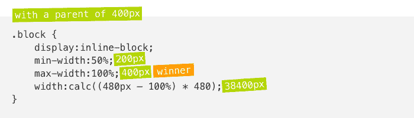
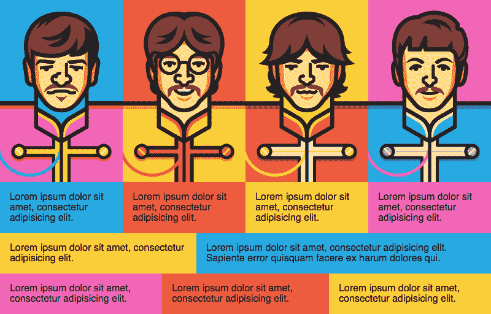
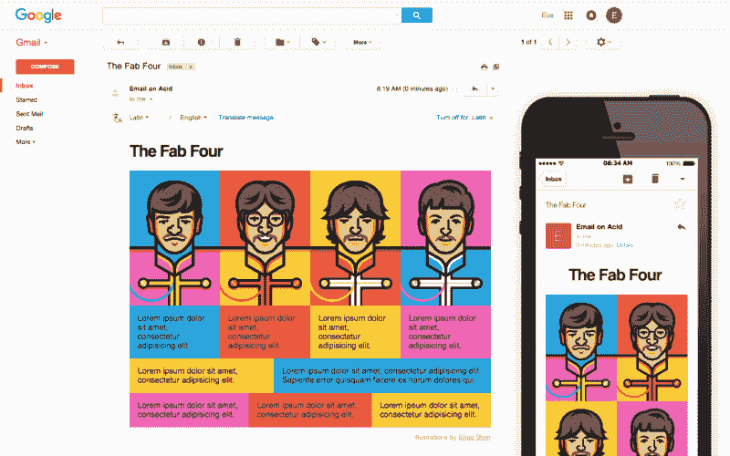
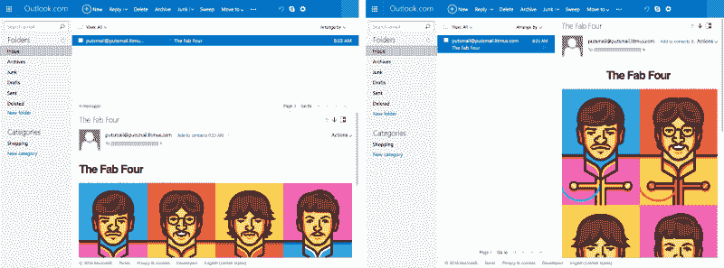

# Fab Four 技术无需媒体询问即可创建回复邮件

> 原文：<https://www.freecodecamp.org/news/the-fab-four-technique-to-create-responsive-emails-without-media-queries-baf11fdfa848/>

按实玖瑠整

# Fab Four 技术无需媒体询问即可创建回复邮件

我想我找到了一种新的方式来创建回复邮件，没有媒体的质疑。该解决方案涉及 CSS *calc()* 函数和三个*宽度*、*最小宽度*和*最大宽度*属性。

或者我喜欢称他们为“四巨头”(CSS)。



calc() & width & min-width & max-width, aka The Fab Four (in CSS).

### 问题是

回复邮件很难，尤其是因为手机邮件客户端(如 Gmail、雅虎或 Outlook.com)不支持媒体查询。一个[混合方法](http://labs.actionrocket.co/the-hybrid-coding-approach)，一个 [Gmail 优先策略](https://julie.io/writing/gmail-first-strategy-for-responsive-emails/)，或者[一封没有媒体询问的回复邮件](http://webdesign.tutsplus.com/tutorials/creating-a-future-proof-responsive-email-without-media-queries--cms-23919)都是适应这种情况的好方法。

到目前为止，最后一种方法是我最喜欢的。主要的想法是让固定宽度的列*<d*iv>s*与“显示:内嵌-* 块”对齐。一旦一个屏幕不能再包含两个并排的块，它们将自然地在彼此下面流动。但我一直对此有意见。

一旦所有的块都堆叠起来，它们就不会占据邮件的整个宽度。



Without media queries, columns can stack up but not grow full width. [Illustration by Nicole Merlin](http://webdesign.tutsplus.com/tutorials/creating-a-future-proof-responsive-email-without-media-queries--cms-23919).

很久以来，我一直在寻找解决这个问题的方法。Flexbox 是一个很好的竞争者，但是不幸的是电子邮件中对 Flexbox 的支持很糟糕。

### 一个解决方案

#### *记忆宽度*、*最小宽度*和*最大宽度*

在 *calc()* 函数之上，我找到的解决方案涉及这三个 CSS 属性。为了充分理解它的工作原理，这里提醒一下*宽度*、*最小宽度*和*最大宽度*一起使用时的行为(正如法国前端开发人员拉斐尔·戈特(raphal go etter)对[的清晰总结)。](http://goetter.tumblr.com/post/64119638003/quiz-parce-que-la-taille-%C3%A7a-compte)

*   如果*宽度*值大于*最大宽度*值，*最大宽度*获胜。
*   如果*最小宽度*值大于*宽度*或*最大宽度*值，则*最小宽度*获胜。

你能猜出下列款式的盒子的宽度吗？

```
.box {    width:320px;    min-width:480px;    max-width:160px;}
```

(回答:这个盒子的宽度应该是 480 像素。)

#### 介绍 calc()和神奇公式

话不多说，下面是 Fab Four 创建两列的示例，这两列将在 480px 以下堆叠和增长。

```
.block {    display:inline-block;    min-width:50%;    max-width:100%;    width:calc((480px — 100%) * 480);}
```

让我们对每个*宽度*属性进行分解。

```
min-width:50%;
```

属性定义了我们桌面版本的列宽。我们可以更改该值以添加更多的列(例如，四列布局为 25%)，或者设置具有固定像素宽度的列。

```
max-width:100%;
```

属性定义了我们的移动版本的列宽。100%时，每一列将增长并适应其父容器的全宽。我们可以更改该值以保持列移动(例如，50%用于两列布局)。

```
width:calc((480px — 100%) * 480);
```

感谢 *calc()* 函数， *width* 属性就是神奇之处。 *480* 值与我们期望的断点值相匹配。100%对应于我们的列的父容器的宽度。这个计算的目标是创建一个比我们的*最大宽度*大或者比我们的*最小宽度*小的值，以便应用这些属性中的任何一个。

这里有两个例子。



父级为 500px 时，计算出的*宽度*等于-9600px。它小于最小宽度。所以 50%的最小宽度胜出。因此，我们有一个两列布局。



如果父级为 400px，则计算出的*宽度*等于 38400px。它大于最小宽度，但最大宽度小于最小宽度。所以 100%的最大宽度胜出。因此，我们有一列布局。

### 演示

这里有一个演示，展示了这种技术可以做什么。
你可以[在这里](http://emails.hteumeuleu.fr/wp-content/uploads/2016/02/the-fab-four.html)在线观看完整的演示(或者在石蕊生成器上的[或者在 CodePen](https://litmus.com/builder/9c0fce1) 上的[)。](http://codepen.io/hteumeuleu/pen/VaZgqg)



Illustrations by [Elias Stein](https://dribbble.com/shots/2012203-Paul-George)

这里有两个 Gmail 中的演示截图，一个在桌面 webmail 上，一个在 iOS 的移动应用上。相同的代码，不同的渲染。



The Fab Four demo as seen on the Gmail desktop webmail and on the Gmail iOS app.

在这个演示中，我设置了几个不同网格的例子(两列、三列、四列)。第一个包含图像的网格是从桌面上的四列扩展到移动设备上的两列。其他网格被构建为在移动设备上增长全宽。

此外，请注意标题如何从桌面上的左对齐位置切换到移动设备上的居中位置。这是通过给标题一个固定的宽度 190 像素和一个"*边距:0 自动；*"使其居中。在桌面上，标题的父容器应用了 190 像素的最小宽度，所以徽标留在左侧。在 mobile 上，父容器变得全宽，因此徽标会居中。

这种技术的一个很好的方面是，因为一切都基于网格的父宽度，所以电子邮件甚至可以适用于桌面 webmail。例如，在 Outlook.com 上，无论您选择将阅读窗格放在底部还是右侧，电子邮件都会正确响应阅读窗格的宽度。这对于媒体询问来说是不可能的。



On Outlook.com, the email adapts to the different views.

### 支持

在浏览器中，calc()从 IE9 开始就被[很好地支持了。事实证明，calc()在电子邮件客户端也有很好的支持。它可以在苹果邮件(iOS 和 OS X)、雷鸟、Outlook (iOS 和 Android 应用)、Gmail(网络邮件、iOS 和 Android 应用)、美国在线(网络邮件)和老 Outlook.com(仍在欧洲存在)上运行。](http://caniuse.com/#search=calc())

#### 旧 Outlook.com

不过，Outlook.com 有一个小怪癖。webmail 将使用包含任何括号的 *calc()* 过滤每个属性。这意味着支持“ *calc(480px - 100%)* ”，但不支持“ *calc((480px - 100%) * 480)* ”。由于我的初始公式包含括号，我们需要重构它以避免括号。所以支持老 Outlook.com 的公式是这样的。

```
width:calc(480px * 480 — 100% * 480);
```

#### 不支持的客户端

当然， *calc()* 在 Lotus Notes 这样的旧电子邮件客户端，或者最新的 Outlook for Windows(使用 Word 的 HTML 渲染引擎)中都不支持。它也不能在 Outlook Web App(Office 365 和新版 Outlook.com)和雅虎(webmail、iOS 和 Android 应用)上运行。这两个函数将去掉所有涉及 *calc()* 的属性。

#### 后退

在这些情况下，我建议为不支持 *calc()* 的客户端复制所有包含固定宽度值的属性。为了对那些客户隐藏 Fab Four，我建议使用 *calc()* 函数，即使它在技术上没有用。我们的第一个例子如下所示。

```
.block {    display:inline-block;    min-width:240px;    width:50%;    max-width:100%;    min-width:calc(50%);    width:calc(480px * 480 — 100% * 480);}
```

#### Outlook Web App

然而，Outlook Web App(Office 365 和新版 Outlook.com)还有一个独特之处。当一个 *calc()* 函数包含一个乘法(带' *** '字符)时，新的 Outlook.com 和 Office 365 会移除整个内联*样式*属性对应。这意味着我们需要手动计算乘法，并且只保留得到的减法。下面是 480px 断点的最终计算结果。

```
width:calc(230400px — 48000%);
```

#### WebKit 前缀

旧版本的 Android(Android 5.0 之前)或 iOS(iOS 7 之前)需要 *-webkit-* 前缀才能工作。我们的最终版本如下所示。

```
.block {    display:inline-block;    min-width:240px;    width:50%;    max-width:100%;    min-width:-webkit-calc(50%);    min-width:calc(50%);    width:-webkit-calc(230400px — 48000%);    width:calc(230400px — 48000%);}
```

### 缺点和最终想法

就像电子邮件开发领域的任何事情一样，Fab Four 技术并不完美。以下是我能想到的一些限制:

*   在雅虎上是行不通的。不过，其网络邮件的桌面版支持媒体查询。因此，我们可以通过制作我们电子邮件的移动第一版，然后在桌面上用媒体查询来增强它，来做一些改进。
*   您只能设置一个断点。不过，对于电子邮件来说，这可能不是一个问题，因为桌面上的设计很少超过 600 像素，在移动设备上不需要超过一个断点。
*   从桌面版本到移动版本，您只能减少列数。虽然这种情况很少发生，但你不能从手机上的四列布局变成桌面上的单列布局。
*   最终版本的计算(支持旧的 Outlook.com，并在新的上优雅地降级)很难读懂。使用预处理器和 mixin 来生成所有需要的属性可能会非常有用。

我仍然认为这项技术在很多情况下会非常方便，特别是对于 Gmail 优化。我相信也有网站的用例(如小工具、广告等)。

我迫不及待地想看看这会激发你创作什么。