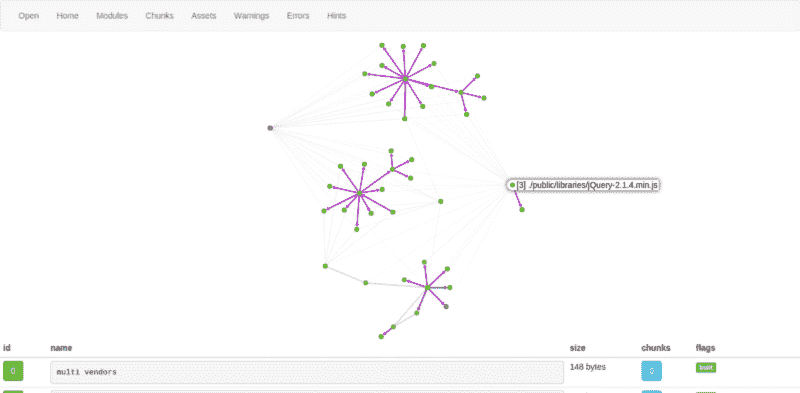

# 速度与激情的网络包

> 原文：<https://www.freecodecamp.org/news/webpack-for-the-fast-and-the-furious-bf8d3746adbd/>

> 也发表在我的科技博客

这是一个指南，旨在帮助您通过使用您在互联网上读到的一些令人敬畏的工具来简化您的开发工作流程并节省您的时间(React Hot Loader 让您想起什么了吗？)

它还旨在帮助您解决使用 Webpack 时最常遇到的一些问题，并在您开始拔头发之前节省一些时间。毕竟你想走快一点，把其他重要的问题撕个透。

您可能会遇到以下一个或多个问题:

*   我如何有多个条目？
*   如何填充模块？
*   我使用的一个库/插件依赖于 jQuery，我该如何处理？
*   我总是在 jQuery 插件中得到 *$未定义*或类似的一些愚蠢的废话
*   我的捆绑要花很长时间才能完成。
*   我读了一堆关于 ReactJS 的模块替换的教程，觉得这真的很酷，但是在设置的时候总是出错。

如果你遇到了这些困难，在你求助于栈溢出问题之前，请先完成这篇文章。


我假设您已经了解了 Webpack 的优点以及它的用途。如果你是初学者，不知道什么是 Webpack，我强烈推荐你在这里阅读。

我还假设您正在构建一个 web 应用程序，而不仅仅是一些静态页面，这意味着您将有一个运行在 Node 和 Express 上的 web 服务器。您很可能还会使用 NodeJS 驱动程序与数据库对话——可能是 MongoDB 或 Redis。

下面是一个典型的 *webpack.config.js* 的样子:

```
/**
 * @Author Ashwin Hariharan
 * @Details Webpack config file for adding new vendors, defining entry points and shimming modules. 
 */

var webpack = require('webpack');
var path = require("path");

var lib_dir = __dirname + '/public/libs',
    node_dir = __dirname + '/node_modules';
   // bower_dir = __dirname + '/bower_components'

var config = {
    resolve: {
        alias: {
            react: node_dir + '/react',
            reactDom: lib_dir + '/react-dom',
            jquery: lib_dir + '/jquery-1.11.2.min.js', 
            magnificPopup: lib_dir + '/jquery.magnific-popup.js' //JQuery Plugin
        }
    },   

    entry: {
        app: ['./public/src/js/app-main'],
        vendors: ['react','reactDom','jquery','magnificPopup']
    },

    output: {
        path: path.join(__dirname, "public"),
        filename: "dist/js/[name].bundle.js"
    },

    plugins: [
        new webpack.ProvidePlugin({
            jQuery: "jquery",
            'window.jQuery': "jquery"
        }),
        new webpack.optimize.CommonsChunkPlugin('vendors', 'dist/js/vendors.js', Infinity),
    ],

    module: {
        noParse: [
            new RegExp(lib_dir + '/react.js'),
            new RegExp(lib_dir +'/jquery-1.11.2.min.js')
        ],
        loaders: [
            { 
                test: /\.js$/, 
                loader: 'babel',
                query: {
                    presets: ['react', 'es2015']
                }
            }, 
        ]
    }
};

module.exports = config;
```

这个配置假设您已经使用了保存在 *public/libs* 文件夹中一些节点模块和几个库的 dist 版本。如果你读过其他教程，你会明白这个文件中的配置是做什么的，但是我还是要简单解释一下这个文件中的一些东西是做什么的

*   **别名/供应商**
    您可以在这里包含所有的库/节点模块/其他供应商，并将它们映射到别名。然后，如果你在你的应用程序逻辑的任何部分使用一个模块，你可以这样写(在你的 *app-main.js* 或任何其他 js 文件中):

```
var React = require(‘react’);
var ReactDom = require('reactDom');
var $ = require('jquery');

//Your application logic
```

或者如果你更喜欢 AMD 而不是 CommonJS:

```
define(
    [
        ‘react’,
        ’reactDom’,
        ’jquery’
    ],
    function(React, ReactDom, $) {
        //Your application logic
    }
);
```

或者在 ES6 中也是如此:

```
import React from 'react';
import ReactDom from 'reactDom';
import $ from 'jquery';
```

*   **定义你的切入点**

```
entry: {

}
```

配置中的这个块允许 Webpack 确定应用程序开始执行的位置，并从中创建块。在应用程序中拥有多个入口点总是有利的。特别是，您可以将所有供应商文件——如 jQuery 和 react js——添加到一个块中。这样，即使您修改了源文件，您的供应商文件也将保持不变。

所以在上面的配置中，有两个入口点。一个用于 JS 开始的应用入口，一个用于供应商——每个供应商都映射到一个变量名。

*   **您的输出目录和捆绑文件名**

```
output: {
     path: path.join(__dirname, “public”),
     filename: “dist/js/[name].bundle.js”
 },
```

这个块告诉 Webpack 在构建过程之后给文件取什么名字，以及把它们放在哪里。在我们的示例中，我们有两个名为 *app* 和 *vendors* 的条目，因此在构建过程之后，您将在 */public/dist/js* 目录中有两个名为 *app.bundle.js* 和 *vendors.bundle.js* 的文件。

*   **插件**

Webpack 附带了丰富的插件生态系统来帮助满足特定的需求。我将简要解释几个最常用的方法:

*   使用 *CommonsChunkPlugin* 让 Webpack 确定您最常用的代码/模块，并将其放在一个单独的包中，以便在您的应用程序中的任何地方使用。
*   您可以选择使用 *ProvidePlugin* 来注入全局变量。有许多 jQuery 插件依赖于一个全局 jQuery 变量，如 *$，*，因此通过使用这个插件，Webpack 可以在每次遇到全局 *$* 标识符时预先考虑 *var $ = require("jquery")* 。其他插件也是如此，比如 Bootstrap。

通过包含 *noParse，*您可以告诉 Webpack 不要解析某些模块。当您只有这些模块/库的 dist 版本时，这很有用。缩短构建时间。


*   **装载机**

现在，如果你在 React 代码中编写 jsx，你可以使用 *jsx-loader* 或 *babel-loader* 将 JSX 预编译成 JavaScript。所以您可以运行 *npm install jsx-loader* 并将其包含在您的配置中:

```
loaders: [
    {                 
        test: /\.js$/,                 
        loader: 'jsx-loader'             
    },
]
```

然而，如果你用 JSX 和 ES6 编写代码，那么你需要使用 *babel-loader、*以及 React 的 babel 插件。所以运行*NPM install babel-core babel-loader babel-preset-es 2015 babel-preset-react*然后把这个添加到你的配置中，而不是上面的。

```
loaders: [
    { 
         test: /\.js$/, 
         loader: ‘babel’,
         query: {
             presets: [‘react’, ‘es2015’]
         },
         include: path.join(__dirname, ‘public’)
    }
]
```

同样，您有加载器来编译 TypeScript、CoffeeScript 等。

### **例子**

*   您的 web 服务器文件:

```
var http = require("http");
var express = require("express");
var consolidate = require('consolidate');
var handlebars = require('handlebars');
var bodyParser = require('body-parser');

var routes = require('./routes');

var app = express();

//Set the folder-name from where you serve the html page.
app.set('views', 'views'); 

//For using handlebars as the template engine.
app.set('view engine', 'html');
app.engine('html', consolidate.handlebars);

//Set the folder from where you serve all static files like images, css, javascripts, libraries etc
app.use(express.static('./public')); 

app.use(bodyParser.urlencoded({ extended: true }));
var portNumber = 8000;

http.createServer(app).listen(portNumber, function(){
    console.log('Server listening at port '+ portNumber);
  	app.get('/', function(req, res){ 
  	    console.log('request to / received');
  		res.render('index.html');		
  	});
});
```

*   app-main.js 从我们的前端逻辑开始:

```
define(
    [
        ‘react’,
        ’reactDom’,
        ’./components/home-page’
    ],
    function(React, ReactDom, HomePage){ 
        console.log(‘Loaded the Home Page’);
        ReactDom.render(<HomePage />, document.getElementById(‘componentContainer’));
    }
);
```

*   *home-page.js* 是我们的父 React 组件，它可能包含如下内容:

```
define(['react', 'jquery', 'magnificPopup'], function(React, $) {
    var HomePage = React.createClass({
        getInitialState: function() {
            return {
                userName: 'ashwin'
            }
        },
        componentDidMount: function() {
            $('.test-popup-link').magnificPopup({
                type: 'image'
                // other options
            });
        },
    	render: function() {
    	    return (
      	    	<div id="homePage">
      	    	    {this.state.userName}
      	    	    <a className="test-popup-link" href="path-to-image.jpg">Open popup</a>
       	    	</div>
    	    );
    	}
    });

    return HomePage;
});
```

打开你的终端，进入你的项目的根文件夹，运行 *webpack* 会创建两个文件: *vendors.bundle.js* 和*app . bundle . js*把这两个文件包含在你的*index.html*里，在你的浏览器里点击 [http://localhost:8000](http://localhost:8000) 。这将呈现一个组件，在网页上显示您的用户名。

现在，当你更多地使用 Webpack 时，你会因为不断地手工构建文件来查看浏览器上的变化而感到沮丧。如果有一种方法可以在每次对文件进行更改时自动执行构建过程，这不是很棒吗？因此，如果您厌倦了键入命令 *webpack* 并在每次更改类名时点击浏览器上的刷新按钮，请继续阅读…

### 使用 Webpack 开发服务器和 React 热加载器自动构建


我们将使用这个名为 **Webpack 开发服务器** *的令人敬畏的模块。*它是一个 express 服务器，运行在端口 8080 上，通过套接字连接向客户端发送关于编译状态的信息。我们还将使用 **React 热加载器**，它是 Webpack 的插件，允许在编辑 React 组件时即时实时刷新而不会丢失状态。

*   **步骤 1** :运行*NPM install web pack-dev-server—save-dev*，然后*NPM install react-hot-loader—save-dev*

然后你需要调整你的 Webpack 配置来使用这个插件。在您的加载器中，在任何其他加载器之前添加以下内容:

```
{ 
    test: /\.jsx?$/, 
    loaders: [‘react-hot’],
    include: path.join(__dirname, ‘public’)
}
```

这告诉 Webpack 对组件使用 React 热加载器。确保 React Hot Loader 在 loaders 数组中位于 Babel 之前。还要确保您有 *include: path.join(__dirname，' public')* 来避免处理 node_modules，否则您可能会得到如下错误:

*未捕获类型错误:无法读取未定义*的属性“NODE_ENV”

*   **第二步**:index.html*的变化*

如果你的*index.html*有这样的东西:

```
<script src="/dist/js/vendors.js"></script>
<script src="/dist/js/app.bundle.js"></script>
```

将它改为指向您的 webpack-dev-server 代理:

```
<script src="http://localhost:8080/dist/js/vendors.js"></script>
<script src="http://localhost:8080/dist/js/app.bundle.js"></script>
```

*   **第三步:**运行*web pack-dev-server-hot-inline*，

等待捆绑完成，然后在浏览器中点击 [http://localhost:8000](http://localhost:8000) (您的 express 服务器端口)。

如果您在设置 React Hot Loader 时遇到任何错误，您会发现这个 [**故障排除指南**](https://github.com/gaearon/react-hot-loader/blob/master/docs/Troubleshooting.md) 和这个关于 [**上堆栈溢出的精彩答案使用 Webpack**](http://stackoverflow.com/questions/28969861/managing-jquery-plugin-dependency-in-webpack) 管理 jQuery 插件依赖性非常有帮助。此外，您可以在这里和这里查看我的项目[的 Webpack 设置。](https://github.com/ashwin01/ReactJS-AdminLTE)

这只是为了发展。在制作过程中，您需要缩小所有文件。只要运行 *webpack -p* 就会缩小/扭曲/连接你所有的文件。

如果有一种方法可以在一个漂亮的树状可视化视图中查看所有的文件依赖关系，这不是很棒吗？有一个网络应用程序可以做到这一点。

在您的终端中，运行*web pack—profile—JSON>stats . j*son。这将生成一个名为 stats.json 的 JSON 文件。转到 http://webpack.github.io/analyse/的[并上传该文件，您将看到所有的依赖关系都在一个树状结构中。](http://webpack.github.io/analyse/)



> 喜欢你读的书吗？你应该[订阅](http://forum.booleanhunter.com)。我不会浪费你的时间。