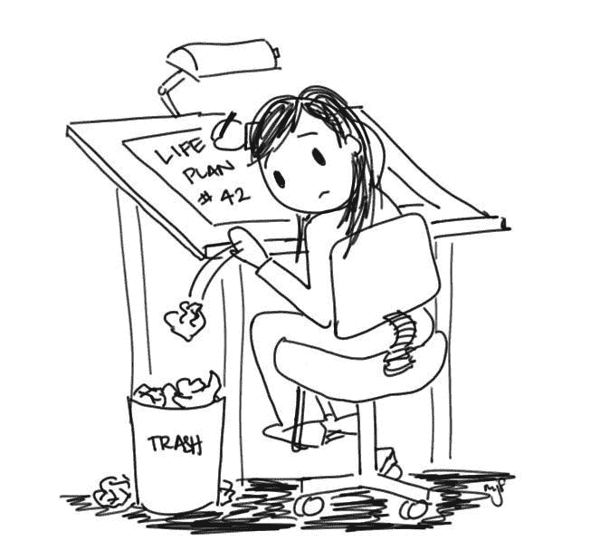

# 我终于得到了我的第一份编程工作，现在呢？

> 原文：<https://www.freecodecamp.org/news/i-finally-got-my-first-programming-job-now-what-e8389ee16ef2/>

用阿里的铁

# 我终于得到了我的第一份编程工作，现在呢？

在我最近的[帖子](https://medium.freecodecamp.com/the-year-of-a-self-starter-programmer-in-review-ed005a041f92#.muzxobu04)中，我讲述了我在广阔的编程领域中作为一名主动者的故事。一个充满斗争、焦虑、激动、激情、挫折和喧嚣的故事。此外，在故事的最后，我告诉你，我正在与两家公司进行深入的谈判，并接近获得我的第一份编程工作。

你猜怎么着？这两份工作我都没得到。相反，我再次回到绘图板，并申请了其他编程工作。然而，我并没有意志消沉。我知道这只是时间问题，我会得到我的第一份编程工作。

如本文标题所示，我终于成功了。从现在开始的两个星期将是我作为前端开发人员的第一天。(首先，我必须在一家美国初创公司的本地子公司完成两周的离职通知。)

我是怎么做到的？老实说，这很讽刺也很随意。

我坐在我女朋友的宿舍里，她的同事开了她的脸书账户。一则招聘广告因其动画设计吸引了我的眼球。我告诉她把那个广告发给我，这样我回家后就可以看看。

我申请了那份工作，第二天就接到了公司面试的电话。

在第一次面试中，我们谈了谈我自己和我的职业轨迹。他们还给了我两道数学题让我当场解答。我正确地解决了这些问题，我认为他们在决定雇佣我的时候考虑到了这一点。

他们还发邮件给我一个作业，涉及纯编码技能。我必须用 HTML、CSS 和 JavaScript 把一个. psd 文件变成一个真正的网站。工作了 16 个小时后，我把解决的作业发给了他们。

然后我被叫去参加第二轮面试，在那里我见到了公司的另一位管理合伙人。基本上，这是一次讨论，旨在看看我是否符合他们的组织文化要求。讨论进行得很顺利，他们当场告诉我，我被录用了。

当我听到“你被录用了”这句话的时候，我百感交集。我感到自豪和愉快。但我也感到如释重负。

当所有这些感觉都沉淀下来后，我心想:“好吧，现在怎么办？”我觉得自己就像一个少年网球运动员，成功赢得了他的第一场比赛，享受这一刻，然后下一周又飞往另一场比赛。因为它永远不会结束。这只是新的开始。

现在，许多新的经历在等待着我。我将弄清楚如何在一个 web 开发团队中工作，以及软件行业与我一直学习的那些课程和教程有多大的不同。

这将是一个我等待了将近十一个月的新的开始——一个我从 2015 年 3 月 16 日开始的旅程(是的——我记得确切的日期)。

当然，我会学到很多关于编程的知识，更重要的是，关于我自己。我是一个正在向成年过渡的年轻人。

当我跨过那条线时，我不禁问自己:到底是什么让我走了这么远，以至于得到了一份编程工作？

显然，FreeCodeCamp 和社区 [Quincy Larson](https://twitter.com/ossia) 设法围绕它建立起来是我成功的最重要的技术因素。

在我听说自由代码营之前，我甚至不知道可以使用 Javascript 进行客户端和服务器端的 web 开发。我不知道有专门的筹码，比如平均筹码。

算法挑战教给我的 Javascript 知识比我从其他课程和教程中学到的加起来还要多。前端开发项目是我放在简历中的网络项目，这些项目引起了潜在雇主的注意，并最终让我被录用。

所以，我不能说自由代码营在我作为一名初级程序员的发展过程中扮演了多么重要的角色。我想对所有让自由代码营得以存在的人表达我所有的感激和钦佩。

在我最近的[帖子](https://medium.freecodecamp.com/the-year-of-a-self-starter-programmer-in-review-ed005a041f92#.muzxobu04)收到所有积极的反馈之后(如果没有[昆西](https://twitter.com/ossia)和整个自由代码营社区的帮助，这是不可能的)，我想为此感谢你们所有人。

我已经决定开始每周写一次，关于我作为一个主动程序员所犯的所有错误，以及我在这个过程中所学到的所有教训。我想和你们分享所有塑造我成为程序员的经历——这些经历让我得到了第一份编程工作，并将在这个领域取得进一步的成功。

基于我从分享我作为一个自我启动者的经历中得到的反馈，我计划为全世界所有想进入 web 开发的自我启动者写一本手册。它将向他们解释 HTML、CSS、JavaScript 的基础知识，以及 web 的实际工作原理。

所以，[如果你想了解我的错误，请订阅我的电子邮件列表](http://eepurl.com/bONtiH)，然后[在 Twitter 上给我发一条推文](https://twitter.com/@RautaAlin)。:)