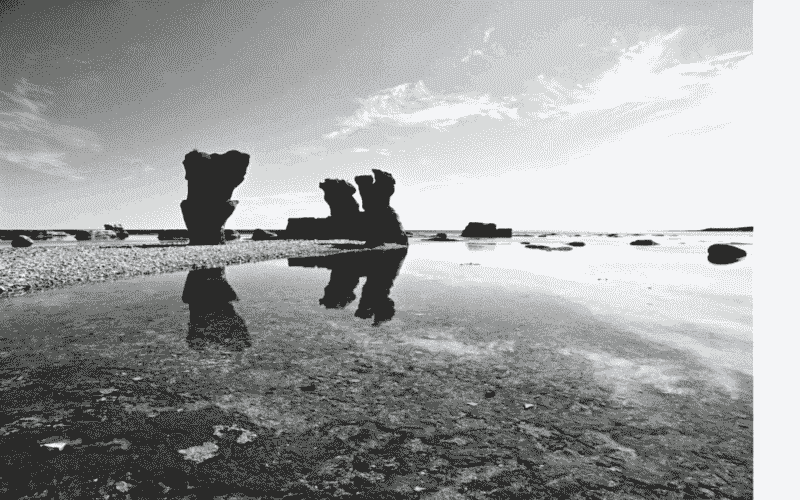
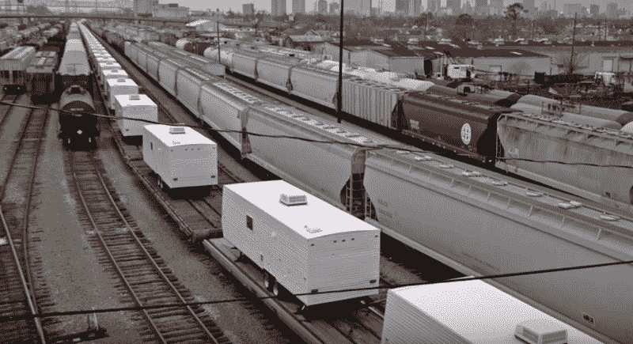
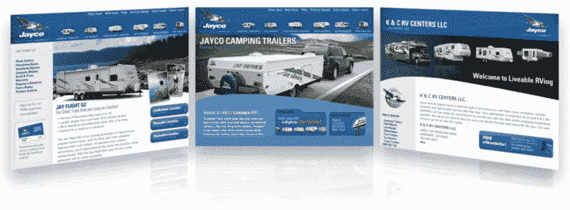
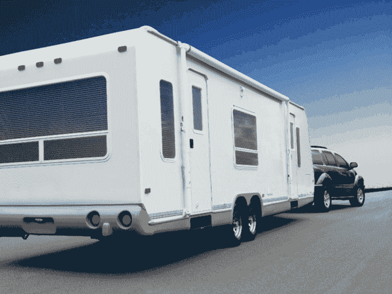
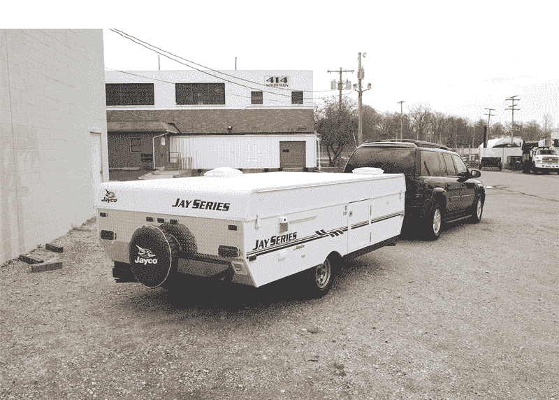
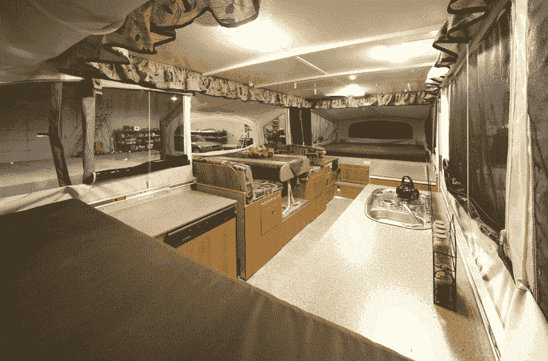
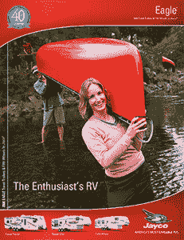

# 像我这样的设计师的特殊地狱

> 原文：<https://www.freecodecamp.org/news/a-special-hell-for-designers-like-me-5c55bd855613/>

阿德里安·汉福特

# 像我这样的设计师的特殊地狱

#### 第 1 部分:触及表面

你一直听到我谈论[燕麦片](https://medium.com/@ade3/the-slow-steady-inevitable-march-towards-oatmeal-e29e2ac2a10f#.i64stw1mr)和[僵尸](https://medium.com/swlh/the-zombie-mobile-b03932ac971d#.4wbb1jvtc)。如果你认为我在象牙塔里指指点点，今天我想坦白我自己对这场混乱的贡献。

(免责声明:诋毁你的客户和前雇主是不好的行为，即使是在沉默了十年之后。那不是我的意图。在接下来的故事中，我为之工作的人并不是僵尸。我们是热情的内部人士，试图在僵尸行业有所作为。)

卡特里娜飓风的那个夏天，我知道我会直接坠入设计师的地狱。我当时正在印第安纳州拍照，那里是美国房车制造业的中心。我在一个铁路道口停下来，等待一列火车驶过。货物是没有品牌的房车。数百个白色的大箱子像血细胞一样涌向南方的伤口。

Some of the 120,000+ RVs heading to help hurricane victims.

房车是飓风受害者的临时住所。

人们在帮助其他人。温暖的绒毛。

这是表面现象，是设计师、营销人员和品牌专家赖以生存的外层。在这里，我们假设良好的意图，从不质疑动机，并把细节变成关于我们客户的有光泽的、高度可消费的故事。

火车上没有标识的房车似乎是营销行业的完美隐喻。客户带着他们普通的白色盒子来找我们。然后有创造力的人去工作。我们在产品上添加了时尚的贴纸。我们创造标志，发明品牌。我们拍摄照片，如果我们把相机放在正确的位置，我们可以让白色的盒子看起来像奢侈品。

这是我的工作，我想我做得很好。我们为我们的 RV 客户创造的工作是坚实的，当你与众所周知的低标准竞争相比时，我们为我们的客户创造了一个表层，使他们(可以说)处于行业的顶端。这是我的故事，一份我犯下的罪恶的清单，以及如何营销白盒的秘密。

An assortment of websites I helped create

首先，让我告诉你一点关于 RVs 的字面表面。外观很丑，漩涡状的贴纸也没多大帮助。我迫切希望有机会改善房车的图形。这似乎是区分我们客户的白盒和竞争对手的最简单的方法。

这就是房车上的图形是如何形成的。房车制造商与生产装饰贴花的公司签有合同。“设计成本”被纳入贴纸的成本。这些贴纸制造商正在与所有的房车制造商达成协议，因此所有的贴纸都是由同一批成本有限的设计师设计的。这是平庸的垄断。

每年我们的代理处都会恳求一个设计贴纸的机会。我们每年都输。所以我们利用现有资源。

你仍然可以把一个贴着丑陋贴纸的白色盒子作为渴望的对象。像任何魔术一样，一旦你知道了秘密，幻觉就失去了魅力。所以让我们来揭开这个谜团。

#### 魔术 1:化妆

An alley in the ghetto transforms into paradise. Magic.

第一个戏法是书中最古老的。补妆。用 Photoshop 去掉瑕疵。把它固定在柱子上。

把房车停在任何地方，都可以停在路边。用一条假想的指向某些山的单车道高速公路取代肮脏的工业园区。干得好，设计师。

“*哦，对了。*我们今年没有足够的资金让你重复这一把戏。继续把我们新的稍微不那么难看的图形添加到你去年伪造的照片上。”

女模照片使用的后期制作是有据可查的。对女性自我形象的损害是显而易见的，也很容易被人指指点点。你很少听到对日常产品照片修饰的批评。这种欺骗的受害者是谁？我们会说到的，跟着我。

#### 魔术 2:使用广角镜头

我不知道你是否坐过房车，让我告诉你吧。它们很小。通常你可以伸出你的手臂去触摸两面墙。让房车内部看起来宽敞是一个令人印象深刻的技巧。

为房车客户工作，我最喜欢的事情之一是能够指导房车内部的摄影艺术。

我们使用了印第安纳州专门创造这些幻觉的摄影师。看着他们投篮真是太棒了。早上你有一辆普通的房车。你找到放置相机的最佳位置。选择合适的镜头。修剪表面。添加道具。然后小心翼翼地造光。一天下来，你已经完成了不可能的任务——微小的内部看起来很大。

最后一步是我拍摄室内照片，剪出窗户，并插入一张美丽风景的照片。欺骗完成。

#### 魔术 3:误导

第三招是误导。如果你的产品不能依靠它自己的漂亮外观，你就创造图像，鼓励观众看别的东西。我们称之为生活照片。照片上的人面带微笑，快乐地做着令人兴奋的事情，背景是你的产品。巧妙的手法是将注意力从产品上转移开。

想象一对冒险的夫妇在度假。他们将独木舟滑入清澈的湖中。在爬上船之前，这个男人回头看了看停在沙滩上的房车。他会意地点点头，感谢英雄产品让这一切成为可能。

如果你能令人信服地 Photoshop 这个概念，它是一个完整的虚构又有什么关系呢？你可以回答一次或两次“不”，但是当你看到这个把戏做了足够多次，你就不得不怀疑了。在产品——你最初从事这项工作的原因——不再是现实的修饰版，而是跨越界限成为掩盖真相的骗局之前，事情离现实有多远。

将产品包含在你的幻想中是一个更好的技巧，但这不是强制性的。简单地将你的产品*放在*生活方式图片旁边，就足以分散对产品的注意力。声明一下，下面的小册子封面不是我做的。

If you make the product small enough, ugly exteriors are ignorable.

让我们跳回印第安纳州，在那里我看着一列没有品牌的房车消失在远处。我穿过铁轨，回到照相馆，在那里我评论了火车，看到一个善意的举动是多么伟大。我问有没有人知道是哪家房车公司做了如此慷慨的捐赠。回答是，

> “捐款？你认为那些房车上为什么没有一个标识？”

我不知道。接下来学到的东西让我质疑一切。我的魔术真的是无害的幻觉吗？我小小的夸大即将成为一个谎言的危险因素，这个谎言最终永远伤害了人们。

今天的帖子是关于表面层的，这个行业的技巧本身似乎是无害的。下周，我将谈论当你开始提问时会发生什么。那是我通往地狱之路的起点。

第二部分:品牌有问题？放一只鸟在上面。

感谢阅读。*喜欢吗？*戳心形图标。*喜欢吗？*高亮分享。*讨厌吗？*写个回应[在推特上诅咒我](https://twitter.com/ade3)。这是我打字的动力。保持创造力。