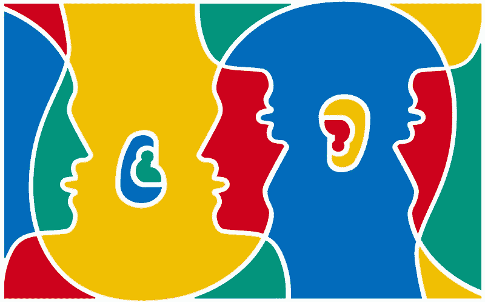
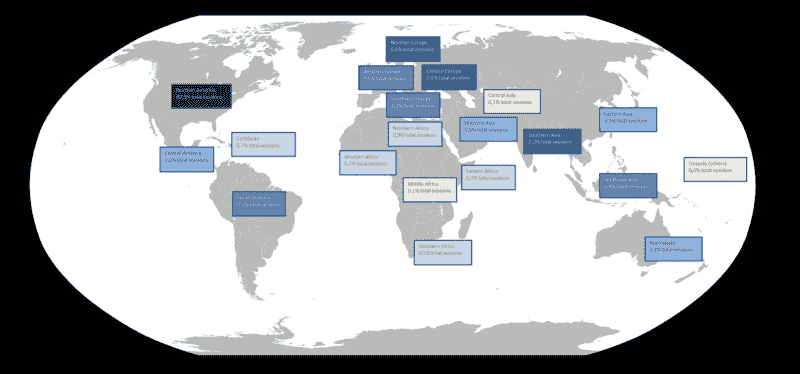
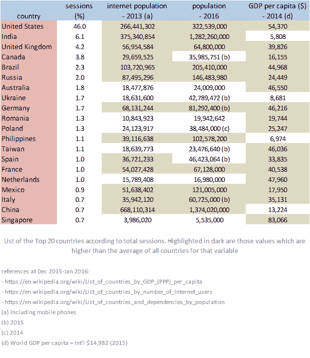
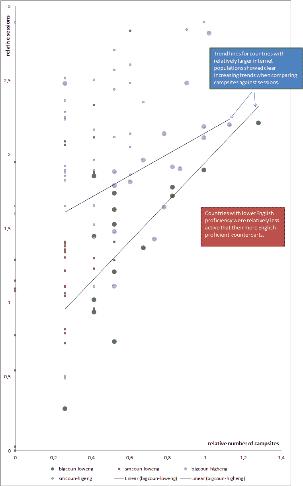

# 英语、人口、连通性和露营地

> 原文：<https://www.freecodecamp.org/news/english-size-connectivity-and-campsites-factors-driving-the-use-of-free-code-camp-worldwide-3c9d4e2b8c17/>

埃瓦里斯托·卡拉巴略

# 英语、人口、连通性和露营地

#### 推动全球使用自由代码营的因素

自由代码营提供了一个开源的、免费的、可访问的编码教育。听起来很理想，对吧？

事实上，有几个方面可以显著改善——尤其是对美国以外的人。

我最近分析了自由代码营的公开数据，发现自由代码营在全球的采用受到几个因素的影响。公平地说，这些似乎是影响其他端到端在线课程和在线课程(MOOCs)的相同因素。这些因素包括学习者所在国家的财富、连通性、人口规模、英语水平，以及活跃的线下社区的存在——尽管记录较少。

你可以通过阅读营员(自由代码营的社区成员)的社交媒体帖子来判断，英语水平和社交影响着自由代码营对特定营员的有用程度。本文将探讨这些，以及一些不太明显的因素。

为了大致了解地理如何影响自由代码营的有用性，我根据相关的人口统计数据，寻找不同地区和国家的*(来自谷歌分析)的会话数量的差异。*

*我首先大致比较了亚大陆地区之间的绝对会议次数。只需看一眼这张地图，就能意识到非洲、中亚和最小的太平洋岛屿的自由代码应用远远落后于其他地区。*

*

Map of the prevalence of the Free Code Camp sessions (in percentages) by sub-continents around the world (continents blank map from [boragetaqs.es.tl](http://boragetaqs.es.tl/continents-map-blank.htm))* 

*这是一个迹象，表明拥有一个 ***健康的经济*** 或属于其外围*可能是*一个影响采用该计划的相关因素。事实上，国家财富可能与项目采用密切相关，我们可以通过研究前 20 个国家的人口统计数据看出这一点。*

*下表还包括一些最富裕的国家，包括人均 GDP 超过平均水平的 79 个国家中的 16 个(2015 年世界人均 GDP = 14，982 美元，[维基百科，2016 年 1 月](https://en.wikipedia.org/wiki/List_of_countries_by_GDP_%28PPP%29_per_capita))。*

**

*尽管如此，拥有健康的经济还不足以解释这张表。仔细观察可以发现，互联网人口 的 ***规模是一个决定性的影响因素:该榜单代表了世界总人口的 60%，但更重要的是，它代表了******世界*** *互联网*人口的 68%*** 。****

好的，到目前为止，我们已经找到了一些证据，证明经济财富和(互联网)人口规模会影响某个人加入自由代码营社区的可能性。其他一些因素是什么？

一个因素似乎是英语水平。另一个似乎是露营地的存在——自由代码营的城市分会，露营者在那里聚会并一起编码。

要找到答案，我们必须用相对的 来看数据 ***，并剔除异常记录，以揭示它们的影响。***

在这一步，我过滤掉了像美国、加拿大、英国、印度和中国这样的大国，并且只比较了有完整数据的国家。

我还重新计算了受互联网人口规模控制的会议次数和营地数量，所以它们显示了一个相对趋势。

我没有使用一个简单的表格，而是依赖于一个散点图，上面显示了修改后的露营地和会议的数量，还有几个额外的特性:

*   该点的**大小**代表每个国家互联网人口的可比**大小(超过平均水平则为大，低于平均水平则为小)**
*   点的**颜色**表示每个所选国家的**英语水平**(基于教育第一的 [*英语水平指数*](http://www.ef.nl/epi/))——紫色表示高于平均水平，绿色表示低于平均水平

Scatter Plot campsites vs sessions: relations between relative number of sessions vs campsites or English proficiency are suggested (non-standardized residuals after transforming into log10 and controlling both variables for internet population; points were translated)

上图同时揭示了几个观点:

1.  露营地数量越多，相对场次就越多。这种影响在互联网人口较多的国家之间尤为明显
2.  英语水平较高的国家(紫色圆点)相对来说比那些英语水平较低的国家(绿色圆点)更活跃，无论这个国家的互联网人口规模有多大

因此，不仅一个国家的财富和互联网人口规模很重要，英语水平和活跃的线下社区似乎也会影响自由代码阵营在这个国家的传播。

总而言之:

1.  在*高水平*，较富裕的区域是那些拥有最多会话的区域；我们的营员主要来自这些地区的国家，如美国、加拿大或几个欧洲国家。
2.  然而，通过独立地比较各个国家，我们可以肯定，当我们谈论绝对数字时，大量互联网人口的存在实际上是非常相关的。这方面的一些例子有印度、巴西、俄罗斯、菲律宾，可能还有中国(我们只捕获了那里的一小部分会话，因为防火长城阻止了所有非 VPN 流量的 Google Analytics)。
3.  英语水平高的国家更广泛地采用自由代码阵营，尽管要看到这一点我们需要通过互联网人口规模来控制。
4.  最后，如果你控制互联网人口规模，你可以看到营地的数量似乎与会议的数量有关，这表明亲自一起编码增加了营员在自由代码营网站上的活跃度。

#### 那么自由代码营对此做了些什么呢？

甚至在此分析之前，我们的机构群体就已经采取行动来减少采用的语言障碍。一小群营员自愿将自由代码营的开源课程、wiki 和其他教学资源翻译成不同的世界语言。

Vladimir Tamara 是哥伦比亚波哥大的核心团队成员，他已经负责将课程翻译成西班牙语。他现在正在协调其他世界语言的翻译工作，并帮助编写处理语言选项的代码。

为了减少糟糕的连接和大量使用智能手机作为主要或唯一互联网设备的营员的影响，自由代码营正在不断改善移动体验。我们还在为缺乏稳定互联网接入和电力的露营者开发离线模式。

我的分析中出现了一个有趣的趋势，那就是在一个特定的国家里，会议的数量和露营地的数量之间的关系。这些面对面的小组可以吸引并吸引那些原本不会主动坚持像自由代码营这样具有挑战性的项目的营员。

加拿大多伦多的视觉设计师贾斯汀·理查德松最近加入了我们的核心团队，专注于露营地。他已经通过多伦多露营地组织了许多编码活动。他的目标是向其他营地领导人学习，并将他们的知识传播到世界各地的营地。

我也在 bl.ocks.org/evaristoc 做相关的可视化工作。

这个分析仅仅触及了我们从[自由代码营的公开数据](https://medium.freecodecamp.com/free-code-camp-christmas-special-giving-the-gift-of-data-6ecbf0313d62#.79rr68eop)中所能学到的皮毛。加入我们的[数据科学聊天室](http://gitter.im/freecodecamp/datascience)，帮助我们理解所有这些数据。