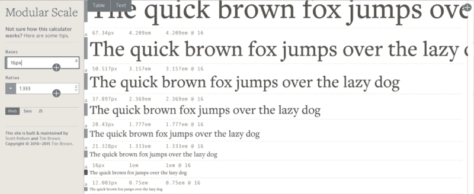

# 我所知道的关于网络响应排版的一切

> 原文：<https://www.freecodecamp.org/news/everything-i-know-about-responsive-web-typography-c774c2138f5c/>

响应式排版是一块难啃的骨头。当我第一次开始创建响应式网站时，这是我能想到的最好的方法:

```
p {
  font-size: 16px;
}

@media (min-width: 800px) {
  p {
    font-size: 18px;
  }
}

/* Repeat for h1 - h6 and other type groups */
```

从那以后，我学到了更多关于排版的知识，并学会了一些最佳实践，比如使用相对单位、垂直节奏和有意义的排版比例。

这些新的实践非常好。他们让我的网站看起来更赏心悦目。然而，实施它们是一次可怕的经历。

我不得不编写复杂的代码，我发现自己在巨大的时间压力下努力创建响应迅速的网站。

现在，经过几个月的黑客攻击，我终于创建了一个解决方案，我很高兴与你分享。这叫典型。

Typi 很棒，因为它允许我使用我学到的实践，同时用 3 个简单的步骤解决了我遇到的大多数问题。让我来解释这三个步骤，向你介绍我在使用响应式排版时的实践。

### 练习 1:随着屏幕尺寸的增加，增加正文的字体和行高。

在手机上阅读和在桌面上阅读是两种完全不同的体验。当你在手机上阅读时，你无疑会把你的设备握得更近，因为手机屏幕更小。

与手机相比，你的桌面屏幕会离你更远。因此，由于距离较远，桌面上相同的字体大小看起来会稍微小一些。

为了增加可读性和补偿由于距离造成的尺寸损失，我们增加了字体大小。

我第一次知道这种做法是通过 ia.net[的](http://ia.net/)[响应排版基础](https://ia.net/know-how/responsive-typography-the-basics)帖子。如果你对我说的不熟悉，我强烈建议你看看这篇文章。

Sass 中这种实践的实现可以是这样的:

```
html {
  font-size: 16px;

  @media (min-width: 800px) {
    font-size: 18px;
  }

  @media (min-width: 1200px) {
    font-size: 20px;
  }
}
```

注意:当我们增加字体大小时，我们可能也需要增加行高，以便文本行之间有更多的空间。使用 Sass，这可能看起来像:

```
html {
  font-size: 16px;
  line-height: 1.3;

  @media (min-width: 800px) {
    font-size: 18px;
  }

  @media (min-width: 1200px) {
    font-size: 20px;
    line-height: 1.4;
  }
}
```

### 练习 2:为你的字体设计使用模块化比例

很难选择你的排版元素的字体大小(

# 到

###### )，尤其是当你试图从无到有地提取它们的时候。模块化比例，也称为排版比例，是一种工具，可以用来帮助您选择良好的排版尺寸，以便与页面的其余部分保持一致。

它是通过一个比率(一个数)相互关联的一系列数。它可以通过将正文的字体大小乘以(或除以)该比率来创建。然后将得到的数字再次乘以(或除以)该比率。



与上述秤一起工作的模块化秤的实现可以是:

```
html { font-size: 16px }
h1 { font-size: 50px }
h2 { font-size: 37px }
h3 { font-size: 28px }
// ...
```

当然，事情不会这么简单。如果您还记得我们在本文前面讨论的第一个实践，您会注意到正文字体大小应该随着屏幕宽度的变化而变化。

当你不得不在每个断点处*改变*所有元素*的排版尺寸以确保尺寸保持一致时，这就成了一个问题。*

```
html {
  font-size: 16px;
  line-height: 1.3;
  @media (min-width: 800px) {
    font-size: 18px;
  }

  @media (min-width: 1200px) {
    font-size: 20px;
    line-height: 1.4;
  }
}

h1 {
  font-size: 50px;
  @media (min-width: 800px) {
    font-size: 56px;
  }
  @media (min-width: 1200px) {
    font-size: 63px;
  }
}

h2 {
  font-size: 37px;
  @media (min-width: 800px) {
    font-size: 42px;
  }
  @media (min-width: 1200px) {
    font-size: 47px;
  }
}

h2 {
  font-size: 28px;
  @media (min-width: 800px) {
    font-size: 32px;
  }
  @media (min-width: 1200px) {
    font-size: 35px;
  }
}
// ...
```

呃。

解决办法？检查下一个练习。

注:如果你需要帮助选择你的模块尺度的起始字体大小和比例，我建议你阅读这篇关于有意义的排版的文章。

### 练习 3:使用相对排版单位

CSS 中的相对单位是百分比(%)、视口单位(vh、vw、vmin、vmax)、em 单位(em)和 rem 单位(rem)。常用的字体大小有 **em** 和 **rem** 。

你可以用同样的方式同时使用 **em** 和 **rem** 来解决我们在练习 2 中遇到的问题。为了将像素转换成 em，我们采用目标字体大小，并将其除以基本字体大小。

下面是它的样子:

```
html {
  font-size: 16px;
  @media (min-width: 800px) {
    font-size: 18px;
  }
  @media (min-width: 1200px) {
    font-size: 20px;
  }
}

h1 { font-size: 3.125em; } // 50 ÷ 16 = 3.125
h2 { font-size: 2.3125em;} // 37 ÷ 16 = 2.3125
h3 { font-size: 1.75em; } // 28 ÷ 16 = 1.75
// ...

// Note: These are approximate values.
// The actual values derived from modularscale.com are 3.129em, 2.3353em and 1.769em respectively.
```

现在好多了！

还有几个问题。注意当屏幕宽度增加到 1200 像素时

# 如何变成大约 63px。

63px 挺大的。阅读文本已经开始变得不舒服了。一个更好的决定可能是将其调低到 47px(大小为

## )。

当这种情况发生时，您可能想要减小

## 元素的大小，因为强调

# 元素是一个很好的做法。有时，您可能还需要更改行高。

然后代码变成…

```
html {
  font-size: 16px;
  @media (min-width: 800px) {
    font-size: 18px;
  }
  @media (min-width: 1200px) {
    font-size: 20px;
  }
}

h1 {
  font-size: 3.129em;
  line-height: 1.2;
  @media (min-width: 1200px) {
    font-size: 2.3353em;   
    line-height: 1.3;
  }
}

h2 {
  font-size: 2.3353em;
  @media (min-width: 1200px) {
    font-size: 1.769em;   
  }
}

h3 {
  font-size: 1.769em;
  @media (min-width: 1200px) {
    font-size: 1.33em;
  }
}

// ...
```

呃。回到起点:(

这就是典型的用武之地。让我们从练习中休息一下，看看 Typi 能如何帮助你。

### 使用类型

Typi 是一个 Sass 库，允许您在单独的 Sass 映射中设置所有印刷元素的字体大小和行高属性。然后，这些映射可以用来输出我们在上述情况中看到的代码。它是这样工作的。

首先，您需要设置一个$typi 映射。看起来是这样的:

```
$typi: (
  null: 16px,
  small: 18px,
  large: 20px
);
```

null、small 和 large 都是断点。

Typi 会自动寻找$breakpoints 映射来创建您的媒体查询(这意味着它可以与我创建的用于帮助媒体查询的库 [mappy-breakpoints](https://github.com/zellwk/mappy-breakpoints) 完美集成)。

```
$breakpoints: (
  small: 800px,
  large: 1200px
);
```

一旦建立了$typi 映射，我们就在 html 选择器中调用 typi-base() mixin。

```
html {
  @include typi-base();
}
```

这个 typi-base() mixin 创建了与我们在练习 2 中为标记编写的样式相同的样式。唯一的区别是字体大小用百分比表示。

```
html {
  font-size: 100%; /* This means 16px */
}

@media all and (min-width: 800px) {
  html {
    font-size: 112.5%; /* This means 18px */
  }
}

@media all and (min-width: 1200px) {
  html {
    font-size: 125%; /* This means 20px */
  }
}
```

我们还提到，随着字体大小的变化，可能需要改变行高值。通过为每个需要行高值的断点提供第二个行高值，您可以在 Typi 中轻松地更改行高值:

```
$typi: (
  null: (16px, 1.3), // Sets line-height to 1.3
  small: 18px,
  large: (20px, 1.4) // Sets line-height to 1.4
);
```

从我们更新的$typi 映射得到的 CSS 是:

```
html {
  font-size: 100%; /* This means 16px */
  line-height: 1.3;
}

@media all and (min-width: 800px) {
  html {
    font-size: 112.5%; /* This means 18px */
  }
}

@media all and (min-width: 1200px) {
  html {
    font-size: 125%; /* This means 20px */
    line-height: 1.4;
  }
}
```

创建$typi 映射后，我们可以使用相同的格式创建其他字体映射。这里有一个例子:

```
$h1-map: (
  null: (3.129em, 1.2),
  large: (2.3353em, 1.3)
  );

$h2-map: (
  null: 2.3353em,
  large: 1.769em
  );

$h3-map: (
  null: 1.769em,
  large: 1.333em
  );
// ...
```

然后，我们使用典型混合来调用这些字体映射:

```
h1 { @include typi($h1-map) }
h2 { @include typi($h2-map) }
h3 { @include typi($h3-map) }
// ...
```

生成的 CSS 将是:

```
h1 {
  font-size: 3.129em;
  line-height: 1.2;
}

@media (min-width: 1200px) {
  h1 {
    font-size: 2.3353em;
    line-height: 1.3;
  }
}

h2 {
  font-size: 2.3353em;
}

@media (min-width: 1200px) {
  h2 {
    font-size: 1.769em;
  }
}

h3 {
  font-size: 1.769em;
}

@media (min-width: 1200px) {
  h3 {
    font-size: 1.333em;
  }
}
```

很漂亮吧？你必须下载 Typi 才能玩它。(在 Sassmeister 或 Codepen 上还没有)

**PROTIP** :如果你不想在不同的字体映射上写精确的 em 值(比如 1.769em)，你可以使用模块化标度 Sass mixin。

为此，您必须[下载库](https://github.com/modularscale/modularscale-sass)并将其导入到您的 Sass 文件中。然后，更改字体映射，使其使用 ms()函数。

```
$h1-map: (
  null: (ms(4) 1.2),
  large: (ms(3), 1.3)
  );

$h2-map: (
  null: ms(3),
  large: ms(2)
  );

$h3-map: (
  null: ms(2),
  large: ms(1)
  );
// ...
```

因此，简而言之， [**Typi**](https://github.com/zellwk/typi) 通过帮助**在不同的断点`**编写字体大小和行高属性，使响应式排版更加容易。

既然我已经向您介绍了 Typi，那么让我们继续讨论最后两个实践(以及一些我还没有找到解决方案的问题)。

### 练习 4:运用垂直节奏

垂直节奏是印刷设计中的一个概念，我们在页面上保持元素之间的垂直空间彼此一致(相对)。这个想法类似于使用排版比例——让页面上的元素流畅。

在实践中，我们经常使用正文文本的行高属性作为一致的垂直节奏的基础。假设你网站的正文部分的行高为 25px。你要做两件事:

1.  将元素之间的**垂直空白设置为 25px** 的**倍数**
2.  将所有文本元素的**行高设置为 25px** 的**倍数**

这是它在 CSS 中的样子(注意:这还没有考虑到我上面提到的三个实践)

```
html {
  font-size: 18px;
  line-height: 25px;
}

// Resets margins
body, h1, p {
  margin: 0;
}

h1 {
  font-size: 63px;
  line-height: 75px;
  margin: 25px 0;
}

p + p {
  margin-top: 25px;
}
```

[https://codepen.io/zellwk/embed/preview/WrjOoa?height=300&slug-hash=WrjOoa&default-tabs=html,result&host=https://codepen.io](https://codepen.io/zellwk/embed/preview/WrjOoa?height=300&slug-hash=WrjOoa&default-tabs=html,result&host=https://codepen.io)

看起来相当不错！让我们更进一步，把上面的代码改成相对单位。在这样做的时候，你会遇到关于 em 和 rem 的大辩论。

### 在 vs Rem 中

让我们试着先把代码转换成 **ems** ，然后是 **rems** 。顺便说一下，[最佳实践指出行高值应该是无单位的](https://css-tricks.com/almanac/properties/l/line-height/)。

```
html {
  font-size: 1.125em;
  line-height: 1.4; // This is 25.2px to be accurate
}

// Resets margins
body, h1, p {
  margin: 0;
}

h1 {
  // font size is 63.147px to be more precise
  font-size: 3.5082em; // 63.147 ÷ 18 = 3.5082em
  line-height: 1.1972; // 75.6 ÷ 63.147 =  1.1972
  margin: 0.3991em 0; // 25.2 ÷ 63.147 = 0.3991
}

p + p {
  margin-top: 1.4em;
}
```

请特别注意我们如何将

# 元素的 margin 属性转换成 ems。

注意我们如何使用 63.147px 作为除法的基础？必须这样做，因为用 ems 计算的大小**是相对于它当前的字体大小**而言的。它经常引起混乱，并涉及许多复杂的数学。

现在，关键是。即使我们努力做到尽可能准确，浏览器似乎并不与我们合作。你会注意到我们的垂直节奏开始变得扭曲。

[https://codepen.io/zellwk/embed/preview/jWmKKZ?height=300&slug-hash=jWmKKZ&default-tabs=html,result&host=https://codepen.io](https://codepen.io/zellwk/embed/preview/jWmKKZ?height=300&slug-hash=jWmKKZ&default-tabs=html,result&host=https://codepen.io)

两个问题导致了这种古怪的行为。

首先，我们的数学不是 100%精确和准确的。我们可以得到更精确的结果(比如 10 个小数位)，但那会让我们的代码难看得要命。

其次，不同的浏览器处理子像素舍入问题的方式不同。这意味着无论我们如何努力，我们永远无法获得像素级的完美节奏。

嗯，我不想喋喋不休地谈论子像素舍入，因为我们无能为力。让我们看看 rem 单元是如何处理这种复杂的数学运算的，好吗？

```
html {
  font-size: 1.125rem;
  line-height: 1.4; // This is 25.2px to be accurate
}

// Resets margins
body, h1, p {
  margin: 0;
}

h1 {
  font-size: 3.5082rem; // 63.147 ÷ 18 = 3.5082
  line-height: 1.1972; // 75.6 ÷ 63.147 = 1.1972
  margin: 1.4rem 0; // 25.2 ÷ 18 = 1.4
}

p + p {
  margin-top: 1.4rem;
}
```

注意我们是如何在 margin 属性上使用 1.4rem 而不是 0.3991em 的？快速眼动装置使得垂直节律**的计算**更加简单。

然而，这并不意味着你应该盲目地切换到 rem 单元。Rems 和 em 单位都很有用，它们应该用于不同的目的。这个话题我改天再写。现在，让我们回到垂直节奏。

既然我们已经将垂直节奏转换成了相对单位，那么让我们来看看当我们将它与练习一结合起来时，效果如何(当屏幕尺寸改变时，字体大小和行高也应该改变)。

我们将通过只使用一个媒体查询来使这个例子尽可能简单。我们还将使用 rem 单元。

```
html {
  font-size: 1.125em;
  line-height: 1.4;

  @media (min-width: 1200px) {
    font-size: 1.25em; // this is 20px
    // Slight change in line heights at 1200px
    line-height: 1.45 // this is 29px
  }
}

// Resets margins
body, h1, p {
  margin: 0;
}

h1 {
  font-size: 3.5082em;
  line-height: 1.1972;
  margin: 1.45rem 0;

  @media (min-width: 1200px) {
    // font-size is now 70.164px
    line-height: 1.24; // 29px * 3 ÷ 70.164 = 1.24
    margin: 1.45rem 0;
  }
}

p + p {
  margin-top: 1.4em;
  @media (min-width: 1200px) {
    margin-top: 1.45em
  }
}
```

呃。我们可能需要添加 20，000 个媒体查询来更改所有元素的边距和行高，而仅仅是对的行高属性的这一个更改。我们甚至还没有谈到填充或边框属性！

### (≥的°)≥的)和±的

所以，这是我意识到的。在不同的浏览器之间应用完美的响应垂直节奏是不可能的。至少用现在的技术不行。

我们可以做的是:

1.  我们可以通过目测和使用 Typi 来处理主要印刷元素的行高属性。
2.  如果可以的话，尽量不要改变正文的行高属性。当所有主流浏览器最终都支持 [CSS 变量](http://caniuse.com/#search=css%20var)时，事情会变得更容易。

### 练习 5:保持文本长度在 45-75 个字符之间

哦，这个很简单。请记住:一个字符大约是 0.5 em。45-75 个字符之间的文本尺寸意味着文本元素的宽度必须在 22.5em 和 37.5em 之间

根据经验，我最关心的是超过 75 个字符的文本。如果你的文本少于 45 个字符，也许是时候改变字体大小了。

```
article {
  max-width: 30em;
  /* Anywhere between 22.5em to 37.5em. Use your discretion */
}
```

### 包扎

响应式排版很难。我们仍然没有可靠的完美答案，但现在让我们试着凑合一下。

顺便说一下，如果你想玩的话，这里有一个[再次键入](https://github.com/zellwk/typi)的链接。

> 这篇文章在 www.zell-weekeat.com 第一次出现在我的博客上。如果你想要更多这样的文章，可以看看