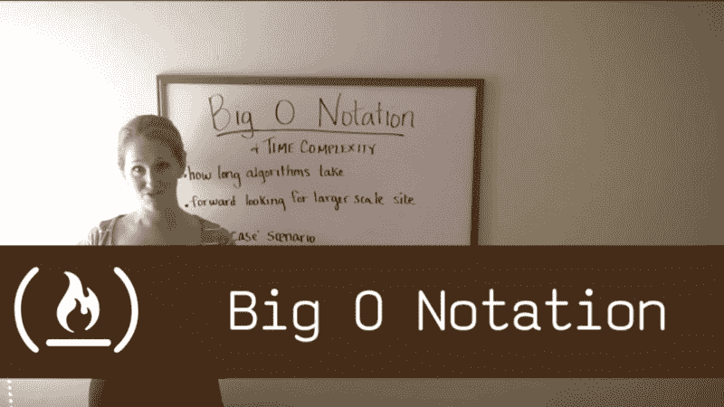
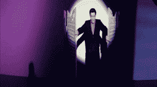
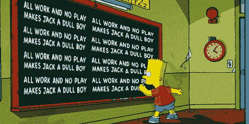
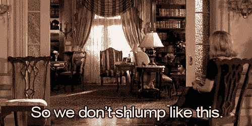
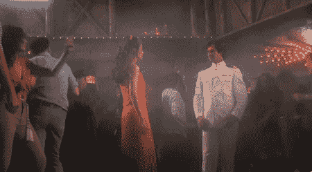
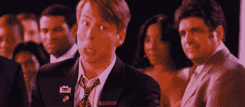
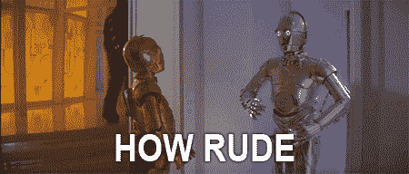
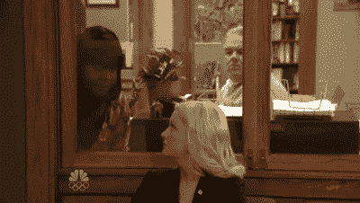
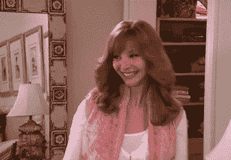

# 如何为自由代码营的视频挑战做贡献

> 原文：<https://www.freecodecamp.org/news/let-s-go-for-a-hike-here-s-your-map-4301df6e3801/>

布里亚娜·玛丽

# 如何为自由代码营的视频挑战做贡献

自由代码营正在推出简短的教学视频，称为视频挑战，旨在向初学者教授有用的软件工程概念。每个视频长约 2 分钟，后面是 2 到 3 个是非题。你可以在图书馆的电脑上或地铁上的手机上学习。

例如，看看这个 YouTube 播放列表。这些视频将在不久的将来在[自由代码营](http://www.freecodecamp.com/)上直播(但是你可以先睹为快我们的[测试版](http://beta.freecodecamp.com/hikes))。

与自由代码营的动手编程课程不同，视频挑战强调理论多于实践。视频挑战用简单易懂的术语解释概念。它们给你足够的理解，当你在现实世界中遇到这些概念时，你能认出它们。当你这样做的时候，你就有了提出有根据的问题和相应地搜索所需的理论知识。

像自由代码营的其他开源课程一样，视频挑战是由我们的社区创建的。几个月前我开始编写脚本和录制视频，现在其他营员也加入了我的行列。你也应该考虑做贡献！

### 视频挑战是一种教学形式。教书很难。但是这些建议会有所帮助。

构建、编写和录制视频看起来令人生畏，但却是值得的工作。不管你有没有当老师的经验，你可能已经知道这不仅仅是纸上的事实。

当你教书的时候，有些事情很重要。有些事情和你内容有关，但大部分都没有关系。

#### 显而易见——你说的话必须准确且符合语境。

好吧，但是还有什么？

#### 除非你确定内容有意义，否则不要做视频挑战。

作为一名软件工程师，有数百个重要的话题需要了解。

事实是，有些话题太大了，根本装不下一个只有两分钟的视频。也许书面教程是让某人熟悉特定主题的更好的方法。

视频挑战赛的关键区别在于，你应该能够观看它，并完全储存高级知识，而不需要练习。

#### 利用照明侵入用户能量

照明。灯光真的很重要！房间里应该很亮，你的脸和白板/黑板都在视野之内。

研究表明，蓝色调让我们警觉，橙色调让我们感到疲劳和放松。利用这个技巧让你的观众保持活力。

#### 拍摄前在黑板上写东西

在视频开始时，将示例、标题或其他文本写在黑板上。

这些短视频需要塞满信息。写一个简单的解释、定义或例子，你可以参考，这将巩固知识，给用户一个锚。

#### 以良好的姿势站起来

站起来，不要坐着。你的姿势应该散发出能量。

#### 穿着引人注目

穿得专业一点，就像你要在成千上万不同文化背景的人面前演讲一样。因为你是。

#### 通过移动你的脸和手臂来娱乐你的观众

要有视觉表现力。如果你把一段视频静音，仍然会有很多非语言的暗示。你的脸和手臂应该在动，表达对比。让你的个性展现出来。

对比度越高，你的视频就越有娱乐性。这将防止观众感到无聊和间隔。

对比也有助于给出内容的线索。有很多非语言的内容要展示，当视频很短时，我们需要利用这一点。

#### 听起来不像机器人，更像舞台演员

声音表达很重要。

正如非语言提示对于表达上下文和吸引用户很重要一样，语调、音高、音量和语速也很重要。大声清晰地说话，不要太快。

在适当的时候上下移动你的声音。大多数人通常会这样做，但在像这样的视频中，夸大是必要的。

声调的变化会引起人们的注意，当我们试图教他们东西时，我们希望他们注意我们！

#### 如果你不能用 7 个字或更少的话来说，那就找一个更好的方法来说。

我最有影响力的教育学教授之一查尔斯·罗宾逊博士坚持认为，教师应该用“7 个字或更少”来传达重要的内容。如果你不能用 7 个字或更少的话来说，你说得不够简洁。

如果你需要一个脚本来做到这一点，这完全没问题。就我个人而言，我给自己两到四个简短的要点来涵盖视频，因为这是我在拍摄过程中唯一能真正跟踪的。

无论你的过程是什么，结果必须是一样的——用尽可能少的话表达内容。听起来像是照本宣科，即使你不是。

#### 告诉他们你想告诉他们的。然后再告诉他们一遍。然后告诉他们你想告诉他们的。

用“它”作为每个视频的书签。

一开始就告诉用户他们最终会知道什么。然后在中间，用尽量少的话告诉他们那件事。最后，提醒他们刚刚学到的内容。

这听起来可能很简单，但是将复杂的概念分解成初学者可以掌握的东西，即使是有经验的老师也时常会感到吃力。

#### 拍摄过程中尽量不要删减。

理想的剪辑是没有剪辑。太多的剪辑会让视频看起来不像是一堂课，而更像是编辑过的汇编。如果你必须做一些，在要点之间和自然休息时做。

尽量让视觉过渡平滑无缝，这样用户甚至不会注意到。

#### 记录(和重新记录)到完美。

当结果是几分钟的视频时，它需要是你能制作的最高质量的内容。

注意你可能无意识地发出的任何重复或不必要的动作或声音。当你回顾你的视频时，请留意。当你注意到的时候，一个真实的教室里已经有十个学生了。

对于你看到的每一个两分钟的视频，我可能记录了大约二十分钟的材料。那是我在练习尽可能简洁地说出视频中的“它”。

我可能漫无边际地说了一大堆，完全弄错了事实，我的狗叫或猫喵喵在背景中，空调开得太大声，有警笛经过，见鬼——谁知道呢，也许我打嗝或打嗝了。

关键是，你需要不断滚动，直到你得到它的权利。

### 我们开始吧！

你想这么做吗？查看当前进展，并在 [GitHub](https://github.com/FreeCodeCamp/hikes) 上参与新的视频挑战。