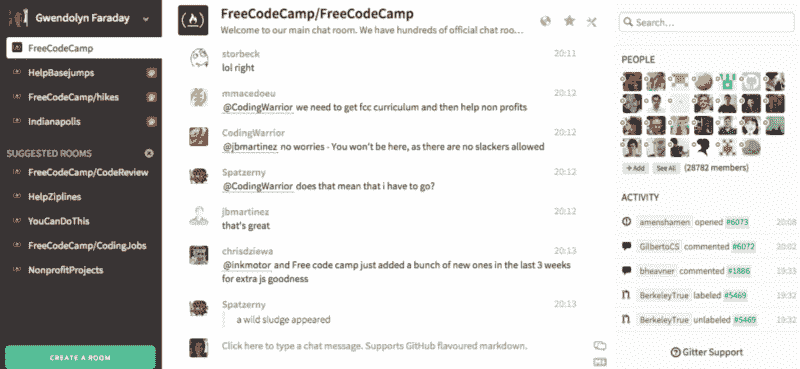

# 我是如何找到我的第一份网页开发工作的

> 原文：<https://www.freecodecamp.org/news/how-i-landed-my-first-job-as-a-web-developer-f991fe728b95/>

我一直对网络编码感兴趣。大约 15 年前，我用雅虎的 Geocities 建立了我的第一个网站，它允许 HTML 样式和一些布局选择。

甚至上了大学还报了工科，学了 Matlab 和 C++。

我热爱编码，但是有一个主要的问题阻碍了我:**我从未致力于学习**。

#### 信息过载

多年来，我会开设一些教程和课程，教我某种语言或技术的基础知识(比如 Dreamweaver、Java 等)。).但是我从来没有花时间去追求更高层次的东西。

我会花几个小时研究和寻找新的课程或教程。我会看无数不同的教程，阅读不同作者的博客，每一个博客都有不同的教学风格和我应该如何学习编码的建议。一个说这个，一个说那个。

我既困惑又沮丧。我想放弃，认为我永远不会达到足够高的水平去从事编码职业。我确信有更多的技术是我学不完的，这将是一次压力太大的旅程。

在职业上，我是一名餐厅经理(后来是一名销售人员)，每周工作 50-60 个小时(或更多)。在工作、帮助我的祖母和其他个人义务之间，我总是找借口说我没有时间学习如何编码。然而，我花了很多时间在网上冲浪，阅读关于我应该如何学习而不承诺和坚持任何一门课程。

#### 快进到 2015 年

正如我经常做的那样，我以雄心勃勃的目标开始了这一年，以改变我的生活，保持体形，并度过有史以来最好的一年。

到 2015 年 1 月，我刚刚完成了一个关于使用 Swift 进行 IOS 应用程序开发的树屋课程，并在我的本地机器上构建了三个半酷的工作应用程序。我太兴奋了，以至于我决定今年——毫无疑问——我一定要学习如何编码！

#### 这个计划

我刚刚辞掉耗时的销售工作，在当地一家餐馆找了份临时工作，这给了我大量的空闲时间。我立即开始研究和计划我将学习什么技术，我将使用什么工具。我开始复习 HTML、CSS 和基础 JavaScript。

大约在三月份，我找到了免费的 Code Camp，还有 Code cloud . me——一个承诺通过与 Expedia 这样的大公司一起建立真实生活项目来有效地教学生的网站。我决定把自由代码营留在我的待办事项列表中，继续 CodeCloud.me 项目。

我浪费了大约一个月的时间，试图弄清楚我将如何在他们的网站上学习编码。它令人困惑，设计糟糕，我的团队大多数人在项目开始前就退出了。我对他们的课程有很多其他的问题，最后我去搜索了我之前偶然发现的那个网站，自由代码营。

#### 自由代码营——我如何最终学会如何编码

我很高兴看到自由代码营的用户数量在增加，所以我认为这是一个好项目。另外，它是完全免费的。

听了约什·肯普的有声读物[《没有学位，没有问题》，我决定每天奉献几个小时学习如何编码。我很快经历了前端开发的挑战，并完成了所有五个前端项目。](http://www.amazon.com/No-Degree-Problem/dp/B00KLF48QG/ref=tmm_aud_swatch_0?_encoding=UTF8&qid=&sr=)

这些项目每个都花了我三天到一周的时间来完成。我学习了 JSON、API、jQuery、Angular、Bootstrap、高级 JavaScript 概念等等。我终于有成就感了！

然后，我在 Node、Express 和 MongoDB 上开始了后端部分。这些真的给了我一个关于 web 开发的广阔视角，以及前端和服务器端技术是如何相互结合的。

到目前为止，我只完成了一个完整的项目，因为我是一名前端开发人员，正在研究 ReactJS。然而，很快，我计划完成所有的自由代码营项目。

有一份网络开发的工作对我帮助很大，让我在工作的同时也能每天学习。

#### 聚会和网络

我天生是一个非常内向、安静的人，所以社交对我来说非常困难。然而，我决定至少要试一试。我开始去参加聚会，让我的在线网络了解我的新技能，并告诉他们我正在找一份新工作。

我去的第一个聚会是一个开发 It 的女孩，她们在那里教 Git 和 Github，然后有时间去社交。我对这些材料已经很熟悉了，所以我想这会让我在第一次见面时更舒服。

课后，我强迫自己走到人们面前介绍自己。很痛苦。我的手在发抖，因为我太紧张了。我想跑出去，但不知怎么的，我熬过了两个小时左右，跑到我的车里喘口气！

情况确实有所好转。我参加的聚会越多，我就越舒服。我看到在印第安纳州没有一个正常运行的免费代码营聚会小组，所以我在这里创建了一个，这样我就可以和与我处于同一水平的程序员在一起，让他们开始互相帮助。我们进行了几次很好的聚会，让我们能够联系和分享想法。希望我们将来会更积极地参与[咖啡和代码会议](https://medium.freecodecamp.com/jump-start-your-local-campsite-with-coffee-and-code-a8d1a57d30e#.zgge9ixqa)和其他活动。

#### 审查和调试其他人的代码

对我帮助很大的一件事是审查别人的代码。编写自己的代码并对其进行修改是一回事。对我来说审查和编辑别人的项目完全是另一回事。

当其他学生有问题要尝试帮助他们时，我开始在免费代码营聊天室看其他人的代码。当我们在印第安纳波利斯成立一个聚会小组时，其他几个营员也发信息给我，希望我能帮助他们完成项目。

起初，我很难理解或阅读别人写的代码。特别是如果我已经完成了一个不同版本的项目，我很难弄清楚所有的东西都在哪里，以及为什么他们要这样写。

我开始克隆各种 github 项目给我练习。这样做了几十次后，我开始掌握它的窍门。

每个人都有不同的风格。有的人比较擅长设计，有的人比较擅长函数式编程，或者其他领域。每个人都有值得学习的地方，即使是不该做的事情。

回顾过去，学习如何阅读别人的代码对我今天的成就有很大的帮助。

#### 书籍与有声读物

我已经收集了相当多的未完成的编程书籍，放在我的书架上。我每本花了 30 美元或更多，兴奋了几天，最后把它们遗忘在书架上，只是为了在不久后追求一本新书。

我发现了一个对我更有效的方法:**听有声读物**。当我在家的时候，我主要是通过视频教程来工作，并构建项目。然后在路上，我听有声读物。

这个系统对我来说非常有效。另外，我可以在听音乐的时候最大限度地学习。

另一点值得注意的是，尽管我通过 Audible 下载了所有的书，但我从未支付过全价。我注册的第一个月就收到了两本免费的书。然后我在月底取消了，之后他们给我发了一封邮件，给我三个月的大折扣(我认为是 50%)。在我再次取消订阅后，他们给我发了一封电子邮件，提供三个月每月 0.99 美元的服务。此外，他们总是有一些免费或非常便宜的有声读物。

**我并不是说高质量的材料不值得花钱购买。相反，我认为一旦你从编码中赚钱，投资高质量的培训材料是非常好的。然而，如果你还没有从中赚到钱，我认为你应该尽量少花钱，直到你被录用。**

这是我到目前为止听过的(有价值的)书的清单。如果你有其他想法，请告诉我。

#### 结果

简言之，我成功的六个关键是:

1.  努力学习课程([自由代码营](http://freecodecamp.com/map))
2.  每天留出时间编码(无论如何都要几个小时！)
3.  每天边开车边听编程/网络开发有声读物
4.  审查别人的代码，并让他们审查我的代码
5.  收集至少 5 或 6 个可以展示能力的工作项目
6.  网络和聚会，以及更多的网络！

作为一名职业球员，我还有很多目标想要实现。我目前正在学习 ReactJS 和 Sass，并且我有一个我想学习的其他技术的列表。

我对我现在的位置很满意，我正试着一次做一件事。

[查看我的博客](https://gwenfaraday.com)并保持联系:)